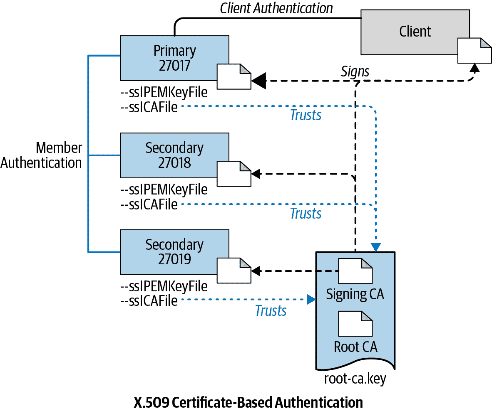

# 第十九章：MongoDB 安全简介

为了保护您的 MongoDB 集群及其保存的数据，您将希望采取以下安全措施：

+   启用授权并强制认证

+   加密通信

+   加密数据

本章展示如何使用 MongoDB 对 x.509 的支持来配置认证和传输层加密，以确保 MongoDB 副本集中客户端和服务器之间的安全通信。我们将在后续章节中讨论在存储层加密数据的方法。

# MongoDB 的认证和授权

虽然认证和授权密切相关，但重要的是要注意认证与授权是不同的。认证的目的是验证用户的身份，而授权则确定经过验证的用户对资源和操作的访问权限。

## 认证机制

在 MongoDB 集群上启用授权强制认证，并确保用户只能执行其角色授权的操作。MongoDB 的社区版支持 SCRAM（Salted Challenge Response Authentication Mechanism）和 x.509 证书认证。除了 SCRAM 和 x.509 之外，MongoDB 企业版还支持 Kerberos 认证和 LDAP 代理认证。有关 MongoDB 支持的各种认证机制的详细信息，请参阅[文档](https://oreil.ly/RQ5Jp)。在本章中，我们将重点介绍 x.509 认证。x.509 数字证书使用广泛接受的 x.509 公钥基础设施（PKI）标准来验证公钥属于呈现者。

## 授权

在 MongoDB 中添加用户时，必须在特定数据库中创建用户。该数据库是用户的认证数据库；您可以使用任何数据库来完成此操作。用户名和认证数据库作为用户的唯一标识符。但是，用户的权限不仅限于其认证数据库。创建用户时，可以指定用户可以对其应具有访问权限的任何资源执行的操作。资源包括集群、数据库和集合。

MongoDB 提供了多个内置角色，为数据库用户授予常见所需权限。其中包括以下内容：

`read`

在所有非系统集合上读取数据，以及在*system.indexes*、*system.js*和*system.namespaces*系统集合上读取数据。

`readWrite`

提供与`read`相同的权限，以及在所有非系统集合和*system.js*集合上修改数据的能力。

`dbAdmin`

执行与模式相关的管理任务，如索引和收集统计信息（不授予用户和角色管理的权限）。

`userAdmin`

创建和修改当前数据库上的角色和用户。

`dbOwner`

结合了*readWrite*、*dbAdmin*和*userAdmin*角色授予的权限。

`clusterManager`

在集群上执行管理和监控操作。

`clusterMonitor`

提供只读访问权限，例如 MongoDB Cloud Manager 和 Ops Manager 监控代理的监控工具。

`hostManager`

监控和管理服务器。

`clusterAdmin`

结合 *clusterManager*、*clusterMonitor* 和 *hostManager* 角色授予的权限，以及 *dropDatabase* 操作。

`backup`

提供足够的权限使用 MongoDB Cloud Manager 备份代理或 Ops Manager 备份代理，或使用 *mongodump* 对整个 *mongod* 实例进行备份。

`restore`

提供从不包括 *system.profile* 集合数据的备份中恢复数据所需的权限。

`readAnyDatabase`

提供与 *read* 权限相同的所有数据库的特权，除了 *local* 和 *config*，还包括整个集群的 *listDatabases* 操作。

`readWriteAnyDatabase`

提供与 *readWrite* 权限相同的所有数据库的特权，除了 *local* 和 *config*，还包括整个集群的 *listDatabases* 操作。

`userAdminAnyDatabase`

提供与 *userAdmin* 权限相同的所有数据库的特权，除了 *local* 和 *config*（实质上是超级用户角色）。

`dbAdminAnyDatabase`

提供与 *dbAdmin* 权限相同的所有数据库的特权，除了 *local* 和 *config*，还包括整个集群的 *listDatabases* 操作。

`root`

提供操作和所有资源的权限，这些权限结合了 *readWriteAnyDatabase*、*dbAdminAnyDatabase*、*userAdminAnyDatabase*、*clusterAdmin*、*restore* 和 *backup* 角色。

您还可以创建所谓的“用户定义角色”，这些角色是自定义角色，将执行特定操作的授权组合在一起，并使用名称标记，以便您可以轻松地将此权限集合授予多个用户。

深入研究内置角色或用户定义角色超出了本章的范围。但是，此介绍应该让您对 MongoDB 授权的可能性有了很好的了解。更详细的信息，请参阅 [MongoDB 文档中的授权部分](https://docs.mongodb.com/manual/core/authorization/)。

要确保根据需要添加新用户，必须首先创建管理员用户。无论您使用哪种认证模式（x.509 也不例外），MongoDB 在启用认证和授权时都不会创建默认的 root 或 admin 用户。

在 MongoDB 中，默认情况下未启用认证和授权。您必须使用 `mongod` 命令的 `--auth` 选项或在 MongoDB 配置文件中的 `security.authorization` 设置中指定值 `"enabled"` 明确启用它们。

要配置副本集，请先在未启用认证和授权的情况下启动它，然后创建管理员用户和每个客户端所需的用户。

## 使用 x.509 证书对成员和客户端进行认证

鉴于所有生产 MongoDB 集群由多个成员组成，为了保护集群，所有在集群内部通信的服务都必须进行相互认证。副本集的每个成员必须与其他成员进行身份验证，以便交换数据。同样，客户端必须与主服务器和任何次要服务器进行身份验证才能进行通信。

对于 x.509，有必要让一个受信任的认证机构（CA）签署所有证书。签署证明了证书主题的命名主体拥有与该证书关联的公钥。CA 充当可信第三方，以防止中间人攻击。

图 19-1 展示了用于保护三成员 MongoDB 副本集的 x.509 身份验证。请注意客户端与副本集成员之间的认证以及与 CA 的信任关系。



###### 图 19-1. 本章使用的三成员副本集的 X.509 身份验证信任层次结构概述

每个成员和客户端都有自己由 CA 签名的证书。对于生产环境使用，您的 MongoDB 部署应该使用由单个证书颁发机构生成和签名的有效证书。您或您的组织可以生成和维护独立的证书颁发机构，或者可以使用第三方 TLS/SSL 供应商生成的证书。

我们将用于内部认证以验证集群成员资格的证书称为成员证书。成员证书和客户端证书（用于验证客户端）的结构如下所示：

```
Certificate:
    Data:
        Version: 1 (0x0)
        Serial Number: 1 (0x1)
    Signature Algorithm: sha256WithRSAEncryption
        Issuer: C=US, ST=NY, L=New York, O=MongoDB, CN=CA-SIGNER
        Validity
            Not Before: Nov 11 22:00:03 2018 GMT
            Not After : Nov 11 22:00:03 2019 GMT
        Subject: C=US, ST=NY, L=New York, O=MongoDB, OU=MyServers, CN=server1
        Subject Public Key Info:
            Public Key Algorithm: rsaEncryption
                Public-Key: (2048 bit)
                Modulus:
                    00:d3:1c:29:ba:3d:29:44:3b:2b:75:60:95:c8:83:
                    fc:32:1a:fa:29:5c:56:f3:b3:66:88:7f:f9:f9:89:
                    ff:c2:51:b9:ca:1d:4c:d8:b8:5a:fd:76:f5:d3:c9:
                    95:9c:74:52:e9:8d:5f:2e:6b:ca:f8:6a:16:17:98:
                    dc:aa:bf:34:d0:44:33:33:f3:9d:4b:7e:dd:7a:19:
                    1b:eb:3b:9e:21:d9:d9:ba:01:9c:8b:16:86:a3:52:
                    a3:e6:e4:5c:f7:0c:ab:7a:1a:be:c6:42:d3:a6:01:
                    8e:0a:57:b2:cd:5b:28:ee:9d:f5:76:ca:75:7a:c1:
                    7c:42:d1:2a:7f:17:fe:69:17:49:91:4b:ca:2e:39:
                    b4:a5:e0:03:bf:64:86:ca:15:c7:b2:f7:54:00:f7:
                    02:fe:cf:3e:12:6b:28:58:1c:35:68:86:3f:63:46:
                    75:f1:fe:ac:1b:41:91:4f:f2:24:99:54:f2:ed:5b:
                    fd:01:98:65:ac:7a:7a:57:2f:a8:a5:5a:85:72:a6:
                    9e:fb:44:fb:3b:1c:79:88:3f:60:85:dd:d1:5c:1c:
                    db:62:8c:6a:f7:da:ab:2e:76:ac:af:6d:7d:b1:46:
                    69:c1:59:db:c6:fb:6f:e1:a3:21:0c:5f:2e:8e:a7:
                    d5:73:87:3e:60:26:75:eb:6f:10:c2:64:1d:a6:19:
                    f3:0b
                Exponent: 65537 (0x10001)
    Signature Algorithm: sha256WithRSAEncryption
         5d:dd:b2:35:be:27:c2:41:4a:0d:c7:8c:c9:22:05:cd:eb:88:
         9d:71:4f:28:c1:79:71:3c:6d:30:19:f4:9c:3d:48:3a:84:d0:
         19:00:b1:ec:a9:11:02:c9:a6:9c:74:e7:4e:3c:3a:9f:23:30:
         50:5a:d2:47:53:65:06:a7:22:0b:59:71:b0:47:61:62:89:3d:
         cf:c6:d8:b3:d9:cc:70:20:35:bf:5a:2d:14:51:79:4b:7c:00:
         30:39:2d:1d:af:2c:f3:32:fe:c2:c6:a5:b8:93:44:fa:7f:08:
         85:f0:01:31:29:00:d4:be:75:7e:0d:f9:1a:f5:e9:75:00:9a:
         7b:d0:eb:80:b1:01:00:c0:66:f8:c9:f0:35:6e:13:80:70:08:
         5b:95:53:4b:34:ec:48:e3:02:88:5c:cd:a0:6c:b4:bc:65:15:
         4d:c8:41:9d:00:f5:e7:f2:d7:f5:67:4a:32:82:2a:04:ae:d7:
         25:31:0f:34:e8:63:a5:93:f2:b5:5a:90:71:ed:77:2a:a6:15:
         eb:fc:c3:ac:ef:55:25:d1:a1:31:7a:2c:80:e3:42:c2:b3:7d:
         5e:9a:fc:e4:73:a8:39:50:62:db:b1:85:aa:06:1f:42:27:25:
         4b:24:cf:d0:40:ca:51:13:94:97:7f:65:3e:ed:d9:3a:67:08:
         79:64:a1:ba
-----BEGIN CERTIFICATE-----
MIIDODCCAiACAQEwDQYJKoZIhvcNAQELBQAwWTELMAkGA1UEBhMCQ04xCzAJBgNV
BAgMAkdEMREwDwYDVQQHDAhTaGVuemhlbjEWMBQGA1UECgwNTW9uZ29EQiBDaGlu
YTESMBAGA1UEAwwJQ0EtU0lHTkVSMB4XDTE4MTExMTIyMDAwM1oXDTE5MTExMTIy
MDAwM1owazELMAkGA1UEBhMCQ04xCzAJBgNVBAgMAkdEMREwDwYDVQQHDAhTaGVu
emhlbjEWMBQGA1UECgwNTW9uZ29EQiBDaGluYTESMBAGA1UECwwJTXlTZXJ2ZXJz
MRAwDgYDVQQDDAdzZXJ2ZXIxMIIBIjANBgkqhkiG9w0BAQEFAAOCAQ8AMIIBCgKC
AQEA0xwpuj0pRDsrdWCVyIP8Mhr6KVxW87NmiH/5+Yn/wlG5yh1M2Lha/Xb108mV
nHRS6Y1fLmvK+GoWF5jcqr800EQzM/OdS37dehkb6zueIdnZugGcixaGo1Kj5uRc
9wyrehq+xkLTpgGOCleyzVso7p31dsp1esF8QtEqfxf+aRdJkUvKLjm0peADv2SG
yhXHsvdUAPcC/s8+EmsoWBw1aIY/Y0Z18f6sG0GRT/IkmVTy7Vv9AZhlrHp6Vy+o
pVqFcqae+0T7Oxx5iD9ghd3RXBzbYoxq99qrLnasr219sUZpwVnbxvtv4aMhDF8u
jqfVc4c+YCZ1628QwmQdphnzCwIDAQABMA0GCSqGSIb3DQEBCwUAA4IBAQBd3bI1
vifCQUoNx4zJIgXN64idcU8owXlxPG0wGfScPUg6hNAZALHsqRECyaacdOdOPDqf
IzBQWtJHU2UGpyILWXGwR2FiiT3Pxtiz2cxwIDW/Wi0UUXlLfAAwOS0dryzzMv7C
xqW4k0T6fwiF8AExKQDUvnV+Dfka9el1AJp70OuAsQEAwGb4yfA1bhOAcAhblVNL
NOxI4wKIXM2gbLS8ZRVNyEGdAPXn8tf1Z0oygioErtclMQ806GOlk/K1WpBx7Xcq
phXr/MOs71Ul0aExeiyA40LCs31emvzkc6g5UGLbsYWqBh9CJyVLJM/QQMpRE5SX
f2U+7dk6Zwh5ZKG6
-----END CERTIFICATE-----
```

在 MongoDB 中使用 x.509 身份验证时，成员证书必须具备以下属性：

+   单个 CA 必须为集群成员颁发所有 x.509 证书。

+   成员证书主题中的专有名称（`DN`）必须为以下至少一个属性指定非空值：组织（`O`）、组织单位（`OU`）或域组件（`DC`）。

+   `O`、`OU`和`DC`属性必须与其他集群成员的证书中的属性匹配。

+   `CN`（Common Name）或主体备用名称（`SAN`）必须与集群中其他成员使用的服务器主机名匹配。

# MongoDB 身份验证和传输层加密教程

在本教程中，我们将设置一个根 CA 和一个中间 CA。最佳实践建议使用中间 CA 签署服务器和客户端证书。

## 建立 CA

在我们可以为复制集的成员生成签名证书之前，我们必须首先解决证书颁发机构的问题。如前所述，我们可以生成并维护独立的证书颁发机构，也可以使用第三方 TLS/SSL 供应商生成的证书。我们将生成自己的 CA 以在本章的运行示例中使用。请注意，您可以从为本书维护的 GitHub 存储库中访问本章中的所有代码示例。这些示例来自您可以用于部署安全复制集的脚本。您将在这些示例中看到来自此脚本的注释。

### 生成根 CA

要生成我们的 CA，我们将使用 OpenSSL。请确保您的本地计算机上有 OpenSSL 可用。

根 CA 位于证书链的顶部。这是信任的最终来源。理想情况下，应该使用第三方 CA。然而，在隔离网络（大型企业环境中典型情况）或测试目的中，您将需要使用本地 CA。

首先，我们将初始化一些变量：

```
dn_prefix="/C=US/ST=NY/L=New York/O=MongoDB"
ou_member="MyServers"
ou_client="MyClients"
mongodb_server_hosts=( "server1" "server2" "server3" )
mongodb_client_hosts=( "client1" "client2" )
mongodb_port=27017
```

然后，我们将创建一个密钥对并将其存储在文件 *root-ca.key* 中：

```
# !!! In production you will want to password-protect the keys
# openssl genrsa -aes256 -out root-ca.key 4096
openssl genrsa -out root-ca.key 4096
```

接下来，我们将创建一个配置文件来保存我们将用于生成证书的 OpenSSL 设置：

```
# For the CA policy
[ policy_match ]
countryName = match
stateOrProvinceName = match
organizationName = match
organizationalUnitName = optional
commonName = supplied
emailAddress = optional

[ req ]
default_bits        = 4096
default_keyfile     = server-key.pem
default_md      = sha256
distinguished_name  = req_dn
req_extensions = v3_req
x509_extensions = v3_ca # The extensions to add to the self-signed cert

[ v3_req ]
subjectKeyIdentifier  = hash
basicConstraints = CA:FALSE
keyUsage = critical, digitalSignature, keyEncipherment
nsComment = "OpenSSL Generated Certificate"
extendedKeyUsage  = serverAuth, clientAuth

[ req_dn ]
countryName = Country Name (2-letter code)
countryName_default = US
countryName_min = 2
countryName_max = 2

stateOrProvinceName = State or Province Name (full name)
stateOrProvinceName_default = NY
stateOrProvinceName_max = 64

localityName = Locality Name (eg, city)
localityName_default = New York
localityName_max = 64

organizationName = Organization Name (eg, company)
organizationName_default = MongoDB
organizationName_max = 64

organizationalUnitName = Organizational Unit Name (eg, section)
organizationalUnitName_default = Education
organizationalUnitName_max = 64

commonName = Common Name (eg, YOUR name)
commonName_max = 64

[ v3_ca ]
# Extensions for a typical CA

subjectKeyIdentifier = hash
basicConstraints = critical,CA:true
authorityKeyIdentifier = keyid:always,issuer:always

# Key usage: this is typical for a CA certificate. However, since it will
# prevent it being used as a test self-signed certificate it is best
# left out by default.
keyUsage = critical,keyCertSign,cRLSign
```

然后，使用 `openssl req` 命令，我们将创建根证书。由于根是权限链的顶部，我们将使用上一步中创建的私钥（存储在 *root-ca.key* 中）自签此证书。 `-x509` 选项告诉 `openssl req` 命令，我们要使用提供给 `-key` 选项的私钥自签名证书。输出是一个名为 *root-ca.crt* 的文件：

```
openssl req -new -x509 -days 1826 -key root-ca.key -out root-ca.crt \
  -config openssl.cnf -subj "$dn_prefix/CN=ROOTCA"
```

如果您查看 *root-ca.crt* 文件，您会发现它包含根 CA 的公共证书。您可以通过查看此命令生成的证书的可读版本来验证其内容：

```
openssl x509 -noout -text -in root-ca.crt
```

此命令的输出将类似于以下内容：

```
Certificate:
    Data:
        Version: 3 (0x2)
        Serial Number:
            1e:83:0d:9d:43:75:7c:2b:d6:2a:dc:7e:a2:a2:25:af:5d:3b:89:43
        Signature Algorithm: sha256WithRSAEncryption
        Issuer: C = US, ST = NY, L = New York, O = MongoDB, CN = ROOTCA
        Validity
            Not Before: Sep 11 21:17:24 2019 GMT
            Not After : Sep 10 21:17:24 2024 GMT
        Subject: C = US, ST = NY, L = New York, O = MongoDB, CN = ROOTCA
        Subject Public Key Info:
            Public Key Algorithm: rsaEncryption
                RSA Public-Key: (4096 bit)
                Modulus:
                    00:e3:de:05:ae:ba:c9:e0:3f:98:37:18:77:02:35:
                    e7:f6:62:bc:c3:ae:38:81:8d:04:88:da:6c:e0:57:
                    c2:90:86:05:56:7b:d2:74:23:54:f8:ca:02:45:0f:
                    38:e7:e2:0b:69:ea:f6:c8:13:8f:6c:2d:d6:c1:72:
                    64:17:83:4e:68:47:cf:de:37:ed:6e:38:b2:ab:3a:
                    e4:45:a8:fa:08:90:a0:f3:0d:3a:14:d8:9a:8d:69:
                    e7:cf:93:1a:71:53:4f:13:29:50:b0:2f:b6:b8:19:
                    2a:40:21:15:90:43:e7:d8:d8:f3:51:e5:95:58:87:
                    6c:45:9f:61:fc:b5:97:cf:5b:4e:4a:1f:72:c9:0c:
                    e9:8c:4c:d1:ca:df:b3:a4:da:b4:10:83:81:01:b1:
                    c8:09:22:76:c7:1e:96:c7:e6:56:27:8d:bc:fb:17:
                    ed:d9:23:3f:df:9c:ef:03:20:cc:c3:c4:55:cc:9f:
                    ad:d4:8d:81:95:c3:f1:87:f8:d4:5a:5e:e0:a8:41:
                    27:c8:0d:52:91:e4:2b:db:25:d6:b7:93:8d:82:33:
                    7a:a7:b8:e8:cd:a8:e2:94:3d:d6:16:e1:4e:13:63:
                    3f:77:08:10:cf:23:f6:15:7c:71:24:97:ef:1c:a2:
                    68:0f:82:e2:f7:24:b3:aa:70:1a:4a:b4:ca:4d:05:
                    92:5e:47:a2:3d:97:82:f6:d8:c8:04:a7:91:6c:a4:
                    7d:15:8e:a8:57:70:5d:50:1c:0b:36:ba:78:28:f2:
                    da:5c:ed:4b:ea:60:8c:39:e6:a1:04:26:60:b3:e2:
                    ee:4f:9b:f9:46:3c:7e:df:82:88:29:c2:76:3e:1a:
                    a4:81:87:1f:ce:9e:41:68:de:6c:f3:89:df:ae:02:
                    e7:12:ee:93:20:f1:d2:d6:3d:36:58:ee:71:bf:b3:
                    c5:e7:5a:4b:a0:12:89:ed:f7:cc:ec:34:c7:b2:28:
                    a8:1a:87:c6:8b:5e:d2:c8:25:71:ba:ff:d0:82:1b:
                    5e:50:a9:8a:c6:0c:ea:4b:17:a6:cc:13:0a:53:36:
                    c6:9d:76:f2:95:cc:ac:b9:64:d5:72:fc:ab:ce:6b:
                    59:b1:3a:f2:49:2f:2c:09:d0:01:06:e4:f2:49:85:
                    79:82:e8:c8:bb:1a:ab:70:e3:49:97:9f:84:e0:96:
                    c2:6d:41:ab:59:0c:2e:70:9a:2e:11:c8:83:69:4b:
                    f1:19:97:87:c3:76:0e:bb:b0:2c:92:4a:07:03:6f:
                    57:bf:a9:ec:19:85:d6:3d:f8:de:03:7f:1b:9a:2f:
                    6c:02:72:28:b0:69:d5:f9:fb:3d:2e:31:8f:61:50:
                    59:a6:dd:43:4b:89:e9:68:4b:a6:0d:9b:00:0f:9a:
                    94:61:71
                Exponent: 65537 (0x10001)
        X509v3 extensions:
            X509v3 Subject Key Identifier:
                8B:D6:F8:BD:B7:82:FC:13:BC:61:3F:8B:FA:84:24:3F:A2:14:C8:27
            X509v3 Basic Constraints: critical
                CA:TRUE
            X509v3 Authority Key Identifier:
                keyid:8B:D6:F8:BD:B7:82:FC:13:BC:61:3F:8B:FA:84:24:3F:A2:14:C8:27
                DirName:/C=US/ST=NY/L=New York/O=MongoDB/CN=ROOTCA
                serial:1E:83:0D:9D:43:75:7C:2B:D6:2A:DC:7E:A2:A2:25:AF:5D:3B:89:43

            X509v3 Key Usage: critical
                Certificate Sign, CRL Sign
    Signature Algorithm: sha256WithRSAEncryption
         c2:cc:79:40:8b:7b:a1:87:3a:ec:4a:71:9d:ab:69:00:bb:6f:
         56:0a:25:3b:8f:bd:ca:4d:4b:c5:27:28:3c:7c:e5:cf:84:ec:
         2e:2f:0d:37:35:52:6d:f9:4b:07:fb:9b:da:ea:5b:31:0f:29:
         1f:3c:89:6a:10:8e:ae:20:30:8f:a0:cf:f1:0f:41:99:6a:12:
         5f:5c:ce:15:d5:f1:c9:0e:24:c4:81:70:df:ad:a0:e1:0a:cc:
         52:d4:3e:44:0b:61:48:a9:26:3c:a3:3d:2a:c3:ca:4f:19:60:
         da:f7:7a:4a:09:9e:26:42:50:05:f8:74:13:4b:0c:78:f1:59:
         39:1e:eb:2e:e1:e2:6c:cc:4d:96:95:79:c2:8b:58:41:e8:7a:
         e6:ad:37:e4:87:d7:ed:bb:7d:fa:47:dd:46:dd:e7:62:5f:e9:
         fe:17:4b:e3:7a:0e:a1:c5:80:78:39:b7:6c:a6:85:cf:ba:95:
         d2:8d:09:ab:2d:cb:be:77:9b:3c:22:12:ca:12:86:42:d8:c5:
         3c:31:a0:ed:92:bc:7f:3f:91:2d:ec:db:01:bd:26:65:56:12:
         a3:56:ba:d8:d3:6e:f3:c3:13:84:98:2a:c7:b3:22:05:68:fa:
         8e:48:6f:36:8e:3f:e5:4d:88:ef:15:26:4c:b1:d3:7e:25:84:
         8c:bd:5b:d2:74:55:cb:b3:fa:45:3f:ee:ef:e6:80:e9:f7:7f:
         25:a6:6e:f2:c4:22:f7:b8:40:29:02:f1:5e:ea:8e:df:80:e0:
         60:f1:e5:3a:08:81:25:d5:cc:00:8f:5c:ac:a6:02:da:27:c0:
         cc:4e:d3:f3:14:60:c1:12:3b:21:b4:f7:29:9b:4c:34:39:3c:
         2a:d1:4b:86:cc:c7:de:f3:f7:5e:8f:9d:47:2e:3d:fe:e3:49:
         70:0e:1c:61:1c:45:a0:5b:d6:48:49:be:6d:f9:3c:49:26:d8:
         8b:e6:a1:b2:61:10:fe:0c:e8:44:2c:33:cd:3c:1d:c2:de:c2:
         06:98:7c:92:7b:c4:06:a5:1f:02:8a:03:53:ec:bd:b7:fc:31:
         f3:2a:c1:0e:6a:a5:a8:e4:ea:4d:cc:1d:07:a9:3f:f6:0e:35:
         5d:99:31:35:b3:43:90:f3:1c:92:8e:99:15:13:2b:8f:f6:a6:
         01:c9:18:05:15:2a:e3:d0:cc:45:66:d3:48:11:a2:b9:b1:20:
         59:42:f7:88:15:9f:e0:0c:1d:13:ae:db:09:3d:bf:7a:9d:cf:
         b2:41:1e:7a:fa:6b:35:20:03:58:a1:6c:02:19:21:5f:25:fc:
         ba:2f:fc:79:d7:92:e7:37:77:14:10:d9:33:b6:e5:fb:7a:46:
         ab:d1:86:70:88:92:59:c3
```

### 创建用于签署的中间 CA

现在我们已经创建了我们的根 CA，我们将创建一个中间 CA 来签署成员和客户证书。中间 CA 只是使用我们的根证书签署的证书。最佳实践是使用中间 CA 来签署服务器（即成员）和客户端证书。通常，CA 会使用不同的中间 CA 来签署不同类别的证书。如果中间 CA 被 compromise 并且证书需要被撤销，只会影响信任树的一部分，而不是由 CA 签署的所有证书，这种情况会发生在根 CA 用于签署所有证书的情况下。

```
# again, in production you would want to password protect your signing key:
# openssl genrsa -aes256 -out signing-ca.key 4096
openssl genrsa -out signing-ca.key 4096

openssl req -new -key signing-ca.key -out signing-ca.csr \
  -config openssl.cnf -subj "$dn_prefix/CN=CA-SIGNER"
openssl x509 -req -days 730 -in signing-ca.csr -CA root-ca.crt -CAkey \
  root-ca.key -set_serial 01 -out signing-ca.crt -extfile openssl.cnf \
  -extensions v3_ca
```

请注意，在上述语句中，我们使用了`openssl req`命令，然后使用`openssl ca`命令对我们的签名证书进行签名，使用我们的根证书。`openssl req`命令创建签名请求，`openssl ca`命令使用该请求作为输入创建一个已签名的中间（签名）证书。

在创建签名 CA 的最后一步中，我们将我们的根证书（包含我们的根公钥）和签名证书（包含我们的签名公钥）串联成一个单独的 pem 文件。稍后，此文件将作为`--tlsCAFile`选项的值提供给我们的 mongod 或客户端进程。

```
cat root-ca.crt > root-ca.pem
cat signing-ca.crt >> root-ca.pem
```

使用设置的根 CA 和签名 CA，我们现在可以创建用于 MongoDB 集群认证的成员和客户端证书。

## 生成并签署成员证书

成员证书通常称为 x.509 服务器证书。对*mongod*和*mongos*进程使用此类证书。MongoDB 集群的成员使用这些证书来验证其在集群中的成员资格。换句话说，一个*mongod*使用服务器证书向复制集的其他成员进行身份验证。

为我们的副本集成员生成证书，我们将使用`for`循环生成多个证书。

```
# Pay attention to the OU part of the subject in "openssl req" command
for host in "${mongodb_server_hosts[@]}"; do
    echo "Generating key for $host"
    openssl genrsa -out ${host}.key 4096
	openssl req -new -key ${host}.key -out ${host}.csr -config openssl.cnf \
	-subj "$dn_prefix/OU=$ou_member/CN=${host}"
	openssl x509 -req -days 365 -in ${host}.csr -CA signing-ca.crt -CAkey \
	signing-ca.key -CAcreateserial -out ${host}.crt -extfile openssl.cnf \
	-extensions v3_req
    cat ${host}.crt > ${host}.pem
    cat ${host}.key >> ${host}.pem
done
```

每个证书涉及三个步骤：

+   使用*openssl genrsa*命令创建新的密钥对。

+   使用*openssl req*命令为密钥生成一个签名请求。

+   使用*openssl x509*命令使用签名 CA 签署并输出证书。

注意变量`$ou_member`。这表示服务器证书和客户端证书之间的差异。服务器和客户端证书在 Distinguished Names 的组织部分必须不同。更具体地说，它们必须在至少一个 O、OU 或 DC 值上有所不同。

## 生成并签署客户端证书

客户端证书由 mongo shell、MongoDB Compass、MongoDB 工具和应用程序使用 MongoDB 驱动程序使用。生成客户端证书基本上遵循与成员证书相同的过程。唯一的区别在于我们使用的变量`$ou_client`。这确保了 O、OU 和 DC 值的组合与上述生成的服务器证书不同。

```
# Pay attention to the OU part of the subject in "openssl req" command
for host in "${mongodb_client_hosts[@]}"; do
    echo "Generating key for $host"
    openssl genrsa -out ${host}.key 4096
    openssl req -new -key ${host}.key -out ${host}.csr -config openssl.cnf \
-subj "$dn_prefix/OU=$ou_client/CN=${host}"
    openssl x509 -req -days 365 -in ${host}.csr -CA signing-ca.crt -CAkey \
      signing-ca.key -CAcreateserial -out ${host}.crt -extfile openssl.cnf \
      -extensions v3_req
    cat ${host}.crt > ${host}.pem
    cat ${host}.key >> ${host}.pem
done
```

## 启动不带认证和授权启用的副本集

我们可以像下面这样启动我们的每个副本集成员而不启用 auth。之前在处理副本集时，我们没有启用 auth，因此这看起来应该很熟悉。在这里，我们再次使用了我们在“生成根 CA”中定义的一些变量（或者查看本章节的完整脚本），以及一个循环来启动每个副本集成员（*mongod*）。

```
mport=$mongodb_port
for host in "${mongodb_server_hosts[@]}"; do
    echo "Starting server $host in non-auth mode"   
    mkdir -p ./db/${host}
    mongod --replSet set509 --port $mport --dbpath ./db/$host \
        --fork --logpath ./db/${host}.log       
    let "mport++"
done
```

一旦每个*mongod*启动，我们可以使用这些*mongod*初始化一个副本集。

```
myhostname=`hostname`
cat > init_set.js <<EOF
rs.initiate();
mport=$mongodb_port;
mport++;
rs.add("localhost:" + mport);
mport++;
rs.add("localhost:" + mport);
EOF
mongo localhost:$mongodb_port init_set.js
```

请注意，上面的代码仅仅构建了一系列命令，将这些命令存储在一个 JavaScript 文件中，然后运行*mongo* shell 来执行创建的小脚本。当这些命令在*mongo* shell 中执行时，它们将连接到运行在端口 27017 上的*mongod*（在“生成根 CA”中设置的`$mongodb_port`变量的值），启动副本集，然后将其他两个*mongod*（在端口 27018 和 27019 上）添加到副本集中。

## 创建管理员用户

现在，我们将基于我们在“生成和签署客户端证书”中创建的客户端证书之一来创建一个管理员用户。我们将在连接到*mongo* shell 或其他客户端以执行管理任务时，作为此用户进行身份验证。要使用客户端证书进行身份验证，必须首先将客户端证书的主题值添加为 MongoDB 用户。每个唯一的 x.509 客户端证书对应一个单独的 MongoDB 用户；即，您不能使用单个客户端证书来验证多个 MongoDB 用户。我们必须在$external 数据库中添加用户；即，认证数据库是$external 数据库。

首先，我们将使用*openssl x509*命令从我们的客户端证书中获取主题。

```
openssl x509 -in client1.pem -inform PEM -subject -nameopt RFC2253 | grep subject
```

这应该导致以下输出：

```
subject= CN=client1,OU=MyClients,O=MongoDB,L=New York,ST=NY,C=US
```

要创建我们的管理员用户，我们将首先使用*mongo* shell 连接到我们副本集的主节点。

```
mongo --norc localhost:27017
```

在*mongo* shell 内部，我们将发出以下命令：

```
db.getSiblingDB("$external").runCommand(
    {
        createUser: "CN=client1,OU=MyClients,O=MongoDB,L=New York,ST=NY,C=US",
        roles: [
             { role: "readWrite", db: 'test' },
             { role: "userAdminAnyDatabase", db: "admin" },
             { role: "clusterAdmin", db:"admin"}
           ],
        writeConcern: { w: "majority" , wtimeout: 5000 }
    }
);
```

请注意在这个命令中使用的$external 数据库，以及我们已指定我们客户证书的主题作为用户名。

## 以启用认证和授权的方式重新启动副本集

现在我们有了一个管理员用户，我们可以以启用认证和授权的方式重新启动副本集，并作为客户端连接。没有任何类型的用户，连接到启用了认证的副本集是不可能的。

让我们停止当前形式的副本集（未启用认证）。

```
kill $(ps -ef | grep mongod | grep set509 | awk '{print $2}')
```

现在，我们准备通过启用认证重新启动副本集。在生产环境中，我们将每个证书和密钥文件复制到它们对应的主机上。在这里，我们在 localhost 上做所有事情以使事情更简单。为了启动安全的副本集，我们将在每次调用*mongod*时添加以下命令行选项：

+   `--tlsMode`

+   `--clusterAuthMode`

+   `--tlsCAFile`—根 CA 文件（root-ca.key）

+   `--tlsCertificateKeyFile`—*mongod*的证书文件

+   `--tlsAllowInvalidHostnames`—仅用于测试；允许无效主机名

在这里，我们提供作为`tlsCAFile`选项值的文件用于建立信任链。正如您回忆的*root-ca.key*文件包含根 CA 和签名 CA 的证书。通过将此文件提供给*mongod*进程，我们表明希望信任此文件中包含的证书以及由这些证书签名的所有其他证书。

好的，让我们开始吧。

```
mport=$mongodb_port
for host in "${mongodb_server_hosts[@]}"; do
    echo "Starting server $host"
    mongod --replSet set509 --port $mport --dbpath ./db/$host \
        --tlsMode requireTLS --clusterAuthMode x509 --tlsCAFile root-ca.pem \
        --tlsAllowInvalidHostnames --fork --logpath ./db/${host}.log \
        --tlsCertificateKeyFile ${host}.pem --tlsClusterFile ${host}.pem \
        --bind_ip 127.0.0.1
    let "mport++"
done
```

使用 x.509 证书对认证和传输层加密的三节点副本集已经安全设置完成。现在唯一剩下的就是使用 mongo shell 进行连接。我们将使用 client1 证书进行认证，因为这是我们创建管理员用户的证书。

```
mongo --norc --tls --tlsCertificateKeyFile client1.pem --tlsCAFile root-ca.pem \
--tlsAllowInvalidHostnames --authenticationDatabase "\$external" \
--authenticationMechanism MONGODB-X509
```

连接成功后，我们鼓励您尝试向集合插入一些数据。您还应尝试使用其他用户连接（例如使用 `client2.pem`）。连接尝试会导致以下类似的错误。

```
mongo --norc --tls --tlsCertificateKeyFile client2.pem --tlsCAFile root-ca.pem \
--tlsAllowInvalidHostnames --authenticationDatabase "\$external" \
--authenticationMechanism MONGODB-X509
MongoDB shell version v4.2.0
2019-09-11T23:18:31.696+0100 W  NETWORK  [js] The server certificate does not 
match the host name. Hostname: 127.0.0.1 does not match
2019-09-11T23:18:31.702+0100 E  QUERY    [js] Error: Could not find user 
"CN=client2,OU=MyClients,O=MongoDB,L=New York,ST=NY,C=US" for db "$external" :
connect@src/mongo/shell/mongo.js:341:17
@(connect):3:6
2019-09-11T23:18:31.707+0100 F  -        [main] exception: connect failed
2019-09-11T23:18:31.707+0100 E  -        [main] exiting with code 1
```

在本章节的教程中，我们已经看过使用 x.509 证书作为认证基础和用于加密客户端和副本集成员之间通信的示例。同样的方法也适用于分片集群。关于保护 MongoDB 集群安全，请牢记以下事项：

+   在生成和签署成员机器或客户端证书的主机上，需要保护目录、根 CA 和签名 CA，以防止未经授权的访问。

+   为简单起见，在本教程中，根 CA 和签名 CA 密钥没有设置密码保护。在生产环境中，有必要使用密码保护密钥，以防止未经授权的使用。

我们鼓励您下载并尝试本书章节在 GitHub 仓库中提供的演示脚本。
