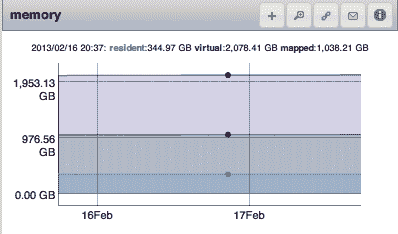
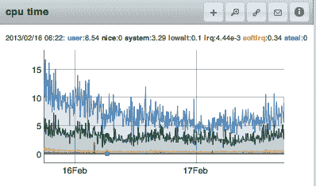

# 第二十二章：监控 MongoDB

在部署之前，设置某种类型的监控非常重要。监控应该允许您追踪服务器正在做什么，并在出现问题时提醒您。本章将涵盖：

+   如何追踪 MongoDB 的内存使用情况

+   如何跟踪应用程序性能指标

+   如何诊断复制问题

我们将使用 MongoDB Ops Manager 的示例图表来演示监控时要查找的内容（请参阅[Ops Manager 的安装说明](https://oreil.ly/D4751)）。MongoDB Atlas（MongoDB 的云数据库服务）的监控能力非常类似。MongoDB 还提供了一个免费的监控服务，用于监控独立节点和副本集。它将监控数据保留 24 小时，并提供有关操作执行时间、内存使用情况、CPU 使用情况和操作计数的粗略统计信息。

如果您不想使用 Ops Manager、Atlas 或 MongoDB 的免费监控服务，请使用某种类型的监控。它将帮助您在问题造成之前检测潜在问题，并在出现问题时进行诊断。

# 监控内存使用情况

访问内存中的数据速度很快，而访问磁盘上的数据速度很慢。不幸的是，内存很昂贵（而磁盘很便宜），通常 MongoDB 在使用其他资源之前就会用完内存。本节介绍如何监控 MongoDB 与 CPU、磁盘和内存的交互，并要注意什么。

## 计算机内存介绍

计算机通常具有少量快速访问的内存和大量慢速访问的磁盘。当您请求存储在磁盘上（尚未在内存中）的数据页时，系统会发生页面错误，并将该页面从磁盘复制到内存中。然后，它可以非常快速地访问内存中的页面。如果您的程序停止定期使用该页面，并且内存填满了其他页面，那么旧页面将从内存中逐出，并且仅在磁盘上再次存在。

将页面从磁盘复制到内存比从内存读取页面需要更长时间。因此，MongoDB 能够尽可能地减少从磁盘复制数据，它将能够更快地访问数据。因此，MongoDB 的内存使用是需要追踪的最重要的统计数据之一。

## 跟踪内存使用情况

MongoDB 在 Ops Manager 报告了三种“类型”的内存：驻留内存、虚拟内存和映射内存。驻留内存是 MongoDB 明确拥有的 RAM 中的内存。例如，如果您查询一个文档并将其换入内存，则该页将添加到 MongoDB 的驻留内存中。

MongoDB 为该页面分配了一个地址。这个地址并不是页面在 RAM 中的真实地址；它是一个虚拟地址。MongoDB 可以将其传递给内核，内核将查找页面的真实位置。这样，如果内核需要从内存中驱逐页面，MongoDB 仍然可以使用该地址访问它。MongoDB 将向内核请求内存，内核将查看其页面缓存，发现页面不在其中时，会发生页面错误以将页面复制到内存中，并返回给 MongoDB。

如果您的数据完全适合内存，驻留内存应该大致等于您的数据大小。当我们谈论数据“在内存中”时，我们总是指数据在 RAM 中。

MongoDB 映射的内存包括 MongoDB 曾经访问过的所有数据（它拥有地址的所有数据页）。它通常会接近您的数据集大小。

虚拟内存是操作系统提供的一个抽象，隐藏了软件进程对物理存储细节的直接访问。每个进程看到的是一个连续的内存地址空间，可以使用。在 Ops Manager 中，MongoDB 的虚拟内存使用通常是映射内存大小的两倍。

图 22-1 显示了 Ops Manager 关于内存信息的图表，描述了 MongoDB 使用的虚拟、驻留和映射内存量。映射内存仅适用于使用 MMAP 存储引擎的较旧（4.0 之前）的部署。现在 MongoDB 使用 WiredTiger 存储引擎，您应该看到映射内存的使用量为零。在专用于 MongoDB 的机器上，驻留内存应该略小于总内存大小（假设您的工作集大小与内存一样大或更大）。驻留内存是实际跟踪物理 RAM 中数据量的统计数据，但仅凭这一点不能告诉您 MongoDB 如何使用内存。



###### 图 22-1 从顶部到底部依次是：虚拟、驻留和映射内存

如果您的数据完全适合内存，驻留内存应该大致等于您的数据大小。当我们谈论数据“在内存中”时，我们总是指数据在 RAM 中。

正如您可以从图 22-1 看到的那样，内存指标通常保持相对稳定，但随着数据集的增长，虚拟内存（顶部线）也会随之增长。驻留内存（中间线）将增长到可用 RAM 的大小，然后保持稳定。

## 跟踪页面错误

您可以使用其他统计信息来了解 MongoDB 如何使用内存，而不仅仅是每种类型有多少。一个有用的统计数据是页面错误的数量，它告诉您 MongoDB 查找的数据在 RAM 中不在的频率。图 22-2 和 22-3 是显示随时间变化的页面错误的图表。图 22-3 的页面错误少于 图 22-2，但单独来看这些信息并不是很有用。如果 图 22-2 的磁盘能够处理那么多的错误，并且应用程序可以处理磁盘寻址的延迟，那么拥有这么多错误（或更多）就没有特别的问题。另一方面，如果您的应用程序无法处理从磁盘读取数据的增加延迟，您别无选择，只能将所有数据存储在内存中（或使用 SSD）。


###### 图 22-2\. 一个每分钟发生数百次页面错误的系统


###### 图 22-3\. 每分钟发生几次页面错误的系统

不管应用程序有多宽容，当磁盘负载过重时，页面错误就会成为一个问题。磁盘可以处理的负载量并非线性：一旦磁盘开始过载，每个操作都必须等待更长的时间，从而产生连锁反应。通常存在一个临界点，磁盘性能会迅速下降。因此，最好避免接近磁盘能处理的最大负载。

###### 注意

随着时间推移跟踪您的页面错误数量。如果您的应用程序在某个页面错误数上表现良好，则对系统可以处理多少页面错误有一个基准。如果页面错误开始逐渐增加并导致性能下降，则有一个警报的阈值。

您可以通过查看 `serverStatus` 输出的 `"page_faults"` 字段来查看每个数据库的页面错误统计：

```
> db.adminCommand({"serverStatus": 1})["extra_info"]
{ "note" : "fields vary by platform", "page_faults" : 50 }
```

`"page_faults"` 提供了自启动以来 MongoDB 必须访问磁盘的次数。

## I/O 等待

总的来说，页面错误通常与 CPU 空闲等待磁盘的时间密切相关，称为 `I/O 等待`。某些 I/O 等待是正常的；MongoDB 有时必须访问磁盘，尽管它在这样做时试图不阻塞任何操作，但无法完全避免。重要的是，I/O 等待没有增加或接近 100%，如 图 22-4 所示。这表示磁盘负载过重。


###### 图 22-4\. I/O 等待约为 100%

# 计算工作集

一般来说，内存中的数据越多，MongoDB 的性能越快。因此，应用程序可能按以下顺序从快到慢具有：

1.  整个数据集在内存中。这虽然很好，但通常太昂贵或不可行。对于依赖快速响应时间的应用程序可能是必需的。

1.  在内存中的工作集。这是最常见的选择。

    你的工作集是应用程序使用的数据和索引。这可能是全部数据，但通常有一个核心数据集（例如，*用户*集合和最近一个月的活动），涵盖了 90%的请求。如果这个工作集适合于 RAM，MongoDB 通常会很快：它只需为少数“不寻常”的请求访问磁盘。

1.  内存中的索引。

1.  内存中的索引工作集。

1.  内存中没有有用的数据子集。如果可能，请避免这种情况。这会很慢。

您必须知道您的工作集是什么（以及有多大），才能知道是否可以将其保留在内存中。计算工作集大小的最佳方法是跟踪常见操作，以了解您的应用程序读取和写入的数据量。例如，假设您的应用程序每周创建 2 GB 的新数据，其中 800 MB 经常访问。用户倾向于访问最多一个月的数据，超过这个时间的数据基本上不用了。您的工作集大小可能约为 3.2 GB（每周 800 MB × 4 周），再加上索引的余地，因此称之为 5 GB。

有一种思考方式是跟踪随时间访问的数据，如图 22-5 所示。如果选择一个包括 90%请求的截止时间，例如图 22-6，那么在该时间段内生成的数据（和索引）形成了您的工作集。您可以测量该时间段以确定数据集增长的情况。请注意，此示例使用时间，但可能存在另一种更适合您的应用程序的访问模式（时间是最常见的一种）。


###### 图 22-5\. 数据访问按数据年龄的图形绘制


###### 图 22-6\. 工作集是在“频繁请求”截止之前使用的数据（在图中用垂直线标示）

## 一些工作集示例

假设您有一个 40 GB 的工作集。90%的请求命中工作集，10%命中其他数据。如果您有 500 GB 的数据和 50 GB 的 RAM，则您的工作集完全适合 RAM。一旦应用程序访问了通常访问的数据（称为*预热*过程），它就不应再为工作集访问磁盘。然后，您有 10 GB 的空间可用于 460 GB 的不经常访问的数据。显然，MongoDB 几乎总是需要访问非工作集数据才能访问磁盘。

另一方面，假设您的工作集不适合 RAM——例如，如果您只有 35 GB 的 RAM。那么工作集通常会占用大部分 RAM。工作集更有可能留在 RAM 中，因为它被更频繁地访问，但在某个时刻，不经常访问的数据将被分页进入，驱逐工作集（或其他不经常访问的数据）。因此，从磁盘访问工作集没有可预测的性能。

# 性能跟踪

查询性能通常是需要跟踪和保持一致的重要指标。有几种方法可以跟踪 MongoDB 是否在处理当前请求负载时遇到问题。

MongoDB 可能会因为 CPU 受 I/O 限制（通过高 I/O 等待指示）。WiredTiger 存储引擎是多线程的，并且可以利用额外的 CPU 核心。与较旧的 MMAP 存储引擎相比，这可以在 CPU 指标的更高使用水平中看出。然而，如果用户或系统时间接近 100%（或者是您拥有的 CPU 数量乘以 100%），最常见的原因是您在频繁使用的查询上缺少索引。跟踪 CPU 使用率（特别是在部署应用程序的新版本后）是一个好主意，以确保所有查询都表现如预期。

注意，图表显示在 图 22-7 中是正常的：如果页面故障数较少，I/O 等待可能会被其他 CPU 活动所掩盖。只有当其他活动开始增加时，坏的索引可能是罪魁祸首。



###### 图 22-7\. 具有最小 I/O 等待时间的 CPU：顶部线为用户，底部线为系统；其他统计数据非常接近 0%

一个类似的度量标准是排队：MongoDB 等待处理的请求数量。当请求等待其需要的锁进行读取或写入时，请求被视为排队。图 22-8 显示了随时间变化的读取和写入队列的图表。没有队列是首选（基本上是一个空图表），但这个图表并不值得担忧。在一个繁忙的系统中，一个操作不得不等待正确的锁变得可用是很正常的事情。


###### 图 22-8\. 随时间变化的读取和写入队列

WiredTiger 存储引擎提供文档级并发，允许对同一集合进行多个同时写入。这显著提高了并发操作的性能。所使用的票务系统控制正在使用的线程数，以避免饥饿：它为读取和写入操作分配票据（默认情况下，每种操作分配 128 个），在此之后新的读取或写入操作将排队。`serverStatus` 的 `wiredTiger.concurrentTransactions.read.available` 和 `wiredTiger.concurrentTransactions.write.available` 字段可用于跟踪可用票据数量何时降至零，表示相应的操作现在正在排队。

通过查看排队的请求数量，您可以看出请求是否在堆积。通常情况下，队列大小应该很小。一个大且长期存在的队列表明 *mongod* 无法跟上其负载。您应该尽快减少该服务器上的负载。

# 跟踪剩余空间

另一个基本但重要的监控指标是磁盘使用情况。有时用户会等到磁盘空间用完才考虑如何处理。通过监控磁盘使用情况并跟踪剩余磁盘空间，你可以预测当前驱动器足够使用的时间，并提前计划在不足时的处理方法。

当你的空间用完时，有几个选项：

+   如果你正在使用分片，请添加另一个分片。

+   如果有未使用的索引，删除它们。可以使用特定集合的聚合`$indexStats`来识别它们。

+   如果你还没有在从节点上运行压缩操作，那么在这方面尝试一下。这通常只在从集合中删除大量数据或索引并且不会被替换时才有用。

+   关闭副本集的每个成员（逐个），将其数据复制到较大的磁盘上，然后可以挂载该磁盘。重新启动成员并继续下一个。

+   用具有较大驱动器的成员替换副本集的成员：删除一个旧成员并添加一个新成员，让它赶上其余成员。对副本集的每个成员重复此操作。

+   如果你使用了`directoryperdb`选项，并且你有一个特别快速增长的数据库，将其移到独立的驱动器上。然后在你的数据目录中将该卷挂载为一个目录。这样可以避免移动其余数据。

无论你选择哪种技术，都要提前计划以最小化对你的应用程序的影响。你需要时间来备份数据，逐个修改副本集的每个成员，并将数据从一个地方复制到另一个地方。

# 监控复制

复制滞后和操作日志长度是重要的监控指标。滞后是指从节点不能跟上主节点的情况。它的计算方法是从从节点上应用的最后一个操作的时间减去主节点上最后一个操作的时间。例如，如果从节点刚刚应用了一个时间戳为下午 3:26:00 的操作，而主节点刚刚应用了一个时间戳为下午 3:29:45 的操作，则从节点滞后了 3 分钟 45 秒。你希望滞后尽可能接近 0，通常是毫秒级的。如果从节点跟上主节点，复制滞后应该看起来像图 22-9 中显示的那样：基本上始终为 0。


###### 图 22-9\. 一个没有滞后的副本集；这是你希望看到的情况

如果一个从节点不能像主节点写入那样快速地复制写操作，你会开始看到一个非零的滞后。这种情况的极端情形是复制卡住了：从节点由于某些原因不能再应用任何操作。此时，滞后将每秒增长一秒，形成图 22-10 中显示的陡峭斜坡。这可能是由网络问题或缺少`"_id"`索引引起的，后者在每个集合上都是复制正常运行所必需的。

###### 小贴士

如果一个集合缺少 `"_id"` 索引，请将服务器从副本集中移出，作为独立服务器启动，并构建 `"_id"` 索引。确保将 `"_id"` 索引创建为*唯一*索引。一旦创建，`"_id"` 索引不能被删除或更改（除非删除整个集合）。

如果系统过载，次要节点可能逐渐落后。一些复制仍在进行，因此通常不会在图表中看到典型的“每秒一秒”的斜坡。不过，如果次要节点无法跟上高峰期的流量或者逐渐落后，这一点非常重要。


###### 图 22-10\. 复制出现故障，并在 2 月 10 日前开始恢复；垂直线代表服务器重新启动。

主节点不会限制写入速度来“帮助”次要节点追赶，因此在过载系统上次要节点落后是常见的（特别是因为 MongoDB 倾向于优先处理写入而不是读取，这意味着复制可能会在主节点上饿死）。你可以通过在写入关注中使用 `"w"` 来在一定程度上强制主节点限制。你也可能希望尝试将次要节点上处理的任何请求路由到另一个成员。

如果你的系统极度**负载不足**，你可能会看到另一种有趣的模式：复制延迟突然上升，如图 22-11 所示。所显示的突然上升实际上不是延迟，而是由于采样变化引起的。*mongod* 处理每隔几分钟写入一次。因为延迟是通过主节点和次要节点时间戳之间的差值来衡量的，所以在主节点写入之前，测量次要节点的时间戳看起来会晚几分钟。如果增加写入速率，这些突然上升应该会消失。


###### 图 22-11\. 低写入系统可能导致“虚假”延迟。

跟踪的另一个重要复制指标是每个成员的操作日志（oplog）长度。可能成为主节点的每个成员都应该有超过一天的操作日志。如果一个成员可能成为另一个成员的同步源，它应该有超过初始同步完成所需时间的操作日志。图 22-12 展示了一个标准的操作日志长度图表。这个操作日志长度很好：1,111 小时相当于一个月的数据！一般来说，操作日志应该尽可能长，只要你负担得起磁盘空间。考虑到它们的使用方式，它们基本上不占用内存，而长操作日志可能意味着在运维体验上的巨大差异，从痛苦到轻松。


###### 图 22-12\. 典型的操作日志长度图表。

图 22-13 展示了由于操作日志较短和流量变化导致的稍微不寻常的变化。这仍然是健康的，但是这台机器上的操作日志可能太短了（维护期间为 6 到 11 小时）。管理员可能希望有机会时将操作日志长度延长。


###### 第 22-13 图。一个每天流量高峰的应用程序的操作日志长度图表。
