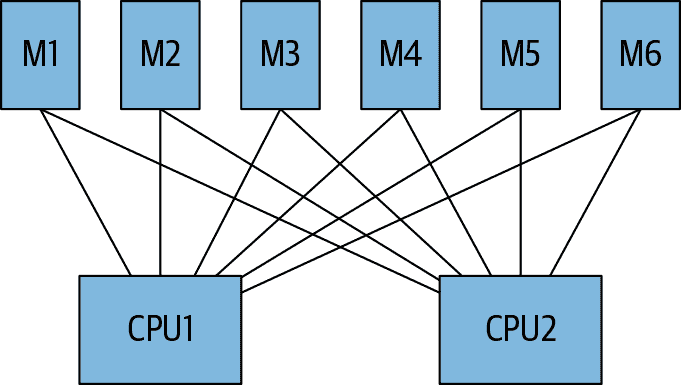
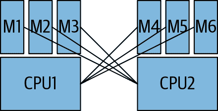
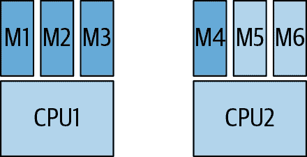
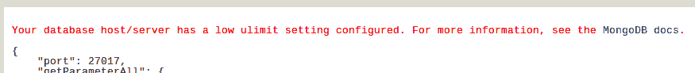

# 第二十四章：部署 MongoDB

本章提供了用于设置进入生产服务器的建议。具体来说，涵盖了：

+   选择购买什么硬件以及如何设置它

+   使用虚拟化环境

+   重要的内核和磁盘 I/O 设置

+   网络设置：谁需要连接到谁

# 系统设计

通常希望优化数据安全性和能够负担的最快访问速度。本节讨论在选择磁盘、RAID 配置、CPU 和其他硬件及低级软件组件时实现这些目标的最佳方法。

## 选择存储介质

按照偏好顺序，我们希望从以下位置存储和检索数据：

1.  RAM

1.  SSD

1.  旋转磁盘

不幸的是，大多数人的预算有限或者数据量足够大，使得将所有内容存储在 RAM 中不切实际，而 SSD 又太昂贵。因此，典型的部署是少量 RAM（相对于总数据量）和大量旋转磁盘空间。如果您处于这种情况，重要的是您的工作集小于 RAM，并且如果工作集变大，您应该准备好进行扩展。

如果您能够在硬件上花费很多钱，购买大量 RAM 和/或 SSD。

从 RAM 读取数据需要几纳秒（比如说，100）。相反，从磁盘读取需要几毫秒（比如说，10）。很难想象这两个数字之间的差异，所以让我们将它们扩展到更容易理解的数字：如果访问 RAM 需要 1 秒，那么访问磁盘将需要超过一天！

100 纳秒 × 10,000,000 = 1 秒

10 毫秒 × 10,000,000 = 1.16 天

这些都是非常粗略的估算（您的磁盘可能稍微快一些或者您的 RAM 可能稍微慢一些），但这种差异的数量级并不会有太大变化。因此，我们希望尽可能少地访问磁盘。

## 推荐的 RAID 配置

RAID 是一种硬件或软件，可以让您将多个磁盘看作单个磁盘来使用。它可以用于可靠性、性能或两者兼而有之。使用 RAID 的一组磁盘称为 RAID 阵列（有点冗余，因为 RAID 意为冗余的*廉价*磁盘阵列）。

有许多配置 RAID 的方法，取决于您所寻找的功能组合——通常是一些速度和容错性的结合。以下是最常见的几种类型：

RAID0

为了提高性能而进行磁盘条带化。每个磁盘保存部分数据，类似于 MongoDB 的分片。由于有多个底层磁盘，可以同时写入大量数据。这提高了写入的吞吐量。然而，如果一个磁盘故障并丢失数据，则没有其它副本。这也可能导致读取缓慢，因为某些数据卷可能比其他卷慢。

RAID1

为了提高可靠性而进行镜像。数据的完全副本被写入阵列的每个成员。这比 RAID0 具有较低的性能，因为一个速度较慢的磁盘会拖慢所有写操作。然而，如果一个磁盘故障，你仍然可以在阵列的另一个成员上找到数据的副本。

RAID5

磁盘条带化，以及保留关于已存储数据的其他数据片段，以防服务器故障时丢失数据。基本上，RAID5 可以处理一个磁盘故障，并从用户那里隐藏此故障。然而，它比这里列出的任何其他变体都要慢，因为每次写入数据时都需要计算这个额外的信息。对于 MongoDB 来说尤其昂贵，因为典型的工作负载执行许多小写操作。

RAID10

RAID0 和 RAID1 的结合：数据条带化以提高速度，同时镜像以提高可靠性。

我们建议使用 RAID10：它比 RAID0 更安全，并且可以解决 RAID1 可能出现的性能问题。然而，有些人认为在副本集之上使用 RAID1 过于保守，因此选择了 RAID0。这是一个个人偏好的问题：你愿意为了性能而承担多大的风险？

不要使用 RAID5：它非常非常慢。

## CPU

MongoDB 在历史上对 CPU 消耗很轻，但使用 WiredTiger 存储引擎后情况已经改变。WiredTiger 存储引擎是多线程的，可以利用额外的 CPU 核心。因此，你应该在内存和 CPU 之间保持平衡。

在速度和核心数量之间进行选择时，请选择速度。MongoDB 更擅长利用单个处理器上的更多周期，而不是增加并行性。

## 操作系统

64 位 Linux 是 MongoDB 表现最佳的操作系统。如果可能的话，请使用这些操作系统的某个变体。CentOS 和 Red Hat Enterprise Linux 可能是最流行的选择，但任何变体都应该可以使用（Ubuntu 和 Amazon Linux 也很常见）。请确保使用操作系统的最新稳定版本，因为旧的、有错误的软件包或内核有时可能会引起问题。

64 位 Windows 也得到了很好的支持。

其他 Unix 变体的支持不如 Linux：如果你使用 Solaris 或 BSD 的其中一个，请谨慎处理。在历史上，这些系统的构建存在许多问题。MongoDB 明确于 2017 年 8 月停止支持 Solaris，指出用户对其缺乏采用。

关于跨兼容性的一项重要说明：MongoDB 在所有系统上使用相同的传输协议并以相同的方式布置数据文件，因此你可以在多种操作系统组合上部署。例如，你可以在 Windows 上运行*mongos*进程，而其作为分片的*mongod*则在 Linux 上运行。你还可以在 Windows 和 Linux 之间复制数据文件，而无需担心兼容性问题。

自版本 3.4 起，MongoDB 不再支持 32 位 x86 平台。不要在 32 位机器上运行任何类型的 MongoDB 服务器。

MongoDB 可与小端架构一起工作，并支持一种大端架构：IBM 的 zSeries。大多数驱动程序都支持小端和大端系统，因此您可以在任何一个上运行客户端。但服务器通常会在小端机器上运行。

## 交换空间

在内存限制达到时，应分配少量交换空间，以防止内核杀死 MongoDB。它通常不会使用任何交换空间，但在极端情况下，WiredTiger 存储引擎可能会使用一些。如果发生这种情况，则应考虑增加机器的内存容量或重新审视工作负载，以避免这种对性能和稳定性都具有问题的情况。

MongoDB 使用的大部分内存是“滑动”的：只要系统请求用于其他用途的空间，它就会被刷新到磁盘并用其他内存替换。因此，数据库数据不应该被写入交换空间：它将首先被刷新回磁盘。

然而，偶尔 MongoDB 会使用交换空间来进行需要排序数据的操作：无论是构建索引还是排序。它尽力不会为这些类型的操作使用过多内存，但通过同时执行许多这些操作，可能会强制进行交换。

如果您的应用程序设法使 MongoDB 使用交换空间，应考虑重新设计应用程序或减少对交换服务器的负载。

## 文件系统

对于 Linux，仅推荐在使用 WiredTiger 存储引擎时使用 XFS 文件系统作为您的数据卷。虽然可以在 WiredTiger 上使用 ext4 文件系统，但请注意已知的性能问题（特别是在 WiredTiger 检查点上可能会出现停顿）。

在 Windows 上，NTFS 或 FAT 都可以。

###### 警告

不要直接将 Network File Storage（NFS）挂载用于 MongoDB 存储。某些客户端版本会关于刷新，随机重新挂载和刷新页面缓存，并不支持排他文件锁定。使用 NFS 可能会导致日志损坏，应尽量避免。

# 虚拟化

虚拟化是获取廉价硬件并能够快速扩展的好方法。然而，也存在一些缺点 —— 特别是不可预测的网络和磁盘 I/O。本节涵盖了虚拟化特定的问题。

## 内存过度承诺

`memory overcommit` Linux 内核设置控制当进程从操作系统请求过多内存时会发生什么。根据设置方式，内核可能会向进程分配内存，即使该内存实际上并不可用（希望在进程需要时会变得可用）。这就是所谓的*过度承诺*：内核承诺了实际上并不存在的内存。这个操作系统内核设置与 MongoDB 不兼容。

`vm.overcommit_memory` 的可能值为 0（内核猜测超出量的大小）、1（内存分配总是成功）或 2（不要比交换空间加上超出比率的一小部分更多的虚拟地址空间）。值 2 比较复杂，但是这是目前可用的最佳选项。要设置此选项，请运行：

```
$ echo 2 > /proc/sys/vm/overcommit_memory
```

更改操作系统设置后，您无需重新启动 MongoDB。

## 神秘的内存

有时虚拟化层未正确处理内存分配。因此，您可能有一个虚拟机声称有 100GB 可用的内存，但实际上只能让您访问其中的 60GB。相反地，我们也看到有些人本应有 20GB 内存，最终可以将整个 100GB 的数据集放入内存中！

假设您没有运气，您将无能为力。如果您的操作系统预读设置正确，并且您的虚拟机只是不会使用应有的所有内存，您可能只能切换虚拟机。

## 处理网络磁盘 I/O 问题

使用虚拟化硬件的最大问题之一是，通常您与其他租户共享磁盘，这会加剧之前提到的磁盘速度缓慢问题，因为每个人都在竞争磁盘 I/O。因此，虚拟化磁盘的性能非常不可预测：它们在您的邻居不忙的时候可能运行良好，但如果有人开始大量使用磁盘，它们可能突然变得运行缓慢。

另一个问题是，这种存储通常未直接连接到运行 MongoDB 的机器上，因此即使您拥有一块独立的硬盘，I/O 的速度也会比使用本地硬盘慢。还有一个不太可能但有可能的情况是，您的 MongoDB 服务器与数据的网络连接中断。

亚马逊拥有可能是最广泛使用的网络块存储，称为弹性块存储（Elastic Block Store，EBS）。EBS 卷可以连接到弹性计算云（Elastic Compute Cloud，EC2）实例，允许您立即为机器提供几乎任意数量的磁盘。如果您正在使用 EC2，还应该在实例类型可用时启用 AWS 增强网络，并禁用动态电压和频率调节（DVFS）以及 CPU 节能模式和超线程。从积极的一面来看，EBS 使备份变得非常简单（从次要源快照，将 EBS 驱动器挂载到另一个实例上，并启动 *mongod*）。但是，缺点是您可能会遇到性能不稳定的情况。

如果您需要更可预测的性能，有几个选择。一种是在自己的服务器上托管 MongoDB —— 这样，您就知道没有人会拖慢速度。但是，对于很多人来说，这并不是一个选择，因此下一个最好的选择就是在云中获取一个保证每秒 I/O 操作数的实例。有关托管服务的最新建议，请参阅 [*http://docs.mongodb.org*](http://docs.mongodb.org)。

如果你不能选择上述任何一种选项，而你需要更多的磁盘 I/O 超过过载的 EBS 卷能够支持的话，还有一种方法可以绕过它。基本上，你可以持续监控 MongoDB 正在使用的卷。如果那个卷变慢了，立即杀掉该实例，然后启动一个新的实例，并使用不同的数据卷。

有几个统计数据需要关注：

+   I/O 利用率飙升（在 Cloud Manager/Atlas 上的“IO wait”），显而易见的原因。

+   页面错误率飙升。请注意，应用程序行为的更改也可能导致工作集的变化：在部署新版本应用程序之前，你应该禁用这个刺杀脚本。

+   丢失的 TCP 数据包数量上升（Amazon 在这方面尤其糟糕：当性能开始下降时，它会随处丢弃 TCP 数据包）。

+   MongoDB 的读写队列飙升（可以在 Cloud Manager/Atlas 或*mongostat*的`qr/qw`列中看到）。

如果你的负载在一天或一周内有所变化，请确保你的脚本考虑到这一点：你不希望一个恶意的定时作业因为周一早晨的异常繁忙而杀掉所有的实例。

这个技巧依赖于你有最近的备份或者数据集同步速度比较快。如果每个实例都持有几 TB 的数据，你可能需要考虑其他方法。此外，这只是*可能*有效：如果你的新卷也受到负载的影响，它将和旧卷一样慢。

## 使用非网络连接的磁盘

###### 注意

本节使用了亚马逊特定的术语。然而，它可能适用于其他提供商。

临时驱动器是连接到虚拟机所在物理机器的实际磁盘。它们没有网络存储的许多问题。本地磁盘仍然可能被同一台机器上的其他用户过载，但是在大型机器上，你可以合理地确保你不会与太多其他用户共享磁盘。即使是较小的实例，通常临时驱动器的性能也会比网络驱动器更好，只要其他租户不进行大量的 IOPS 操作。

缺点正如其名：这些磁盘是临时的。如果你的 EC2 实例宕机，重新启动实例时不能保证会回到同一台机器，那么你的数据将会丢失。

因此，临时驱动器应谨慎使用。你应确保不在这些磁盘上存储任何重要或未复制的数据。特别是，不要将日志放在这些临时驱动器上，或者将你的数据库放在网络存储上。总体而言，把临时驱动器看作是一个慢速缓存而不是快速磁盘，并相应地使用它们。

# 配置系统设置

有几个系统设置可以帮助 MongoDB 运行更顺畅，这些设置大多与磁盘和内存访问有关。本节涵盖了每个选项及其调整方法。

## 关闭 NUMA

当计算机只有一个 CPU 时，所有 RAM 在访问时间上基本相同。随着计算机开始拥有更多处理器，工程师意识到让所有内存与每个 CPU 等距离（如 图 24-1 所示）不如让每个 CPU 有一些特别靠近它的内存，并且对该 CPU 访问快速的内存（如 图 24-2 所示）更有效率。每个 CPU 都有其自己“本地”内存的这种架构称为*非统一内存架构*（NUMA）。



###### 图 24-1\. 统一内存架构：每个 CPU 对所有内存的访问成本相同



###### 图 24-2\. 非统一内存架构：某些内存连接到一个 CPU，使该 CPU 更快地访问该内存；CPU 仍然可以访问其他 CPU 的内存，但与访问自己的内存相比，成本更高

对于许多应用程序来说，NUMA 的效果很好：处理器通常需要不同的数据，因为它们运行不同的程序。然而，这对于数据库来说效果极差，特别是 MongoDB，因为数据库的内存访问模式与其他类型的应用程序大不相同。MongoDB 使用大量内存，并且需要能够访问“本地”于其他 CPU 的内存。然而，许多系统上默认的 NUMA 设置使得这一点很困难。

CPUs 偏向使用与它们连接的内存，而进程倾向于优先使用一个 CPU。这意味着内存通常会不均匀地填满，可能导致一个处理器使用其本地内存的 100%，而其他处理器仅使用它们内存的一小部分，如 图 24-3 所示。



###### 图 24-3\. NUMA 系统中的示例内存使用情况

在 图 24-3 的场景中，假设 CPU1 需要一些尚未在内存中的数据。它必须使用其本地内存存储没有“归属”的数据，但其本地内存已满。因此，它必须逐出一些本地内存中的数据，为新数据腾出空间，即使 CPU2 的内存还有大量空间可用！这个过程往往会导致 MongoDB 运行速度远低于预期，因为它只能使用可用内存的一小部分。MongoDB 更倾向于半有效地访问更多数据，而不是极其有效地访问更少的数据。

在 NUMA 硬件上运行 MongoDB 服务器和客户端时，应配置内存交织策略，以使主机以非 NUMA 方式运行。MongoDB 在 Linux 和 Windows 机器上部署时会检查 NUMA 设置。如果 NUMA 配置可能降低性能，MongoDB 将打印警告。

在 Windows 上，必须通过机器的 BIOS 启用内存交织。请参考系统文档获取详细信息。

在 Linux 上运行 MongoDB 时，应使用以下命令之一在 *sysctl* 设置中禁用区域回收：

`echo 0 | sudo tee /proc/sys/vm/zone_reclaim_mode`

```
sudo sysctl -w vm.zone_reclaim_mode=0
```

然后，您应该使用 *numactl* 启动您的 *mongod* 实例，包括配置服务器、*mongos* 实例和任何客户端。如果您没有 `numactl` 命令，请参阅您操作系统的文档安装 *numactl* 软件包。

下面的命令演示了如何使用 *numactl* 启动 MongoDB 实例：

```
numactl --interleave=all *<path> <options>*
```

*`<路径>`* 是您要启动的程序的路径，而 *`<选项>`* 是要传递给该程序的任何可选参数。

要完全禁用 NUMA 行为，您必须执行这两个操作。有关更多信息，请参阅[文档](https://oreil.ly/cm-_D)。

## 设置预读

预读是操作系统读取比实际请求的数据更多的优化方法。这是有用的，因为大多数计算机处理的工作负载是顺序的：如果您加载视频的前 20 MB，您可能会希望获取接下来的几兆字节。因此，系统将从磁盘读取比您实际请求的更多数据，并将其存储在内存中，以防您很快需要它。

对于 WiredTiger 存储引擎，无论存储介质类型（旋转磁盘、SSD 等），都应将预读设置为 8 到 32。将其设置得更高有助于顺序 I/O 操作，但由于 MongoDB 的磁盘访问模式通常是随机的，较高的预读值提供的益处有限，甚至可能导致性能下降。对于大多数工作负载，预读设置为 8 到 32 提供了最佳的 MongoDB 性能。

通常情况下，您应该在此范围内设置预读（readahead），除非测试表明更高的值在可测性、重复性和可靠性方面都有明显的益处。MongoDB 专业支持可以就非零预读配置提供建议和指导。

## 禁用透明大页（THP）

THP 会引起类似于高预读的问题。除非

+   您的所有数据都适合放入内存。

+   您没有计划让它超出内存范围。

MongoDB 需要将大量小片段的内存分页，因此使用 THP 可能会导致更多的磁盘 I/O。

系统通过页面从磁盘到内存再回来移动数据。页面通常是几千字节（x86 默认为 4,096 字节页面）。如果一台机器有许多吉字节的内存，追踪每个（相对较小的）页面可能比仅追踪几个更大粒度的页面更慢。THP 是一个解决方案，允许您拥有高达 256 MB 的页面（适用于 IA-64 架构）。但是，使用它意味着您正在将来自磁盘一部分的兆字节数据保留在内存中。如果您的数据不适合在 RAM 中，则从磁盘中交换更大的数据块将快速填满您的内存，需要再次交换出去。此外，刷新任何更改到磁盘的速度会更慢，因为磁盘必须写入兆字节的“脏”数据，而不是几千字节。

THP 实际上是为了使数据库受益而开发的，因此对经验丰富的数据库管理员来说可能会感到惊讶。 然而，MongoDB 往往比关系数据库进行较少的顺序磁盘访问。

###### 注意

在 Windows 上，这些称为大页而不是巨大页。 某些 Windows 版本默认启用此功能，某些则没有，因此请检查并确保已关闭。

## 选择磁盘调度算法

磁盘控制器从操作系统接收请求，并根据调度算法确定的顺序处理它们。 有时更改此算法可以改善磁盘性能。 对于其他硬件和工作负载，可能没有区别。 决定使用哪种算法的最佳方法是在您自己的工作负载上进行测试。 截止时间和完全公平排队（CFQ）通常都是不错的选择。

有几种情况下，noop 调度器（“no-op”的缩写）是最佳选择。 如果您处于虚拟化环境中，请使用 noop 调度器。 此调度程序基本上将操作尽快传递到底层磁盘控制器。 最快的方法是这样做，并让真实的磁盘控制器处理任何需要进行的重新排序。

类似地，在 SSD 上，noop 调度器通常是最佳选择。 SSD 没有与旋转磁盘相同的局部性问题。

最后，如果您使用带有缓存的 RAID 控制器，请使用 noop。 缓存的行为类似于 SSD，将有效地将写操作传播到磁盘。

如果您在未虚拟化的物理服务器上，则操作系统应使用截止时间调度程序。 截止时间调度程序限制每个请求的最大延迟，并保持对于磁盘密集型数据库应用程序最佳的合理磁盘吞吐量。

您可以通过在引导配置中设置`--elevator`选项来更改调度算法。

###### 注意

这个选项称为“电梯”，因为调度器的行为类似于电梯，从不同的楼层（进程/时间）中接收人们（I/O 请求），并以一种较优的方式将它们送到它们想去的地方。

通常所有的算法表现都很好； 您可能看不出它们之间有多大区别。

## 禁用访问时间跟踪

默认情况下，系统会跟踪文件上次访问的时间。 由于 MongoDB 使用的数据文件非常频繁，因此通过禁用此跟踪可以提高性能。 您可以在 Linux 上通过在*/etc/fstab*中将`atime`更改为`noatime`来执行此操作：

```
/dev/sda7 /data xfsf rw,noatime 1  2
```

您必须重新挂载设备以使更改生效。

在较旧的内核（例如 ext3）上，`atime`是一个更大的问题； 较新的内核默认使用`relatime`，它的更新较少。 另外，请注意，设置`noatime`可能会影响使用该分区的其他程序，例如*mutt*或备份工具。

同样，在 Windows 上，您应该设置`disablelastaccess`选项。 要关闭最后访问时间记录，请运行：

```
C:\> fsutil behavior set disablelastaccess 1
```

必须重新启动才能使此设置生效。设置这个可能会影响远程存储服务，但您可能不应该使用自动将数据移动到其他磁盘的服务。

## 修改限制

MongoDB 往往会超出两个限制：一个进程允许生成的线程数和一个进程允许打开的文件描述符数。通常情况下，这两者都应该设置为无限制。

每当 MongoDB 服务器接受一个连接时，它会生成一个线程来处理该连接上的所有活动。因此，如果您有 3000 个连接到数据库的连接，数据库将有 3000 个正在运行的线程（加上一些用于非客户端相关任务的其他线程）。根据您的应用服务器配置，您的客户端可能会生成从几十到数千个连接到 MongoDB 的连接。

如果您的客户端会随着流量增加动态生成更多的子进程（大多数应用服务器会这样做），重要的是确保这些子进程数量不要太多，以至于它们可以超出 MongoDB 的限制。例如，如果您有 20 个应用服务器，每个服务器允许生成 100 个子进程，并且每个子进程可以生成 10 个线程，所有这些都连接到 MongoDB，那么在高峰时段可能会生成 20 × 100 × 10 = 20000 个连接。MongoDB 可能不会很高兴地生成数万个线程，并且如果您的进程线程数达到上限，将简单地开始拒绝新的连接。

另一个需要修改的限制是 MongoDB 允许打开的文件描述符数。每个传入和传出的连接都使用一个文件描述符，因此刚才提到的客户端连接风暴将创建 20000 个打开的文件句柄。

特别是*mongos*倾向于创建到许多分片的连接。当客户端连接到*mongos*并发出请求时，*mongos*会打开到所有必要的分片的连接来完成该请求。因此，如果一个集群有 100 个分片，并且客户端连接到*mongos*并尝试查询其所有数据，则*mongos*必须打开 100 个连接：每个分片一个连接。这可能很快导致连接数量激增，正如前面的例子所示。假设一个配置很宽松的应用服务器向*mongos*进程创建了 100 个连接。这可能被翻译为 100 个入站连接 × 100 个分片 = 10000 个分片的连接！（这假设每个连接上都有一个非目标化的查询，这是一个很糟糕的设计，因此这是一个相对极端的例子。）

因此，需要进行一些调整。许多人有意配置*mongos*进程，仅允许使用`maxConns`选项来限制特定数量的传入连接。这是强制确保客户端行为良好的好方法。

您还应增加文件描述符数量限制，因为默认值（通常为 1,024）太低了。将最大文件描述符设置为[无限](https://oreil.ly/oTGLL)，或者如果对此感到不安，设置为 20,000。每个系统更改这些限制的方式不同，但通常确保同时更改硬限制和软限制。硬限制由内核强制执行，只能由管理员更改，而软限制是可由用户配置的。

如果将最大连接数保留为 1,024，Cloud Manager 将通过在主机列表中以黄色显示主机来警告您。如果低限制是触发警告的原因，则“最后 ping”选项卡应显示与图 24-4 类似的消息。



###### 图 24-4。Cloud Manager 低 ulimit（文件描述符）设置警告

即使您采用非分片设置并且应用程序仅使用少量连接，将硬限制和软限制至少增加到 4,096 是个好主意。这将阻止 MongoDB 提示您有关这些问题，并为您提供某些操作余地以防万一。

# 配置您的网络

本节涵盖了哪些服务器应与其他服务器建立连接的内容。通常基于网络安全（和合理性）的原因，您可能希望限制 MongoDB 服务器的连接性。请注意，多服务器 MongoDB 部署应处理网络被分割或宕机的情况，但这并不推荐作为一般部署策略。

对于独立服务器，客户端必须能够连接到*mongod*。

副本集的成员必须能够与其他每个成员建立连接。客户端必须能够连接到所有非隐藏、非仲裁成员。根据网络配置，成员也可能尝试连接自己，因此应允许*mongod*之间创建连接。

分片稍微复杂。它包括四个组件：*mongos*服务器、分片、配置服务器和客户端。连接性可以总结为以下三点：

+   客户端必须能够连接到*mongos*。

+   *mongos*必须能够连接到分片和配置服务器。

+   分片必须能够连接到其他分片和配置服务器。

完整的连接图表详见表 24-1。

表 24-1。分片连接性

| 连接性 | 来自服务器类型 |
| --- | --- |
| 到服务器类型 | *mongos* | 分片 | 配置服务器 | 客户端 |
| --- | --- | --- | --- | --- |
| *mongos* | 不必需 | 不必需 | 不必需 | 必需 |
| 分片 | 必需 | 必需 | 不必需 | 不建议 |
| 配置服务器 | 必需 | 必需 | 不必需 | 不建议 |
| 客户端 | 不必需 | 不必需 | 不必需 | 与 MongoDB 无关 |

表中有三个可能的值。“必需”意味着这两个组件之间的连接对于分片按设计工作是必要的。由于网络问题，如果丢失这些连接，MongoDB 将尝试优雅降级，但不应故意配置成这样。

“不需要”意味着这两个元素从未按指定方向通信，因此不需要连接。

“不推荐”意味着这两个元素不应该通信，但由于用户错误可能会发生。例如，建议客户端只连接到*mongos*，而不是分片，这样客户端就不会不经意地直接向分片发出请求。同样，客户端不应直接访问配置服务器，以防止意外修改配置数据。

注意，*mongos* 进程和分片与配置服务器通信，但配置服务器不与任何人建立连接，甚至彼此也不例外。

分片在迁移过程中必须进行通信：分片直接连接到彼此以传输数据。

正如前面提到的，组成分片的副本集成员应能够连接到自身。

# 系统维护

本节涵盖了部署前应注意的一些常见问题。

## 同步时钟

一般来说，确保系统时钟相差不超过一秒是最安全的。副本集应能处理几乎任何时钟偏差。分片可以处理一些偏差（如果超过几分钟，你将在日志中看到警告），但最好将其最小化。保持时钟同步还能更轻松地从日志中了解发生的情况。

可以使用 Windows 上的*w32tm*工具和 Linux 上的*ntp*守护进程来保持时钟同步。

## OOM Killer

非常偶尔，MongoDB 会分配足够的内存，以至于会被内存不足（OOM）杀手瞄准。这通常发生在索引构建期间，因为这是 MongoDB 的驻留内存可能对系统造成压力的几个时刻之一。

如果你的 MongoDB 进程突然死机，并且日志中没有任何错误或退出消息，请检查*/var/log/messages*（或者其他记录这类信息的位置），看看是否有关于终止*mongod*的消息。

如果内核因内存过度使用而杀死了 MongoDB 进程，你应该在内核日志中看到类似以下的信息：

```
kernel: Killed process 2771 (mongod)
kernel: init invoked oom-killer: gfp_mask=0x201d2, order=0, oomkilladj=0
```

如果你使用了日志记录，此时可以简单地重新启动*mongod*。如果没有，从备份中恢复数据或从副本重新同步数据。

如果没有交换空间并且内存不足，OOM Killer 会变得特别紧张，因此防止它胡作非为的一个好方法是配置适量的交换空间。正如前面提到的，MongoDB 永远不应该使用它，但这会让 OOM Killer 感到满意。

如果 OOM Killer 杀死了一个*mongos*，你可以简单地重新启动它。

## 关闭定期任务

检查没有任何可能定期启动并占用资源的 cron 作业、杀毒软件扫描器或守护进程。我们见过的一个罪魁祸首是包管理器的自动更新。这些程序会突然启动，消耗大量的 RAM 和 CPU，然后消失。这不是你希望在生产服务器上运行的东西。
