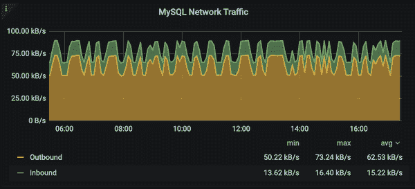
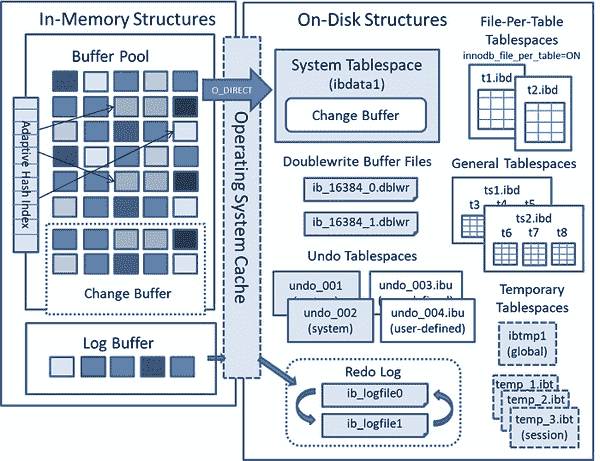

# 第二十三章：监控 MySQL 服务器

# 23.0 简介

本章介绍如何使用各种命令行工具监控 MySQL 服务器：

+   mysqladmin 接口

+   系统变量

+   状态变量

+   信息和性能模式

+   存储引擎诊断

+   日志文件

本章不涵盖管理任务。相反，它专注于服务器的可观察性。管理员或开发人员在采取行动和修改 第二十二章 中列出的配置更改之前，应仔细评估 MySQL 服务器上各种命令行工具的结果。它讨论了您可以了解的内容及其调查类型信息以及如何使用该信息来回答问题。其目的不是考虑特定的监控问题，而是展示您的选择，以便您开始回答您的问题，无论是什么情况。在响应性监控问题的情况下，请选择以下其中一种选项。

1.  确定哪些可用的信息源与手头的问题相关。

1.  选择一种使用信息的方法：您是否提出了一个一次性的问题？如果是这样，也许几个交互式查询就足够了。如果您正在尝试解决可能会重复出现或需要持续监控的问题，最好采用面向程序的方法。一个完全使用 SQL 编写的脚本能否完成任务，或者您是否需要编写一个查询服务器并对获取的信息进行额外处理的程序？（这在纯 SQL 无法完成的操作，具有特殊的输出格式要求等情况下很典型。）如果一个任务必须定期运行，也许您需要设置一个定期事件或 *cron* 作业。对于浏览器显示，请编写一个 Web 脚本。

###### 注意

这里展示的一些技术需要管理员访问权限，例如访问操作系统中的 MySQL 日志文件或使用需要 `SUPER` 特权的语句。因此，为了执行这里描述的操作，您可能需要连接到服务器作为 `root` 用户，而不是 `cbuser` 用户，或者授予 `cbuser` SUPER 权限。MySQL 安装创建了一个名为 ‘root'@'localhost’ 的超级用户账户，该账户作为数据库用户拥有所有权限。

# 23.1 为什么要监控 MySQL 服务器？

## 问题

您希望监视服务器以捕获其状态，从而验证或更改在 第二十二章 中解释的设置。了解 MySQL 服务器的等待事件和状态计数器的状态可以提供大量关于服务器限制的信息。等待事件是服务器的性能指标。监控可以在两个不同的领域中使用。监控需求最常见的原因是故障排除错误、崩溃或故障。其他原因可能包括更好地利用用于内存、I/O 子系统、CPU 利用率和网络带宽的可用资源的硬件层。由于硬件限制，MySQL 可能会在性能上遭受显著降级，因此硬件在数据库操作中起着重要作用。

## 解决方案

要监视 MySQL 服务器，请使用 MySQL 客户端的内置功能和其他内置工具（如 mysaladmin）。

## 讨论

当您的 MySQL 服务器运行时，您希望了解底层硬件是否满足您的需求。

### 操作系统

在进入特定于 MySQL 的监控和故障排除之前，建议根据需要验证操作系统（OS）的关键状态。在四个主要类别内存、输入/输出（I/O）、CPU 和网络资源可以被视为 MySQL 操作行为的主要影响因素。

#### 内存利用

*mysqld* 的内存利用情况可以通过操作系统命令行检查。每个服务器都应有专用的 MySQL 主机，因此没有竞争操作系统资源，包括内存。经验法则是为专用 MySQL 服务器分配高达 %80 的内存，但您必须检查您的工作负载和数据大小以计算所需的内存。

```
$ `sudo pmap $(pidof mysqld) |grep total`
 total          1292476K
```

您可以通过 *sys* 模式使用 *mysql* 客户端来确认这一点。

```
mysql> `USE sys`
Reading table information for completion of table and column names
You can turn off this feature to get a quicker startup with -A

Database changed
mysql> `SELECT * FROM memory_global_total;`
+-----------------+
| total_allocated |
+-----------------+
| 476.81 MiB      |
+-----------------+
1 row in set (0.00 sec)
```

还要注意虚拟内存的利用情况，并确保主机操作系统首先不进行交换。

```
$ `free -m`
              total        used        free      shared  buff/cache   available
Mem:           1993         453         755           5         784        1382
Swap:           979           0         979

$ `cat /proc/$(pidof mysqld)/status | grep Swap`
VmSwap:	       0 kB
```

关于内存利用的以下操作系统配置对 MySQL 的内存分配至关重要。确保已相应配置这些内容。

swappiness

这是一个允许物理内存移动到交换区的概念，由内核执行。建议将此值设置为 1（一个），以便内核执行最少量的交换。

```
$ `sudo sysctl vm.swappiness=1`
vm.swappiness = 1
```

NUMA

这是一个在多个 CPU 核心可用时支持启用 [NUMA](https://dev.mysql.com/doc/refman/8.0/en/innodb-parameters.html#sysvar_innodb_numa_interleave) 交错模式的概念。此值默认为关闭。通过启用 NUMA 交错模式，操作系统在多个 CPU 核心之间平衡分配内存，以实现更好的利用。

```
mysql> `SHOW GLOBAL VARIABLES LIKE "innodb_numa_interleave";`
+------------------------+-------+
| Variable_name          | Value |
+------------------------+-------+
| innodb_numa_interleave | ON    |
+------------------------+-------+
1 row in set (0.00 sec)
```

OOM killer

在 Linux 系统中，MySQL 通常有一个由内核控制的内存杀手概念，即防止操作系统中可能出现的暴走进程，以避免竞争条件和服务器崩溃。由于 MySQL 及其优化的内存缓冲区是内存占用量巨大的，操作系统可能会经常杀死 mysqld 进程，以避免系统范围的崩溃，如果未进行调整。正如我们之前提到的，我们可以控制 MySQL 从操作系统分配多少内存。但是，如果发生内存溢出，可能可以在系统级别配置或完全禁用（不建议）。

```
$ `pidof mysqld`
25046
$ `sudo cat /proc/25046/oom_score`
34
$ `sudo echo -100 > /proc/24633/oom_score_adj`
$ `sudo cat /proc/24633/oom_score`
0
```

文件系统缓存

操作系统将为所有内存操作使用缓存，而 MySQL 则具有自己优化的缓存，包括 InnoDB 缓冲池。由于没有必要对数据进行两次缓存，我们通过将 innodb_flush_method 设置为 O_DIRECT 来选择不使用文件系统缓存，并且其值需要在启动时进行更改。

###### 警告

虽然 O_DIRECT 刷新方法适用于大多数安装，但并不适用于所有存储子系统。在设置此值之前，您可能需要进行测试。

```
mysql> `SHOW GLOBAL VARIABLES LIKE "innodb_flush_method";`
+---------------------+-------+
| Variable_name       | Value |
+---------------------+-------+
| innodb_flush_method | fsync |
+---------------------+-------+
1 row in set (0.00 sec)
```

#### I/O 利用率

I/O 性能对于 MySQL 数据库至关重要。数据从磁盘读取并写回会导致 I/O 操作。根据可用缓冲区的大小，所有在缓冲区内处理的数据最终都会被刷新到磁盘，这在数据传输方面是非常昂贵的操作。尽管数据在最佳情况下被缓存，也必须定期刷新到磁盘上。此外，无法完全存入内存的大数据集必须从磁盘读取。在现代硬件中，我们通过固态硬盘（SSD）获得了更好的性能，但了解底层瓶颈的位置仍然是有益的。您可以使用 *iotop* 观察系统上每个进程的 I/O 影响，因此可以深入了解每个操作的方法。

###### 注意

你可以交互地使用 *iotop* 工具来监视 I/O 操作。在这个例子中，我们看到了一个 MySQL 线程的磁盘活动。

```
$ `sudo iotop --only`
Total DISK READ : 2.93 M/s | Total DISK WRITE : 9.24 M/s 
Actual DISK READ: 2.93 M/s | Actual DISK WRITE: 12.01 M/s 
TID PRIO USER DISK READ DISK WRITE SWAPIN IO> COMMAND 
10692 be/4 vagrant 0.00 B/s 0.00 B/s 0.00 % 56.11 % mysqld --defaults-file=/home/sandboxes
~-socket=/tmp/mysql_sandbox8021.sock --port=8021 
10684 be/4 vagrant 0.00 B/s 0.00 B/s 0.00 % 53.33 % mysqld --defaults-file=/home/sandboxes
~-socket=/tmp/mysql_sandbox8021.sock --port=8021 
10688 be/4 vagrant 0.00 B/s 6.96 M/s 0.00 % 30.12 % mysqld --defaults-file=/home/sandboxes
~-socket=/tmp/mysql_sandbox8021.sock --port=8021 
10685 be/4 vagrant 0.00 B/s 0.00 B/s 0.00 % 26.89 % mysqld --defaults-file=/home/sandboxes
~-socket=/tmp/mysql_sandbox8021.sock --port=8021 
 ...
```

与此同时，我们可以从 MySQL 命令行界面检查进程列表，看看哪些线程优先级较高：

```
mysql> `SELECT THREAD_OS_ID, PROCESSLIST_ID, PROCESSLIST_USER,` 
    -> `PROCESSLIST_DB, PROCESSLIST_COMMAND`
    -> `FROM performance_schema.threads WHERE PROCESSLIST_COMMAND IS NOT NULL;`
+-------+-----+----------+--------------------+---------+
| TOSID | PID | PUSR     | PDB                | PCMD    |
+-------+-----+----------+--------------------+---------+
|  1964 |   5 | NULL     | NULL               | Sleep   |
|  1968 |   7 | NULL     | NULL               | Daemon  |
|  1971 |   8 | msandbox | performance_schema | Query   |
|  2003 |   9 | root     | test               | Execute |
|  2002 |  10 | root     | test               | Execute |
|  2004 |  11 | root     | test               | Execute |
|  2001 |  12 | root     | test               | Execute |
|  2000 |  13 | root     | test               | Execute |
+-------+-----+----------+--------------------+---------+
8 rows in set (0.00 sec)
```

我们还可以精确地确定进程 ID，以获取关于此查询的详细信息。

```
mysql> `EXPLAIN FOR CONNECTION 10\G`
*************************** 1\. row ***************************
           id: 1
  select_type: INSERT
        table: sbtest25
   partitions: NULL
         type: ALL
possible_keys: NULL
          key: NULL
      key_len: NULL
          ref: NULL
         rows: NULL
     filtered: NULL
        Extra: NULL
1 row in set (0.00 sec)
```

我们还可以通过查询 'table_io_waits_summary_by_table' 从 performance_schema 中收集关于此线程的更多信息，该表汇总了所有表 I/O 等待事件，由 wait/io/table/sql/handler 仪表生成。

`table_io_waits_summary_by_table` 表具有以下列，用于指示表聚合事件的方式：`OBJECT_TYPE`、`OBJECT_SCHEMA` 和 `OBJECT_NAME`。这些列的含义与 `events_waits_current` 表中相同。它们标识适用于哪个表的行。此表还包含有关以下组的信息：

`COUNT_*`

从此表中请求读取/写入/等待的用户有多少次。

`SUM_*`

此表的总读/写请求数有多少次。

`MIN_*/MAX_*/AVG_*`

此表的最小、最大和平均值。

```
 mysql> `SELECT * FROM performance_schema.table_io_waits_summary_by_table` 
    -> `WHERE object_schema='test' AND object_name='sbtest25'\G`
*************************** 1\. row ***************************
     OBJECT_TYPE: TABLE
   OBJECT_SCHEMA: test
     OBJECT_NAME: sbtest25
      COUNT_STAR: 3200367
  SUM_TIMER_WAIT: 1970633326256
  MIN_TIMER_WAIT: 1505980
  AVG_TIMER_WAIT: 615412
  MAX_TIMER_WAIT: 2759234856
      COUNT_READ: 3200367
  SUM_TIMER_READ: 1970633326256
  MIN_TIMER_READ: 1505980
  AVG_TIMER_READ: 615412
  MAX_TIMER_READ: 2759234856
     COUNT_WRITE: 0
 SUM_TIMER_WRITE: 0
 MIN_TIMER_WRITE: 0
 AVG_TIMER_WRITE: 0
 MAX_TIMER_WRITE: 0
     COUNT_FETCH: 3200367
 SUM_TIMER_FETCH: 1970633326256
 MIN_TIMER_FETCH: 1505980
 AVG_TIMER_FETCH: 615412
 MAX_TIMER_FETCH: 2759234856
    COUNT_INSERT: 0
...
```

此表还被*sys*模式中的`schema_table_statistics%`视图使用。 （有关详细信息，请参阅[table_io_waits_summary_by_table](https://dev.mysql.com/doc/mysql-perfschema-excerpt/5.6/en/performance-schema-table-io-waits-summary-by-table-table.html)的文档）

```
mysql> `SELECT * FROM sys.schema_table_statistics` 
    -> `WHERE table_schema="test" AND table_name="sbtest23"\G`
*************************** 1\. row ***************************
     table_schema: test
       table_name: sbtest23
    total_latency: 14.46 s
     rows_fetched: 8389964
    fetch_latency: 14.46 s
    rows_inserted: 0
   insert_latency: 0 ps
     rows_updated: 0
   update_latency: 0 ps
     rows_deleted: 0
   delete_latency: 0 ps
 io_read_requests: 3006
          io_read: 46.97 MiB
  io_read_latency: 19.48 ms
io_write_requests: 737
         io_write: 11.61 MiB
 io_write_latency: 21.09 ms
 io_misc_requests: 284
  io_misc_latency: 1.72 s
1 row in set (0.01 sec)
```

#### 网络利用率

网络也是数据库配置中非常重要的一部分。通常，测试和开发系统在本地配置上运行，省略了节点之间的网络跳跃。如果 MySQL 运行在专用主机上，所有对数据库的请求将通过应用程序层或代理服务器进行。由于监控需要持续的数据流，最好使用具有至少 30 天历史数据的时间序列工具来进行分析。为此，我们强烈推荐使用[Percona 监控与管理工具 (PMM)](https://www.percona.com/software/database-tools/percona-monitoring-and-management)来监控网络利用率，如图 23-1 所示。



###### 图 23-1\. Percona 监控与管理 - MySQL 实例摘要

# 23.2 发现 MySQL 监控信息的来源

## 问题

您希望检查服务器在可用资源下的运行情况。

## 解决方案

让服务器使用内置实用程序告诉您自己的情况。

## 讨论

当 MySQL 服务器运行时，您可能会对其操作或性能的某些方面有疑问。或者它可能*未*在运行，您想知道原因。

要了解可用的信息源，以便评估其适用性及其对特定问题的可用性，以下是几个内置实用程序和信息资源可供查看：

+   系统变量告诉您服务器的配置方式。(Recipe 22.1 详细介绍了如何检查这些值。)

+   状态变量提供有关服务器正在执行的操作的信息，例如执行的语句数量，磁盘访问次数，内存使用情况或缓存效率。状态信息可以帮助指示何时需要进行配置更改，例如增加过小的缓冲区大小以提高性能，或减少少用资源的大小以减少服务器的内存占用。

+   性能模式专为监控而设计，并提供丰富的测量数据，从高级信息（例如连接的客户端）到细粒度信息（例如语句持有的锁或打开的文件）。性能模式自 MySQL 5.7 起默认启用。在先前版本中使用性能模式，必须启用它。要在服务器启动时显式启用它，请使用以下配置设置：

    ```
    [mysqld]
    performance_schema=1
    ```

+   `由于性能模式`专注于 MySQL 服务器的性能数据，并可以用于类似于高度特定或复杂查询，包括联接。它还有助于在运行时澄清一切

    ```
    mysql> `SELECT EVENT_NAME, COUNT_STAR`
        -> `FROM performance_schema.events_waits_summary_global_by_event_name`
        -> `ORDER BY COUNT_STAR DESC LIMIT 10;`
    +---------------------------------------+------------+
    | EVENT_NAME                            | COUNT_STAR |
    +---------------------------------------+------------+
    | wait/io/file/innodb/innodb_log_file   |       6439 |
    | wait/io/file/innodb/innodb_data_file  |       5994 |
    | idle                                  |       5309 |
    | wait/io/table/sql/handler             |       3263 |
    | wait/io/file/innodb/innodb_dblwr_file |       1356 |
    | wait/io/file/sql/binlog               |        798 |
    | wait/lock/table/sql/handler           |        683 |
    | wait/io/file/innodb/innodb_temp_file  |        471 |
    | wait/io/file/sql/io_cache             |        203 |
    | wait/io/file/sql/binlog_index         |         75 |
    +---------------------------------------+------------+
    10 rows in set (0.16 sec)
    ```

+   Sys schema 是一个独特的模式，不包含物理表，而是 Performance Schema 表上的视图和存储过程。 Performance Schema 提供了内存仪表化信息，通过 *SYS* 模式中的视图可以更轻松地访问。对于内存使用情况，使用 *SYS* 模式要容易得多；因此，我们建议使用提供内存分配详细信息的五个视图。

    ```
    mysql> `SHOW TABLES like "memory%";`	
    +-----------------------------------+
    | Tables_in_sys (memory%)           |
    +-----------------------------------+
    | memory_by_host_by_current_bytes   |
    | memory_by_thread_by_current_bytes |
    | memory_by_user_by_current_bytes   |
    | memory_global_by_current_bytes    |
    | memory_global_total               |
    +-----------------------------------+
    5 rows in set (0.00 sec)
    ```

+   `PERFORMANCE_SCHEMA` 数据库中的 `SHOW` 语句和表提供的信息范围从服务器中运行的进程到活动存储引擎和插件再到系统和状态变量。在许多情况下，这两个来源提供相同或类似的信息，但显示格式不同。 （例如，`SHOW` `PLUGINS` 语句和 `PLUGINS` 表相关联。）熟悉这两个来源帮助您选择在特定情况下更易于使用的那个：

    +   对于交互式使用，`SHOW` 通常比 `PERFORMANCE_SCHEMA` 查询更方便，因为输入更少。比较这两个产生相同结果的语句：

        ```
        SHOW GLOBAL STATUS LIKE 'Threads_connected';
        ```

        ```
        SELECT VARIABLE_VALUE FROM PERFORMANCE_SCHEMA.GLOBAL_STATUS
        WHERE VARIABLE_NAME = 'Threads_connected';
        ```

    +   `INFORMATION_SCHEMA` 查询使用 `SELECT`，比 `SHOW` 更具表达力，可以用于非常具体或复杂的查询，包括连接。

        ```
        SELECT t.table_schema, t.table_name, c.column_name
          FROM information_schema.tables t,
               information_schema.columns c
          WHERE t.table_schema = c.table_schema
                AND t.table_name = c.table_name
                AND t.engine='InnoDB';
        ```

    +   `SHOW` 输出不能仅通过 SQL 保存。如果您需要进一步处理 `PERFORMANCE_SCHEMA` 查询结果，可以使用 `INSERT` `INTO` … `SELECT` 将结果保存到表中以供进一步分析（参见 Recipe 6.2）。要获取单个值，将标量子查询结果赋给变量：

        ```
        mysql> `SET` `@``queries` `=` 
            -> `(``SELECT` `VARIABLE_VALUE` `FROM` `PERFORMANCE_SCHEMA``.``GLOBAL_STATUS`
            -> `WHERE` `VARIABLE_NAME` `=` `'Queries'``)``;`
        Query OK, 0 rows affected (0.00 sec)

        mysql> `SELECT` `@``queries``;`
        +----------+ | @queries |
        +----------+ | 5338     |
        +----------+ 1 row in set (0.00 sec)
        ```

+   一些存储引擎可以提供有关自身的信息。例如，InnoDB 有自己的系统和状态变量。它还提供了自己的 `INFORMATION_SCHEMA` 表和一组 InnoDB Monitors。 `INFORMATION_SCHEMA` 表提供更结构化的信息，因此更适合使用 SQL 进行分析，如果它们包含您想要的信息。要查看哪些与 InnoDB 相关的表可用，请使用此语句：

    ```
    SHOW TABLES FROM INFORMATION_SCHEMA LIKE 'innodb%';
    ```

    Monitors 生成非结构化输出。您可以用眼睛看，但对于程序使用，必须以某种方式解析或提取信息。在某些情况下，简单的 *grep* 命令可能足够：

    ```
    $ `mysql -E -e "SHOW ENGINE INNODB STATUS" | grep "Free buffers"`
    Free buffers       4733
    ```

+   服务器日志提供多种类型的信息。以下是使用它们的一些建议：

    +   错误日志会警示服务器遇到的严重问题。它最适合视觉检查，因为消息可能来自服务器的任何位置，并且没有固定的格式来帮助程序化分析。通常，只有文件的最后部分是感兴趣的，因为您通常检查此文件以查找最近问题的原因。这些问题可能包括导致崩溃的损坏表，甚至与未运行 *mysql_upgrade* 进一步引起的问题有关。

    +   一般查询日志显示客户端运行的查询。它有助于评估服务器工作负载的性质。它是唯一捕获所有内容的日志；因此在启用此日志时必须小心。根据服务器的活动情况，它可能会快速填满磁盘空间并造成非常严重的 I/O，导致在监视 MySQL 时事情变得更糟。建议根据需要在线启用，然后在之后禁用。

    +   慢查询日志包含可能效率低下的查询。它可以帮助您找到优化的候选项。

    服务器能够将一般查询和慢查询日志写入文件、表或两者。日志表比文件更有利于分析；它们更为结构化，因此可以使用 SQL 语句进行分析。内容也更容易解释。`general_log`表中的每个查询行显示与其关联的用户。使用日志文件时，用户仅在连接行上命名。要识别用户的查询，必须从连接行中提取连接 ID，并查找具有相同 ID 的后续查询行。

    此外，日志表由 CSV 存储引擎管理，因此表数据文件以逗号分隔值格式写入。在服务器数据目录下的*mysql*目录中查找名为*general_log.CSV*和*slow_log.CSV*的文件。您可以使用读取 CSV 文件的工具处理它们。

    要从日志中获取信息，必须启用它（参见 Recipe 22.3 获取指南）。

+   `EXPLAIN`语句可用于检查运行时间较长的查询。尽管通常用于查看潜在查询的执行计划，但 MySQL 5.7.2 及更高版本能够使用`EXPLAIN`来检查其他会话中当前执行的查询。如果查询似乎被卡住，这可能帮助您理解原因。使用`SHOW PROCESSLIST`或`INFORMATION_SCHEMA`中的`PROCESSLIST`表确定运行问题查询的会话连接 ID，然后指向该会话执行`EXPLAIN`：

    ```
    EXPLAIN FOR CONNECTION *`connection_id`*;
    ```

    `EXPLAIN`可以生成表格、树形或`JSON`格式的输出。后者可以通过您选择的编程语言中的标准 JSON 模块进行解析和操作。

# 23.3 检查服务器运行时间和进度

## 问题

您想知道服务器是否正在运行，如果是，它已经运行了多长时间。

## 解决方案

使用 mysqladmin 和 MySQL CLI 工具查找它是否启动。

## 讨论

要判断服务器是否正在运行，只需尝试连接它。如果连接成功或收到来自服务器本身的错误，服务器正在运行。*mysqladmin* `ping`在这里是一个不错的选择，可供交互使用或在 Shell 脚本中使用。这个结果表明服务器正在运行，尽管您应该通过监控系统被警告服务器已宕机：

```
$ `mysqladmin ping`
mysqld is alive
```

这次连接尝试失败，但服务器本身返回了第二个错误消息，所以它并没有宕机：

```
$ `mysqladmin -u baduser ping`
mysqladmin: connect to server at '127.0.0.1' failed
error: 'Access denied for user 'baduser'@'localhost' (using password: YES)'
```

这个结果表明完全连接失败；服务器宕机了：

```
$ `mysqladmin ping`
mysqladmin: connect to server at '127.0.0.1' failed
error: 'Can't connect to MySQL server on '127.0.0.1' (61)'
```

如果服务器没有启动，请检查错误日志找出原因。

如果服务器正在运行，可以通过多种方式确定它的运行时间（以秒为单位）：

+   使用 *mysqladmin* `status`:

    ```
    $ `mysqladmin status`
    Uptime: 22158655  Threads: 2  Questions: 65733141  Slow queries: 34
    Opens: 6570  Flush tables: 1  Open tables: 95  Queries per second
    avg: 2.966
    ```

    该方法在程序使用上的一个缺点是你必须解析输出以提取感兴趣的值。

+   检查 `Uptime` 状态变量：

    ```
    mysql> `SHOW` `GLOBAL` `STATUS` `LIKE` `'Uptime'``;`
    +---------------+---------+ | Variable_name | Value   |
    +---------------+---------+ | Uptime        | 1640724 |
    +---------------+---------+ 1 row in set (0.00 sec)
    ```

    使用内置的 CLI 命令来显示当前连接的状态

    ```
    mysql> `\status`
    ...
    Uptime:			18 days 23 hours 45 min 43 sec
    ...
    --------------
    ```

显然服务器没有运行是值得关注的原因。但即使它正在运行，可能也会出现问题。如果你经常发现在没有计划重启的情况下服务器正常运行时间重置，可能有些原因导致服务器退出，你应该调查一下。再次检查错误日志以查看原因。

当你的 MySQL 服务器运行时，你可能会对其操作或性能的各个方面有疑问。或者它 *没有* 运行，你想知道原因。

# 23.4 解决服务器启动问题

## 问题

服务器在启动后很快退出，你想知道是什么原因导致了这一情况以及你可以采取什么措施。

## 解决方案

检查错误日志以获取详细信息。

## 讨论

如果服务器在启动后不久就停止，可能的原因是服务器选项文件中的配置错误。错误日志会在这里帮助你。但不要被纯粹的警告所误导，这并不表示服务器已经退出。例如，以下消息仅表示 *innodb_ft_min_token_size* 需要更正以消除警告：

```
2022-02-17T15:05:25.482596Z 0 [Warning] [MY-013746] 
          [Server] A deprecated TLS version TLSv1.1 is enabled for channel 
          mysql_main 2022-02-17T15:05:25.487543Z 0 [Warning] [MY-010068] 
          [Server] CA certificate ca.pem is self signed.
```

相反，检查如下所示的 [ERROR] 行：

```
2022-02-17T15:05:25.495461Z 0 [ERROR] [MY-000067] 
      [Server] unknown variable 'innodb_ft_min_toke_size=2'.
```

正如你所看到的，服务器抱怨有一个打字错误 *innodb_ft_min_token_size*，导致它无法正常启动。

其他服务器启动问题包括：

+   my.cnf 变量的配置错误。

+   多个配置文件。

+   缺少操作系统权限。

+   不正确的路径设置。

+   超配可用内存。

+   升级后版本缺少 `mysql_upgrade` 步骤。

###### 注意

自 8.0.16 版本起，*mysql_upgrade* 不再需要。但在升级到任何 8.0.16 之前的版本时，您必须运行此实用程序。

# 23.5 确定 MySQL 服务器的 IO 利用率

## 问题

你想知道击中 MySQL 服务器的查询数量。

## 解决方案

检查详细的利用率状态变量。

## 讨论

这个问题可能是简单好奇引起的，也可能是性能问题。随时间监视语句执行并总结结果可以揭示模式，比如活动笨重的某个时间或某天。也许几个报告生成器配置为同时启动。将它们错开启动将有助于通过分散负载来帮助服务器。捕获基线数据以比较给定时期的几个读取数据是至关重要的。

在编程上下文中，您可能会编写一个长时间运行的应用程序，定期探测服务器的`Queries`和`Uptime`值，以确定语句执行活动的运行情况。为了避免每次发出语句时重新连接，请询问服务器的会话超时期限，并在比该值更短的间隔内进行探测。要获取会话超时值（以秒为单位），请使用以下语句：

```
SELECT @@wait_timeout;
```

默认值是 28,800（8 小时）。如果配置的值比您期望的探测间隔短，请将其设置更高：

```
SET wait_timeout = *`seconds`*;
```

前面的讨论使用了`Queries`，表示执行的总语句数。还有更精细的分析选项可供选择。

服务器维护一组`Com_`*`xxx`*状态变量，用于计算特定语句的执行次数。例如，`Com_insert`和`Com_update`分别计数`INSERT`和`UPDATE`语句的执行次数。

```
 mysql> `SHOW GLOBAL STATUS LIKE "Com_select";`
+---------------+-------+
| Variable_name | Value |
+---------------+-------+
| Com_select    | 100   |
+---------------+-------+
1 row in set (0.00 sec)

mysql> `SHOW GLOBAL STATUS LIKE "Com_insert";`
+---------------+-------+
| Variable_name | Value |
+---------------+-------+
| Com_insert    | 3922  |
+---------------+-------+
1 row in set (0.00 sec)
```

MySQL 版本 5.7 后，`information_schema`中的一些仪器迁移到了`performance_schema`，因此建议使用`performance_schema`进行此类监控查询。

###### 注意

由于 Performance Schema 具有关于事件的详细信息，不再具有*Com Stats*值。

```
mysql> `SELECT EVENT_NAME, COUNT_STAR`
    -> `FROM performance_schema.events_statements_summary_global_by_event_name`
    -> `WHERE EVENT_NAME LIKE 'statement/sql/%';`
+-----------------------------------------------+------------+
| EVENT_NAME                                    | COUNT_STAR |
+-----------------------------------------------+------------+
| statement/sql/select                          |        106 |
...
```

您还可以计算 InnoDB 缓冲池缓存命中率，以回答 InnoDB 可在不访问磁盘的情况下解决多少请求的问题。

要回答这个问题，使用状态变量信息：

```
mysql> `SHOW GLOBAL STATUS LIKE 'innodb_buffer_pool_read%s';`
+----------------------------------+----------+
| Variable_name                    | Value    |
+----------------------------------+----------+
| Innodb_buffer_pool_read_requests | 50350973 |
| Innodb_buffer_pool_reads         | 1622447  |
+----------------------------------+----------+
2 rows in set (0.00 sec)
```

状态变量`Innodb_buffer_pool_read_requests`保存了 SQL 查询从 InnoDB 缓冲池请求数据的次数。这个值也可以理解为对 InnoDB 的查询次数。变量`Innodb_buffer_pool_reads`保存了解析这些查询而无需触及磁盘上表空间文件的指标。

`SHOW GLOBAL STATUS`计算自服务器启动以来的查询次数，但这是一个可变的值。如果您等待一定时间并重新运行相同的查询，您将得到一个命中率。

```
mysql> `SHOW GLOBAL STATUS LIKE 'innodb_buffer_pool_read%s';`↩
`SELECT SLEEP(60); SHOW GLOBAL STATUS LIKE 'innodb_buffer_pool_read%s';`
+----------------------------------+----------+
| Variable_name                    | Value    |
+----------------------------------+----------+
| Innodb_buffer_pool_read_requests | 51504330 |
| Innodb_buffer_pool_reads         | 1830647  |
+----------------------------------+----------+
2 rows in set (0.00 sec)

+-----------+
| sleep(60) |
+-----------+
|         0 |
+-----------+
1 row in set (1 min 0.00 sec)

+----------------------------------+----------+
| Variable_name                    | Value    |
+----------------------------------+----------+
| Innodb_buffer_pool_read_requests | 53626254 |
| Innodb_buffer_pool_reads         | 2214763  |
+----------------------------------+----------+
2 rows in set (0.00 sec)
```

在这个例子中，InnoDB 收到了`53626254 - 51504330 = 2121924`次数据请求，并且仅使用缓冲区解析了`2214763 - 1830647 = 384116`个请求。因此，InnoDB 缓冲池命中率为`384116 / 2121924 = 0.18`。这意味着服务器可能刚刚启动，InnoDB 缓冲池还没有包含活跃数据集，或者缓冲池过小，导致 InnoDB 经常需要清除页面并重新读取。理想情况下，InnoDB 缓冲池命中率应接近 1（一个）。

###### 警告

如果您的 OLTP 内存工作负载，您可能会有 100%的查询在内存中。查询的概要可能会显著变化，这可能使得命中率指标不准确。仅仅监视内存操作的命中率是不足够的。

# 23.6 确定 MySQL 线程的 CPU 利用率

## 问题

您想找出导致服务器高 CPU 利用率的进程。

## 解决方案

使用`THREAD_OS_ID`值来从 Performance Schema 的`THREADS`表中关联。

## 讨论

进程的 CPU 利用率在找出由单个查询引起的缓慢时有些问题。有时这可能是一个失控的作业或运行大数据集的进程。在月末，您可能会看到这种行为，其中查询或作业仅在每月运行一次以处理季度或统计计算。`threads`表包含在服务器启动后创建的每个线程的信息。它包含线程是否为历史记录（如果被检测到请参见[按线程预过滤](https://dev.mysql.com/doc/refman/8.0/en/performance-schema-thread-filtering.html)）。

```
mysql> `DESC performance_schema.threads;`
+---------------------+------------------+------+-----+---------+-------+
| Field               | Type             | Null | Key | Default | Extra |
+---------------------+------------------+------+-----+---------+-------+
| THREAD_ID           | bigint unsigned  | NO   | PRI | NULL    |       |
| NAME                | varchar(128)     | NO   | MUL | NULL    |       |
| TYPE                | varchar(10)      | NO   |     | NULL    |       |
| PROCESSLIST_ID      | bigint unsigned  | YES  | MUL | NULL    |       |
| PROCESSLIST_USER    | varchar(32)      | YES  | MUL | NULL    |       |
| PROCESSLIST_HOST    | varchar(255)     | YES  | MUL | NULL    |       |
| PROCESSLIST_DB      | varchar(64)      | YES  |     | NULL    |       |
| PROCESSLIST_COMMAND | varchar(16)      | YES  |     | NULL    |       |
| PROCESSLIST_TIME    | bigint           | YES  |     | NULL    |       |
| PROCESSLIST_STATE   | varchar(64)      | YES  |     | NULL    |       |
| PROCESSLIST_INFO    | longtext         | YES  |     | NULL    |       |
| PARENT_THREAD_ID    | bigint unsigned  | YES  |     | NULL    |       |
| ROLE                | varchar(64)      | YES  |     | NULL    |       |
| INSTRUMENTED        | enum('YES','NO') | NO   |     | NULL    |       |
| HISTORY             | enum('YES','NO') | NO   |     | NULL    |       |
| CONNECTION_TYPE     | varchar(16)      | YES  |     | NULL    |       |
| THREAD_OS_ID        | bigint unsigned  | YES  | MUL | NULL    |       |
| RESOURCE_GROUP      | varchar(64)      | YES  | MUL | NULL    |       |
+---------------------+------------------+------+-----+---------+-------+
```

在 Linux 系统中，`THREAD_OS_ID`对应于`gettid()`函数的值。此值暴露在`top`或`proc`文件系统（/proc/[pid]/task/[tid]）中，以帮助识别相关的`THREAD_OS_ID`，还有通过使用内置命令行工具从`proc`文件系统中抓取。`ps -L aux`提供了与使用更高`CPU`的相应线程相关的足够详细信息。MySQL 的父 ID `mysqld_pid`也可以通过结合使用`pidof mysqld`和`ps`命令来确定：

```
$  `` ps -L aux |grep -e PID -e `pidof mysqld` ``
      USER         PID     LWP %CPU NLWP %MEM    VSZ   RSS TTY      STAT START↩   
      TIME COMMAND
mysql     740282  740282  0.0   68 20.9 1336272 209440 ?      Rsl   2021   0:05 ↩
/usr/sbin/mysqld
mysql     740282  740285  0.0   68 20.9 1336272 209440 ?      Ssl   2021   1:50 ↩
/usr/sbin/mysqld
mysql     740282  740286  0.0   68 20.9 1336272 209440 ?      Ssl   2021   1:52 ↩
/usr/sbin/mysqld
mysql     740282  740287  0.0   68 20.9 1336272 209440 ?      Ssl   2021   1:53 ↩
/usr/sbin/mysqld
mysql     740282  740288  0.0   68 20.9 1336272 209440 ?      Ssl   2021   1:50 ↩
/usr/sbin/mysqld
....
mysql     740282 1353650  0.0   48 21.0 1336272 210456 ?      Ssl  09:35   0:00 ↩
/usr/sbin/mysqld
mysql     740282 1533749  6.6   48 21.0 1336272 210456 ?      Dsl  10:11   0:18 ↩
/usr/sbin/mysqld
mysql     740282 1558301  0.8   48 21.0 1336272 210456 ?      Ssl  10:15   0:00 ↩
/usr/sbin/mysqld
mysql     740282 1558459  1.0   48 21.0 1336272 210456 ?      Ssl  10:15   0:00 ↩
/usr/sbin/mysqld
mysql     740282 1559291  0.7   48 21.0 1336272 210456 ?      Ssl  10:15   0:00 ↩
/usr/sbin/mysqld
```

这将为我们提供一个*thread_os_id*的提示，我们将用它来弄清楚它在做什么？

```
mysql> `SELECT * from performance_schema.threads` 
    -> `WHERE THREAD_OS_ID = 1533749 \G`
mysql> `SELECT * FROM performance_schema.threads where THREAD_OS_ID = 1533749 \G`
*************************** 1\. row ***************************
          THREAD_ID: 213957
               NAME: thread/sql/one_connection
               TYPE: FOREGROUND
     PROCESSLIST_ID: 213905
   PROCESSLIST_USER: root
   PROCESSLIST_HOST: localhost
     PROCESSLIST_DB: mysqlslap
PROCESSLIST_COMMAND: Query
   PROCESSLIST_TIME: 0
  PROCESSLIST_STATE: waiting for handler commit
   PROCESSLIST_INFO: INSERT INTO t1 VALUES (964445884,
   'DPh7kD1E6f4MMQk1ioopsoIIcoD83DD8Wu7689K6oHTAjD3Hts6lYGv8x9G0EL0k87q8G2ExJ
   jz2o3KhnIJBbEJYFROTpO5pNvxgyBT9nSCbNO9AiKL9QYhi0x3hL9')
   PARENT_THREAD_ID: NULL
               ROLE: NULL
       INSTRUMENTED: YES
            HISTORY: YES
    CONNECTION_TYPE: Socket
       THREAD_OS_ID: 1533749
     RESOURCE_GROUP: USR_default
```

另一种选择是使用`pidstat`命令（需要 sysstat 包）。首先找到*mysqld*的进程 ID 并执行以下操作：pidstat -t -p {mysqld_pid}

```
$ `pidstat -t -p 740282`
       Linux 5.8.0-63-generic (localhost)      01/02/2022      _x86_64_        (1 CPU)

06:57:13 PM   UID      TGID       TID    %usr %system  %guest   %wait    %CPU   CPU  
06:57:14 PM   113    740282         -   24.75   11.88    0.00    0.00   36.63     0  
06:57:14 PM   113         -    740282    0.00    0.00    0.00    0.00    0.00     0 
06:57:14 PM   113         -    740285    0.00    0.00    0.00    0.00    0.00     0  
....
06:57:19 PM   113         -    759641    0.00    0.00    0.00    0.00    0.00     0 
06:57:19 PM   113         -    839592    1.00    0.00    0.00    1.00    1.00     0 
06:57:19 PM   113         -    839647   17.00    4.00    0.00   14.00   21.00     0 
06:57:20 PM   113    740282         -   24.00   14.00    0.00    0.00   38.00     0 
06:57:20 PM   113         -    740282    0.00    0.00    0.00    0.00    0.00     0 
06:57:20 PM   113         -    740285    0.00    0.00    0.00    0.00    0.00     0  
```

我们在测试运行中可以看到一个*thread_os_id*从上述输出中消耗了%21 的 CPU。为了将其与 MySQL 运行的线程相关联，我们遵循*性能模式查询*。

```
mysql> `SELECT * from performance_schema.threads  where THREAD_OS_ID = 839647 \G`
*************************** 1\. row ***************************
          THREAD_ID: 2326
               NAME: thread/sql/one_connection
               TYPE: FOREGROUND
     PROCESSLIST_ID: 2282
   PROCESSLIST_USER: root
   PROCESSLIST_HOST: localhost
     PROCESSLIST_DB: mysqlslap
PROCESSLIST_COMMAND: Query
   PROCESSLIST_TIME: 0
  PROCESSLIST_STATE: waiting for handler commit
   PROCESSLIST_INFO: INSERT INTO t1 VALUES (964445884,'DPh7kD1E6f4MMQk1ioopso
   IIcoD83DD8Wu7689K6oHTAjD3Hts6lYGv8x9G0EL0k87q8G2ExJjz2o3KhnIJBbEJYFROTpO5pN
   vxgyBT9nSCbNO9AiKL9QYhi0x3hL9')
   PARENT_THREAD_ID: NULL
               ROLE: NULL
       INSTRUMENTED: YES
            HISTORY: YES
    CONNECTION_TYPE: Socket
       THREAD_OS_ID: 839647
     RESOURCE_GROUP: USR_default
```

## 参见

有关*THREADS*表的更多信息，请参阅[threads 表](https://dev.mysql.com/doc/mysql-perfschema-excerpt/8.0/en/performance-schema-threads-table.html)。

# 23.7 确定 MySQL 是否已达到其连接限制

## 问题

您想知道 MySQL 服务器处理连接的限制

## 解决方案

检查配置参数。

## 讨论

通常，服务器函数的评估使用配置设置与当前操作状态的组合。前者通常来自系统变量，而后者来自状态变量。连接管理就是这个概念的一个例子。`max_connections`系统变量指示服务器允许的最大同时连接数，而`Threads_connected`状态变量显示当前连接的客户端数，`Threads_running`状态变量显示当前活动的客户端数。此外，`Threads_running`对于以下几个原因非常重要。

+   如果运行线程的数量增加到超过 CPU 核心数量，它们开始争夺 CPU 资源。

+   如果两个线程（无论连接了多少线程）竞争同一行、表或其他数据库对象，则在服务器级别设置引擎级表锁或元数据锁（MD）。

由于 MySQL 是单进程应用程序，具有多线程架构，每个连接创建一个线程。要监视达到的最大连接数，请执行以下命令。

```
mysql> `SHOW GLOBAL STATUS LIKE 'Max_used_connections';`
+----------------------+-------+
| Variable_name        | Value |
+----------------------+-------+
| Max_used_connections | 6     |
+----------------------+-------+
1 row in set (0.00 sec)

mysql> `SHOW GLOBAL STATUS LIKE 'Max_used_connections_time';`
+---------------------------+---------------------+
| Variable_name             | Value               |
+---------------------------+---------------------+
| Max_used_connections_time | 2020-12-27 17:09:59 |
+---------------------------+---------------------+
1 row in set (0.00 sec)

mysql  > `SHOW GLOBAL STATUS LIKE 'threads_connected';`
+-------------------+-------+
| Variable_name     | Value |
+-------------------+-------+
| Threads_connected | 6     |
+-------------------+-------+
1 row in set (0.00 sec)
```

如果 `threads_connected` 经常接近 `max_connections` 的值，则可能需要增加后者的值。如果间隙总是很大，可以减少 `max_connections`。要进一步了解 MySQL 处理连接及其能力，请参阅[MySQL 连接处理和扩展](https://mysqlserverteam.com/mysql-connection-handling-and-scaling/)。

MySQL 的性能也会受到互斥锁（Mutex）和元数据锁在高并发环境下的影响。如上所述，在某些时候，读取线程将开始竞争数据库请求相同资源时。InnoDB 处理此问题的方式是对特定的内存资源施加排他锁，其他线程必须等待相同资源。虽然 MySQL 中的互斥操作处理这一点，所有的数据定义语言（DDL，也就是表结构更改操作）均由元数据锁处理。

# 23.8 确认缓冲池大小是否适当

## 问题

您需要了解 MySQL 服务器处理连接的限制。

## 解决方案

确定存储引擎内存分配。

## 讨论

InnoDB 存储引擎具有数据缓冲区。为了最小化物理 I/O，DBA 应确保有效利用服务器内存。InnoDB 缓冲池提高索引键查找和数据读取操作的效率；因此，大多数数据访问将在内存中进行。

要确定缓存大小，请检查相关的系统变量：

```
mysql>  `SELECT @@innodb_buffer_pool_size;`
+---------------------------+
| @@innodb_buffer_pool_size |
+---------------------------+
|                 134217728 |
+---------------------------+
1 row in set (0.00 sec)
```

你还可以使用 `SHOW` `VARIABLES` 或 `PERFORMANCE_SCHEMA` `GLOBAL_VARIABLES` 表。例如：

```
mysql> `SELECT * from performance_schema.global_variables`
    -> `WHERE variable_name='innodb_buffer_pool_size';`
+-------------------------+----------------+
| VARIABLE_NAME           | VARIABLE_VALUE |
+-------------------------+----------------+
| innodb_buffer_pool_size | 134217728      |
+-------------------------+----------------+
1 row in set (0.00 sec)
```

衡量读取比例运行情况的有效性指标是其命中率：从 InnoDB 缓冲池中满足读取请求的速率，而无需从磁盘读取数据。如果数据在缓存中，就是命中；如果不在，就是未命中。命中率是高度相关但不是保证的度量标准；因此 OLTP（在线事务处理）速率更为重要。还可以通过性能模式验证 InnoDB 缓冲池的利用情况。

```
mysql> `SELECT CONCAT(FORMAT(A.num * 100.0 / B.num,2),"%") BufferPoolFullPct FROM`
    -> `(SELECT variable_value num FROM performance_schema.GLOBAL_STATUS`
    -> `WHERE variable_name = 'Innodb_buffer_pool_pages_data') A,`
    -> `(SELECT variable_value num FROM performance_schema.GLOBAL_STATUS`
    -> `WHERE variable_name = 'Innodb_buffer_pool_pages_total') B;`
+-------------------+
| BufferPoolFullPct |
+-------------------+
| 23.46%            |
+-------------------+
1 row in set (0.02 sec)
```

我们还可以使用 `sys` 架构确定缓冲池的内存分配。在启动时配置缓冲池以适当分配内存资源至关重要。

```
mysql> `SELECT * FROM sys.memory_global_by_current_bytes`
    -> `WHERE event_name like 'memory/innodb_buf_buf_pool'\G`
*************************** 1\. row ***************************
       event_name: memory/innodb/buf_buf_pool
    current_count: 1
    current_alloc: 131.00 MiB
current_avg_alloc: 131.00 MiB
       high_count: 1
       high_alloc: 131.00 MiB
   high_avg_alloc: 131.00 MiB
1 row in set (0.00 sec)
```

所需的信息可以从 `SHOW` `STATUS` 或 `GLOBAL_STATUS` 表中获取。但是，在程序内执行查询并保存结果时，必须考虑 `SHOW` 语句和从 `performance_schema` 表中选择的差异。以下查询检索类似的信息，但是列标题在大小写和名称上有所不同，并且变量名称在大小写上也有所不同：

```
mysql> `SHOW GLOBAL STATUS;`
+-----------------------------------------------+-------------+
| Variable_name                                 | Value       |
+-----------------------------------------------+-------------+
| Aborted_clients                               | 1           |
| Aborted_connects                              | 6           |
…
…
```

为了使应用程序在变量信息来自 `SHOW` 还是 `information_schema` 时都能够保持不可知性，将变量名称强制统一为一个一致的字母大小写，并在引用变量的表达式中使用该大小写。选择任何大小写都无所谓，只要保持一致即可。以下讨论使用大写。

这是一个简单的例程（使用 Ruby），它接受数据库句柄，获取状态变量，并将它们作为值键入名称的哈希返回：

```
def get_status_variables(client)
  vars = {}
  query = "SELECT VARIABLE_NAME, VARIABLE_VALUE FROM
 performance_schema.global_status"
  client.query(query).each { |row| vars[row["VARIABLE_NAME"]↩
  .upcase] = row["VARIABLE_VALUE"] }
  return vars
end
```

要使用 `SHOW` 语句获取信息，可以用以下查询替换原来的查询：

```
query = "SHOW GLOBAL STATUS"
```

代码对变量名称应用了 `upcase` 方法。这样，无论例程使用 `GLOBAL_STATUS` 还是 `SHOW` 获取信息，结果的哈希都可以通过大写变量名称访问元素。

要计算命中率，请将变量哈希和读取和请求变量的名称传递给此例程：

```
def cache_hit_rate(vars,reads_name,requests_name)
  reads = vars[reads_name].to_f
  requests = vars[requests_name].to_f
  hit_rate = requests == 0 ? 0 : 1 - (reads/requests)
  printf "        Key reads: %12d (%s)\n", reads, reads_name
  printf "Key read requests: %12d (%s)\n", requests, requests_name
  printf "         Hit rate: %12.4f\n", hit_rate
end
```

现在我们准备好了。调用获取状态信息并计算命中率的例程如下：

```
statvars = get_status_variables(client)
cache_hit_rate(statvars,
               "INNODB_BUFFER_POOL_READS",
               "INNODB_BUFFER_POOL_READ_REQUESTS")
cache_hit_rate(statvars,
               "KEY_READS",
               "KEY_READ_REQUESTS")
```

运行脚本以查看服务器的命中率：

```
$ `hitrate.rb`
        Key reads:         6280 (INNODB_BUFFER_POOL_READS)
Key read requests:     70138276 (INNODB_BUFFER_POOL_READ_REQUESTS)
         Hit rate:       0.9999
        Key reads:        23269 (KEY_READS)
Key read requests:      8902674 (KEY_READ_REQUESTS)
         Hit rate:       0.9974
```

对于涉及系统变量的任务，类似于 `get_status_variables()` 的代码足以满足要求。这个实现使用 `GLOBAL_VARIABLES` 表：

```
def get_system_variables(client)
  vars = {}
  query = "SELECT VARIABLE_NAME, VARIABLE_VALUE FROM
 performance_schema.global_variables"
  client.query(query).each { |row| vars[row["VARIABLE_NAME"].upcase]↩
  = row["VARIABLE_VALUE"] }
  return vars
end
```

要使用 `SHOW` 替换查询，请使用以下查询：

```
query = "SHOW GLOBAL VARIABLES"
```

# 23.9 查找关于存储引擎的信息

## 问题

您想要针对 MySQL 的可插入存储引擎架构的特定问题进行定位。

## 解决方案

使用 MySQL 的 *mysql* 客户端直接与存储引擎交互。

## 讨论

现在我们准备好了。从 *mysql* 客户端调用 `SHOW ENGINE` 命令。

```
mysql> `help show engine`
Name: 'SHOW ENGINE'
Description:
Syntax:
SHOW ENGINE engine_name {STATUS | MUTEX}
```

### SHOW ENGINE

SHOW ENGINE 显示有关存储引擎的操作信息。它需要 PROCESS 权限。该语句在 INNODB 方面有以下变体：

```
SHOW ENGINE INNODB STATUS;
SHOW ENGINE INNODB MUTEX;
```

第一个命令 *SHOW ENGINE INNODB STATUS* 显示有关 InnoDB 存储引擎的广泛信息。为了消化这些信息，可以捕获此命令的输出并通过命令行解析它。

```
mysql> `SHOW ENGINE INNODB STATUS\G`
*************************** 1\. row ***************************
  Type: InnoDB
  Name:
Status:
=====================================
2020-10-28 23:43:12 0x70000d0ae000 INNODB MONITOR OUTPUT
=====================================
Per second averages calculated from the last 6 seconds
-----------------
BACKGROUND THREAD
-----------------
srv_master_thread loops: 34 srv_active, 0 srv_shutdown, 768286 srv_idle
srv_master_thread log flush and writes: 0
----------
SEMAPHORES
----------
```

例如，可以使用相同的命令轻松地访问缓冲池信息。当您需要快速、准确地获取信息且不对正在运行的服务器造成任何影响时，这些信息非常有用。

```
----------------------
BUFFER POOL AND MEMORY
----------------------
Total large memory allocated 137363456
Dictionary memory allocated 1539651
Buffer pool size   8191
Free buffers       6250
Database pages     1924
Old database pages 725
Modified db pages  0
Pending reads      0
Pending writes: LRU 0, flush list 0, single page 0
Pages made young 131, not young 1806
0.00 youngs/s, 0.00 non-youngs/s
Pages read 913, created 1105, written 3138
0.00 reads/s, 0.00 creates/s, 0.00 writes/s
No buffer pool page gets since the last printout
Pages read ahead 0.00/s, evicted without access 0.00/s, Random read ahead 0.00/s
LRU len: 1924, unzip_LRU len: 0
I/O sum[0]:cur[0], unzip sum[0]:cur[0]
```

如果您正在监视单个事件，可以设置分页器并重复监视其值。

```
mysql> `PAGER` `grep` `-``i` `history`
PAGER set to 'grep -i history'
mysql> `SHOW` `ENGINE` `INNODB` `STATUS``\``G`
History list length 0
1 row in set (0.00 sec)
```

让我们来看看空闲系统上的 Mutex 信息。如果线程竞争资源，生成的 *SHOW* 语句会更长。

```
mysql> `SHOW ENGINE  INNODB MUTEX;`
+--------+----------------------------+---------+
| Type   | Name                       | Status  |
+--------+----------------------------+---------+
| InnoDB | rwlock: fil0fil.cc:3206    | waits=4 |
| InnoDB | sum rwlock: buf0buf.cc:778 | waits=3 |
+--------+----------------------------+---------+
2 rows in set (0.00 sec)
```



###### Figure 23-2\. InnoDB 架构 *© 2021, Oracle Corporation and/or its affiliates. (2021). InnoDB Architecture [Figure]. https://dev.mysql.com/doc/refman/8.0/en/innodb-architecture.html*

如上所示，InnoDB 包括两种类型的结构。第一部分是内存中的，第二部分是在磁盘上的。InnoDB 通过其内部内存管理协议有效地利用主机操作系统的内存。正如本章节介绍中提到的，内存利用是 MySQL 监控中的重要因素。

作为 MySQL 生态系统中最复杂和广泛采用的存储引擎，InnoDB 还配备了*Components*，用于进一步调试内部。虽然这是一个高级话题，但知道您可以向 MySQL 服务器添加插件是很好的。未来阅读请参考[MySQL 文档。](https://dev.mysql.com/doc/refman/8.0/en/server-plugins.html)

# 23.10 使用错误日志文件来排查 MySQL 服务器崩溃

## 问题

我的应用程序报告“MySQL 服务器已断开连接”（错误 2006）。

## 解决方案

这是一个非常常见的错误的可能场景。它们包括：

+   OOM（内存耗尽）Killer

+   MySQL 信号

+   崩溃 bug

+   其他原因，如服务器超时、删除的系统文件等。

有时甚至错误日志也会误导进行故障排除。因此建议检查系统日志，如/var/log/messages。

## 讨论

错误日志是监控 MySQL 服务器状态最关键的一部分。从启动到关闭，它将记录所有事件到这个文件中。主动监控这个文件将提供关于当前和过去事件的足够信息。

###### 注意

错误日志在 MySQL 8.0 中是可调整的，并且可以通过给定的条件来记录和过滤事件。详情请参阅[MySQL 文档。](https://dev.mysql.com/doc/refman/8.0/en/error-log-configuration.html)

下面是监控和解决此错误的一些指针。

### 服务器崩溃

服务器在执行大查询时可能会断开连接。在这种情况下，客户端在长时间运行的查询期间超时。

```
$ ``( echo -n "SELECT '" ; for i in `seq 1 110000` ; \``
        `do echo -n "1234567890" ; done ; echo -n "' a") | mysql | wc`

ERROR 2006 (HY000) at line 1: MySQL server has gone away
       0       0       0
```

这可能是要检查的几个原因之一。通常`max_allowed_packet`大小对于类似上面崩溃的*for*循环的大查询来说太小。

```
$ `mysql -e "SHOW GLOBAL VARIABLES LIKE 'max_allowed_packet'"`
+--------------------+---------+
| Variable_name      | Value   |
+--------------------+---------+
| max_allowed_packet | 1048576 |
+--------------------+---------+
$ `mysql -e "SET GLOBAL max_allowed_packet=67108864"`
$ `mysql -e "SHOW GLOBAL VARIABLES LIKE 'max_allowed_packet'"`
+--------------------+----------+
| Variable_name      | Value    |
+--------------------+----------+
| max_allowed_packet | 67108864 |
+--------------------+----------+
$ ``( echo -n "SELECT '" ; for i in `seq 1 110000` ; do echo -n "1234567890" ; done ; \``
> `echo -n "' a") | mysql | wc`
       2       2 1100003
```

### 服务器超时

应用程序与每个请求返回的查询结果之间的连接具有超时变量。监视的常见超时变量之一是*wait_timeout*。

```
$ `mysql -e "SHOW GLOBAL VARIABLES LIKE 'wait_timeout'"`
+---------------+-------+
| Variable_name | Value |
+---------------+-------+
| wait_timeout  | 28800 |
+---------------+-------+
```

为了演示这一点，我们将`wait_timeout`值设置为非常低的 4 秒，然后重新运行相同的查询。

```
$ `mysql -e "SET GLOBAL wait_timeout=4"`
$ ``time ( echo -n "SELECT '" ; for i in `seq 1 1100000` ; do echo -n "1234567890" ; done ; \``
> `echo -n "' a") | mysql | wc`
ERROR 2006 (HY000) at line 1: MySQL server has gone away
       0       0       0
real	0m8.062s
user	0m7.506s
sys	0m2.581s
$ mysql -e "SHOW GLOBAL VARIABLES LIKE 'wait_timeout'"
+---------------+-------+
| Variable_name | Value |
+---------------+-------+
| wait_timeout  | 4     |
+---------------+-------+
```

# 23.11 慢查询日志文件

## 问题

使用慢查询日志识别慢查询。

## 解决方案

启用慢查询日志并设置阈值以过滤查询以解决问题。

## 讨论

MySQL 可以记录所有查询。通过调整慢查询记录的方式，可以捕获并分析所有查询。默认的慢查询日志设置为 10 秒，意味着任何超过 10 秒的查询只会在日志文件中显示。

您可以使用多个变量控制慢查询日志的行为。

```
mysql> `SHOW GLOBAL VARIABLES LIKE '%slow%';`
+---------------------------+---------------------------------------+
| Variable_name             | Value                                 |
+---------------------------+---------------------------------------+
| log_slow_admin_statements | OFF                                   |
| log_slow_extra            | OFF                                   |
| log_slow_slave_statements | OFF                                   |
| slow_launch_time          | 2                                     |
| slow_query_log            | OFF                                   |
| slow_query_log_file       | /usr/local/mysql/data/askdba-slow.log |
+---------------------------+---------------------------------------+
6 rows in set (0.01 sec)
```

最重要的是`slow_query_log`，它启用或禁用慢查询日志记录。默认情况下是`OFF`。

慢查询日志阈值由变量`long_query_time`控制。您可以从默认阈值开始调整记录的查询，然后逐步减少。最后将`long_query_time`设置为 0 以记录所有查询。

### 记录所有查询。

将`long_query_time`设置为 0 并运行慢查询日志是常见做法。这样您将获得所有查询性能的信息。然后，您可以运行诸如*pt-query-digest*或*mysqldumpslow*之类的程序来创建查询摘要。

要启用所有查询的记录，请将`long_query_time`设置为 0。

```
mysql> `SHOW GLOBAL VARIABLES LIKE 'long_query_time';`
+-----------------+-----------+
| Variable_name   | Value     |
+-----------------+-----------+
| long_query_time | 10.000000 |
+-----------------+-----------+
1 row in set (0.00 sec)

mysql> `SET GLOBAL LONG_QUERY_TIME=0;`
Query OK, 0 rows affected (0.00 sec)

mysql> `SET GLOBAL SLOW_QUERY_LOG=1;`
Query OK, 0 rows affected (0.02 sec)
```

现在我们已准备好测试简单查询，因为将`long_query_time`设置为 0 会记录所有内容。

```
mysql> `SELECT thing,legs,arms FROM limbs WHERE legs>=2;`

$ `sudo tail -f /usr/local/mysql/data/askdba-slow.log`
# Time: 2020-11-21T15:15:12.873279Z
# User@Host: root[root] @ localhost [127.0.0.1]  Id:   326
# Query_time: 0.000239  Lock_time: 0.000098 Rows_sent: 6  Rows_examined: 11
SET timestamp=1605971712;
SELECT thing,legs,arms FROM limbs WHERE legs>=2;
```

在此示例中，我们可以看到`Query_time`非常小，这是预期的，因为表本身很小。但 MySQL 需要检查的行数（`Rows_examined`）比查询发送到客户端的行数（`Rows_sent: 6`）要多（11）。这意味着有很大可能需要优化查询。

我们可以通过运行*EXPLAIN*来开始优化查询。

```
mysql> `EXPLAIN` `SELECT` `thing``,``legs``,``arms` `FROM` `limbs` `WHERE` `legs``>``=``2``\``G`
*************************** 1. row ***************************
           id: 1
  select_type: SIMPLE
        table: limbs
   partitions: NULL
         type: ALL
possible_keys: NULL
          key: NULL
      key_len: NULL
          ref: NULL
         rows: 11
     filtered: 33.33
        Extra: Using where
1 row in set, 1 warning (0.00 sec)
```

###### 警告

将`long_query_time`值设置为 0 会启用对每个单独查询的记录。在繁忙的系统上，您需要小心，因为您的文件系统可能因 I/O 操作而填满或变慢。

当将`long_query_time`设置为 0 时，请勿使用表格记录，因为 CSV 存储引擎不适用于高并发环境，并可能影响性能。

# 23.12 使用一般查询日志进行监控

## 问题

您希望识别每个客户端所参与的活动。

## 解决方案

启用一般查询日志以进行调查。

## 讨论

MySQL 一般查询日志是 mysqld 正在执行的记录证明。通过启用此日志，管理员可以监控用户连接与 mysqld 的交互情况。

###### 警告

通过启用一般查询日志，您指示 MySQL 服务器记录其接收到的所有查询。在繁忙的系统上，您需要小心，因为您的文件系统可能因增加的 I/O 操作而填满或变慢。

```
mysql> `SHOW GLOBAL VARIABLES LIKE 'general%';`
+------------------+-----------------------------------------------------+
| Variable_name    | Value                                               |
+------------------+-----------------------------------------------------+
| general_log      | OFF                                                 |
| general_log_file | /home/vagrant/sandboxes/msb_8_0_21/data/vagrant.log |
+------------------+-----------------------------------------------------+
2 rows in set (0.01 sec)
```

若要在运行时启用`general_log`，请使用*SET*命令。

```
mysql> `SET GLOBAL general_log = 'ON';`
Query OK, 0 rows affected (0.00 sec)

mysql> `SHOW GLOBAL VARIABLES LIKE 'general_log';`
+---------------+-------+
| Variable_name | Value |
+---------------+-------+
| general_log   | ON    |
+---------------+-------+
1 row in set (0.00 sec)
Query OK, 0 rows affected (0.00 sec)
```

现在我们已准备好监控所有事务。此值是动态的，并在运行时设置。如果您希望在启动时进行持久设置，请参阅第 22.1 节：

```
$ `tail -f /home/vagrant/sandboxes/msb_8_0_21/data/vagrant.log`
/home/vagrant/opt/mysql/8.0.21/bin/mysqld, Version: 8.0.21 (MySQL Community Server - GPL). ↩
started with:
Tcp port: 8021  Unix socket: /tmp/mysql_sandbox8021.sock
Time                 Id Command    Argument
2020-12-06T14:27:26.739541Z	    8 Query	show global variables like "general_log"
2020-12-06T14:51:08.660453Z	    8 Quit
```

连接另一个会话并在尾随一般查询日志文件时运行以下命令：

```
mysql> `SHOW PROCESSLIST \G`
*************************** 1\. row ***************************
     Id: 5
   User: event_scheduler
   Host: localhost
     db: NULL
Command: Daemon
   Time: 2015
  State: Waiting on empty queue
   Info: NULL
*************************** 2\. row ***************************
     Id: 10
   User: msandbox
   Host: localhost
     db: NULL
Command: Query
   Time: 0
  State: starting
   Info: show processlist
2 rows in set (0.00 sec)

$ `tail -f /home/vagrant/sandboxes/msb_8_0_21/data/vagrant.log`
2020-12-06T14:51:45.765019Z	   10 Connect	msandbox@localhost on  using Socket
2020-12-06T14:51:45.765785Z	   10 Query	select @@version_comment limit 1
2020-12-06T14:51:45.769113Z	   10 Query	select USER()
2020-12-06T14:52:29.130072Z	   10 Query	show processlist
```

###### 注意

与 MySQL 慢查询日志不同，一般查询日志不记录查询执行时间。相反，它按顺序记录每个会话的完整记录。这些信息对于调试 MySQL 崩溃或查明应用程序发送的查询很有用。

# 23.13 使用二进制日志来识别更改

## 问题

您希望跟踪给定时间段内的数据更改。

## 解决方案

启用二进制日志以进行调查。

## 讨论

MySQL 可以将所有数据更改记录到二进制日志格式中，其具有三个目的。

+   配置主副本设置。通过启用此功能，我们可以设置 MySQL 复制的拓扑结构，详见第三章

+   在进行完整备份后进行时点恢复。

+   对特定时间段内的事件进行故障排除或调查。

通过在启动时设置 `--log-bin` 来启用二进制日志。设置此值允许 MySQL 将数据更改追踪到一个二进制日志文件中。日志文件包括一组顺序日志文件和一个索引文件。

```
To read binary logs we must use verbose option `--verbose` or `-v`
      by using mysqlbinlog command.

###### Note

      To see statement representation of row events use option `--verbose` (`-v`). 
      To see metadata of columns specify `--verbose`  twice: `--verbose --verbose` 
      or `-vv`. To suppress output of row events specify the option 
      `--base64-output=DECODE-ROWS`

```

$ `/usr/bin/mysqlbinlog  binlog.000003 -v |more`

#210208 19:39:03 服务器 ID 1  end_log_pos 517272 CRC32 0x043a9ff4 ↩

                        Write_rows: 表 ID 112 标志: STMT_END_F

### INSERT INTO `test`.`sbtest1`

### 设置

### @1=1

### @2=21417

### @3='83868641912-28773972837-60736120486-75162659906-27563526494-↩

        20381887404-41576422241-93426793964-56405065102-33518432330'

### @4='67847967377-48000963322-62604785301-91415491898-96926520291'

```

To give specific start time:

```

    /usr/bin/mysqlbinlog --start-datetime="2020-11-29 10:50:32"

    binlog.000003 -v |more

```

To filter specific DML type:

```

    $ `/usr/bin/mysqlbinlog --start-datetime="2020-11-29 10:50:32"  binlog.000003 \`

    > `-v| grep -i -e "update" -e "insert"`

    > `-e "delete" -e "drop" -e "alter"  |cut -c1-100 | tr '[A-Z]' '[a-z]'`

    > ``| sed -e "s/\t/ /g;s/\`//g;s/(.*$//;s/ set .*$//;s/ as .*$//"``

    > `| sed -e "s/ where .*$//" | sort | uniq -c | sort -nr`

    50000 ### 插入到 test.sbtest9

    50000 ### 插入到 test.sbtest9

    50000 ### 插入到 test.sbtest8

    50000 ### 插入到 test.sbtest7

    ...

```

```
