## 第一部分\. 入门

这前两章是 Redis 的介绍，并提供了一些 Redis 的基本用例。阅读这些章节后，你应该开始对 Redis 在你当前项目中可能非常适合的一些低垂的优化有所了解。

## 第一章\. 了解 Redis

*本章涵盖*

+   Redis 与你使用过的其他软件的相似与不同之处

+   如何使用 Redis

+   使用示例 Python 代码与 Redis 进行简单交互

+   使用 Redis 解决实际问题

Redis 是一个内存远程数据库，提供高性能、复制和独特的数据模型，以解决问题的平台。通过支持五种不同的数据结构，Redis 可以适应各种问题，这些问题可以自然地映射到 Redis 提供的内容上，让你无需执行其他数据库所需的概念体操即可解决问题。复制、持久化和客户端分片等附加功能使 Redis 能够从方便地原型化系统，扩展到数百 GB 的数据和每秒数百万次请求。

我第一次接触 Redis 是在一个需要搜索客户联系数据库的公司。搜索需要通过姓名、电子邮件地址、位置和电话号码来查找联系信息。系统是用 SQL 数据库编写的，执行一系列查询，需要 10-15 秒才能在 60,000 个客户中找到匹配项。在花费一周时间学习 Redis 的基础知识后，我构建了一个搜索引擎，可以过滤和排序所有这些字段以及更多，响应时间在 50 毫秒以内。仅仅几周的努力，包括测试和使系统达到生产标准，性能提高了 200 倍。通过阅读这本书，你可以了解许多使用 Redis 解决的技巧、窍门和常见问题。

本章将帮助你了解 Redis 在数据库世界中的位置，以及 Redis 如何在多个环境中解决问题（在不同组件和语言之间通信等）。后续章节将展示使用 Redis 解决的各种问题和解决方案。

现在你已经了解了我开始使用 Redis 的方式以及我们将要涵盖的内容，让我们更深入地讨论 Redis 是什么，以及它可能是你一直需要的，即使你没有意识到这一点。

|  |
| --- |

##### 安装 redis 和 python

在附录 A 中查找 Redis 和 Python 的快速安装说明。

|  |
| --- |
|  |

##### 使用其他语言访问 redis

虽然这些示例的源代码不会包含在这本书中，但所有可能的示例源代码将在所有章节完成后不久以 Ruby、Java 和 JavaScript (Node.js) 的形式提供。对于 Spring 框架的用户，Spring Data Redis 接口的作者 Costin Leau 与 Redis 作者 Salvatore Sanfilippo 合作，制作了一个使用 Spring 与 Redis 的一小时入门教程，可在 [`www.springsource.org/spring-data/redis`](http://www.springsource.org/spring-data/redis) 获取。

|  |
| --- |

### 1.1\. 什么是 Redis？

当我说 Redis 是一个数据库时，我只是在说部分真相。Redis 是一个非常快速的、非关系型数据库，它存储了键到五种不同类型值的映射。Redis 支持在磁盘上的内存持久化存储、用于扩展读性能的复制以及用于扩展写性能的客户端分片^([1])。这听起来可能有些复杂，但我将分部分来解释。

> ¹ 分片是一种将数据分割成不同部分的方法。在这种情况下，你根据键中嵌入的 ID、键的哈希值或两者的组合来分割数据。通过分割数据，你可以将数据存储和检索到多台机器上，这可以在某些问题域中允许性能的线性扩展。

#### 1.1.1\. Redis 与其他数据库和软件的比较

如果你熟悉关系型数据库，你无疑已经编写过 SQL 查询来关联表中的数据。Redis 是一种通常被称为 *NoSQL* 或 *非关系型* 的数据库类型。在 Redis 中，没有表，也没有数据库定义或强制执行的方式将 Redis 中的数据与其他 Redis 中的数据关联起来。

将 Redis 与 memcached 进行比较并不罕见，memcached 是一个非常高性能的键值缓存服务器。像 memcached 一样，Redis 也可以存储键到值的映射，甚至可以达到与 memcached 相似的性能水平。但相似之处很快就会结束——Redis 支持以两种不同的方式自动将数据写入磁盘，并且除了像 memcached 那样存储纯字符串键之外，还可以存储四种结构的数据。这些以及其他差异使得 Redis 能够解决更广泛的问题，并允许 Redis 被用作主数据库或与其他存储系统一起作为辅助数据库。

在后续章节中，我们将介绍 Redis 作为数据的主要和次要存储介质的使用示例，支持各种用例和查询模式。一般来说，许多 Redis 用户会选择仅在 Redis 的性能或功能是必需的情况下存储数据，对于性能较慢或数据太大无法经济地存储在内存中的数据，则使用其他关系型或非关系型数据存储。在实践中，您将根据自己的判断来决定数据存储的位置（主要在 Redis 中，或在其他地方主要存储，同时在 Redis 中保留副本），如何确保数据完整性（复制、持久性和事务），以及 Redis 是否满足您的需求。

要了解 Redis 在各种数据库和缓存软件中的位置，您可以查看 Redis 功能重叠的一些不同类型的缓存或数据库服务器的不完整列表，请参阅表 1.1。

##### 表 1.1\. 一些数据库和缓存服务器的特性和功能

| 名称 | 类型 | 数据存储选项 | 查询类型 | 其他特性 |
| --- | --- | --- | --- | --- |
| Redis | 内存中非关系型数据库 | 字符串，列表，集合，散列，有序集合 | 每种数据类型的常见访问模式命令，批量操作和部分事务支持 | 发布/订阅，主/从复制，磁盘持久化，脚本（存储过程） |
| memcached | 内存中键值缓存 | 键到值的映射 | 创建、读取、更新、删除等命令和一些其他命令 | 多线程服务器以提供额外性能 |
| MySQL | 关系型数据库 | 行表数据库，表视图，空间和第三方扩展 | SELECT, INSERT, UPDATE, DELETE, 函数，存储过程 | 符合 ACID（InnoDB），主/从复制和主/主复制 |
| PostgreSQL | 关系型数据库 | 行表数据库，表视图，空间和第三方扩展，可自定义类型 | SELECT, INSERT, UPDATE, DELETE, 内置函数，自定义存储过程 | 符合 ACID，主/从复制，多主复制（第三方） |
| MongoDB | 磁盘上非关系型文档存储 | 无模式 BSON 文档的表数据库 | 创建、读取、更新、删除、条件查询等命令 | 支持 map-reduce 操作，主/从复制，分片，空间索引 |

#### 1.1.2\. 其他特性

当使用像 Redis 这样的内存数据库时，人们通常会问的第一个问题是：“当我的服务器关闭时会发生什么？”Redis 提供两种不同的持久化形式，可以将内存中的数据以紧凑的格式写入磁盘。第一种方法是满足某些条件（给定时间段内的写入次数）或调用两个写入磁盘命令之一时的时间点转储。另一种方法使用一个只写文件，它会将更改 Redis 数据的每个命令实时写入磁盘。根据你对数据的谨慎程度，只写写入可以配置为从不同步、每秒同步一次，或在每次操作完成后同步。我们将在第四章更深入地讨论这些持久化选项。

尽管 Redis 能够表现出色，但由于其内存设计，在某些情况下，你可能需要 Redis 处理比单个 Redis 服务器能处理的更多读取查询。为了支持更高的读取性能（以及处理 Redis 运行的服务器崩溃时的故障转移），Redis 支持主/从复制，其中从服务器连接到主服务器并接收完整数据库的初始副本。由于写入操作在主服务器上执行，因此它们会被发送到所有连接的从服务器以实时更新从服务器数据集。随着从服务器上数据的持续更新，客户端可以连接到任何从服务器进行读取，而不是向主服务器发送请求。我们将在第四章详细讨论 Redis 从服务器。

#### 1.1.3\. 为什么选择 Redis？

如果你之前使用过 memcached，你可能知道你可以使用 `APPEND` 将数据添加到现有字符串的末尾。memcached 的文档指出，`APPEND` 可以用于管理项目列表。太好了！你将项目添加到你将其视为列表的字符串的末尾。但然后如何删除项目呢？memcached 的答案是使用黑名单来隐藏项目，以避免读取/更新/写入（或数据库查询和 memcached 写入）。在 Redis 中，你可以使用 `LIST` 或 `SET`，然后直接添加和删除项目。

使用 Redis 而不是 memcached 解决这些问题和其他问题，不仅可以使你的代码更短、更容易理解、更容易维护，而且速度更快（因为你不需要读取数据库来更新你的数据）。你会发现还有许多其他情况下 Redis 比关系型数据库更高效且/或更容易使用。

数据库的一个常见用途是将长期报告数据作为固定时间范围内的聚合存储。为了收集这些聚合数据，将行插入到报告表中，然后稍后扫描这些行以收集聚合数据，并更新聚合表中的现有行，这种情况并不少见。行被插入，因为对于大多数数据库来说，插入行是一个非常快的操作（插入写入磁盘文件的末尾，这与 Redis 的只追加日志类似）。但是，在表中更新现有行相对较慢（它可能引起随机读取，并可能导致随机写入）。在 Redis 中，你可以使用其中一个原子的 `INCR` 命令直接计算聚合——对 Redis 数据的随机写入总是很快，因为数据始终在内存中，^([2])，并且对 Redis 的查询不需要通过典型的查询解析器/优化器。

> ² 公平起见，memcached 也可以用于这种简单场景，但使用 Redis，你的聚合可以放置在保持相关聚合在一起以便于访问的结构中；聚合可以是聚合序列的一部分，以实时保持排行榜；聚合可以是整数或浮点数。

通过使用 Redis 而不是关系型或其他主要基于磁盘的数据库，你可以避免编写不必要的临时数据，避免需要扫描和删除这些临时数据，并最终提高性能。这些只是简单的例子，但它们展示了你的工具选择如何极大地影响你解决问题的方法。

随着你继续阅读关于 Redis 的内容，请记住，我们几乎所做的一切都是为了实时解决问题（除了第六章中的任务队列 chapter 6）。我会展示技术并提供可工作的代码，帮助你消除瓶颈、简化代码、收集数据、分发数据、构建工具，以及总体上使你的软件开发任务变得更简单。当做得正确时，你的软件甚至可以扩展到让其他使用所谓 Web 规模技术的用户都感到羞愧的水平。

我们可以继续讨论 Redis 有什么，它能做什么，甚至为什么。或者我可以给你展示。在下一节中，我们将讨论 Redis 中可用的结构，它们能做什么，以及一些用于访问它们的命令。

### 1.2. Redis 数据结构的外观

如 表 1.1 所示，Redis 允许我们存储映射到五种不同数据结构类型的键；`STRING`s、`LIST`s、`SET`s、`HASH`es 和 `ZSET`s。这五种不同的结构都有一些共享的命令（`DEL`、`TYPE`、`RENAME` 等），以及一些只能由一个或两个结构使用的命令。我们将在第三章中更深入地探讨可用的命令 chapter 3。

在 Redis 提供的五种结构中，`STRING`、`LIST`和`HASH`对于大多数程序员来说应该是熟悉的。它们的实现和语义与其他各种语言中构建的相同结构相似。一些编程语言也有集合数据结构，在实现和语义上与 Redis 的`SET`类似。`ZSET`在 Redis 中是独一无二的，但当我们开始使用它们时，它们会变得很有用。Redis 中提供的五种结构的比较，它们包含的内容以及它们语义的简要描述，可以在表 1.2 中看到。

##### 表 1.2\. Redis 中可用的五种结构

| 结构类型 | 包含的内容 | 结构的读写能力 |
| --- | --- | --- |
| STRING | 字符串、整数或浮点值 | 对整个字符串、部分进行操作，增加/减少整数和浮点数 |
| LIST | 字符串的链表 | 从两端推送或弹出项目，基于偏移量修剪，读取单个或多个项目，根据值查找或删除项目 |
| SET | 唯一字符串的无序集合 | 添加、获取或删除单个项目，检查成员资格，交集、并集、差集，随机获取项目 |
| HASH | 键到值的无序哈希表 | 添加、获取或删除单个项目，获取整个哈希表 |
| ZSET（有序集合） | 字符串成员到浮点分数的有序映射，按分数排序 | 添加、获取或删除单个值，基于分数范围或成员值获取项目 |
|  |

##### 命令列表

在本节讨论每种数据类型时，您会发现一些命令的小表格。每种类型的命令的更完整（但部分）列表可以在第三章中找到。如果您需要带有文档的完整命令列表，可以访问[`redis.io/commands`](http://redis.io/commands)。

|  |
| --- |

在本节中，您将了解如何表示所有五种这些结构，您将有机会开始使用 Redis 命令，为后续章节做准备。在本书中，所有示例都是用 Python 提供的。如果您按照附录 A 中描述的方式安装了 Redis，那么您也应该安装了 Python 以及使用 Redis 的 Python 库所需的必要库。如果可能的话，您应该有一个安装了 Redis、Python 和 redis-py 库的计算机，这样您就可以在阅读时尝试所有内容。

|  |
| --- |

##### 安装 Redis 和 Python 的注意事项

在继续之前，您需要安装 Redis 和 Python。再次提醒，Redis 和 Python 的快速安装说明可以在附录 A 中找到。对于基于 Debian 的 Linux 发行版，更快的安装说明如下：从[`redis.io/download`](http://redis.io/download)下载 Redis，解压，运行`make && sudo make install`，然后运行`sudo python -m easy_install redis hiredis`（*hiredis*是一个可选的性能提升 C 库）。

|  |
| --- |

如果你熟悉过程式或面向对象的编程语言，即使你没有使用过 Python，Python 也应该是可理解的。如果你使用的是其他 Redis 语言，你应该能够将我们用 Python 所做的一切翻译成你的语言，尽管 Redis 命令的名称和方法可能拼写（或顺序）不同。

|  |
| --- |

##### Redis 与其他语言

虽然本书中没有包含，但所有可转换的代码列表都有 Ruby、JavaScript 和 Java 的翻译可供下载，这些翻译可以从 Manning 网站或本书的 Manning 论坛链接获取。这些翻译代码还包括类似的描述性注释，以便你可以用你选择的语言跟踪。

|  |
| --- |

作为一种风格，我尽量减少 Python 更高级特性的使用，编写函数来执行对 Redis 的操作，而不是构建类或其他方式。我这样做是为了让 Python 的语法不会干扰本书的重点，即用 Redis 解决问题，而不是“看看我们能用 Python 做的酷东西。” 对于本节，我们将使用 redis-cli 控制台与 Redis 进行交互。让我们从 Redis 中第一个和最简单的结构开始：`STRING`s。

#### 1.2.1\. Redis 中的字符串

在 Redis 中，`STRING`s 与我们在其他语言或其他键值存储中看到的字符串类似。通常，当我展示表示键和值的图表时，图表的顶部有键名和值的类型，值在框内。我在 图 1.1 中标记了哪些部分是哪些，它显示了一个键为 `hello`、值为 `world` 的 `STRING`。

##### 图 1.1\. 一个示例，`STRING, world` 存储在键 `hello` 下

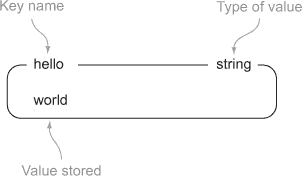

可用于 `STRING` 的操作始于其他键值存储中可用的操作。我们可以 `GET` 值、`SET` 值和 `DEL` 值。按照附录 A（kindle_split_024.html#app01）中描述的安装和测试 Redis 后，在 redis-cli 中，你可以尝试在 Redis 中 `SET`、`GET` 和 `DEL` 值，如 列表 1.1 所示，其中函数的基本含义在 表 1.3 中描述。

##### 表 1.3\. 用于 `STRING` 值的命令

| 命令 | 它做什么 |
| --- | --- |
| GET | 从给定键获取数据 |
| SET | 设置给定键存储的值 |
| DEL | 删除给定键存储的值（适用于所有类型） |

##### 列表 1.1\. Redis 中 `SET`、`GET` 和 `DEL` 命令的示例

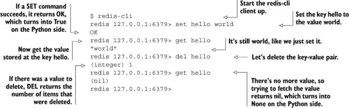

|  |
| --- |

##### 使用 redis-cli

在本章的第一部分，我介绍了 Redis 以及一些使用 Redis 伴随的 *redis-cli* 交互式客户端的命令。这允许你快速轻松地开始与 Redis 交互。

|  |
| --- |

除了能够`GET`、`SET`和`DEL STRING`值之外，还有一些其他命令用于读取和写入`STRING`的部分，以及允许我们将字符串视为数字来递增/递减它们的命令。我们将在第三章中讨论许多这些命令。但我们还有很多内容要覆盖，所以让我们继续看看`LIST`以及我们可以用它做什么。

#### 1.2.2\. Redis 中的列表

在键值存储的世界中，Redis 的独特之处在于它支持链表结构。Redis 中的`LIST`存储了一系列有序的字符串，就像`STRING`一样，我用一个带有列表项的标签框来表示`LIST`。一个`LIST`的例子可以在图 1.2 中看到。

##### 图 1.2\. 关键字`list-key`下有三个项的`LIST`示例。注意`item`可以在列表中出现多次。

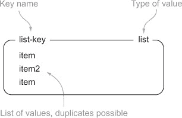

可以在`LIST`上执行的操作在几乎所有编程语言中都很典型。我们可以使用`LPUSH`/`RPUSH`将项推送到`LIST`的前端和后端；我们可以使用`LPOP`/`RPOP`从列表的前端和后端弹出项；我们可以使用`LINDEX`获取指定位置的项；我们可以使用`LRANGE`获取一系列项。让我们继续我们的 Redis 客户端交互，通过查看对`LIST`的交互，如列表 1.2 所示。表 1.4 给出了我们可以用在列表上的命令的简要描述。

##### 表 1.4\. 对`LIST`值使用的命令

| 命令 | 它做什么 |
| --- | --- |
| RPUSH | 将值推送到列表的右端 |
| LRANGE | 从列表中获取一系列值 |
| LINDEX | 从列表中获取指定位置的项 |
| LPOP | 从列表的左侧弹出值并返回它 |

##### 列表 1.2\. Redis 中的`RPUSH`、`LRANGE`、`LINDEX`和`LPOP`命令

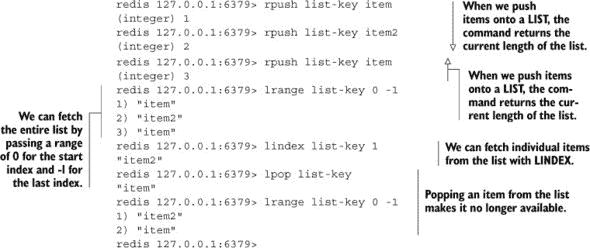

即使我们只能用`LIST`做这么多，Redis 也已经是一个解决各种问题的有用平台。但我们还可以删除项，在中间插入项，修剪列表到特定大小（从一端或两端丢弃项），等等。我们将在第三章中讨论许多这些命令，但现在让我们继续看看`SET`能给我们带来什么。

#### 1.2.3\. Redis 中的集合

在 Redis 中，`SET`与`LIST`类似，因为它们都是字符串序列，但与`LIST`不同，Redis 的`SET`使用哈希表来保持所有字符串的唯一性（尽管没有关联的值）。我对`SET`的视觉表示将与`LIST`类似，图 1.3 显示了包含三个项的示例`SET`。

##### 图 1.3\. 关键字`set-key`下有三个项的`SET`示例

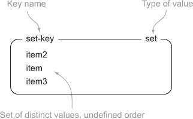

由于 Redis 的 `SET` 是无序的，我们不能像对 `LIST` 那样从两端推入和弹出项。相反，我们使用 `SADD` 和 `SREM` 命令通过值添加和删除项。我们还可以使用 `SISMEMBER` 快速确定项是否在 `SET` 中，或者使用 `SMEMBERS` 获取整个集合（对于大型 `SET`，这可能会很慢，所以请小心）。您可以在 Redis 客户端控制台中跟随列表 1.3 来了解 `SET` 的工作方式，表 1.5 描述了这里使用的命令。

##### 表 1.5\. 对 `SET` 值使用的命令

| 命令 | 执行的操作 |
| --- | --- |
| SADD | 向集合中添加项 |
| SMEMBERS | 返回整个项集合 |
| SISMEMBER | 检查项是否在集合中 |
| SREM | 如果存在，则从集合中删除项 |

##### 列表 1.3\. Redis 中的 `SADD`、`SMEMBERS`、`SISMEMBER` 和 `SREM` 命令

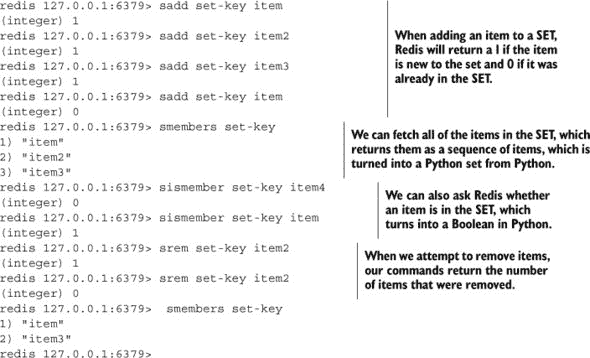

根据您对 `STRING` 和 `LIST` 部分的了解，`SET` 有许多其他用途，而不仅仅是添加和删除项。与 `SET` 相关的三个常用操作包括交集、并集和差集（分别对应 `SINTER`、`SUNION` 和 `SDIFF`）。我们将在第三章中详细介绍 `SET` 命令，第七章的一半涉及的问题几乎都可以用 Redis `SET` 解决。但让我们不要过于急躁；我们还有两个结构要讨论。继续阅读以了解 Redis `HASH`。

#### 1.2.4\. Redis 中的哈希

与 Redis 中的 `LIST` 和 `SET` 一样，`HASH` 存储键到值的映射。可以存储在 `HASH` 中的值与作为正常 `STRING` 存储的值相同：字符串本身，或者如果值可以解释为数字，则该值可以增加或减少。图 1.4 显示了一个包含两个值的哈希的图。

##### 图 1.4\. 一个在 `hash-key` 键下有两个键/值的 `HASH` 示例

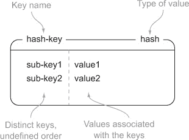

在很多方面，我们可以将 Redis 中的 `HASH` 视为 Redis 本身的微型版本。我们可以对 `STRING` 执行的一些相同命令，也可以对 `HASH` 内部的值执行，只需使用稍微不同的命令。尝试跟随列表 1.4 来查看我们可以用于向 `HASH` 中插入、获取和删除项的命令。表 1.6 描述了这些命令。

##### 表 1.6\. 对 `HASH` 值使用的命令

| 命令 | 执行的操作 |
| --- | --- |
| HSET | 在哈希中存储键的值 |
| HGET | 获取给定哈希键的值 |
| HGETALL | 获取整个哈希 |
| HDEL | 如果存在，则从哈希中删除键 |

##### 列表 1.4\. Redis 中的 `HSET`、`HGET`、`HGETALL` 和 `HDEL` 命令

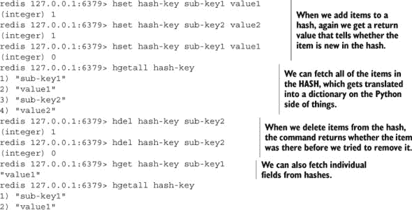

对于熟悉文档存储或关系型数据库的人来说，我们可以将 Redis 的 `HASH` 视为文档存储中的 *文档* 或关系型数据库中的 *行*，因为我们可以在一次访问或更改单个或多个字段。我们现在已经看到了 Redis 中所有可用的结构。继续阅读以了解 `ZSET` 是什么以及我们可以用它做什么。

#### 1.2.5\. Redis 中的有序集合

与 Redis 的 `HASH` 类似，`ZSET` 也包含一种键和值。键（称为 *成员*）是唯一的，值（称为 *分数*）限于浮点数。`ZSET` 在 Redis 中具有独特的属性，可以通过成员（如 `HASH`）访问，但项目也可以通过分数的排序顺序和值进行访问。图 1.5 展示了一个包含两个项目的示例 `ZSET`。

##### 图 1.5\. `zset-key` 键下有两个成员/分数的 `ZSET` 示例

与所有其他结构一样，我们需要能够向 `ZSET` 中添加、删除和检索项目。列表 1.5 提供了类似于其他结构的添加、删除和检索命令，而表 1.7 描述了我们将使用的命令。

##### 表 1.7\. 在 `ZSET` 值上使用的命令

| 命令 | 执行的操作 |
| --- | --- |
| ZADD | 将具有给定分数的成员添加到 ZSET 中 |
| ZRANGE | 从排序顺序中的位置获取 ZSET 中的项目 |
| ZRANGEBYSCORE | 根据分数范围从 ZSET 中获取项目 |
| ZREM | 如果存在，则从 ZSET 中删除项目 |

##### 列表 1.5\. Redis 中的 `ZADD`、`ZRANGE`、`ZRANGEBYSCORE` 和 `ZREM` 命令

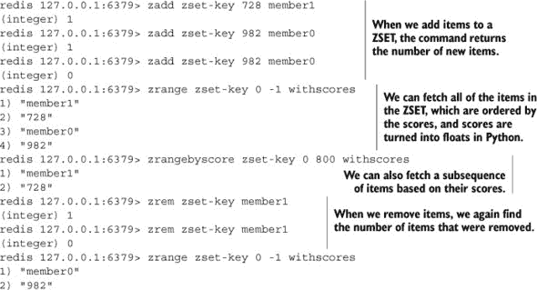

现在你已经了解了 `ZSET` 及其一些功能，你已经学会了 Redis 中可用的基本结构。在下一节中，我们将结合 `HASH` 的数据存储能力和 `ZSET` 的内置排序能力来解决一个常见问题。

### 1.3\. 欢迎使用 Redis

现在你对 Redis 提供的结构更加熟悉了，是时候在真实问题中使用 Redis 了。近年来，越来越多的网站提供了对网页链接、文章或问题进行投票的功能，包括如 Reddit 和 Stack Overflow 这样的网站，如图 1.6（#ch01fig06）和图 1.7（#ch01fig07）所示。通过考虑所投的票，帖子根据与这些投票和链接提交时间相关的分数进行排名和显示。在本节中，我们将构建一个基于 Redis 的后端，用于此类网站的简单版本。

##### 图 1.6\. Reddit，一个提供对文章进行投票功能的网站

##### 图 1.7\. Stack Overflow，一个提供对问题进行投票功能的网站

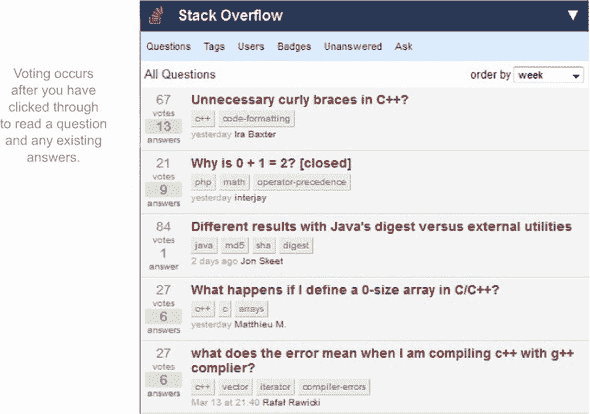

#### 1.3.1\. 对文章进行投票

首先，让我们从一些数字和问题的限制开始，这样我们就可以在不失目标的情况下解决问题。让我们假设每天提交 1,000 篇文章。在这 1,000 篇文章中，大约有 50 篇足够有趣，我们希望它们至少有一天在顶级 100 篇文章中。所有这 50 篇文章都将至少收到 200 个赞。我们不会担心这个版本中的反对票。

当处理随着时间的推移而下降的分数时，我们需要使发布时间、当前时间或两者都与整体分数相关。为了使事情简单，我们将说一个项目的分数是文章发布时间的函数，加上一个常数乘以文章收到的投票数。

我们将使用自 1970 年 1 月 1 日以来的秒数，在 UTC 时区中，这通常被称为*Unix 时间*。我们将使用 Unix 时间，因为它可以在大多数编程语言和可能用于 Redis 的每个平台上轻松获取。对于我们的常数，我们将使用一天中的秒数（86,400）除以所需的投票数（200）以维持一整天，这给我们带来了每票增加 432“点”的分数。

要实际构建这个，我们需要开始考虑在 Redis 中使用的结构。首先，我们需要存储文章信息，如标题、文章链接、发布者、发布时间和收到的投票数。我们可以使用 Redis 的`HASH`来存储这些信息，一个示例文章可以在图 1.8 中看到。

##### 

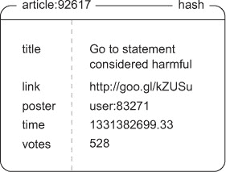

| |
| --- |

##### 使用冒号字符作为分隔符

在本章和其他章节中，你会发现我们使用冒号字符（`:`）作为名称各部分的分隔符；例如，在图 1.8 中，我们用它来区分*文章*和文章的 ID，创建了一种命名空间。冒号的选择是主观的，但 Redis 用户中很常见。其他常见的选择包括点（`.`）、正斜杠（`/`），甚至偶尔的管道字符（`|`）。无论你选择什么，都要保持一致，并注意我们如何在本书的示例中通过冒号定义嵌套命名空间。

| |
| --- |

要存储文章本身的有序集合，我们将使用`ZSET`，它按项目分数对项目进行排序。我们可以使用我们的文章 ID 作为成员，`ZSET`分数就是文章本身的分数。在此过程中，我们还将创建另一个`ZSET`，其分数只是文章发布的时间，这为我们提供了按文章分数或时间浏览文章的选项。我们可以在图 1.9 中看到时间排序和分数排序的文章`ZSET`的小示例。

##### 图 1.9\. 表示按时间排序和按分数排序的文章索引的两个有序集合

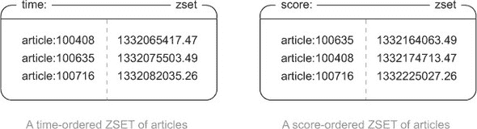

为了防止用户对同一文章重复投票，我们需要存储每个文章投票用户的唯一列表。为此，我们将为每个文章使用一个 `SET`，并存储所有对给定文章进行投票的用户的成员 ID。一个对文章进行投票的用户 `SET` 示例在 图 1.10 中展示。

##### 图 1.10\. 对文章 100408 投票的一些用户

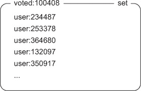

为了长期记忆使用，我们可以说一周后用户不能再对文章进行投票，其分数将固定。在那一周过去之后，我们将删除对文章进行投票的 `SET` 用户。

在我们构建这个之前，让我们看看如果用户 115423 在 图 1.11 中对文章 100408 进行投票会发生什么。

##### 图 1.11\. 当用户 115423 对文章 100408 投票时，我们的结构会发生什么变化

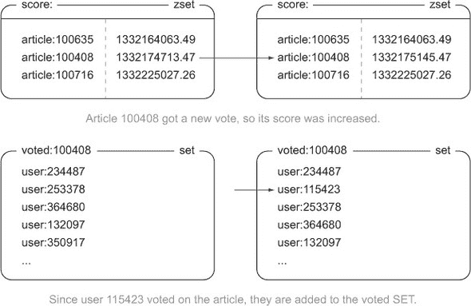

现在我们知道了我们要构建什么，让我们开始构建！首先，让我们处理投票。当有人尝试对文章进行投票时，我们首先通过 `ZSCORE` 检查文章的发布时间来验证文章是否在最近一周内发布。如果我们还有时间，然后我们尝试通过 `SADD` 将用户添加到文章的投票 `SET` 中。最后，如果用户之前没有对那篇文章进行投票，我们使用 `ZINCRBY`（一个增加成员分数的命令）将文章的分数增加 432（我们之前计算过），并使用 `HINCRBY`（一个在哈希中增加值的命令）更新 `HASH` 中的投票计数。投票代码在 列表 1.6 中展示。

##### 列表 1.6\. `article_vote()` 函数

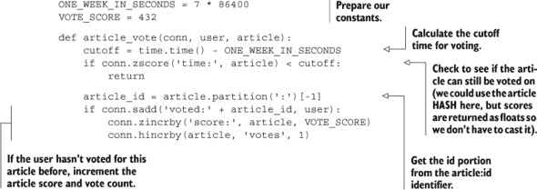

|  |
| --- |

##### Redis 事务

为了正确性，技术上我们的 `SADD`、`ZINCRBY` 和 `HINCRBY` 调用应该在事务中进行。但由于我们直到 第四章 才介绍事务，所以我们现在不会担心它们。

| |
| --- |

投票并不那么糟糕，对吧？但发布文章呢？

#### 1.3.2\. 发布和检索文章

要发布文章，我们首先通过 `INCR` 增加计数器来创建文章 ID。然后，我们通过 `SADD` 将发布者的 ID 添加到 `SET` 中来创建投票 `SET`。为了确保 `SET` 在一周后删除，我们将使用 `EXPIRE` 命令给它设置一个过期时间，这允许 Redis 自动删除它。然后，我们使用 `HMSET` 存储文章信息。最后，我们使用 `ZADD` 将初始分数和发布时间添加到相关的 `ZSET`s 中。我们可以在 列表 1.7 中看到发布文章的代码。

##### 列表 1.7\. `post_article()` 函数

好吧，所以我们可以投票，我们可以发布文章。但是，关于获取当前得分最高或最新文章怎么办？为此，我们可以使用`ZRANGE`来获取文章 ID，然后我们可以调用`HGETALL`来获取每篇文章的信息。唯一棘手的部分是我们必须记住`ZSET`是按分数升序排序的。但我们可以使用`ZREVRANGEBYSCORE`以相反的顺序获取项目。获取文章页面的函数在列表 1.8 中展示。

##### 列表 1.8. `get_articles()`函数

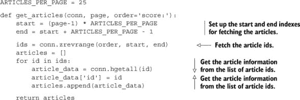

| |
| --- |

##### 默认参数和关键字参数

在列表 1.8 中，我们使用了一个名为`order`的参数，并给它提供了一个默认值`score:`。对于 Python 语言的新手来说，默认参数和按名称（而不是按位置）传递参数的一些细节可能有些奇怪。如果你在理解函数定义或参数传递方面遇到困难，Python 语言教程提供了一个很好的介绍，你可以通过访问这个缩短的 URL 直接跳转到特定部分：[`mng.bz/KM5x`](http://mng.bz/KM5x)。

| |
| --- |

我们现在可以获取整个网站上的得分最高的文章。但是，许多这些文章投票网站都有只处理特定主题文章的群体，比如可爱动物、政治、Java 编程，甚至 Redis 的使用。我们如何添加或修改我们的代码来提供这些主题群体？

#### 1.3.3. 文章分组

提供群体需要两个步骤。第一步是添加关于哪些文章属于哪些群体的信息，第二步是从群体中实际获取文章。我们将为每个群体使用一个`SET`，它存储该群体中所有文章的文章 ID。在列表 1.9 中，我们看到一个允许我们向群体中添加和删除文章的函数。

##### 列表 1.9. `add_remove_groups()`函数

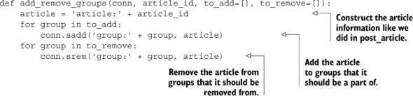

乍一看，这些包含文章信息的`SET`可能看起来并不那么有用。到目前为止，你只看到了检查`SET`是否有项目的能力。但是，Redis 有执行涉及多个`SET`的操作的能力，在某些情况下，Redis 可以在`SET`和`ZSET`之间执行操作。

当我们在浏览特定群体时，我们希望能够看到该群体中所有文章的分数。或者，实际上，我们希望它们在`ZSET`中，这样我们就可以有预先排序好的分数，并准备好进行分页。Redis 有一个名为`ZINTERSTORE`的命令，当提供`SET`和`ZSET`时，它会找到所有`SET`和`ZSET`中的条目，以几种不同的方式合并它们的分数（`SET`中的项目被认为是分数等于 1）。在我们的情况下，我们想要每个项目的最高分数（这将是文章分数或文章发布时间，取决于选择的排序选项）。

为了可视化正在发生的事情，让我们看看图 1.12。这个图展示了在一个小文章组上进行的`ZINTERSTORE`操作，这些文章存储为一个`SET`，与更大的（但未完全显示）的分数`ZSET`。注意，只有那些同时存在于`SET`和`ZSET`中的文章才会出现在结果`ZSET`中？

##### 图 1.12. 新创建的`ZSET`，`score:programming`，是`SET`和`ZSET`的交集。交集只会保留所有输入`SET`s/`ZSET`s 中存在的成员。当交集`SET`s 和`ZSET`s 时，`SET`s 表现得好像它们有一个分数为 1，所以当与`MAX`的聚合交集时，我们只使用`score:`输入`ZSET`中的分数，因为它们都大于 1。

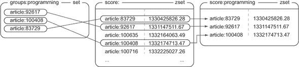

要计算一个组中所有项目的分数，我们只需要对组和分数或最近的`ZSET`执行一个`ZINTERSTORE`调用。因为一个组可能很大，所以计算可能需要一些时间，所以我们将`ZSET`保留 60 秒以减少 Redis 需要执行的工作量。如果我们小心（我们是），甚至可以使用我们现有的`get_articles()`函数来处理分页和文章数据检索，这样我们就不需要重写它。我们可以在列表 1.10 中看到从组中检索一页文章的函数。

##### 列表 1.10. `get_group_articles()`函数

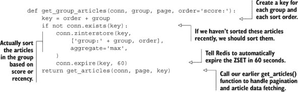

在一些网站上，文章通常只属于一个或两个组（例如“所有文章”和与文章最匹配的组）。在这种情况下，将文章所在的组作为文章的`HASH`的一部分来保留可能更有意义，并在我们的`article_vote()`函数的末尾添加一个额外的`ZINCRBY`调用。但就我们而言，我们选择允许文章同时属于多个组（也许一张图片既可爱又有趣）。因此，为了更新多个组中的文章分数，我们需要同时增加所有这些组的分数。对于属于许多组的文章，这可能很昂贵，所以我们偶尔会执行交集操作。我们如何选择提供灵活性或限制，可以改变我们在任何数据库中存储和更新数据的方式，Redis 也不例外。

|  |
| --- |

**练习：取消投票**

在我们的例子中，我们只计算了对文章投赞成票的人。但在许多网站上，负面投票可以为每个人提供有用的反馈。你能想出一种方法来为`article_vote()`和`post_article()`添加取消投票支持吗？如果可能的话，尝试允许用户切换他们的投票。提示：如果你在投票切换上卡住了，可以查看我在第三章中简要介绍的`SMOVE`。

|  |
| --- |

现在我们能够获取文章、发布文章、对文章进行投票，甚至有分组文章的能力，我们已经为显示热门链接或文章构建了一个后端。恭喜您走到这一步！如果您在跟随、理解示例或使解决方案工作方面有任何困难，请继续阅读以了解您可以在哪里获得帮助。

### 1.4\. 寻求帮助

如果您在 Redis 上遇到问题，不要害怕寻找或寻求帮助。可能很多人都会遇到类似的问题。首先尝试使用您喜欢的搜索引擎搜索您看到的特定错误信息。

如果您找不到问题的解决方案，并且在这本书的示例中遇到问题，请前往 Manning 论坛：[`www.manning-sandbox.com/forum.jspa?forumID=809`](http://www.manning-sandbox.com/forum.jspa?forumID=809)提问。我或熟悉这本书的其他人应该能够帮助您。

如果您在 Redis 上遇到问题，或者解决的不是这本书中的问题，请加入并发布您的问题到[`groups.google.com/d/forum/redis-db/`](https://groups.google.com/d/forum/redis-db/)的 Redis 邮件列表。再次提醒，我或熟悉 Redis 的其他人应该能够帮助您。

最后，如果您在特定语言或库上遇到困难，您也可以尝试 Redis 邮件列表，但您可能更幸运地搜索您使用的库的邮件列表或论坛。

### 1.5\. 摘要

在本章中，我们介绍了 Redis 的基本知识，以及它与其他数据库的相似之处和不同之处。我们还讨论了您为什么想在下一个项目中使用 Redis 的几个原因。在阅读即将到来的章节时，请记住，我们并不是在构建一个单一的最終应用程序或工具；我们正在查看 Redis 可以帮助您解决的各种问题。

如果您从这个章节中应该带走一个概念，那就是 Redis 是您可以用来解决问题的另一个工具。Redis 具有其他数据库所不具备的结构，并且由于 Redis 是内存中的（使其快速），远程的（使其对多个客户端/服务器可访问），持久的（在重启之间保持数据的机会），以及可扩展的（通过从属和分片），您可以用您已经习惯的方式构建解决各种问题的解决方案。

在阅读本书的其余部分时，请注意您解决问题的方法是如何变化的。您可能会发现，您对数据驱动问题的思考方式从“我如何使我的想法适应表格和行界定的世界？”转变为“Redis 中的哪些结构将导致更容易维护的解决方案？”

在第二章中，我们将使用 Redis 来解决在 Web 应用世界中遇到的问题，所以请继续阅读以更深入地了解 Redis 能帮助您做什么。

## 第二章\. Redis Web 应用的解剖结构

*本章涵盖*

+   登录 cookie

+   购物车 cookie

+   缓存生成的网页

+   缓存数据库行

+   分析网页访问

在第一章中，我向您介绍了 Redis 是什么以及它能够做什么。在本章中，我将继续沿着这条路径前进，开始深入研究一些在特定类型的 Web 应用程序上下文中出现的问题示例。虽然与现实世界相比，我已经大大简化了这些问题，但实际上每个部分都可以经过少量修改后直接用于您的应用程序。本章主要作为 Redis 实际应用的指南，而第三章则更像是命令参考。

首先，让我们从高层次上看看我们所说的 Web 应用程序是什么。通常，我们指的是一个服务器或服务，它通过 HTTP 协议对 Web 浏览器的请求做出响应。以下是 Web 服务器在响应请求时通常会经历的典型步骤：

> **1**. 服务器解析请求。
> 
> **2**. 请求被转发到预定义的处理程序。
> 
> **3**. 处理程序可能会向数据库请求数据。
> 
> **4**. 使用检索到的数据，处理程序随后将模板渲染为响应。
> 
> **5**. 处理程序返回渲染后的响应，并将其传回客户端。

此列表是典型 Web 服务器中发生事件的概述。在这种情况下，Web 请求被认为是*无状态的*，因为 Web 服务器本身不保存有关过去请求的信息，试图允许轻松替换失败的服务器。关于如何优化该过程中的每一步都已有书籍出版，本书也做了类似的工作。本书的不同之处在于，它解释了如何用针对 Redis 的更快查询替换典型关系型数据库中的某些查询，以及如何使用 Redis，这在关系型数据库中可能会非常昂贵。

通过本章，我们将探讨并解决在假网络零售商（一个相当大的（假）网络商店）上下文中出现的问题，该商店每天大约有 500 万独立用户访问，他们每天购买超过 10 万件商品。这些数字很大，但如果我们可以轻松解决大问题，那么小问题和中等问题应该更容易解决。尽管这些解决方案针对大型网络零售商，但除了一个之外，所有这些解决方案都可以通过不超过几个 GB 内存的 Redis 服务器处理，并且旨在提高实时响应请求的系统的性能。

所提出的解决方案（或其某些变体）都已被用于解决生产环境中的实际问题。更具体地说，通过将一些处理和存储任务从传统数据库卸载到 Redis，网页加载速度更快，资源消耗更少。

我们的首要问题是使用 Redis 帮助管理用户登录会话。

### 2.1. 登录和 cookie 缓存

无论何时我们在互联网上登录服务，如银行账户或网络邮箱，这些服务都会使用*cookies*来记住我们是谁。Cookies 是网站要求我们的网络浏览器存储并在每次请求该服务时重新发送的小数据块。对于登录 cookie，有两种常见的将登录信息存储在 cookie 中的方法：签名 cookie 或 token cookie。

*签名 cookie*通常存储用户的姓名、可能还有他们的用户 ID、他们最后一次登录的时间以及服务可能认为有用的其他信息。除了这些特定用户信息外，cookie 还包括一个签名，允许服务器验证浏览器发送的信息没有被更改（例如，用一个用户的登录名替换另一个用户的登录名）。

*Token cookies* 使用一系列随机字节作为 cookie 中的数据。在服务器上，token 用作键，通过查询某种类型的数据库来查找拥有该 token 的用户。随着时间的推移，可以删除旧 token 以腾出空间给新 token。以下展示了签名 cookie 和 token cookie 在参考信息方面的优缺点，供表 2.1 参考。

##### 表 2.1\. 签名 cookie 和 token cookie 的优缺点

| Cookie 类型 | 优点 | 缺点 |
| --- | --- | --- |
| 签名 cookie | 验证 cookie 所需的所有信息都包含在 cookie 中 可以轻松包含和签名附加信息 | 正确处理签名很困难 容易忘记签名和/或验证数据，从而允许安全漏洞 |
| Token cookie | 添加信息很容易 非常小的 cookie，因此移动和慢速客户端可以更快地发送请求 | 需要在服务器上存储更多信息 如果使用关系型数据库，cookie 加载/存储可能很昂贵 |

为了避免实现签名 cookie，假网络零售商选择使用 token cookie 来引用关系型数据库表中的一个条目，该表存储用户登录信息。通过在数据库中存储这些信息，假网络零售商还可以存储用户浏览时长或查看的商品数量等信息，并在以后分析这些信息，以尝试了解如何更好地向用户进行市场营销。

如预期的那样，人们在选择购买一个（或几个）商品之前通常会浏览许多不同的商品，记录下所有看到的不同商品的信息、用户最后一次访问页面的时间等信息，这可能会导致大量的数据库写入操作。从长远来看，这些数据是有用的，但即使经过数据库调整，大多数关系型数据库也仅限于每个数据库服务器每秒插入、更新或删除大约 200-2,000 条单独的行。尽管批量插入/更新/删除可以更快地执行，但客户每次查看网页时只更新一小部分行，因此更高的批量插入速度在这里并没有帮助。

目前，由于一天中的相对较大负载（平均每秒约 1,200 次写入，高峰时段接近每秒 6,000 次写入），假网络零售商不得不在高峰时段设置 10 个关系型数据库服务器来处理负载。我们的任务是让关系型数据库在登录 cookie 方面退出舞台，并用 Redis 来替代。

为了开始，我们将使用一个`HASH`来存储我们的从登录 cookie 令牌到已登录用户的映射。为了检查登录，我们需要根据令牌获取用户，如果它可用，则返回它。以下列表展示了我们如何检查登录 cookie。

##### 列表 2.1\. `check_token()` 函数

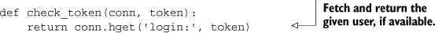

检查令牌并不令人兴奋，因为所有有趣的事情都发生在我们更新令牌本身的时候。对于访问，我们将更新用户的登录`HASH`并记录令牌在最近用户`ZSET`中的当前时间戳。如果用户正在查看项目，我们还会将该项目添加到用户的最近查看`ZSET`中，并在它增长超过 25 个项目时对其进行修剪。执行所有这些操作的功能将在下面展示。

##### 列表 2.2\. `update_token()` 函数

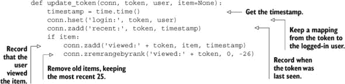

你知道吗？就是这样。我们现在记录了给定会话的用户上次查看项目的时间和用户最近查看的项目。在最近几年制造的服务器上，你可以每秒记录至少 20,000 次项目查看的信息，这比我们需要对数据库执行的操作多出三倍。这可以做得更快，我们稍后会讨论。但即使是这个版本，我们也比典型的关系型数据库在这个上下文中提高了 10-100 倍的性能。

随着时间的推移，内存使用量将会增长，我们希望清理旧数据。为了限制我们的数据，我们只保留最近的 1,000 万次会话.^([1]) 对于我们的清理，我们将通过循环获取`ZSET`的大小。如果`ZSET`太大，我们将每次最多获取 100 个最旧的条目（因为我们使用时间戳，这仅仅是`ZSET`中的前 100 个条目），从最近的`ZSET`中移除它们，从登录`HASH`中删除登录令牌，并删除相关的查看`ZSET`s。如果`ZSET`不是太大，我们将暂停一秒钟，稍后再试。清理旧会话的代码将在下面展示。

> ¹ 请记住，这些类型的限制是为了作为示例，你可以在大规模生产环境中使用。在测试和开发过程中，你可以将这些限制减少到更小的数字，以验证它们是否有效。

##### 列表 2.3\. `clean_sessions()` 函数

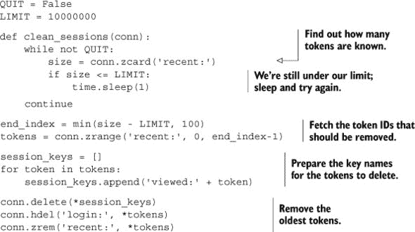

如何让如此简单的东西扩展到每天处理五百万用户？让我们来看看数字。如果我们预计每天有五百万个唯一用户，那么在两天（如果我们每天都获得新用户），我们将耗尽空间并需要开始删除令牌。一天有 24 × 3600 = 86,400 秒，所以平均每秒有 5 百万 / 86,400 < 58 个新会话。如果我们每秒运行我们的清理函数（如我们的代码实现），我们每秒将清理不到 60 个令牌。但实际上，我们的代码可以在网络上每秒清理超过 10,000 个令牌，在本地每秒清理超过 60,000 个令牌，这比我们需要的速度快 150-1,000 倍。

|  |
| --- |

##### 清理函数的运行位置

本书中的其他示例有时会包括清理函数，例如列表 2.3。根据清理函数的不同，它可能被编写为作为守护进程运行（如列表 2.3），通过 cron 作业定期运行，或者甚至在每次执行时运行（第 6.3 节实际上将清理操作作为“获取”操作的一部分）。一般来说，如果函数包含`while not QUIT:`行，它应该作为守护进程运行，尽管根据其目的，它可能被修改为定期运行。

|  |
| --- |
|  |

##### Python 传递和接收可变数量参数的语法

在列表 2.3 内部，你会注意到我们使用类似于`conn.delete(*vtokens)`的语法调用了三个函数。基本上，我们是在不预先解包参数的情况下将一系列参数传递给底层函数。有关此工作方式的语义的更多详细信息，你可以通过访问这个简短的网址访问 Python 语言教程网站：[`mng.bz/8I7W`](http://mng.bz/8I7W)。

|  |
| --- |
|  |

##### Redis 中的过期数据

随着你对 Redis 了解的深入，你可能会发现我们提出的解决方案并不是解决问题的唯一方法。在这种情况下，我们可以省略最近的`ZSET`，将登录令牌作为纯键值对存储，并使用 Redis 的`EXPIRE`来设置未来的日期或时间来清理会话和最近查看的`ZSET`s。但是使用`EXPIRE`会阻止我们明确地将会话信息限制在 1000 万用户以内，并阻止我们在会话过期时执行遗弃购物车分析，如果将来需要的话。

|  |
| --- |

熟悉线程或并发编程的人可能会看到，前面的清理函数存在一个竞态条件，技术上用户有可能在我们删除他们的信息时，在相同的一秒内访问网站。我们在这里不会担心这个问题，因为它不太可能发生，而且它不会对我们记录的数据造成重大变化（除了要求用户再次登录）。我们将在第三章和第四章中讨论如何防止竞态条件以及如何加快删除操作的速度。chapters 3 和 4。

我们每天减少写入数据库的行数已经减少了数百万行。这很好，但这只是我们在 Web 应用程序中使用 Redis 的第一步。在下一节中，我们将使用 Redis 来处理另一种类型的 cookie。

### 2.2. Redis 中的购物车

网络上最早使用 cookie 之一是由 Netscape 在 20 世纪 90 年代中期开创的，最终导致了我们刚才提到的登录会话 cookie。最初，cookie 的目的是为网络零售商提供一种方式，以便为用户保留一种购物车，以便跟踪他们想要购买的商品。在 cookie 出现之前，有一些不同的解决方案用于跟踪购物车，但它们都不太容易使用。

购物车 cookie 的使用很常见，就像将整个购物车本身存储在 cookie 中一样。将购物车存储在 cookie 中的一个巨大优势是，您不需要写入数据库来保持它们。但缺点之一是您还需要重新解析和验证 cookie，以确保它具有正确的格式并包含可以实际购买的商品。另一个缺点是 cookie 会随着每个请求传递，这可能会减慢大型 cookie 的请求发送和处理速度。

由于我们在会话 cookie 和最近查看的项目上取得了如此好的运气，我们将我们的购物车信息推送到 Redis。由于我们已经在 Redis 中保存了用户会话 cookie（以及最近查看的项目），我们可以使用相同的 cookie ID 来引用购物车。

我们将要使用的购物车很简单：它是一个将商品 ID 映射到客户希望购买的商品数量的`HASH`。我们将让 Web 应用程序处理商品数量的验证，所以我们只需要在数量变化时更新购物车中的数量。如果用户想要超过 0 件商品，我们将商品（们）添加到`HASH`中（如果存在，则替换之前的数量）。如果不想要，我们将从哈希中删除条目。我们的`add_to_cart()`函数可以在下面的列表中看到。

##### 列表 2.4. `add_to_cart()`函数

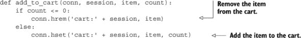

在此同时，我们将更新我们的会话清理函数，以便在下一个列表中包括删除旧的购物车作为`clean_full_sessions()`。

##### 列表 2.5. `clean_full_sessions()`函数

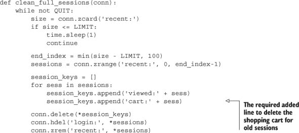

现在我们将会话和购物车都存储在 Redis 中，这有助于减少请求大小，同时允许基于访问者查看的物品、最终放入购物车的物品以及他们最终购买的物品进行统计计算。所有这些让我们能够构建（如果我们想的话）类似于许多其他大型网络零售商的功能：“查看此物品的人最终购买了此物品 X%的时间”，“购买此物品的人也购买了这些其他物品”。这可以帮助人们找到其他相关物品，这对业务最终是有益的。

现在我们已经在 Redis 中存储了会话和购物车 cookie，我们现在有两个主要的数据分析工具。继续前进，让我们看看我们如何通过缓存进一步减少数据库和 Web 前端负载。

### 2.3. 网页缓存

在动态生成网页时，通常使用模板语言来简化页面生成。那些每个页面都要手动编写的日子已经过去了。现代网页是从带有标题、页脚、侧菜单、工具栏、内容区域甚至生成的 JavaScript 的页面模板生成的。

尽管能够动态生成内容，但 Fake Web Retailer 网站上提供的大多数页面在常规情况下变化不大。当然，目录中会添加一些新物品，旧物品会被移除，有时会有特价商品，有时甚至有“热门物品”页面。但事实上，只有少数账户设置、历史订单、购物车/结账等页面需要在每次页面加载时生成内容。

通过查看它们的观看次数，Fake Web Retailer 已经确定他们提供的 95%的 Web 页面每天最多变化一次，实际上并不需要动态生成内容。我们的任务是停止为每次加载生成 95%的页面。通过减少我们用于生成静态内容的时间，我们可以减少处理相同负载所需的服务器数量，并且我们可以更快地提供服务。（研究表明，减少用户等待页面加载的时间会增加他们使用网站的愿望，并改善他们对网站的评分。）

所有标准的 Python 应用程序框架都提供了添加层的能力，这些层可以在处理请求时进行预处理或后处理。这些层通常被称为*中间件*或*插件*。让我们创建一个这样的层，它调用我们的 Redis 缓存函数。如果 Web 请求无法被缓存，我们将生成页面并返回内容。如果请求可以被缓存，我们将尝试从缓存中获取并返回页面；否则，我们将生成页面，将结果缓存到 Redis 中，最多 5 分钟，然后返回内容。我们的简单缓存方法可以在下一列表中看到。

##### 列表 2.6. `cache_request()` 函数

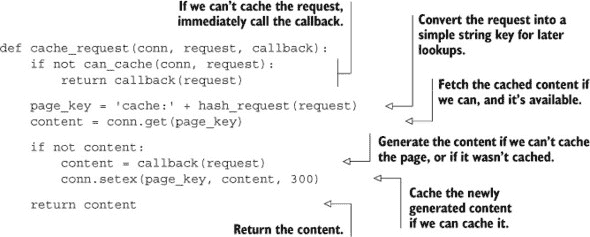

对于那 95%可以缓存且经常加载的内容，这段代码消除了为 5 分钟动态生成查看页面的需要。根据内容的复杂性，这一变化可以将数据密集型页面的延迟从大约 20-50ms 降低到一次 Redis 往返（本地连接下不到 1ms，同一数据中心内彼此靠近的计算机下不到 5ms）。对于以前需要从数据库获取数据的页面，这可以进一步减少页面加载时间和数据库负载。

现在我们已经减少了那些不经常变化的页面的加载时间，我们是否可以继续使用 Redis 来减少那些经常变化的页面的加载时间呢？当然可以！继续阅读以了解如何实现。

### 2.4. 数据库行缓存

到目前为止，我们已经将登录和访客会话从我们的关系型数据库和网页浏览器移动到 Redis，我们将购物车从关系型数据库中移除并放入 Redis，并在 Redis 中缓存整个页面。这有助于我们提高性能并减少对关系型数据库的负载，这也降低了我们的成本。

我们向用户显示的个别产品页面通常只从数据库中加载一到两行：登录用户的用户信息（在我们的生成页面中，我们可以通过 AJAX 调用加载它以继续使用我们的缓存），以及关于商品本身的信息。即使对于可能不希望缓存整个页面的页面（客户账户页面、特定用户的过去订单等），我们也可以缓存关系型数据库中的个别行。

作为缓存此类行有用的例子，让我们假设假想网络零售商决定开始一项新的促销活动，旨在清理一些库存并吸引人们回来消费。为了实现这一点，我们将对某些商品进行每日特价销售，直到其售罄。在交易的情况下，我们不能缓存整个页面，因为这样可能会有人看到剩余物品数量的错误版本。尽管我们可以从数据库中继续读取商品的行，但这可能会使我们的数据库过度使用，进而增加我们的成本，因为我们需要再次扩展我们的数据库。

为了在重负载前缓存数据库行，我们将编写一个持续运行的守护进程函数，其目的是在可变的时间表上缓存特定的数据库行到 Redis 中，并更新它们。这些行本身将以 JSON 编码的字典形式存储为普通的 Redis 值。我们将映射列名和行值到字典的键和值。一个示例行可以在图 2.1 中看到。

##### 图 2.1. 一个用于在线销售的缓存数据库行

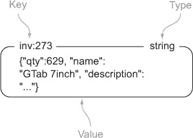

为了知道何时更新缓存，我们将使用两个 `ZSET`。我们的第一个 `ZSET`，即 `scheduleZSET`，将使用原始数据库行的行 ID 作为 `ZSET` 的成员。我们将使用时间戳作为我们的计划分数，这将告诉我们何时将行复制到 Redis。我们的第二个 `ZSET`，即 `delayZSET`，将使用相同的行 ID 作为成员，但分数将是缓存更新之间的秒数。

| |
| --- |

##### 使用 JSON 而不是其他格式

我们选择使用 JSON 而不是 XML、Google 的协议缓冲区、Thrift、BSON、MessagePack 或其他序列化格式是主观的。我们通常使用 JSON，因为它易于阅读，相对简洁，并且每个具有现有 Redis 客户端的编程语言都有快速的编码和解码库（据我们所知）。如果你的情况需要使用另一种格式，或者你更愿意使用不同的格式，那么请随意使用。

| |
| --- |
| |

##### 嵌套结构

其他非关系型数据库的用户有时期望的一个功能是能够嵌套结构。具体来说，一些 Redis 的新用户期望 `HASH` 类型的值可以是 `ZSET` 或 `LIST`。虽然从概念上讲这是可行的，但在这样的讨论中早期出现的一个问题是归结为一个简单的例子，“我如何在嵌套五层的 `HASH` 中增加一个值？”为了保持命令语法的简单性，Redis 不允许嵌套结构。如果需要，你可以使用键名来实现这一点（例如 `user:123` 可以是一个 `HASH`，而 `user:123:posts` 可以是该用户最近帖子的 `ZSET`）。或者，你可以显式地使用 JSON 或其他你选择的序列化库来存储你的嵌套结构（Lua 脚本，在第十一章中介绍，支持服务器端操作 JSON 和 MessagePack 编码的数据）。

| |
| --- |

为了使缓存函数定期缓存行，我们首先将行 ID 添加到我们的延迟 `ZSET` 中，并指定延迟。这是因为我们的实际缓存函数将需要延迟，如果缺失，它将删除计划的项目。当行 ID 在延迟 `ZSET` 中时，我们将然后添加行 ID 到我们的计划 `ZSET` 中，并使用当前的时间戳。如果我们想停止行同步到 Redis 并从缓存中删除它，我们可以将延迟设置为小于或等于 0，我们的缓存函数将处理它。我们的用于计划或停止缓存的函数可以在以下列表中看到。

##### 列表 2.7\. `schedule_row_cache()` 函数

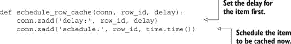

现在我们已经完成了调度部分，我们如何缓存行？我们将从调度`ZSET`中拉取第一个项目及其分数。如果没有项目，或者返回的时间戳在将来，我们将等待 50 毫秒后再次尝试。当我们有一个现在应该更新的项目时，我们将检查行的延迟。如果下一次缓存时间的延迟小于或等于 0，我们将从延迟和调度`ZSET`s 中移除行 ID，并删除缓存的行再次尝试。最后，对于任何应该被缓存的行，我们将更新行的调度，从数据库中拉取行，并将行的 JSON 编码版本保存到 Redis。我们执行此操作的功能可以在下面的列表中看到。

##### 列表 2.8\. `cache_rows()`守护进程函数

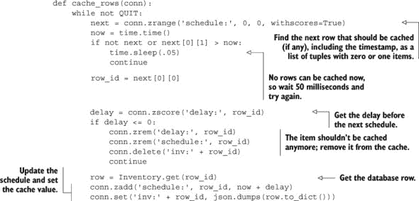

结合调度函数和持续运行的缓存函数，我们添加了一个重复的定时自动缓存机制。有了这两个函数，库存行可以更新得像我们认为合理的那样频繁。对于一个每天的交易，库存数量减少并影响某人是否可以购买商品，如果有很多买家，每几秒钟更新缓存的行可能是有意义的。但如果数据不经常改变，或者当后置订单的商品是可以接受的，可能只每分钟更新缓存一次更有意义。这两种方法都可以用这个简单的方法实现。

现在我们已经在 Redis 中缓存了单个行，是否有可能通过只缓存部分页面来进一步减少我们的内存负载？

### 2.5\. 网页分析

当人们访问我们构建的网站，与他们互动，甚至可能从他们那里购买东西时，我们可以获得有价值的信息。例如，如果我们只关注获得最多浏览量的页面，我们可以尝试改变页面的格式，使用的颜色，甚至可能改变页面上显示的其他链接。这些变化中的每一个都可能影响页面或后续页面的体验，甚至影响购买行为。

在第 2.1 节和 2.2 节中，我们讨论了收集关于用户查看或添加到购物车中的商品的信息。在第 2.3 节中，我们讨论了缓存生成的网页以减少页面加载时间和提高响应性。不幸的是，我们在假网络零售商的缓存上做得太过分了；我们缓存了所有 100,000 个可用的产品页面，现在我们正在耗尽内存。经过一些工作，我们确定我们只能合理地保留大约 10,000 页在缓存中。

如果您还记得第 2.1 节，我们保留了对每个访问过的项目的引用。虽然我们可以直接使用这些信息来帮助我们决定要缓存哪些页面，但实际上计算这些信息可能需要很长时间才能得到好的数据。相反，让我们向列表 2.2 中的`update_token()`函数添加一行，我们将在下面看到。

##### 列表 2.9\. 更新的 `update_token()` 函数

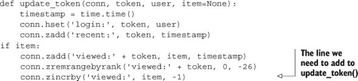

通过添加这一行，我们现在有了所有查看项目的记录。更有用的一点是，这些项目的列表是按人们查看项目的次数排序的，最常查看的项目具有最低的分数，因此索引为 0。随着时间的推移，一些项目会被多次查看，而其他项目则很少被查看。显然，我们只想缓存常见查看的项目，但我们还希望能够发现正在变得流行的新的项目，这样我们就可以知道何时缓存它们。

为了保持页面排行榜的新鲜，我们需要修剪查看项目列表，同时调整分数以允许新项目变得流行。您已经知道如何从 第 2.1 节 中的 `ZSET` 中删除项目，但缩放是新的。`ZSET` 有一个名为 `ZINTERSTORE` 的函数，它允许我们合并一个或多个 `ZSET`，并将输入 `ZSET` 中的每个分数乘以一个给定的数字。（每个输入 `ZSET` 可以乘以不同的数字。）每 5 分钟，我们就可以删除不在前 20,000 个项目中的任何项目，并将查看次数缩放为之前的一半。以下列表将删除项目并缩放剩余的分数。

##### 列表 2.10\. `rescale_viewed()` 守护进程函数

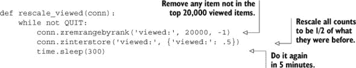

通过缩放和计数，我们现在有了 Fake Web Retailer 最常查看项目的实时列表。现在我们只需要更新我们的 `can_cache()` 函数，使其考虑我们决定页面是否可以缓存的新的方法，然后我们就完成了。您可以在下面看到我们的新 `can_cache()` 函数。

##### 列表 2.11\. `can_cache()` 函数

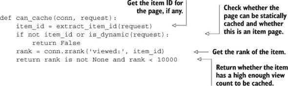

通过这个最后的部分，我们现在能够使用实际的查看统计信息，并且只缓存那些位于前 10,000 个产品页面中的页面。如果我们想以最小的努力存储更多的页面，我们可以在将页面存储到 Redis 之前压缩它们，使用名为 *边侧包含* 的技术来删除我们页面的一部分，或者我们可以预先优化我们的模板以去除不必要的空白。这些技术以及更多技术可以减少内存使用，并增加我们可以在 Redis 中存储的页面数量，所有这些都可以随着我们网站的扩展而提高性能。

### 2.6\. 摘要

在本章中，我们介绍了几种减少 Fake Web Retailer 数据库和 Web 服务器负载的方法。这些示例中使用的方法目前在今天的真实 Web 应用程序中正在使用。

如果从这个章节中你能带走一件事，那就是当你构建适合你应用的新组件时，你不应该害怕回顾和更新你已经编写过的旧组件。有时你可能会发现，你早期的解决方案已经让你朝着现在的需求前进了几步（就像购物车 cookies 和结合我们初始登录会话 cookies 代码的 web 分析一样）。随着我们继续阅读这本书，我们会不断引入新的主题，并且我们偶尔会回顾它们，以提高性能或功能，或者重用我们已经理解的想法。

现在你已经尝到了 Redis 作为真实应用一部分所能做的事情，下一章将介绍 Redis 中可用的更广泛的命令。在你了解更多关于每个结构和可以用它们做什么之后，你将准备好为你的应用的其他层或服务堆栈构建更多有用的组件。那你还在等什么呢？继续阅读吧！
