## 第二部分\. 核心概念

在接下来的几章中，我们将深入研究标准的 Redis 命令，它们如何操作数据，以及如何配置 Redis。在后几章中，我们将构建不断增长的支持工具和应用程序，直到我们最终在 Redis 中构建一个简单的社交网络。

## 第三章\. Redis 中的命令

*本章涵盖*

+   字符串、列表和集合命令

+   哈希和有序集合命令

+   发布/订阅命令

+   其他命令

在本章中，我们将主要介绍在第一章和第二章中尚未涉及到的命令。通过学习 Redis 的命令，你将能够基于提供的示例进行构建，并更好地理解如何解决你自己的问题。如果你在寻找比我在这里展示的简单交互更短的示例，你可以在第二章中找到一些。

本章中突出显示的命令是根据结构或概念划分的，并且被选中是因为它们包含了各种应用中 95%或更多的典型 Redis 调用。示例是控制台中的交互，类似于我在第一章中介绍每个结构的方式。在适当的地方，我会引用使用这些命令的早期或后期部分。

在每个不同数据类型的部分，我会展示那些独特于不同结构的命令，主要关注那些使这些结构和命令与众不同的特点。让我们先看看 Redis 的`STRING`类型除了`GET`和`SET`操作之外还能提供什么。

| |
| --- |

##### 未涵盖命令的附加文档

在本章中，我只介绍最常用的命令或我们将在后续章节中使用的命令。如果你在寻找完整的命令和文档参考，你可以访问[`redis.io/commands`](http://redis.io/commands)。

| |
| --- |
| |

##### Redis 2.4 和 2.6

如附录 A 中所述，截至本书写作之时，Windows 上的预编译 Redis 版本来自 2.4 系列。在本章和其他章节中，我们使用仅在 Redis 2.6 及以后版本中可用的功能。Redis 2.4 和 2.6 之间的主要区别包括（但不限于）Lua 脚本（我们将在第十一章中讨论）、毫秒级精度的过期时间（`PTTL`、`PEXPIRE`和`PEXPIREAT`，在本章中描述）、一些位操作（`BITOP`和`BITCOUNT`），以及一些现在接受多个参数而之前只接受一个参数的命令（`RPUSH`、`LPUSH`、`SADD`、`SREM`、`HDEL`、`ZADD`和`ZREM`）。

| |
| --- |

### 3.1\. 字符串

你会记得从第一章和第二章中，`STRING`存储的是一系列字节，与许多编程语言中的字符串或甚至 C/C++风格的 char 数组没有太大区别。在 Redis 中，`STRING`用于存储三种类型的值：

+   字节字符串值

+   整数值

+   浮点值

整数和浮点数可以通过任意数值递增或递减（整数在必要时转换为浮点数）。整数的范围与平台的长整数范围相当（32 位平台上的有符号 32 位整数，64 位平台上的有符号 64 位整数），而浮点数的范围和值限于 IEEE 754 浮点双精度数。这种查看 Redis 最简单值的三种方式可以是一个优势；它比只允许字节字符串值提供了更多的数据表示灵活性。

在本节中，我们将讨论 Redis 中最简单的结构，即`STRING`。我们将介绍基本的数值递增和递减操作，随后将介绍位和子字符串操作调用，你将了解到即使是最简单的结构也有一些惊喜，可以使它在各种强大的方式中变得有用。

在表 3.1 中，你可以看到 Redis `STRING`上可用的整数和浮点数递增/递减操作。

##### 表 3.1\. Redis 中的递增和递减命令

| 命令 | 示例用法和描述 |
| --- | --- |
| INCR | INCR key-name—通过 1 递增存储在键中的值 |
| DECR | DECR key-name—通过 1 递减存储在键中的值 |
| INCRBY | INCRBY key-name amount—通过提供的整数值递增存储在键中的值 |
| DECRBY | DECRBY key-name amount—通过提供的整数值递减存储在键中的值 |
| INCRBYFLOAT | INCRBYFLOAT key-name amount—通过提供的浮点值递增存储在键中的值（Redis 2.6 及以后版本可用） |

当在 Redis 中设置`STRING`值时，如果该值可以被解释为十进制整数或浮点数，Redis 将检测到这一点，并允许你使用各种`INCR*`和`DECR*`操作来操作该值。如果你尝试递增或递减一个不存在或为空字符串的键，Redis 将像该键的值是零一样操作。如果你尝试递增或递减一个值不能被解释为整数或浮点数的键，你将收到一个错误。在下一个列表中，你可以看到这些命令的一些交互。

##### 列表 3.1\. 显示 Redis 中`INCR`和`DECR`操作的示例交互

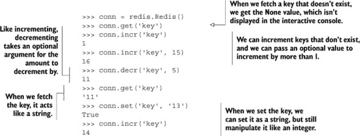

在阅读了其他章节之后，你可能注意到我们实际上只调用了`incr()`。在内部，Python Redis 库使用`INCRBY`调用，要么使用可选的第二个值，要么如果省略值为 1。截至本文撰写时，Python Redis 客户端库支持 Redis 2.6 的完整命令集，并通过`incrbyfloat()`方法提供`INCRBYFLOAT`支持，该方法与`incr()`的工作方式相同。

Redis 还提供了读取和写入字节字符串值部分的方法（整数和浮点值也可以像字节字符串一样访问，尽管这种用法相对不常见）。如果我们使用 Redis `STRING`值以高效的方式打包结构化数据，这可能很有用，我们将在第九章中讨论这一点。表 3.2 显示了可以用于在 Redis 中操作`STRING`的子字符串和单个位的某些方法。

##### 表 3.2\. Redis 可用的子字符串操作命令

| 命令 | 示例用法和描述 |
| --- | --- |
| APPEND | APPEND key-name value—将提供的值连接到给定键已存储的字符串上 |
| GETRANGE | GETRANGE key-name start end—获取子字符串，包括从起始偏移量到结束偏移量（包括）的所有字符 |
| SETRANGE | SETRANGE key-name offset value—将提供的偏移量开始的子字符串设置为给定的值 |
| GETBIT | GETBIT key-name offset—将字节字符串视为位字符串，并返回字符串在提供的位偏移量处的位值 |
| SETBIT | SETBIT key-name offset value—将字节字符串视为位字符串，并在提供的位偏移量处设置字符串中的位值 |
| BITCOUNT | BITCOUNT key-name [start end]—计算字符串中 1 位的数量，可选地从提供的字节偏移量开始和结束 |
| BITOP | BITOP 操作 dest-key key-name [key-name ...]—对提供的字符串执行位运算之一，AND、OR、XOR 或 NOT，并将结果存储在目标键中 |
|  |

##### `GETRANGE`和`SUBSTR`

在过去，`GETRANGE`被命名为`SUBSTR`，Python 客户端继续使用`substr()`方法名从字符串中获取范围。当使用 2.6 版本之后的 Redis 版本时，应使用`getrange()`方法，对于 2.6 版本之前的 Redis 版本，使用`substr()`。

|  |
| --- |

当使用`SETRANGE`和`SETBIT`写入字符串时，如果`STRING`之前不够长，Redis 将在更新和写入新数据之前自动用空字符扩展`STRING`。当使用`GETRANGE`读取`STRING`时，任何超出`STRING`末尾的数据请求都不会返回，但当使用`GETBIT`读取位时，任何超出`STRING`末尾的位都被视为零。在下面的列表中，你可以看到这些`STRING`操作命令的一些用法。

##### 列表 3.2\. 一个示例交互，展示了 Redis 中的子字符串和位操作

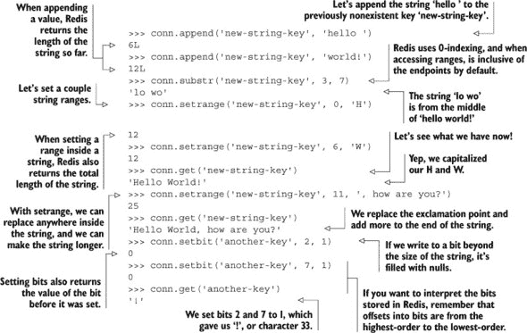

在许多其他键值数据库中，数据以纯字符串的形式存储，没有操作的机会。一些其他键值数据库允许您预拼接或后拼接字节，但 Redis 在其读取和写入子字符串的能力方面是独一无二的。在许多方面，即使 Redis 只提供 `STRING` 和这些字符串操作方法，Redis 也会比许多其他系统更强大；有创业精神的用户可以使用子字符串和位操作调用以及 `WATCH`/`MULTI`/`EXEC`（我们将在第 3.7.2 节中简要介绍，并在第四章中详细讨论）来构建任意数据结构。在第九章[kindle_split_021.html#ch09]，我们将讨论使用 `STRING` 存储一种可以大大减少某些情况下内存使用的简单映射类型。

经过一些努力，我们可以存储某些类型的序列，但我们能进行的操作种类有限。但如果我们使用 `LIST`，我们就有更广泛的命令和操作 `LIST` 项的方式。

### 3.2\. 列表

如您从第一章中可能记得，`LIST` 允许您从序列的两端推送和弹出项，获取单个项，并执行列表预期的一系列其他操作。`LIST` 本身非常适合用于保持工作项队列、最近查看的文章或最喜欢的联系人。

在本节中，我们将讨论 `LIST`，它存储了一个有序的 `STRING` 值序列。我们将介绍一些最常用的 `LIST` 操作命令，用于从 `LIST` 中推送和弹出项。阅读本节后，您将了解如何使用最常见的命令来操作 `LIST`。我们将首先查看表 3.3，在那里您可以查看一些最常用的 `LIST` 命令。

##### 表 3.3\. 一些常用的 `LIST` 命令

| 命令 | 示例用法和描述 |
| --- | --- |
| RPUSH | RPUSH key-name value [value ...]—将值（们）推送到列表的右侧 |
| LPUSH | LPUSH key-name value [value ...]—将值（们）推送到列表的左侧 |
| RPOP | RPOP key-name—从列表中移除并返回最右侧的项 |
| LPOP | LPOP key-name—从列表中移除并返回最左侧的项 |
| LINDEX | LINDEX key-name offset—返回给定偏移量的项 |
| LRANGE | LRANGE key-name start end—返回从 start 到 end 索引的列表项，包括 start 和 end |
| LTRIM | LTRIM key-name start end—修剪列表，只包含从 start 到 end 索引之间的项，包括 start 和 end |

`LIST` 推送命令的语义不应该令人惊讶，弹出命令也是如此。我们之前在第一章中介绍了一些这些命令，包括 `LINDEX` 和 `LRANGE`。下面的列表显示了这些推送和弹出命令的一些用法。

##### 列表 3.3\. Redis 中`LIST`推送和弹出命令的示例交互

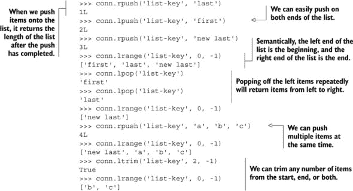

`LTRIM` 命令在本例中是新的，我们可以将其与 `LRANGE` 结合使用，以提供类似于 `LPOP` 或 `RPOP` 调用并一次性返回和弹出多个项目。我们将在本章后面更详细地讨论如何使这些类型的复合命令原子化^([1]), 以及在第四章（chapter 4）中深入探讨更高级的 Redis 风格事务。

> ¹ 在 Redis 中，当我们说一组命令是 *原子* 时，我们的意思是，在我们读取或更改相同数据时，没有其他客户端可以读取或更改数据。

在第一章（chapter 1）中我们没有介绍的一些 `LIST` 命令允许您将项目从一个列表移动到另一个列表，甚至可以在等待其他客户端向 `LIST`s 添加项目时阻塞。表 3.4 展示了我们的阻塞弹出和项目移动命令。

##### **表 3.4\. 一些用于阻塞 `LIST` 弹出和在 `LIST`s 之间移动项目的 `LIST` 命令**

| 命令 | 示例用途和描述 |
| --- | --- |
| |
| BLPOP | BLPOP key-name [key-name ...] timeout—从第一个非空列表的左侧弹出项目，或者等待超时秒数以获取项目 |
| BRPOP | BRPOP key-name [key-name ...] timeout—从第一个非空列表的右侧弹出项目，或者等待超时秒数以获取项目 |
| RPOPLPUSH | RPOPLPUSH source-key dest-key—从源列表的右侧弹出项目，并将其 LPUSH 到目标列表，同时也将项目返回给用户 |
| BRPOPLPUSH | BRPOPLPUSH source-key dest-key timeout—从源列表的右侧弹出项目，并将其 LPUSH 到目标列表，同时也将项目返回给用户，如果源列表为空，则等待超时 |

这组命令在我们讨论第六章（chapter 6）中的队列时特别有用。以下列表展示了使用 `BRPOPLPUSH` 在多个列表中移动项目以及使用 `BLPOP` 从多个列表中弹出项目的示例。

##### **列表 3.4\. Redis 中阻塞 `LIST` 弹出和移动命令**

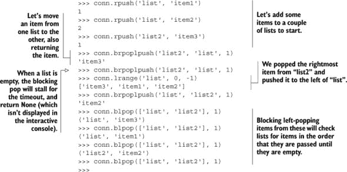

使用阻塞弹出命令以及弹出/推送组合命令的最常见用例是在消息传递和任务队列的开发中，我们将在第六章（chapter 6）中介绍。

| |
| --- |

**练习：使用 `LIST` 减少内存使用**

在 2.1 节和 2.5 节中，我们使用了`ZSET`s 来保存最近查看项目的列表。这些最近查看的项目包括时间戳作为分数，以便我们在清理或购买后进行数据分析。但是，包括这些时间戳会占用空间，如果时间戳对我们分析不是必需的，那么使用`ZSET`只是浪费空间。尝试用`LIST`s 替换`update_token()`中的`ZSET`s 的使用，同时保持相同的语义。提示：如果你发现自己陷入了困境，可以跳到 6.1.1 节以获得正确的方向。

|  |
| --- |

`LIST`s 的主要优点之一是它们可以包含多个字符串值，这可以让你将数据分组在一起。`SET`s 提供类似的功能，但有一个前提，即给定`SET`中的所有项目都是唯一的。让我们看看这如何改变我们可以用`SET`s 做什么。

### 3.3. 集合

你可以从第一章中回忆起，`SET`s 以无序方式存储独特的项目。你可以快速添加、删除并确定一个项目是否在`SET`中。`SET`s 的许多用途包括存储为文章投票的人以及属于特定组的文章，如第一章第一章中所示。

在本节中，我们将讨论一些最常用的操作`SET`s 的命令。你将了解在`SET`s 中插入、删除和移动成员的标准操作，以及执行集合交集、并集和差集的命令。完成本节后，你将更好地了解我们的搜索示例在第七章中是如何工作的。

让我们看一下表 3.5 来了解一些更常用的集合命令。

##### 表 3.5. 一些常用的`SET`命令

| 命令 | 示例用法和描述 |
| --- | --- |
| SADD | SADD key-name item [item ...]—将项目添加到集合中，并返回添加的项目数量，这些项目之前不存在 |
| SREM | SREM key-name item [item ...]—删除项目并返回被删除的项目数量 |
| SISMEMBER | SISMEMBER key-name item—返回项目是否在集合中 |
| SCARD | SCARD key-name—返回集合中的项目数量 |
| SMEMBERS | SMEMBERS key-name—以 Python 集合的形式返回集合中的所有项目 |
| SRANDMEMBER | SRANDMEMBER key-name [count]—从集合中返回一个或多个随机项目。当 count 为正数时，Redis 将返回 count 个不同的随机选择的项目，当 count 为负数时，Redis 将返回 count 个随机选择的项目，这些项目可能不是不同的。 |
| SPOP | SPOP key-name—从集合中随机删除并返回一个项目 |
| SMOVE | SMOVE source-key dest-key item—如果项目在源中，则从源中删除该项目并将其添加到目标，如果项目已移动则返回 |

其中一些命令在第一章（kindle_split_011.html#ch01）中应该已经熟悉，所以让我们跳到下一个列表，看看这些命令的实际应用。

##### 列表 3.5\. 显示 Redis 中一些常见`SET`命令的示例交互

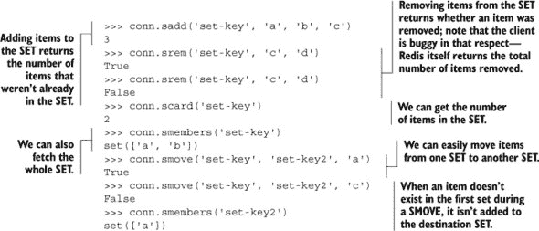

仅使用这些命令，我们可以跟踪独特的事件和项目，就像我们在第一章（kindle_split_011.html#ch01）中通过投票和文章组所做的那样。但`SET`的真正力量在于同时组合多个`SET`的命令。表 3.6 展示了你可以将多个`SET`相互关联的一些方式。

##### 表 3.6\. Redis 中组合和操作`SET`的操作

| 命令 | 示例用途和描述 |
| --- | --- |
| SDIFF | SDIFF key-name [key-name ...]—返回第一个 SET 中不在任何其他 SET 中的项目（数学集合差集操作） |
| SDIFFSTORE | SDIFFSTORE dest-key key-name [key-name ...]—将第一个 SET 中不在其他任何 SET 中的项目存储到 dest-key（数学集合差集操作） |
| SINTER | SINTER key-name [key-name ...]—返回所有 SET 中都存在的项目（数学集合交集操作） |
| SINTERSTORE | SINTERSTORE dest-key key-name [key-name ...]—将所有 SET 中都存在的项目存储到 dest-key（数学集合交集操作） |
| SUNION | SUNION key-name [key-name ...]—返回至少在一个 SET 中的项目（数学集合并集操作） |
| SUNIONSTORE | SUNIONSTORE dest-key key-name [key-name ...]—将至少在一个 SET 中的项目存储到 dest-key（数学集合并集操作） |

这组命令是三个基本的`SET`操作，既有“返回结果”版本，也有“存储结果”版本。让我们看看这些命令能做什么的一个示例。

##### 列表 3.6\. 显示 Redis 中`SET`差集、交集和并集的示例交互

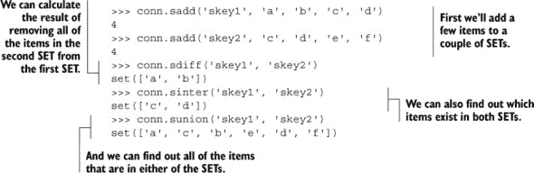

如果你与 Python 集合进行比较，Redis 的`SET`提供了许多相同的语义和功能，但可以远程提供给可能许多客户端。我们将在第七章（kindle_split_018.html#ch07）中更深入地探讨`SET`的能力，在那里我们将使用它们构建一种搜索引擎。

接下来，我们将讨论操作`HASH`的命令，这些命令允许我们将相关的键和值组合在一起，以便于检索和更新。

### 3.4\. 哈希表

如第一章（kindle_split_011.html#ch01）中所述，Redis 中的`HASH`允许你在单个高级 Redis 键中存储键值对组。功能上，这些值提供了与`STRING`中的值类似的一些功能，并且可以用来将相关数据分组在一起。这种数据分组可以被视为类似于关系数据库中的一行或文档存储中的一个文档。

在本节中，我们将讨论最常用的操作 `HASH` 的命令。您将了解更多关于向 `HASH` 中添加和删除键值对的操作，以及获取所有 `HASH` 内容的命令，以及增加或减少值的能力。完成本节后，您将更好地理解将数据存储在 `HASH` 中的有用性以及如何这样做。查看 表 3.7 以了解一些常用的 `HASH` 命令。

##### 表 3.7\. 向 `HASH` 中添加和删除项的操作

| 命令 | 示例使用和描述 |
| --- | --- |
| HMGET | HMGET key-name key [key ...]—从 HASH 中获取字段的值 |
| HMSET | HMSET key-name key value [key value ...]—设置 HASH 中字段的值 |
| HDEL | HDEL key-name key [key ...]—从 HASH 中删除键值对，返回找到并删除的对的数量 |
| HLEN | HLEN key-name—返回 HASH 中的键值对数量 |

其中一些命令可能来自 第一章，但我们有一些新的命令用于同时获取和设置多个键。这些批量命令主要是为了方便，并通过减少客户端和 Redis 之间的调用和往返次数来提高 Redis 的性能。查看下一个列表以查看其中的一些命令。

##### 列表 3.7\. 显示 Redis 中一些常见 `HASH` 命令的示例交互

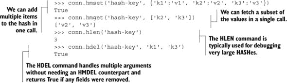

`HMGET`/`HMSET` 命令与我们在 第一章 中介绍的单一参数版本类似，只是它们接受列表或字典作为参数，而不是单个条目。

表 3.8 展示了一些其他批量命令以及 `HASH` 上的更多类似 `STRING` 的操作。

##### 表 3.8\. `HASH` 上的更多批量操作和类似 `STRING` 的调用

| 命令 | 示例使用和描述 |
| --- | --- |
| HEXISTS | HEXISTS key-name key—返回给定键是否存在于 HASH 中 |
| HKEYS | HKEYS key-name—从 HASH 中获取键 |
| HVALS | HVALS key-name—从 HASH 中获取值 |
| HGETALL | HGETALL key-name—从 HASH 中获取所有键值对 |
| HINCRBY | HINCRBY key-name key increment—将给定键存储的值增加整数增量 |
| HINCRBYFLOAT | HINCRBYFLOAT key-name key increment—将给定键存储的值增加浮点增量 |

随着 `HGETALL` 的可用性，`HKEYS` 和 `HVALUES` 可能看起来不那么有用，但当你预期你的值很大时，你可以获取键，然后逐个获取值，以避免阻塞其他请求。`HINCRBY` 和 `HINCRBYFLOAT` 应该会让你想起在 `STRING` 键上可用的 `INCRBY` 和 `INCRBYFLOAT` 操作，并且它们具有相同的语义，应用于 `HASH` 值。让我们在下一个列表中查看一些这些命令的使用示例。

##### 列表 3.8\. 一个展示 Redis `HASH`的高级功能的示例交互

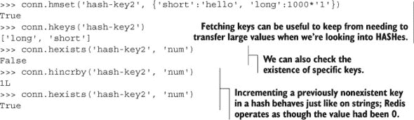

如我们之前所述，当面对`HASH`中的大值时，我们可以获取键，并且只获取我们感兴趣的值，以减少传输的数据量。我们还可以执行键检查，就像我们可以在`SET`上使用`SISMEMBER`执行成员检查一样。在第一章中，我们使用了`HINCRBY`来跟踪文章收到的投票数，这正是我们刚刚回顾的内容。

让我们看看在接下来的章节中我们将非常频繁使用的一种结构：排序集合。

### 3.5\. 排序集合

`ZSET`提供了将成员映射到分数的能力（类似于`HASH`的键和值）。这些映射允许我们操作数值分数，^([2])并根据分数的排序顺序检索和扫描成员和分数。在第一章中，我们展示了使用`ZSET`根据时间和收到的点赞数对提交的文章进行排序的简短示例，在第二章中，我们有一个使用`ZSET`处理旧 cookie 过期示例。

> ² 分数实际上以 IEEE 754 浮点双精度格式存储在 Redis 中。

在本节中，我们将讨论操作`ZSET`的命令。您将学习如何在`ZSET`中添加和更新项目，以及如何使用`ZSET`的交集和并集命令。完成本节后，您将更清楚地了解`ZSET`的工作原理，这将帮助您更好地理解我们在第一章中对其所做的工作，以及我们将在第五章、第六章和第七章中使用它们的方式。

让我们看看表 3.9 中的一些常用`ZSET`命令。

##### 表 3.9\. 一些常见的`ZSET`命令

| 命令 | 示例用法和描述 |
| --- | --- |
| ZADD | ZADD key-name score member [score member ...]—将具有给定分数的成员添加到 ZSET 中 |
| ZREM | ZREM key-name member [member ...]—从 ZSET 中删除成员，返回被删除成员的数量 |
| ZCARD | ZCARD key-name—返回 ZSET 中的成员数量 |
| ZINCRBY | ZINCRBY key-name increment member—在 ZSET 中对指定成员的分数进行增量操作 |
| ZCOUNT | ZCOUNT key-name min max—返回分数介于 min 和 max 之间的成员数量 |
| ZRANK | ZRANK key-name member—返回给定成员在 ZSET 中的位置 |
| ZSCORE | ZSCORE key-name member—返回 ZSET 中成员的分数 |
| ZRANGE | ZRANGE key-name start stop [WITHSCORES]—返回排名在 start 和 stop 之间的成员，以及可选的分数 |

我们在 1 和 2 章节中使用了一些这些命令，所以它们应该已经对你很熟悉了。让我们快速回顾一下我们的一些命令的使用。

##### 列表 3.9\. 显示 Redis 中一些常见 `ZSET` 命令的示例交互

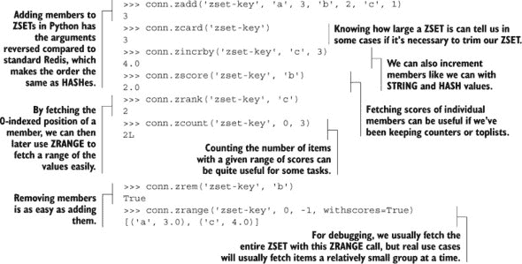

你可能还记得我们在第 1 和 2 章节中提到的 `ZADD`, `ZREM`, `ZINCRBY`, `ZSCORE`, 和 `ZRANGE` 命令，因此它们的语义应该不会让你感到意外。`ZCOUNT` 命令与其他命令略有不同，主要是为了让你能够发现分数在提供的最小和最大分数之间的值的数量。

表 3.10 展示了 Redis 中一些你可能会发现很有用的 `ZSET` 命令。

##### 表 3.10\. 从 `ZSET` 中获取和删除数据范围以及提供类似 `SET` 的交集的命令

| 命令 | 示例使用和描述 |
| --- | --- |
| ZREVRANK | ZREVRANK key-name member—返回成员在 ZSET 中的位置，成员按逆序排列 |
| ZREVRANGE | ZREVRANGE key-name start stop [WITHSCORES]—通过排名从 ZSET 中获取指定的成员，成员按逆序排列 |
| ZRANGEBYSCORE | ZRANGEBYSCORE key min max [WITHSCORES] [LIMIT offset count]—获取 min 和 max 之间的成员 |
| ZREVRANGEBYSCORE | ZREVRANGEBYSCORE key max min [WITHSCORES] [LIMIT offset count]—按逆序获取 min 和 max 之间的成员 |
| ZREMRANGEBYRANK | ZREMRANGEBYRANK key-name start stop—从 ZSET 中删除排名在 start 和 stop 之间的项目 |
| ZREMRANGEBYSCORE | ZREMRANGEBYSCORE key-name min max—从 ZSET 中删除分数在 min 和 max 之间的项目 |
| ZINTERSTORE | ZINTERSTORE dest-key key-count key [key ...] [WEIGHTS weight [weight ...]] [AGGREGATE SUM | MIN | MAX]—执行提供的 ZSET 的类似 SET 的交集操作 |
| ZUNIONSTORE | ZUNIONSTORE dest-key key-count key [key ...] [WEIGHTS weight [weight ...]] [AGGREGATE SUM | MIN | MAX]—执行提供的 ZSET 的类似 SET 的并集操作 |

这是你第一次看到这些命令中的几个。如果一些 `ZREV*` 命令让你感到困惑，请记住，它们的工作方式与它们的非逆序对应命令相同，只是 `ZSET` 的行为就像它是逆序排列的（按分数从高到低排序）。你可以在下一列表中看到它们的一些使用示例。

##### 列表 3.10\. 显示 `ZINTERSTORE` 和 `ZUNIONSTORE` 的示例交互

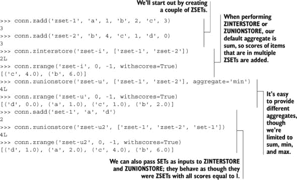

`ZSET` 的并集和交集一开始可能难以理解，所以让我们看看一些图示，展示在交集和并集过程中发生的情况。图 3.1 展示了两个 `ZSET` 的交集和最终的 `ZSET` 结果。在这种情况下，我们的聚合是默认的 `sum`，所以分数是相加的。

##### 图 3.1\. 调用`conn.zinterstore('zset-i', ['zset-1', 'zset-2'])`时会发生什么；存在于 zset-1 和 zset-2 中的元素会被相加得到 zset-i

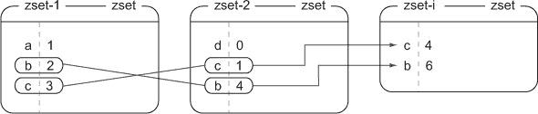

与交集不同，当我们执行并集操作时，至少存在于一个输入`ZSET`中的项目会被包含在输出中。图 3.2 显示了使用不同的聚合函数`min`执行并集操作的结果，如果成员在多个输入`ZSET`中，则取最小分数。

##### 图 3.2\. 调用`conn.zunionstore('zset-u', ['zset-1', 'zset-2'], aggregate='min')`时会发生什么；存在于 zset-1 或 zset-2 中的元素与`最小`函数结合得到 zset-u

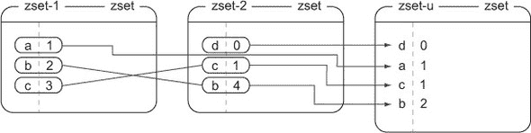

在第一章中，我们使用了可以将`SET`作为`ZSET`并集和交集操作一部分的事实。这个特性允许我们轻松地在不将评分和插入时间传播到额外的`ZSET`的情况下添加和删除文章。显示了将两个`ZSET`和一个`SET`组合起来产生最终`ZSET`的`ZUNIONSTORE`调用。

##### 图 3.3\. 调用`conn.zunionstore('zset-u2', ['zset-1', 'zset-2', 'set-1'])`时会发生什么；存在于 zset-1、zset-2 或 set-1 中的元素通过相加组合得到 zset-u2

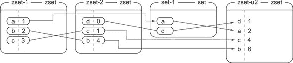

在第七章中，我们将使用`ZINTERSTORE`和`ZUNIONSTORE`作为几种不同类型搜索的一部分。我们还将讨论几种不同的方法来结合`ZSET`分数与可选的`WEIGHTS`参数，以进一步扩展可以使用`SET`和`ZSET`解决的问题类型。

在开发应用程序时，你可能已经遇到了一种称为发布/订阅的模式，也称为*pub/sub*。Redis 包含了这个功能，我们将在下一节中介绍。

### 3.6\. 发布/订阅

如果你因为记不起阅读过关于发布或订阅的内容而感到困惑，请不要担心——这是我们第一次讨论它。通常，发布/订阅的概念，也称为 pub/sub，其特点是听众*订阅*频道，发布者向频道发送二进制字符串消息。任何正在监听特定频道的听众都会在连接并监听时接收到发送到该频道的所有消息。你可以将其想象成一个广播电台，订阅者可以同时收听多个电台，发布者可以在任何电台发送消息。

在本节中，我们将讨论和使用涉及发布和订阅的操作。完成本节后，你将知道如何使用这些命令，以及为什么在后面的章节中我们会使用其他类似解决方案。

在 Redis 中，通过使用表 3.11 中显示的五个命令集合来包含 pub/sub 概念。

##### 表 3.11\. Redis 中处理 pub/sub 的命令

| 命令 | 示例用法和描述 |
| --- | --- |
| 订阅 | 订阅频道 [频道 ...]—订阅给定的频道 |
| 取消订阅 | 取消订阅 [频道 [频道 ...]]—取消订阅提供的频道，如果没有提供频道则取消订阅所有频道 |
| PUBLISH | PUBLISH 频道 消息—向给定的频道发布消息 |
| PSUBSCRIBE | PSUBSCRIBE 模式 [模式 ...]—订阅发送到匹配给定模式的频道的消息 |
| PUNSUBSCRIBE | PUNSUBSCRIBE [模式 [模式 ...]]—取消订阅提供的模式，如果没有提供模式则取消订阅所有已订阅的模式 |

在 Python 端实现 `PUBLISH` 和 `SUBSCRIBE` 命令的方式中，如果我们使用一个辅助线程来处理 `PUBLISH`，那么演示这个特性会更容易。你可以在下一列表中看到一个 `PUBLISH`/`SUBSCRIBE` 的例子.^([3])

> ³ 如果你想亲自运行此代码，你可以：我在本章的源代码中包含了 `publisher()` 和 `run_pubsub()` 函数。

##### 列表 3.11\. 在 Redis 中使用 `PUBLISH` 和 `SUBSCRIBE`

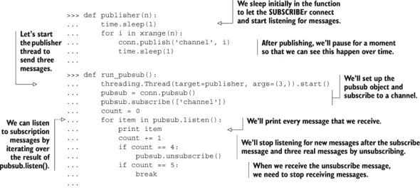

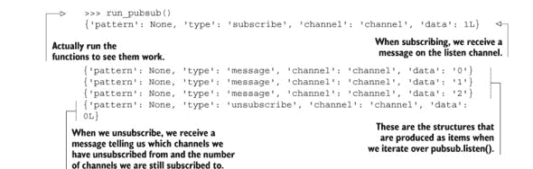

发布/订阅模式和其在 Redis 中的实现可能很有用。如果你跳过并浏览其他章节，你会注意到我们只在另一个部分使用发布/订阅，第 8.5 节。如果 `PUBLISH` 和 `SUBSCRIBE` 是如此有用，为什么我们不用得很多？有两个原因。

一个原因是由于 Redis 系统的可靠性。在 Redis 的旧版本中，如果一个客户端订阅了频道但未能足够快地读取发送的消息，这可能导致 Redis 本身保持一个很大的输出缓冲区。如果这个输出缓冲区变得过大，可能会导致 Redis 迅速减慢或崩溃，可能导致操作系统杀死 Redis，甚至可能导致操作系统本身变得不可用。Redis 的现代版本没有这个问题，并且会断开无法跟上 `client-output-buffer-limit pubsub` 配置选项（我们将在第八章中讨论）的已订阅客户端。

第二个原因是数据传输的可靠性。在任何网络化系统中，你必须假设你的连接可能在某个时刻失败。通常，这通过任一方的重新连接来处理，作为连接错误的结果。我们的 Python Redis 客户端通常会通过在失败时自动重新连接、自动处理连接池（我们将在第四章中更多地讨论这一点）以及更多来很好地处理连接问题。但在已订阅的客户端的情况下，如果客户端断开连接，并且在它重新连接之前发送了消息，客户端将永远看不到这条消息。当你依赖于通过频道接收消息时，Redis 中 `PUBLISH`/`SUBSCRIBE` 的语义可能会让你失望。

正是因为这两个原因，我们在 第六章 中编写了两种不同的方法来处理可靠的消息传递，这种方法在面对网络断开连接的情况下也能工作，并且不会导致 Redis 内存增长（即使在 Redis 的旧版本中），除非你希望它增长。

如果你喜欢使用 `PUBLISH`/`SUBSCRIBE` 的简单性，并且可以接受可能会丢失一些数据的风险，那么你可以自由地使用 pub/sub 而不是我们的方法，就像我们在 第 8.5 节 中做的那样；只是记得在开始之前合理地配置 `client-output-buffer-limit pubsub`。

到目前为止，我们已经介绍了你将定期使用的与单个数据类型相关的多数命令。还有一些你可能会使用的其他命令，它们不适合我们那五种结构加 pub/sub 的主题。

### 3.7\. 其他命令

到目前为止，我们已经介绍了 Redis 提供的五种结构，以及展示了一些 pub/sub 的内容。本节中的命令是操作多种类型数据的命令。我们首先介绍 `SORT`，它可以同时涉及 `STRING`s、`SET`s、`LIST`s 和 `HASH`es。然后，我们将介绍使用 `MULTI` 和 `EXEC` 的基本事务，这可以让你像执行一个命令一样一起执行多个命令。最后，我们将介绍各种自动过期命令，用于自动删除不必要的数据。

在阅读本节之后，你应该对如何同时组合和操作多种数据类型有了更好的了解。

#### 3.7.1\. 排序

在 Redis 中的排序与其他语言的排序类似：我们希望对一系列项目进行排序，根据元素之间的比较来排列它们。`SORT` 命令允许我们根据存储在 `STRING` 键中的 `LIST`/`SET`/`ZSET` 数据来排序 `LIST`s、`SET`s 和 `ZSET`s，甚至可以排序存储在 `HASH` 中的数据。如果你来自关系型数据库的背景，你可以将 `SORT` 视为类似于 SQL 语句中的 `order by` 子句，它可以引用其他行和表。表 3.12 展示了 `SORT` 命令的定义。

##### 表 3.12\. `SORT` 命令定义

| Command | 示例使用和描述 |
| --- | --- |
| SORT | SORT source-key [BY pattern] [LIMIT offset count] [GET pattern [GET pattern ...]] [ASC | DESC] [ALPHA] [STORE dest-key]—根据提供的选项对输入的 LIST、SET 或 ZSET 进行排序，并返回或存储结果 |

`SORT` 的一些更基本选项包括能够以降序而不是默认的升序对结果进行排序，将项目视为数字，将项目视为二进制字符串进行比较（字符串 `'110'` 和 `'12'` 的排序顺序与数字 110 和 12 的排序顺序不同），根据原始序列中未包含的值进行排序，甚至可以检索输入 `LIST`、`SET` 或 `ZSET` 之外的值。

您可以在 列表 3.12 中看到一些使用 `SORT` 的示例。列表的前几行显示了初始数据的添加和基本排序（按数值和字符串顺序）。其余部分显示了如何使用特殊语法将数据存储到要排序的，以及/或从 `HASH` 中检索的内部。

##### 列表 3.12\. 显示 `SORT` 一些使用的示例交互

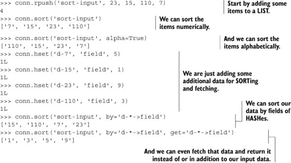

排序可以用来排序 `LIST`s，但它也可以排序 `SET`s，将结果转换为 `LIST`。在这个例子中，我们按字符逐个排序数字（通过 `alpha` 关键字参数），我们根据外部数据排序了一些项目，甚至能够获取外部数据返回。当与 `SET` 的交集、并集和差集操作以及在外部 `HASH` 中存储数据相结合时，`SORT` 是一个强大的命令。我们将在第七章（kindle_split_018.html#ch07）中花时间讨论如何将 `SET` 操作与 `SORT` 结合使用。

虽然 `SORT` 是唯一一个可以同时操作三种数据类型的命令，但基本的 Redis 事务可以通过一系列命令让您在不被打断的情况下操作多种数据类型。

#### 3.7.2\. 基本 Redis 事务

有时我们需要多次调用 Redis 来同时操作多个结构。尽管有一些命令可以复制或移动键之间的项目，但没有一个命令可以移动不同类型之间的项目（尽管您可以使用 `ZUNIONSTORE` 从 `SET` 复制到 `ZSET`）。对于涉及多个键（相同或不同类型）的操作，Redis 有五个命令可以帮助我们在不中断的情况下操作多个键：`WATCH`、`MULTI`、`EXEC`、`UNWATCH` 和 `DISCARD`。

现在，我们只讨论 Redis 事务的最简单版本，它使用 `MULTI` 和 `EXEC`。如果您想看使用 `WATCH`、`MULTI`、`EXEC` 和 `UNWATCH` 的示例，可以跳到第 4.4 节（kindle_split_015.html#ch04lev1sec4），在那里我解释了为什么需要在使用 `MULTI` 和 `EXEC` 时使用 `WATCH` 和 `UNWATCH`。

##### Redis 中的基本事务是什么？

在 Redis 中，涉及 `MULTI` 和 `EXEC` 的基本事务旨在为单个客户端提供执行多个命令 A、B、C、... 的机会，而其他客户端无法中断它们。这不同于关系型数据库事务，它可以部分执行，然后回滚或提交。在 Redis 中，作为基本 `MULTI`/`EXEC` 事务一部分传递的每个命令都会依次执行，直到完成。完成之后，其他客户端可以执行它们的命令。

要在 Redis 中执行事务，我们首先调用`MULTI`，然后是任何我们打算执行的命令序列，最后调用`EXEC`。当看到`MULTI`时，Redis 将排队等待来自同一连接的命令，直到它看到`EXEC`，此时 Redis 将顺序执行排队的命令，而不会中断。从语义上讲，我们的 Python 库通过使用所谓的*管道*来处理这个问题。在连接对象上调用`pipeline()`方法将创建一个事务，如果使用得当，它将自动将一系列命令用`MULTI`和`EXEC`包裹起来。顺便提一下，Python Redis 客户端也会存储要发送的命令，直到我们真正想要发送它们。这减少了 Redis 和客户端之间的往返次数，可以提高一系列命令的性能。

与`PUBLISH`和`SUBSCRIBE`的情况一样，通过使用线程来演示使用事务的结果是最简单的方法。在下一个列表中，你可以看到在没有事务的情况下并行增加操作的结果。

##### 列表 3.13\. 在并行执行期间没有事务可能发生的情况

|  |

没有事务的情况下，三个线程中的每一个都能在减量操作到来之前增加`notrans:`计数器。我们在这里通过包含一个 100 毫秒的休眠来夸大潜在的问题，但如果我们需要在没有其他命令干扰的情况下执行这两个调用，我们就会遇到问题。下面的列表显示了使用事务执行这些相同操作的结果。

##### 列表 3.14\. 在并行执行期间使用事务可能发生的情况

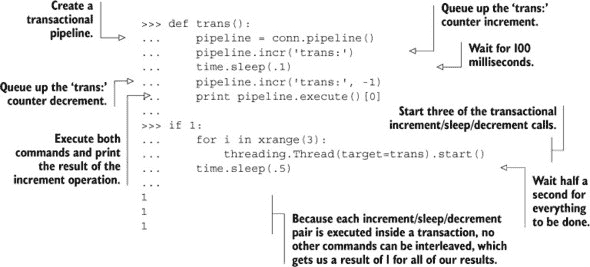

如你所见，通过使用事务，每个线程都能够在其没有其他线程干扰的情况下执行其整个命令序列，尽管这两个调用之间存在延迟。再次强调，这是因为 Redis 会等待在`MULTI`和`EXEC`之间执行所有提供的命令，直到所有命令都已接收并跟随一个`EXEC`。

使用事务既有好处也有坏处，我们将在第 4.4 节中进一步讨论。

|  |
| --- |

**练习：移除竞争条件**

`MULTI`/`EXEC`事务的主要目的之一是移除所谓的*竞争条件*，这在列表 3.13 中已经暴露出来。结果是，第一章中的`article_vote()`函数有一个竞争条件和一个相关的第二个错误。竞争条件可能导致内存泄漏，而错误可能导致投票计数不正确。它们发生的可能性非常小，但你能否找到并修复它们？提示：如果你在寻找内存泄漏方面有困难，请在查阅`post_article()`函数时查看第 6.2.5 节。

|  |
| --- |
|  |

**练习：提高性能**

在 Redis 中使用管道的次要目的是提高性能（我们将在第 4.4–4.6 节中更多地讨论这一点）。特别是，通过减少在一系列命令中 Redis 和我们的客户端之间的往返次数，我们可以显著减少客户端等待响应的时间。在我们定义在第一章中的`get_articles()`函数中，实际上会有 26 次 Redis 和客户端之间的往返来获取一整页的文章。这是浪费。你能修改`get_articles()`使其只进行两次往返吗？

| |
| --- |

当向 Redis 写入数据时，有时数据只会在短时间内有用。我们可以在时间过去后手动删除这些数据，或者我们可以让 Redis 自动通过使用键过期来删除数据。

#### 3.7.3\. 过期键

当将数据写入 Redis 时，可能会有数据不再需要的情况。我们可以使用`DEL`显式地删除数据，或者如果我们想在指定超时后删除整个键，我们可以使用所谓的*过期时间*。当我们说一个键有*生存时间*，或者它将在给定时间*过期*时，我们的意思是当它的过期时间到达时，Redis 将自动删除该键。

拥有将在一定时间后过期的键可以用来处理缓存数据的清理。如果你查看其他章节，你不会经常看到 Redis 中键过期的使用（除了在第 6.2、7.1 和 7.2 节中）。这主要是因为使用的结构类型；我们使用的命令中很少有能够自动设置键过期时间的。而且对于容器（`LIST`s、`SET`s、`HASH`es 和`ZSET`s），我们只能使整个键过期，而不能使单个项目过期（这也是为什么我们在一些地方使用带时间戳的`ZSET`s）。

在本节中，我们将介绍用于在指定超时后或指定时间自动过期和删除 Redis 中键的命令。阅读本节后，你将能够使用过期时间来保持 Redis 内存使用率低，并清理不再需要的数据。

表 3.13 展示了我们用来设置和检查 Redis 中键的过期时间的命令列表。

##### 表 3.13\. Redis 中处理过期的命令

| 命令 | 示例用途和描述 |
| --- | --- |
| --- | --- |
| PERSIST | PERSIST key-name—从键中移除过期时间 |
| TTL | TTL key-name—返回键过期前剩余的时间 |
| EXPIRE | EXPIRE key-name seconds—将键设置为在给定秒数后过期 |
| EXPIREAT | EXPIREAT key-name timestamp—将过期时间设置为给定的 Unix 时间戳 |
| PTTL | PTTL key-name—返回键将在多少毫秒后过期（自 Redis 2.6 及以后版本可用） |
| PEXPIRE | PEXPIRE key-name milliseconds—将键设置为在给定数量的毫秒后过期（自 Redis 2.6 及以后版本可用） |
| PEXPIREAT | PEXPIREAT key-name timestamp-milliseconds—将过期时间设置为给定的以毫秒为单位的 Unix 时间戳（自 Redis 2.6 及以后版本可用） |

您可以在下一个列表中看到一些在键上使用过期时间的示例。

##### 列表 3.15\. 一个示例交互，展示了在 Redis 中使用与过期相关的命令

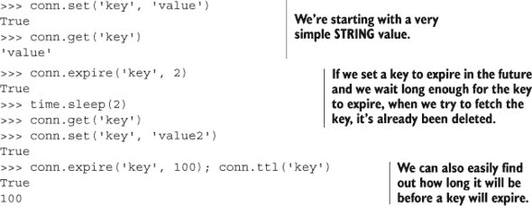

|  |
| --- |

**练习：用 `EXPIRE` 替换时间戳 `ZSET`**

在 2.1 节、2.2 节 和 2.5 节 中，我们使用带时间戳的 `ZSET` 来保存会话 ID 的列表以进行清理。通过使用这个 `ZSET`，我们可以在清理会话时可选地对我们的事项进行数据分析。但如果我们对分析不感兴趣，我们可以通过过期来获得类似的语义，而不需要清理函数。您能否更新 `update_token()` 和 `add_to_cart()` 函数，使键过期而不是使用“最近”的 `ZSET` 和清理函数？

|  |
| --- |

### 3.8\. 摘要

在本章中，我们查看了一些通常应该涵盖您在 Redis 中至少 95%的命令使用情况的命令。我们从每种不同的数据类型开始，然后讨论了 `PUBLISH` 和 `SUBSCRIBE`，接着是 `SORT`、`MULTI`/`EXEC` 事务和键过期。

如果您应该从本章中学到一件事，那就是可以使用各种命令以多种方式操作 Redis 结构。尽管本章介绍了 70 多个最重要的命令，但还有更多命令被列出并描述在 [`redis.io/commands`](http://redis.io/commands)。

如果您应该从本章中得到的第二件事，那就是我有时并不能为每个问题提供完美的答案。在回顾一些我们在练习中来自 第一章 和 第二章 的例子（其答案可在可下载的源代码中查看）时，我给了您一个机会来尝试改进我们已有的相当不错的答案，或者使它们更适合您的问题。

本章未涵盖的一组大量命令是与配置相关的命令。在下一章中，我们将配置 Redis 以确保您的数据保持健康，并提供有关如何确保 Redis 性能良好的指南。

## 第四章\. 保持数据安全并确保性能

*本章涵盖*

+   将数据持久化到磁盘

+   将数据复制到其他机器

+   处理系统故障

+   Redis 事务

+   非事务性管道

+   诊断性能问题

在过去的几章中，您已经了解了 Redis 中可用的各种命令以及它们如何操作结构，您甚至使用 Redis 解决了一些问题。本章将通过向您展示如何在系统故障的情况下保持数据安全，为您准备使用 Redis 构建真实软件，同时我会指出您可以用来提高 Redis 性能并保持数据完整性的方法。

我们将首先探索您可用于将数据存储在磁盘上的各种 Redis 持久化选项。然后，我们将讨论使用复制来在额外的机器上保持数据的最新副本，以实现性能和数据可靠性。结合复制和持久化，我们将讨论您可能需要做出的权衡，并演示一些选择持久化和复制选项以适应您需求的示例。然后，我们将讨论 Redis 事务和管道，并以讨论如何诊断一些性能问题结束本章。

在我们阅读本章的过程中，我们的重点是了解 Redis 的工作原理，以便我们首先确保我们的数据是正确的，然后努力使我们的数据操作变得快速。

首先，让我们看看 Redis 如何将我们的信息存储在磁盘上，以便在重启后它仍然存在。

### 4.1. 持久化选项

在 Redis 中，有两种不同的方法将数据持久化到磁盘。一种被称为*快照*的方法，它将某一时刻存在的数据写入磁盘。另一种方法被称为*AOF*，或*追加文件*，它通过将发生的写入命令复制到磁盘来实现。在某些情况下，这些方法可以一起使用，单独使用，或者根本不使用。选择哪种方法将取决于您的数据和应用程序。

您想要将内存中的数据存储在磁盘上的一个主要原因是，以便以后使用，或者以防故障，您可以将它备份到远程位置。此外，存储在 Redis 中的数据可能已经花费了很长时间进行计算，或者可能正处于计算过程中，您可能希望在以后能够访问它而无需再次计算。对于某些 Redis 用途，“计算”可能只是将数据从另一个数据库复制到 Redis 的行为（如 2.4 节中所述），但对于其他用途，Redis 可能存储来自数十亿日志行的聚合分析数据。

两种不同的配置选项组控制着 Redis 如何将数据写入磁盘。所有这些配置选项及其示例配置值可以在以下列表中看到。我们将在 4.1.1 节和 4.1.2 节中更具体地讨论它们，但就目前而言，我们将仅查看这些选项，以便您能熟悉它们。

##### 列表 4.1. Redis 中可用的持久化配置选项


正如你在列表 4.1 中看到的，前几个选项处理基本的快照功能，比如在磁盘上命名快照，多久执行一次自动快照，是否压缩快照，以及是否在失败时继续接受写入。第二组选项配置 AOF 子系统，告诉 Redis 是否使用它，多久同步一次写入到磁盘，是否在 AOF 压缩期间同步，以及多久压缩一次 AOF。在下一节中，我们将讨论使用快照来保护我们的数据安全。

#### 4.1.1\. 使用快照持久化到磁盘

在 Redis 中，我们可以通过创建快照来创建内存数据的点时间副本。创建后，这些快照可以被备份，复制到其他服务器以创建服务器的克隆，或者保留以供将来重启使用。

在配置的配置方面，快照被写入配置中引用的`dbfilename`文件，并存储在引用的`dir`路径中。在执行下一个快照之前，如果由于 Redis、系统或硬件故障导致崩溃，自上次快照开始（并完成）以来写入 Redis 的数据将会丢失。

例如，假设我们有一个 Redis 实例正在运行，当前内存中有 10GB 的数据。之前的一个快照在下午 2:35 开始并完成。现在在下午 3:06 开始了一个快照，并在下午 3:08 快照完成之前更新了 35 个键。如果系统在下午 3:06 和下午 3:08 之间崩溃，阻止 Redis 完成快照操作，那么从下午 2:35 到现在写入的所有数据将会丢失。但如果系统在快照完成后立即崩溃，那么只会丢失那 35 个键的更新。

有五种方法可以启动快照，如下所示：

+   任何 Redis 客户端都可以通过调用`BGSAVE`命令来启动快照。在支持`BGSAVE`的平台（基本上是除了 Windows 以外的所有平台）上，Redis 将**分叉**，^([1]), 子进程将快照写入磁盘，而父进程继续响应命令。

    > ¹ 当一个进程分叉时，底层操作系统会复制该进程。在 Unix 和 Unix-like 系统上，复制过程被优化，使得最初，所有内存都在父进程和子进程之间共享。当父进程或子进程写入内存时，该内存将停止共享。

+   Redis 客户端也可以通过调用`SAVE`命令来启动快照，这将导致 Redis 停止响应任何/所有命令，直到快照完成。这个命令并不常用，除非我们需要磁盘上的数据，并且我们愿意等待其完成，或者我们没有足够的内存来执行`BGSAVE`。

+   如果 Redis 配置了 `save` 行，例如 `save 60 10000`，Redis 将在自上次成功保存开始后的 60 秒内发生 10,000 次写入时自动触发一个 `BGSAVE` 操作（使用所描述的配置选项）。当存在多个 `save` 行时，只要其中一个规则匹配，就会触发一个 `BGSAVE`。

+   当 Redis 通过 `SHUTDOWN` 命令收到关闭请求，或者它收到标准的 `TERM` 信号时，Redis 将执行 `SAVE`，阻止客户端执行任何进一步的命令，然后关闭。

+   如果一个 Redis 服务器连接到另一个 Redis 服务器并发出 `SYNC` 命令以开始复制，如果主 Redis 服务器尚未执行或最近已完成 `BGSAVE` 操作，它将启动一个 `BGSAVE` 操作。有关复制的更多信息，请参阅第 4.2 节。

当仅使用快照来保存数据时，你必须记住，如果发生崩溃，你将丢失自上次快照以来更改的任何数据。对于某些应用程序，这种损失是不可接受的，你应该考虑使用描述在第 4.1.2 节中的仅追加文件持久性。但是，如果你的应用程序可以接受数据损失，快照可能是正确的答案。让我们看看一些场景以及你可能想要如何配置 Redis 以获得所需的快照持久性行为。

##### 开发

对于我的个人开发服务器，我主要关注最小化快照的开销。为此，并且因为我通常信任我的硬件，我只有一个规则：`save 900 1`。`save` 选项告诉 Redis 应根据后续的两个值执行 `BGSAVE` 操作。在这种情况下，如果自上次 `BGSAVE` 以来至少 900 秒（15 分钟）内至少发生了一次写入，Redis 将自动启动一个新的 `BGSAVE`。

如果你计划在生产服务器上使用快照，并且你将存储大量数据，你将想要尝试使用相同或类似硬件、相同的 `save` 选项、类似的数据集和类似的预期负载运行一个开发服务器。通过设置一个与你在生产中运行的环境等效的环境，你可以确保你不会过于频繁地快照（浪费资源）或过于不频繁（使自己面临数据损失的风险）。

##### 日志聚合

在聚合日志文件和分析页面浏览量的情况下，我们实际上只需要问自己，如果两次转储之间发生崩溃，我们愿意丢失多少时间。如果我们对丢失最多一小时的工具有所容忍，那么我们可以使用 `save 3600 1`（一小时有 3600 秒）。但是，如果我们正在处理日志，我们如何恢复呢？

为了从数据丢失中恢复，我们首先需要知道我们最初失去了什么。为了知道我们失去了什么，我们需要在处理日志时记录我们的进度。让我们想象一下，我们有一个函数，当新的日志准备好处理时会被调用。这个函数提供了一个 Redis 连接，一个指向存储日志文件的路径，以及一个回调，该回调将处理日志文件中的单个行。有了我们的函数，我们可以在处理过程中记录我们正在处理的文件以及文件位置信息。一个记录此信息的日志处理函数可以在下一列表中看到。

##### 列表 4.2. 在 Redis 中记录进度信息的`process_logs()`函数


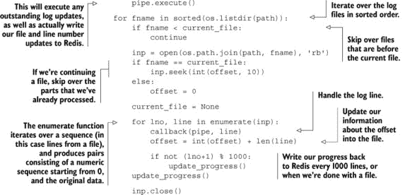

通过在 Redis 中记录我们的进度，如果系统中的任何部分在任何时候崩溃，我们都可以继续处理日志。而且因为我们使用了在第三章中介绍过的`MULTI`/`EXEC`管道，我们确保转储将只包括包含进度信息的处理日志信息。

##### 大数据

当我们存储在 Redis 中的数据量趋于几 GB 时，快照可能是正确的答案。Redis 将进行分叉，保存到磁盘，并且比您读完这句话的时间更快地完成快照。但随着我们的 Redis 内存使用随着时间的增长，执行`BGSAVE`的分叉操作所需的时间也会增加。在 Redis 使用数十 GB 内存、没有太多空闲内存或我们在虚拟机上运行的情况下，让`BGSAVE`发生可能会导致系统长时间暂停，或者可能导致系统虚拟内存的过度使用，这可能会降低 Redis 的性能到无法使用的程度。

这种延长的暂停（以及它有多重要）将取决于我们在什么类型的系统上运行。真实硬件、VMware 虚拟化或 KVM 虚拟化通常允许我们以大约每 GB 内存 10-20 毫秒的速度创建 Redis 进程的分叉。如果我们的系统在 Xen 虚拟化中运行，这些数字可以接近每 GB Redis 使用的内存 200-300 毫秒，具体取决于 Xen 配置。所以如果我们使用 20GB 的 Redis 内存，在标准硬件上运行`BGSAVE`将使 Redis 暂停 200-400 毫秒进行分叉。如果我们使用 Redis 在 Xen 虚拟化的机器内部（如 Amazon EC2 和一些其他云服务提供商的情况），同样的分叉将使 Redis 暂停 4-6 秒。您需要决定对于您的应用程序，这种暂停是否可以接受。

为了防止派生引起此类问题，我们可能希望完全禁用自动保存。当自动保存被禁用时，我们需要手动调用`BGSAVE`（它具有与之前相同的潜在问题，但现在我们知道它们何时会发生），或者我们可以调用`SAVE`。使用`SAVE`，Redis 会阻塞直到保存完成，但由于没有派生，所以没有派生延迟。并且由于 Redis 不需要与其他自身争夺资源，快照将更快完成。

作为个人经验，我运行过在运行 Xen 虚拟化的云提供商的 68GB 内存机器上使用 50GB 内存的 Redis 服务器。当尝试使用`BGSAVE`与向 Redis 写入客户端一起使用时，派生需要 15 秒或更长时间，然后是 15-20 分钟来完成快照。但使用`SAVE`，快照会在 3-5 分钟内完成。对于我们的使用，凌晨 3 点的每日快照就足够了，所以我们编写了脚本，阻止客户端尝试访问 Redis，调用`SAVE`，等待`SAVE`完成，备份生成的快照，然后向客户端发出信号，告知他们可以继续。

当我们能够处理 Redis 中可能的大量数据丢失时，快照是非常有用的，但对于许多应用程序来说，15 分钟或更长时间的数据丢失或处理时间是不够的。为了使 Redis 能够保持关于存储在磁盘上的内存中数据的更及时信息，我们可以使用仅追加文件持久化。

#### 4.1.2\. 仅追加文件持久化

简单来说，仅追加日志文件通过将每个更改写入文件的末尾来记录数据变化。通过这种方式，任何人都可以通过从开始到结束重放仅追加日志来恢复整个数据集。Redis 也有这样的功能，并且可以通过设置配置选项`appendonly yes`来启用，如列表 4.1 所示。表 4.1 显示了`appendfsync`选项及其对文件写入磁盘同步的影响。

##### 表 4.1\. 与`appendfsync`一起使用的同步选项

| 选项 | 同步发生的频率 |
| --- | --- |
| always | 每个写入 Redis 的命令都会导致磁盘上的写入。如果使用，这会显著减慢 Redis 的速度。 |
| everysec | 每秒一次，显式地将写命令同步到磁盘。 |
| no | 允许操作系统控制同步到磁盘。 |
|  |

##### 文件同步

当将文件写入磁盘时，至少会发生三件事情。第一是写入缓冲区，这发生在调用`file.write()`或其它语言中的等效函数时。当数据在缓冲区中时，操作系统可以在未来的某个时刻将数据写入磁盘。我们可以选择性地进行第二步，并请求操作系统在有机会时将提供的数据写入磁盘，使用`file.flush()`，但这只是一个请求。因为数据实际上只有在操作系统将其写入磁盘后才会存在于磁盘上，所以我们可以告诉操作系统“同步”文件到磁盘，这将阻塞直到完成。当同步完成时，我们可以相当确信数据已经写入磁盘，并且如果系统出现故障，我们可以在以后读取它。

| |
| --- |

如果我们将`appendfsync always`设置为，每次写入 Redis 都会导致写入磁盘，并且如果 Redis 崩溃，我们可以确保最小化数据丢失。不幸的是，因为我们每次写入 Redis 都会写入磁盘，所以我们受限于磁盘性能，对于旋转磁盘大约是每秒 200 次写入，而对于 SSD（固态驱动器）可能是几千次。

| |
| --- |

##### 警告：SSD 和`appendfsync always`

如果你使用的是 SSD 与`appendfsync always`，你需要小心。将每次更改即时写入磁盘，而不是像其他`appendfsync`选项那样让操作系统将写入分组在一起，可能会引起一种称为*写入放大*的极端形式。通过将少量数据写入文件的末尾，你可以在某些情况下将 SSD 的使用寿命从几年缩短到仅仅几个月。

| |
| --- |

作为在保证数据安全与保持高写入性能之间的一种合理折衷，我们也可以设置`appendfsync everysec`。这种配置将每秒同步一次只追加日志。对于大多数常见用途，我们可能不会发现与不使用任何持久化方式相比，每秒同步到磁盘会有显著的性能损失。通过每秒同步到磁盘，如果系统崩溃，我们最多可能丢失一秒钟内写入或更新的数据。此外，在磁盘无法跟上写入量时，Redis 会优雅地降低速度以适应驱动器的最大写入速率。

如你所猜，当设置`appendfsync no`时，Redis 不会执行任何显式的文件同步，将一切留给操作系统。在这种情况下，不应该有任何性能损失，尽管如果系统以某种方式崩溃，我们可能会丢失未知且不可预测的数据量。如果我们使用的是无法满足我们写入负载的硬盘，Redis 将表现良好，直到写入磁盘的数据缓冲区被填满，此时 Redis 会因为无法写入而变得非常慢。出于这些原因，我通常不建议使用此配置选项，并在此处包含其描述和语义，以保持完整性。

只追加文件具有灵活性，提供了各种选项以确保几乎可以解决每个级别的偏执。但 AOF 持久化有一个阴暗面，那就是文件大小。

#### 4.1.3. 重写/压缩只追加文件

在阅读了关于 AOF 持久化的内容后，你可能想知道为什么快照存在。如果我们通过使用只追加文件可以将数据损失最小化到一秒（或者实际上没有损失），并且最小化定期将数据持久化到磁盘所需的时间，那么我们的选择似乎应该是明确的。但实际上，选择并不那么简单：因为每次写入 Redis 都会导致将命令日志写入磁盘，只追加日志文件将不断增长。随着时间的推移，不断增长的 AOF 可能会导致你的磁盘空间不足，但更常见的情况是，在重启时，Redis 将按顺序执行 AOF 中的每个命令。在处理大型 AOF 时，Redis 启动可能需要非常长的时间。

为了解决日益增长的 AOF 问题，我们可以使用`BGREWRITEAOF`，它通过删除冗余命令将 AOF 重写为尽可能短。`BGREWRITEAOF`的工作方式与快照的`BGSAVE`类似：执行一个 fork 操作，随后在子进程中重写只追加日志。因此，在使用只追加文件时，关于快照性能的所有相同限制，如 fork 时间、内存使用等，仍然存在。但更糟糕的是，因为 AOF 可以增长到比转储文件大许多倍（如果不受控制），当 AOF 被重写时，操作系统需要删除 AOF，这可能导致系统在删除数十 GB 的 AOF 时挂起数秒。

使用快照时，我们可以使用`save`配置选项来启用使用`BGSAVE`自动写入快照。使用 AOFs，有两个配置选项可以启用自动`BGREWRITEAOF`执行：`auto-aof-rewrite-percentage`和`auto-aof-rewrite-min-size`。使用`auto-aof-rewrite-percentage`的示例值`100`和`auto-aof-rewrite-min-size 64mb`，当 AOF 启用时，Redis 将在 AOF 至少比 Redis 上次完成 AOF 重写时大 100%时，以及 AOF 大小至少为 64 兆字节时启动`BGREWRITEAOF`。作为一个配置点，如果我们的 AOF 重写过于频繁，我们可以将代表 100%的`100`增加到更大的值，尽管这会导致 Redis 在重写发生一段时间后启动时间更长。

无论我们选择只读文件还是快照，将数据存储在磁盘上都是迈出的重要一步。但除非我们的数据已经在其他地方（最好是多个位置）进行了备份，否则我们仍然面临数据丢失的风险。在可能的情况下，我建议将快照和重新编写的只读文件备份到其他服务器。

通过使用只读文件或快照，我们可以在系统重启或崩溃之间保持数据。随着负载的增加或对数据完整性的要求变得更加严格，我们可能需要考虑复制来帮助我们。

### 4.2. 复制

在多年的平台扩展经验中，工程师和管理员已经将*复制*添加到他们的工具箱中，以帮助系统扩展。复制是一种方法，其他服务器可以接收正在写入的数据的持续更新的副本，以便副本可以处理读取查询。在关系型数据库领域，单个*主*数据库向多个*从*数据库发送写入操作，从数据库执行所有读取查询的情况并不少见。Redis 采用了这种复制方法作为帮助扩展的一种方式，本节将讨论配置 Redis 的复制，以及 Redis 在复制过程中的操作。

尽管 Redis 可能很快，但在某些情况下，单个 Redis 服务器运行可能不够快。特别是，对`SET`和`ZSET`的操作可能涉及数十个`SET`和`ZSET`，这些操作可能涉及数万个甚至数百万个项目。当我们开始处理数百万个项目时，集合操作可能需要几秒钟才能完成，而不是毫秒或微秒。但即使单个命令可以在 10 毫秒内完成，这也限制了单个 Redis 实例每秒只能执行 100 个命令。

| |
| --- |

##### `SUNIONSTORE`的性能示例

作为考虑 Redis 性能的一个点，在 2.4 GHz Intel Core 2 Duo 处理器上，Redis 执行两个包含 10,000 个元素的`SET`的`SUNIONSTORE`操作，将产生一个包含 20,000 个元素的`SET`，这个过程需要 7-8 毫秒。

| |
| --- |

对于需要扩展读查询的情况，或者可能需要写入临时数据（我们将在第七章中讨论一些此类情况），我们可以设置额外的从服务器 Redis 来保存我们数据集的副本。从服务器在接收到主服务器上的初始数据副本后，会实时更新，以保持与客户端写入主服务器数据的同步。在主/从服务器配置中，客户端将连接到从服务器之一来读取数据（通常随机选择以尝试平衡负载），而不是连接到主服务器读取数据。

让我们讨论如何配置 Redis 以实现主/从操作，以及 Redis 在整个过程中的行为。

#### 4.2.1\. 配置 Redis 以实现复制

正如我在 4.1.1 节中提到的，当从服务器连接到主服务器时，主服务器将启动`BGSAVE`操作。为了在主服务器端配置复制，我们只需要确保列表 4.1 中显示的`dir`和`dbfilename`配置选项下的路径和文件是 Redis 进程可写路径和文件。

尽管有许多选项控制从服务器本身的行为，但只有一个选项真正必要以启用从属：`slaveof`。如果我们要在配置文件中设置`slaveof host port`，那么使用该配置启动的 Redis 将使用提供的主机和端口作为它应该连接的主服务器 Redis。如果我们有一个已经运行的系统，我们可以告诉 Redis 服务器停止从属，甚至将其从属到一个新的或不同的主服务器。要连接到新的主服务器，我们可以使用`SLAVEOF host port`命令，或者如果我们想停止从主服务器更新数据，我们可以使用`SLAVEOF no one`。

配置 Redis 以实现主/从操作并没有太多内容，但有趣且值得了解的是，当 Redis 成为主服务器或从服务器时会发生什么。

#### 4.2.2\. Redis 复制启动过程

我简要描述了当从服务器连接时发生的情况——主服务器开始创建快照并将其发送到从服务器，但这只是简单版本。表 4.2 列出了当从服务器连接到主服务器时，主服务器和从服务器上发生的所有操作。

##### 表 4.2\. 当从服务器连接到主服务器时发生的情况

| 步骤 | 主服务器操作 | 从服务器操作 |
| --- | --- | --- |
| 1 | (等待命令) | (重新)连接到主服务器；发出 SYNC 命令 |
| 2 | 开始 BGSAVE 操作；保留所有在 BGSAVE 之后发送的写命令的回压 | 提供旧数据（如果有），或根据配置返回错误 |
| 3 | 完成 BGSAVE；开始向从服务器发送快照；继续保留写命令的回压 | 抛弃所有旧数据（如果有）；开始加载接收到的转储 |
| 4 | 完成将快照发送到从属节点；开始向从属节点发送写命令积压 | 完成解析转储；再次正常响应命令 |
| 5 | 完成发送积压；开始实时流式传输发生的写命令 | 完成执行来自主节点的写命令积压；继续实时执行命令 |

使用表 4.2 中概述的方法，Redis 在复制过程中能够跟上大多数负载，除了在主从实例之间的网络带宽不够快，或者当主节点没有足够的内存来分叉并保持写命令积压的情况下。虽然这不是必需的，但通常认为将 Redis 主节点仅使用系统内存的约 50-65%是一个好的做法，在`BGSAVE`和命令积压期间留出大约 30-45%的备用内存。

在从属节点方面，配置也很简单。要配置从属节点进行主从复制，我们可以设置配置选项`SLAVEOF host port`，或者我们可以在运行时使用`SLAVEOF`命令配置 Redis。如果我们使用配置选项，Redis 将最初加载当前可用的任何快照/AOF（如果有），然后连接到主节点以启动表 4.2 中概述的复制过程。如果我们运行`SLAVEOF`命令，Redis 将立即尝试连接到主节点，如果成功，将启动表 4.2 中概述的复制过程。

|  |
| --- |

##### 在同步过程中，从属节点刷新其所有数据

为了确保我们都在同一页面上（有些用户在第一次尝试使用从属节点时可能会忘记这一点）：当从属节点最初连接到主节点时，之前存储在内存中的任何数据都将丢失，将被来自主节点的数据所取代。

|  |
| --- |
|  |

##### 警告：Redis 不支持主-主复制

当展示主从复制时，有些人会错误地认为，因为我们可以在启动后使用`SLAVEOF`命令设置从属节点选项，这意味着我们可以通过将两个 Redis 实例设置为相互作为`SLAVEOF`来获得所谓的*多主复制*。不幸的是，*这行不通*。最坏的情况是，我们的两个 Redis 实例将尽可能使用处理器，将不断进行双向通信，并且根据我们连接的服务器以及尝试从/向其读写数据，我们可能会得到不一致的数据或没有数据。

|  |
| --- |

当多个从属节点尝试连接到 Redis 时，可能会出现两种不同的场景。表 4.3 描述了它们。

##### 表 4.3。当从属节点连接到现有的主节点时，有时它可以重用现有的转储文件。

| 当附加从属节点连接 | 主节点操作 |
| --- | --- |
| 在表 4.2 的第 3 步之前 | 所有从属节点将接收到相同的转储和相同的积压写命令。 |
| 在表 4.2 的第 3 步或之后 | 当主节点完成早期从节点的五个步骤时，新的从节点将开始执行步骤 1-5 的新序列。 |

在大多数情况下，Redis 会尽力确保它不需要做比必要更多的工作。在某些情况下，从节点可能会在不合适的时间尝试连接，导致主节点做更多的工作。另一方面，如果多个从节点同时连接，用于最初同步所有从节点的出带宽可能会导致其他命令难以通过，并可能造成同一网络上的其他设备的一般网络速度降低。

#### 4.2.3\. 主/从链

一些开发者发现，当他们需要将数据复制到超过几个从节点时，某些网络无法跟上——尤其是在通过互联网或在数据中心之间进行复制时。由于在 Redis 中，主节点和从节点并没有什么特别之处，从节点可以有它们自己的从节点，从而形成主/从链。

在操作上，复制过程中发生的唯一区别是，如果从节点 X 有一个自己的从节点 Y，当从节点 X 从表 4.2 的步骤 4 开始时，从节点 X 将断开与从节点 Y 的连接，导致 Y 重新连接并重新同步。

当读负载远大于写负载，并且当读操作的数量远远超过单个 Redis 服务器可以处理的能力时，通常需要继续添加从节点来帮助处理负载。随着负载的持续增加，我们可能会遇到单个主节点无法足够快地将数据写入所有从节点，或者被过多的从节点重新连接和重新同步所超载的情况。为了缓解这些问题，我们可能需要设置一层中间 Redis 主/从节点，以帮助执行类似于图 4.1 的复制任务。

##### 图 4.1\. 一个包含九个最低级从节点和三个中间复制辅助服务器的 Redis 主/从副本树示例

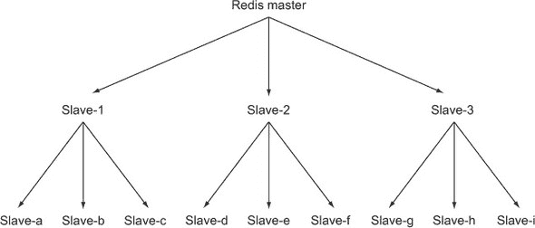

虽然图 4.1 中显示的示例可能不一定需要是树形结构，但记住和理解这对于 Redis 复制来说既是可能的也是合理的，这有助于你以后。

在第 4.1.2 节中，我们讨论了使用带有同步的只写文件来限制我们丢失数据的机会。我们可以通过将每次写入同步到磁盘来几乎完全防止数据丢失（除了系统或硬盘故障），但这样会严重限制性能。如果我们告诉 Redis 每秒同步一次，我们就能获得所需的性能，但如果发生不好的事情，我们可能会丢失最多一秒的写入。但是，通过结合复制和只写文件，我们可以确保数据被发送到多台机器的磁盘上。

为了确保数据在多台机器上到达磁盘，我们显然需要设置一个带有从节点的主节点。通过将我们的从节点（以及可选的主节点）配置为 `appendonly yes` 和 `appendfsync everysec`，我们现在有一组每秒钟都会同步到磁盘的机器。但这只是第一部分：我们必须等待写入到达从节点并检查数据是否在我们可以继续之前已到达磁盘。

#### 4.2.4\. 验证磁盘写入

验证我们写入主节点的数据是否已到达从节点是很容易的：我们只需在我们的重要数据之后写入一个唯一的虚拟值，然后在从节点上检查它。但是，验证数据是否已到达磁盘则更为困难。如果我们至少等待一秒钟，我们就知道我们的数据已到达磁盘。但如果我们小心，我们可能通过检查 `INFO` 输出的 `aof_pending_bio_fsync` 值来等待更少的时间，该值将在服务器所知道的所有数据都已写入磁盘时为 0。为了自动化此检查，我们可以使用下一列表中提供的函数，在将数据写入主节点后通过传递主节点和从节点连接来调用此函数。

##### 列表 4.3\. `wait_for_sync()` 函数

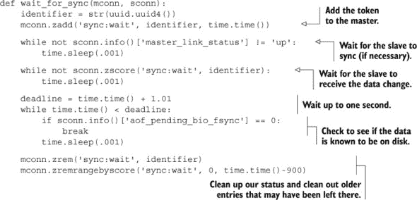

| |
| --- |

##### `INFO` 命令的其他信息

`INFO` 命令可以提供有关 Redis 服务器当前状态的广泛信息——使用的内存、连接的客户端数量、每个数据库中的键的数量、自上次快照以来执行的命令数量等。一般来说，`INFO` 是我们 Redis 服务器一般状态的不错信息来源，许多在线资源可以解释更多。

| |
| --- |

为了确保正确操作，此函数将首先验证从节点是否连接到主节点。然后它将轮询从节点，寻找它添加到同步等待 `ZSET` 的值。在它发现该值已到达从节点后，它将检查 Redis 写入缓冲区的状态，等待它要么表示没有挂起的同步到磁盘（表示更改已到达磁盘），要么等待最多一秒钟。我们等待一秒钟是基于假设，在一秒钟后，数据已同步到磁盘，但由于我们对数据同步时发生的写入没有捕捉到，所以有大量的写入到 Redis。在验证写入磁盘后，我们然后清理我们的工作。

通过结合复制和只追加文件，我们可以配置 Redis 以抵御系统故障。

### 4.3\. 处理系统故障

为了能够处理 Redis 中的系统故障，我们需要为故障做好准备。我们之所以花费这么多时间讨论这些主题，是因为如果我们打算将 Redis 作为我们应用程序的唯一数据存储，那么我们必须确保我们永远不会丢失任何数据。与传统提供 ACID^([2]) 保证的数据库不同，当我们选择在 Redis 后端之上进行架构时，我们需要做一些额外的工作来确保数据一致性。Redis 是软件，它运行在硬件上，即使两者都设计得完美无缺且不会失败，电力也可能中断，发电机可能会耗尽燃料，电池可能会耗尽电量。在查看 Redis 提供的功能时，我们花费了大量时间来准备潜在的系统故障。本节将讨论当故障发生时我们可以做什么。

> ² ACID——或原子性、一致性、隔离性和持久性——是对数据库必须保证提供可靠事务的函数描述。

#### 4.3.1\. 验证快照和仅追加文件

面对系统故障时，我们拥有工具来帮助我们恢复，无论是启用快照功能还是仅追加文件日志。Redis 包含两个命令行应用程序，用于测试快照和仅追加文件的状态。这些命令是 `redis-check-aof` 和 `redis-check-dump`。如果我们不带参数运行这些命令，我们会看到提供的基本帮助信息：

```
$ redis-check-aof
Usage: redis-check-aof [--fix] <file.aof>
$ redis-check-dump
Usage: redis-check-dump <dump.rdb>
$
```

如果我们将 `--fix` 作为参数传递给 `redis-check-aof`，该命令将修复文件。它修复仅追加文件的方法很简单：它扫描提供的 AOF，寻找不完整或不正确的命令。一旦找到第一个错误的命令，它就会将文件修剪到该命令应该被执行之前。在大多数情况下，这将丢弃最后的部分写入命令。

不幸的是，目前没有支持修复损坏快照的方法。尽管有可能发现第一个错误发生的位置，但由于快照本身是压缩的，如果在转储过程中出现错误，可能会使快照的剩余部分变得不可读。正因为如此，我通常建议保留多个重要快照的备份，并在恢复过程中计算 SHA1 或 SHA256 哈希值以验证内容。（现代 Linux 和 Unix 平台将提供 `sha1sum` 和 `sha256sum` 命令行应用程序，用于生成和验证这些哈希值。）

| |
| --- |

##### 校验和与哈希

包括 2.6 版本及以后的 Redis 版本，将快照的 CRC64 校验和作为快照的一部分。使用 CRC 家族校验和对于发现某些类型网络传输或磁盘损坏中典型的错误很有用。加密散列的 SHA 家族更适合发现任意错误。具体来说，如果我们计算了一个文件的 CRC64，然后翻转文件内部的任意位，我们可以在以后翻转文件最后 64 位的一个子集来产生原始校验和。目前还没有已知的方法可以用 SHA1 或 SHA256 做同样的事情。

|  |
| --- |

在我们验证我们的备份是我们之前保存的内容，并且我们已经根据需要更正了 AOF 的最后写入后，我们可能需要替换一个 Redis 服务器。

#### 4.3.2\. 替换失败的 master

当我们运行一组具有复制和持久性的 Redis 服务器时，可能会有某个时候，我们的基础设施的某个部分因为某种原因停止工作。也许我们得到了一个坏硬盘，也许内存有问题，或者电力突然中断。无论是什么原因导致系统失败，我们最终都需要替换一个 Redis 服务器。让我们看看一个涉及 master、从服务器和需要替换 master 的示例场景。

机器 A 正在运行一个充当 master 的 Redis 复制，机器 B 正在运行一个充当从服务器的 Redis 复制。不幸的是，机器 A 由于我们尚未诊断出的某种原因刚刚失去了网络连接。但我们有一个安装了 Redis 的机器 C，我们希望将其用作新的 master。

我们的计划很简单：我们将告诉机器 B 使用 `SAVE` 生成一个新的快照。然后我们将该快照复制到机器 C。在快照被复制到正确的路径后，我们将在机器 C 上启动 Redis。最后，我们将告诉机器 B 成为机器 C 的从服务器。^[[3]] 在以下列表中展示了使这成为可能的一些示例命令。

> ³ 因为 B 最初是奴隶，我们的客户不应该向 B 写信，所以在快照操作开始后，我们不会与向 B 写信的客户有任何竞态条件。

##### 列表 4.4\. 替换失败的 master 节点的命令示例

![077fig01_alt.jpg]

大多数这些命令对于那些有使用和维护 Unix 或 Linux 系统经验的人来说应该是熟悉的。这里运行的命令中唯一有趣的事情是我们可以通过运行一个命令在机器 B 上启动 `SAVE`，我们后来通过运行一个命令设置机器 B 成为机器 C 的从服务器。

作为创建新 master 的替代方案，我们可能希望将从服务器转换为 master 并创建一个新的从服务器。无论哪种方式，Redis 都能从上次停止的地方继续，我们此后唯一的任务就是更新我们的客户端配置以读取和写入正确的服务器，并且如果需要重启 Redis，还可以选择更新磁盘上的服务器配置。

| |
| --- |

##### Redis Sentinel

Redis 可用工具集合中相对较新的补充是 *Redis Sentinel*。到这份手稿最终出版时，Redis Sentinel 应该已经完成。通常，Redis Sentinel 会关注 Redis 主节点及其从节点，并在主节点故障时自动处理故障转移。我们将在第十章 中讨论 Redis Sentinel。

| |
| --- |

在下一节中，我们将讨论如何防止多个作者在处理相同数据时导致数据损坏，这是确保数据安全所必需的步骤。

### 4.4. Redis 事务

保持数据正确的一部分是理解，当其他客户端正在处理相同的数据时，如果我们不小心，我们可能会遇到数据损坏。在本节中，我们将讨论使用 Redis 事务来防止数据损坏，在某些情况下，还可以提高性能。

Redis 中的事务与更传统的关系型数据库中的事务不同。在关系型数据库中，我们可以告诉数据库服务器 `BEGIN`，此时我们可以执行各种读和写操作，这些操作将相互一致，之后我们可以运行 `COMMIT` 使我们的更改永久化，或者运行 `ROLLBACK` 来丢弃我们的更改。

在 Redis 中，有一种简单的方法可以处理一系列读和写操作，这些操作将相互一致。我们通过调用特殊命令 `MULTI` 开始事务，传递我们的命令序列，然后是 `EXEC`（如第 3.7.2 节 中所述）。问题是这个简单的交易实际上在调用 `EXEC` 之前并不做任何事情，这意味着我们可能需要在之后才能使用我们读取的数据来做决定。这看起来可能并不重要，但有一些问题由于无法以一致的方式读取数据或允许事务在应该成功的地方失败（例如，当我们使用两阶段提交时，这是解决该问题的常见方法）而变得难以解决。这些问题之一是从市场中购买商品的过程。让我们看看这个过程的例子。

| |
| --- |

##### 使用 `MULTI/EXEC` 进行延迟执行可以提高性能

由于 Redis 在`MULTI`/`EXEC`中使用时，直到调用`EXEC`才延迟执行命令，因此许多客户端（包括我们使用的 Python 客户端）甚至会在所有命令都已知之前推迟发送命令。当所有命令都已知时，客户端将同时发送`MULTI`，然后是执行的一系列命令，最后是`EXEC`。然后客户端将等待直到收到所有命令的回复。这种方法通常被称为*管道化*，它能够通过减少客户端需要等待的网络往返次数来提高 Redis 执行多个命令时的性能。

| |
| --- |

在过去几个月里，假游戏公司在 YouTwitFace（一个虚构的社会网络）上玩的游戏 RPG 中看到了重大增长。因为它关注其社区的需求和愿望，它已经确定玩家需要在市场上买卖物品。我们的任务是设计和构建一个能够扩展到社区需求的市场。

#### 4.4.1. 定义用户及其库存

我们将从展示一些定义我们的用户及其库存的结构开始。用户信息以`HASH`存储，键和值存储用户属性，如姓名、资金等。用户的库存将是一个`SET`，它包含每个物品的唯一标识符，如图 4.2 所示。

##### 图 4.2. 示例用户库存和用户信息。Frank 有 43 个电子美元，并且他正在考虑从他的库存中出售一个物品。

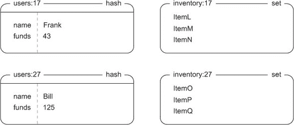

我们对市场的要求很简单：用户可以以特定价格列出物品，当另一个用户购买该物品时，卖家收到钱。我们还将说，我们将关注的市场的部分只需要按售价排序。在第七章中，我们将介绍一些处理其他排序的主题。

为了在市场上销售特定物品，我们将物品 ID 与卖家用户 ID 连接起来，并将其作为市场`ZSET`的一个成员使用，分数为物品的售价。通过将所有这些信息一起包含，我们大大简化了我们的数据结构和需要查找的内容，并获得了能够轻松分页浏览预排序市场的优势。市场的小版本如图 4.3 所示。

##### 图 4.3. 我们的基本市场，其中包括用户 4 以 35 个电子美元出售的物品 A

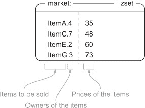

现在我们已经知道了我们的市场使用哪些结构，让我们在市场上列出物品。

#### 4.4.2. 在市场上列出物品

在列出过程中，我们将使用 Redis 的一个操作`WATCH`，我们将它与`MULTI`和`EXEC`结合使用，有时还会使用`UNWATCH`或`DISCARD`。当我们用`WATCH`监视了键，如果在执行`EXEC`操作之前，有其他客户端替换、更新或删除了我们之前监视的任何键，那么当我们尝试`EXEC`时，我们的 Redis 操作将因错误信息而失败（此时我们可以重试或中止操作）。通过使用`WATCH`、`MULTI/EXEC`和`UNWATCH/DISCARD`，我们可以确保我们在做重要的事情时，所处理的数据不会发生变化，这可以保护我们免受数据损坏。

|  |
| --- |

##### `DISCARD`是什么意思？

与`UNWATCH`在`WATCH`之后但在`MULTI`之前发送时可以让我们重置连接一样，`DISCARD`在`MULTI`之后但在`EXEC`之前发送时也会重置连接。也就是说，如果我们用`WATCH`监视了一个或多个键，获取了一些数据，然后使用`MULTI`启动了一个事务，随后是一组命令，我们可以通过`DISCARD`取消`WATCH`并清除任何排队的命令。我们在这里不使用`DISCARD`主要是因为我们知道是否要执行`MULTI/EXEC`或`UNWATCH`，所以对于我们的目的来说，`DISCARD`是不必要的。

|  |
| --- |

让我们来看看如何在市场上列出商品。为此，我们将商品添加到市场`ZSET`中，同时监视卖家的库存以确保该商品仍然可供出售。列出商品的函数如下所示。

##### 列表 4.5\. `list_item()`函数

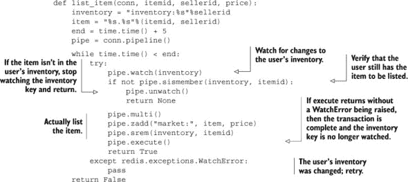

在一些初始设置之后，我们将执行之前描述的操作。我们将告诉 Redis 我们想要监视卖家的库存，验证卖家是否仍然可以出售该商品，如果是这样，就将商品添加到市场并从他们的库存中移除。如果我们查看库存时库存有更新或变化，我们将收到错误并重试，正如我们实际操作之外的`while`循环所示。

让我们看看当 Frank（用户 17）想要以 97 个电子美元的价格出售 ItemM 时，在图 4.4 中执行的操作序列。

##### 图 4.4\. `list_item(conn, "ItemM", 17, 97)`

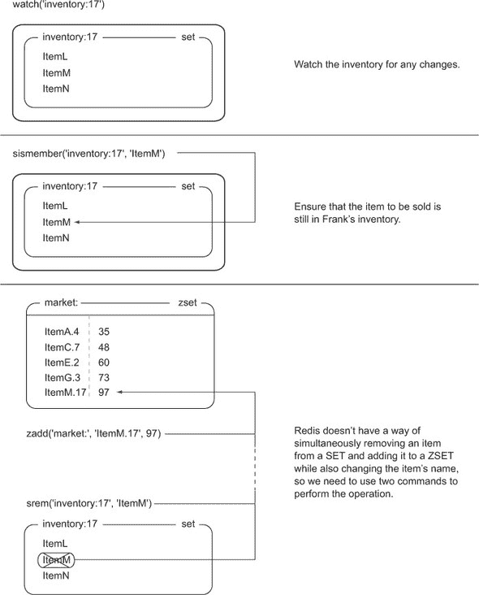

通常，列出商品应该不会出现任何重大问题，因为只有用户应该出售他们自己的商品（这在应用堆栈的更高层得到了强制执行）。但如我之前提到的，如果用户的库存在与`WATCH`和`EXEC`之间发生变化，我们尝试列出商品的努力将失败，我们将重试。

现在你已经知道了如何列出商品，是时候购买商品了。

#### 4.4.3\. 购买商品

为了处理物品的购买，我们首先监视市场以及购买该物品的用户。然后我们获取买家的总资金和物品的价格，并验证买家是否有足够的钱。如果他们没有足够的钱，我们取消交易。如果他们有足够的钱，我们执行账户间的转账，将物品移入买家的库存，并从市场中移除该物品。在`WATCH`错误的情况下，我们将重试，总时间不超过 10 秒。我们可以在以下列表中看到处理物品购买的功能。

##### 列表 4.6。`purchase_item()` 函数

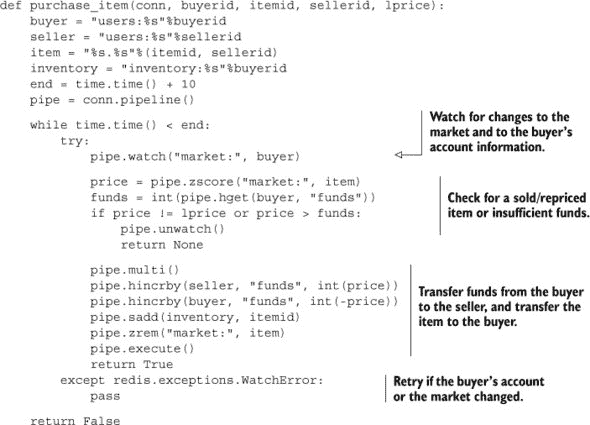

要购买物品，我们需要花更多的时间准备数据，并且我们需要监视市场和买家的信息。我们监视市场以确保物品仍然可以购买（或者我们可以注意到它已经被购买），我们监视买家的信息以验证他们是否有足够的钱。当我们验证了物品仍然存在，并且买家有足够的钱时，我们就开始将物品移入他们的库存，并将钱从买家转移到卖家。

在看到市场中的可用物品后，比尔（用户 27）决定他想通过市场从弗兰克那里购买 ItemM。让我们跟随这些图（图 4.5 和 4.6）来了解我们的数据是如何变化的。

##### 图 4.5。在物品可以购买之前，我们必须监视市场以及买家的信息，以验证该物品是否仍然可用，以及买家是否有足够的钱。

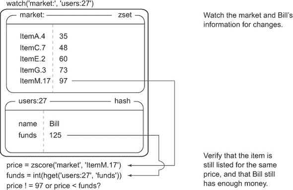

##### 图 4.6。为了完成物品购买，我们必须实际上从买家向卖家转账，同时从市场中移除该物品，并将其添加到买家的库存中。

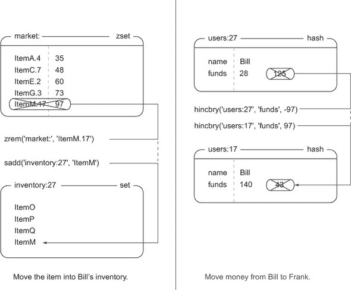

如果在“监视”（`WATCH`）和“执行”（`EXEC`）之间，市场中的`ZSET`或比尔的账户信息发生变化，`purchase_item()`函数将根据尝试购买该物品的时间长短来决定是重试还是中止，具体请参考列表 4.6。

|  |
| --- |

##### 为什么 Redis 不实现典型的锁定机制？

当访问数据以进行写入操作（SQL 中的 `SELECT FOR UPDATE`）时，关系型数据库将对访问的行进行锁定，直到事务通过 `COMMIT` 或 `ROLLBACK` 完成。如果任何其他客户端尝试访问同一行的数据以进行写入操作，该客户端将被阻塞，直到第一个事务完成。这种锁定机制在实践中效果良好（实际上所有关系型数据库都实现了它），尽管如果锁定持有者操作缓慢，这可能会导致等待获取多个行锁的客户出现长时间的等待。

由于存在长时间等待的可能性，并且 Redis 的设计最小化了客户端的等待时间（除了阻塞 `LIST` 弹出之外），Redis 在 `WATCH` 期间不会锁定数据。相反，如果有人先修改了数据，Redis 将通知客户端，这被称为*乐观锁*（关系型数据库实际执行的锁定可以被视为*悲观锁*）。乐观锁在实践中也表现良好，因为客户端永远不会等待锁的第一个持有者；相反，如果其他客户端更快，它们会重试。

| |
| --- |

在本节中，我们讨论了如何结合 `WATCH`、`MULTI` 和 `EXEC` 来处理多种类型数据的操作，以便我们可以实现一个市场。基于这个功能作为基础，将我们的市场转变为拍卖，添加其他排序选项，使市场中的旧项目超时，或者甚至添加基于第七章中讨论的技术的高级搜索和过滤功能，这些都是可以想象的事情。

只要我们在 Redis 中持续使用事务，我们就可以防止我们的数据在多个客户端操作时被损坏。让我们看看当我们不需要担心其他客户端更改我们的数据时，我们如何使我们的操作更快。

### 4.5. 非事务性管道

当我们在第三章中首次介绍 `MULTI`/`EXEC` 时，我们将其描述为具有“事务”属性——`MULTI` 和 `EXEC` 命令之间的所有内容都将执行，而其他客户端无法进行任何操作。使用事务的一个好处是底层库使用管道，这提高了性能。本节将展示如何在不使用事务的情况下使用管道来进一步提高性能。

你可能会记得，在第二章中，一些命令需要多个参数来进行添加/更新操作——例如 `MGET`、`MSET`、`HMGET`、`HMSET`、`RPUSH`/`LPUSH`、`SADD`、`ZADD` 等命令。这些命令的存在是为了简化执行相同操作的多次调用。正如你在第二章中看到的，这可以带来显著的性能提升。尽管这些命令的效果不如这些命令那么显著，但使用非事务性管道也能提供许多相同的性能优势，并允许我们同时运行各种命令。

在我们不需要事务，但仍然想要做大量工作的场合，我们仍然可以使用 `MULTI`/`EXEC` 来利用它们同时发送所有命令的能力，以最小化往返次数和延迟。不幸的是，`MULTI` 和 `EXEC` 并非免费，并且可能会延迟其他重要命令的执行。但我们可以不使用 `MULTI`/`EXEC` 就获得管道的所有好处。当你我们在第三章和第 4.4 节中使用 Python 的 `MULTI`/`EXEC` 时，你可能已经注意到我们做了以下操作：

```
pipe = conn.pipeline()
```

通过将 `True` 传递给 `pipeline()` 方法（或省略它），我们告诉我们的客户端将我们将要调用的命令序列用 `MULTI`/`EXEC` 对包裹起来。如果我们传递 `False` 而不是 `True`，我们会得到一个准备并收集要执行的命令的对象，类似于事务性管道，但它不会被 `MULTI`/`EXEC` 包裹。对于需要向 Redis 发送多个命令的情况，一个命令的结果不会影响另一个命令的输入，并且我们不需要它们都作为事务执行，将 `False` 传递给 `pipeline()` 方法可以进一步提高 Redis 的整体性能。让我们看一个例子。

在很久以前，第 2.1 节 和 第 2.5 节 中，我们编写并更新了一个名为 `update_token()` 的函数，该函数记录了最近查看的项目和最近查看的页面，并更新了用户的登录 Cookie。第 2.5 节的更新代码显示在 列表 4.7 中。注意该函数在每次函数调用时都会对 Redis 进行三次或五次调用。按照目前的编写方式，这将导致 Redis 和我们的客户端之间进行三次或五次往返。

##### 列表 4.7\. 来自 第 2.5 节 的 `update_token()` 函数

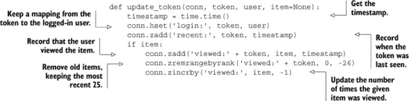

如果我们的 Redis 和 Web 服务器通过局域网连接，且只有一两个步骤，我们可以预期 Web 服务器和 Redis 之间的往返时间大约为 1–2 毫秒。在 Redis 和 Web 服务器之间进行三次到五次往返后，我们可以预期 `update_token()` 的执行时间大约为 3–10 毫秒。在这个速度下，我们只能期望单个 Web 服务器线程每秒能够处理 100–333 个请求。这已经很不错了，但我们还能做得更好。让我们快速创建一个非事务性管道，并通过该管道发送所有请求。您可以在下一个列表中看到更新后的函数。

##### 列表 4.8\. `update_token_pipeline()` 函数

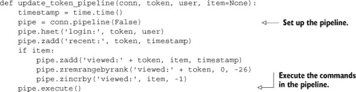

通过将我们的标准 Redis 连接替换为管道连接，我们可以将往返次数减少 3–5 倍，并将 `update_token_pipeline()` 的预期执行时间减少到 1–2 毫秒。在这个速度下，如果 Web 服务器线程只需要处理更新项目视图信息，那么它每秒可以处理 500–1000 个请求。从理论上讲，这很棒，但在现实中又会怎样呢？

让我们通过执行一个简单的基准测试来测试这两个函数。我们将测试每秒可以处理多少个请求，与同一台机器上的 Redis 副本进行测试，通过快速和低延迟的网络连接，以及通过慢速和更高延迟的连接进行测试。我们将首先从我们将用于测试这些连接性能的基准代码开始。在我们的基准测试中，我们将反复调用`update_token()`或`update_token_pipeline()`，直到达到预定的超时时间，然后计算在给定时间内可以服务的请求数量。以下列表显示了我们将用于运行两个`update_token`命令的代码。

##### 列表 4.9. `benchmark_update_token()`函数

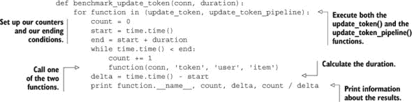

当我们在具有给定可用带宽（千兆比特或兆比特）和延迟的各种连接上运行基准函数时，我们得到表 4.4 中所示的数据。

##### 表 4.4. 不同类型连接的管道和非管道连接的性能。对于高速连接，我们将倾向于运行单个处理器在 Redis 中编码/解码命令的性能极限。对于较慢的连接，我们将运行带宽和/或延迟的极限。

| 描述 | 带宽 | 延迟 | 每秒 update_table()调用次数 | 每秒 update_table_pipeline()调用次数 |
| --- | --- | --- | --- | --- |
| 本地机器，Unix 域套接字 | >1 千兆比特 | 0.015 毫秒 | 3,761 | 6,394 |
| 本地机器，localhost | >1 千兆比特 | 0.015 毫秒 | 3,257 | 5,991 |
| 远程机器，共享交换机 | 1 千兆比特 | 0.271 毫秒 | 739 | 2,841 |
| 远程机器，通过 VPN 连接 | 1.8 兆比特 | 48 毫秒 | 3.67 | 18.2 |

观察表格，请注意，对于高延迟连接，我们可以通过使用管道而不是不使用管道将性能提高五倍。即使是非常低延迟的远程连接，我们也能将性能提高近四倍。对于本地连接，我们实际上遇到了 Python 使用 Redis 协议发送和接收短命令序列的单核性能限制（我们将在第 4.6 节中更多地讨论这个问题）。

你现在知道如何在没有事务的情况下推动 Redis 表现得更好。除了使用管道之外，还有没有其他标准方法可以提高 Redis 的性能？

### 4.6. 性能考虑

当来自关系型数据库背景时，大多数用户会非常高兴地通过添加 Redis 将性能提高 100 倍或更多，以至于他们没有意识到他们可以使 Redis 的性能表现得更好。在前一节中，我们介绍了非事务性管道作为减少应用程序和 Redis 之间往返次数的一种方式。但如果我们已经构建了一个应用程序，并且我们知道它可以表现得更好，我们应该怎么办？我们如何找到提高性能的方法？

在 Redis 中提高性能需要了解我们发送到 Redis 的命令类型方面的性能预期。为了更好地了解 Redis 的预期性能，我们将快速运行 Redis 中包含的基准测试，即 `redis-benchmark`，如代码列表 4.10 所示。请随意探索 `redis-benchmark` 以发现您服务器和 Redis 的性能特征。

##### 列表 4.10\. 在 Intel Core-2 Duo 2.4 GHz 桌面上运行 `redis-benchmark`

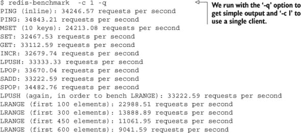

`redis-benchmark` 的输出显示了一组在 Redis 中通常使用的命令，以及每秒可以运行的该类型命令的数量。在没有任何选项的情况下运行此基准测试将尝试使用 50 个客户端将 Redis 推向其极限，但与多个客户端相比，将单个基准测试客户端的性能与我们的客户端的一个副本进行比较要容易得多。

在查看 `redis-benchmark` 的输出时，我们必须小心不要直接将其输出与我们的应用程序的性能进行比较。这是因为 `redis-benchmark` 实际上并没有处理它执行的命令的结果，这意味着一些需要大量解析开销的响应结果没有被考虑在内。通常，与使用单个客户端运行的 `redis-benchmark` 相比，我们可以预期 Python Redis 客户端在调用复杂命令时，其性能大约是 `redis-benchmark` 对单个客户端和非管道命令报告的 50–60%。

如果您发现您的命令运行速度大约是您预期的 `redis-benchmark` 速度的一半（大约是 `redis-benchmark` 报告的 25–30%），或者如果您收到“无法分配请求的地址”的错误报告，您可能意外地为每个命令创建了一个新的连接。

我列出了一些相对于单个 `redis-benchmark` 客户端使用 Python 客户端时的性能数据，并描述了一些可能导致性能下降和/或错误的最可能原因，见表 4.5。

##### 表 4.5\. 与单个 `redis-benchmark` 客户端的一般性能比较表以及可能导致潜在性能下降的原因

| 性能或错误 | 可能原因 | 解决方案 |
| --- | --- | --- |
| 单个客户端的 50–60% 的 redis-benchmark | 无管道时的预期性能 | 无需操作 |
| 单个客户端的 25–30% 的 redis-benchmark | 每个命令/命令组都进行连接 | 重复使用您的 Redis 连接 |
| 客户端错误：“无法分配请求的地址” | 每个命令/命令组都进行连接 | 重复使用您的 Redis 连接 |

这份可能的性能问题和解决方案列表很短，但这些问题的数量占到了用户定期报告的性能相关问题的 95% 以上（除了使用 Redis 数据结构不正确之外）。如果我们遇到难以诊断的减速，并且我们知道它不是 表 4.5 中列出的问题之一，我们应该通过 第 1.4 节 中描述的某种方式请求帮助。

大多数访问 Redis 的客户端库都内置了一定级别的连接池。对于 Python，我们只需要为每个需要连接的唯一 Redis 服务器创建一个 `redis.Redis()`（我们为每个使用编号数据库都需要创建一个新的连接）。`redis.Redis()` 对象本身将负责根据需要创建连接，重用现有连接，并丢弃超时的连接。按照目前的编写，Python 客户端连接池既线程安全也 `fork()` 安全。

### 4.7\. 摘要

通过本章，我们涵盖了可以帮助 Redis 保持良好性能同时确保数据在系统故障中安全性的主题。本章的前半部分主要讨论了使用持久化和复制来准备故障处理和故障处理。后半部分处理了防止数据损坏，使用管道提高性能，以及诊断潜在的性能问题。

如果您应该从本章中吸取两点，那么它们是：使用复制和只追加文件可以大大提高数据的安全性，以及使用 `WATCH`/`MULTI`/`EXEC` 可以防止多个客户端在相同数据上工作时数据被破坏。

希望我们在 第三章 中引入的 `WATCH`/`MULTI`/`EXEC` 的讨论能帮助您更好地理解如何充分利用 Redis 中的事务。在 第六章 中，我们将重新讨论事务，但现在让我们转到 第五章，在那里您将了解更多关于如何使用 Redis 来帮助系统管理任务的信息。

## 第五章\. 使用 Redis 支持应用程序

*本章涵盖*

+   将日志记录到 Redis

+   计数器和统计信息

+   从 IP 地址发现城市和国家

+   服务发现和配置

在上一章中，我们大部分时间都在讨论如何将 Redis 作为更大系统组的一部分保持运行。在本章中，我们将讨论如何使用 Redis 来支持您环境中的其他部分：从使用日志和计数器收集关于系统当前状态的信息，到发现使用您系统的客户端信息，一直到使用 Redis 作为目录来配置您的系统。

总体而言，本章提供了对系统在运行时操作的控制和洞察。在你阅读的过程中，请记住，我们正在寻求支持高级应用程序的持续运行——本章中构建的组件本身不是应用程序，而是将帮助支持这些应用程序。这种支持是通过记录有关应用程序和应用程序访问者的信息以及配置应用程序的方法来实现的。让我们看看我们可以通过日志记录添加的第一层监控。

### 5.1. 将日志记录到 Redis

随着我们构建应用程序和服务，能够发现有关运行系统的信息变得越来越重要。能够深入挖掘这些信息以诊断问题、在问题变得严重之前发现它们，或者仅仅是发现有关用户的信息——所有这些都需要记录日志。

在 Linux 和 Unix 的世界里，有两种常见的日志记录方法。第一种是将日志记录到文件中，随着时间的推移，我们将单个日志行写入文件，偶尔我们会写入到一个新文件中。已经编写了成千上万件软件来做这件事（包括 Redis 本身）。但是这种方法可能会遇到问题，因为我们有多个不同的服务正在将信息写入各种日志文件，每个文件都有不同的滚动方式，而且没有一种简单的方法可以轻松地处理所有日志文件并从中获取有用的信息。

几乎所有 Unix 和 Linux 服务器都运行在 TCP 和 UDP 端口 514 上的一个名为*syslog*的服务，这是第二种常见的日志记录方法。Syslog 接受任何向它发送消息的程序发送的日志消息，并将这些消息路由到各种磁盘日志文件中，处理旧日志的轮换和删除。通过配置，它甚至可以将消息转发到其他服务器进行进一步处理。作为一个服务，它比直接将日志记录到文件要方便得多，因为所有特殊的日志文件轮换和删除都已经为我们处理好了。

| |
| --- |

##### 替换 syslog

无论你最终是否使用这里描述的日志记录方法，你都应该考虑用`syslog-ng`替换你当前的 syslog 守护进程（可能是`Rsyslogd`）。在使用和配置了这两个系统之后，我发现`syslog-ng`提供的用于指导日志消息的配置语言更容易使用。尽管我没有足够的空间和时间在这本书中构建它，但构建一个消费 syslog 消息并将它们放入 Redis 的服务是一个很好的方法，可以在处理请求的当前需要发生的事情和可以稍后发生的事情（如日志记录或更新计数器）之间提供一层间接层。

| |
| --- |

由于 syslog 转发，在单个服务器上的文件中（感谢 syslog 转发）提供日志是一个很好的长期计划（记得备份它们）。在本节中，我们将讨论使用 Redis 作为保持更时间敏感的日志的方式，作为短期存储 syslog 消息的替代。我们第一次查看日志变化的方式是连续更新的最近日志消息流。

#### 5.1.1\. 近期日志

在构建系统时，知道需要记录什么可能会很困难。你是否每次有人登录时都记录？当他们注销时呢？你是否每次有人更改账户信息时都记录？或者你只记录错误和异常？我无法直接为你回答这些问题，但我可以提供一个方法，让你在 Redis 中保持最近日志消息的列表，这样你就可以在任何时候获取日志的快照视图。

为了保持最近日志的列表，我们将日志消息`LPUSH`到一个`LIST`中，然后将其修剪到固定大小。稍后，如果我们想读取日志消息，我们可以执行一个简单的`LRANGE`来获取消息。我们将采取一些额外的步骤来支持不同命名的日志消息队列和支持典型的日志严重级别，但如果你需要，你可以在自己的代码中移除其中任何一个。将最近日志写入 Redis 的代码将在下一列表中展示。

##### 列表 5.1\. `log_recent()`函数

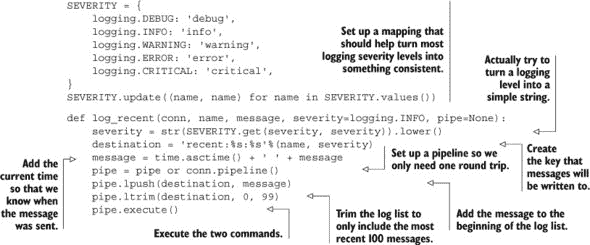

除了处理将不同日志级别转换为有用的字符串（如`info`和`debug`）的部分之外，`log_recent()`函数很简单——先进行一次`LPUSH`操作，然后进行一次`LTRIM`。现在你已经对当前正在发生的事情有了更好的了解，我们能否发现最常见（也许是最重要的）消息？

#### 5.1.2\. 常见日志

如果你一直在运行`log_recent()`，你可能会发现，虽然它对于了解当前正在发生的事情很有用，但它并不擅长告诉你是否有任何重要消息在噪音中丢失。通过记录特定消息出现的频率信息，然后你可以按发生的频率顺序查看消息，以帮助你确定什么重要。

知道一个消息出现频率的一种简单而实用的方法是将消息存储为`ZSET`的一个成员，其中分数表示消息出现的频率。为了确保我们只看到最近常见的消息，我们将每小时轮换一次常见消息的记录。为了不丢失*所有*内容，我们将保留前一个小时的常见消息。我们用于跟踪和轮换常见日志消息的代码将在下面展示。

##### 列表 5.2\. `log_common()`函数

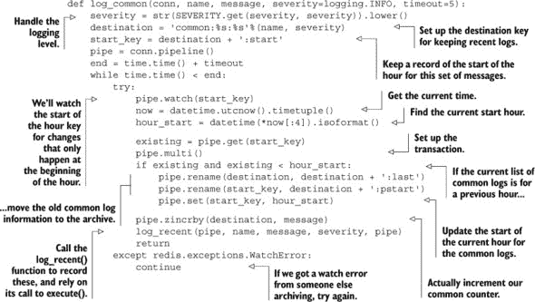

这个日志功能比最近的日志功能更复杂，主要是因为在处理旧日志时非常小心。这就是为什么我们使用了 `WATCH`/`MULTI`/`EXEC` 事务来重命名 `ZSET` 并重写告诉我们当前数据是哪个小时的键。我们还通过管道将 `log_recent()` 函数传递过去，以在跟踪常见和最近日志的同时最小化对 Redis 的往返次数。

现在我们已经开始通过存储最近和常见的日志来收集关于在 Redis 中运行软件的信息，那么还有哪些其他类型的信息对保留在 Redis 中会有用？

### 5.2\. 计数器和统计数据

就像你在第二章中看到的那样，当我介绍了计数单个页面访问的概念，拥有基本的点击次数信息可以（例如）改变我们选择缓存的方式。但我们的第二章中的例子非常简单，现实很少那么简单，尤其是在涉及到真实网站的时候。

我们网站在过去的 5 分钟内收到了 10,000 次点击，或者数据库在过去的 5 秒内处理了 200 次写入和 600 次读取，这些是有用的信息。如果我们能够随着时间的推移看到这些信息，我们就可以注意到流量突然或逐渐的增加，预测何时需要服务器升级，并最终避免因系统过载而导致的停机。

本节将介绍两种不同的方法来记录 Redis 中的计数器和统计数据，并通过讨论如何简化我们示例统计数据的收集来结束。这两个示例都由实际的使用案例和需求驱动。我们在应用内省之路上的下一个目的地是收集 Redis 中的时间序列计数器。

#### 5.2.1\. 在 Redis 中存储计数器

随着我们监控我们的应用程序，能够随着时间的推移收集信息变得越来越重要。代码更改（可能会影响我们网站响应的速度，从而影响我们服务的页面数量），新的广告活动，或新用户到我们的系统中，都可能极大地改变网站上加载的页面数量。随后，许多其他性能指标可能会改变。但如果我们没有记录任何指标，那么我们就无法知道它们是如何变化的，或者我们是在变得更好还是更差。

为了开始收集用于监控和分析的指标，我们将构建一个工具来随着时间的推移保持命名的计数器（例如 *site hits*、*sales* 或 *database queries* 的计数器可能至关重要）。每个计数器都将存储最近 120 个样本，以各种时间精度（如 1 秒、5 秒、1 分钟等）存储。样本的数量和记录精度的选择可以根据需要定制。

保持计数器的第一步实际上是存储计数器本身。

##### 更新计数器

为了更新计数器，我们需要存储实际的计数器信息。对于每个计数器和精度，例如 *网站点击* 和 *5 秒*，我们将保留一个 `HASH`，其中存储了每个 5 秒时间切片内发生的网站点击次数。`HASH` 中的键将是时间切片的开始，值将是点击次数。图 5.1 展示了一个具有 5 秒时间切片的点击计数器的数据选择。

##### 图 5.1\. 一个 `HASH`，显示了 2012 年 5 月 7 日上午 7:40 左右 5 秒时间切片内的网页点击次数

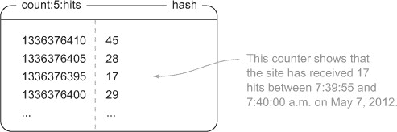

当我们开始使用计数器时，我们需要记录哪些计数器已被写入，以便我们可以清除旧数据。为此，我们需要一个有序序列，它允许我们逐个迭代其条目，并且不允许重复。我们可以使用 `LIST` 与 `SET` 结合，但这将需要额外的代码和 Redis 的往返。相反，我们将使用 `ZSET`，其中成员是已写入的精度和名称的组合，分数都是 0。通过在 `ZSET` 中将所有分数设置为 0，Redis 将尝试按分数排序，由于它们都相等，因此将按成员名称排序。这为我们给定的一组成员提供了一个固定顺序，这将使它们按顺序扫描变得容易。一个已知的计数器的 `ZSET` 示例可以在 图 5.2 中看到。

##### 图 5.2\. 一个 `ZSET`，显示了某些已知的计数器

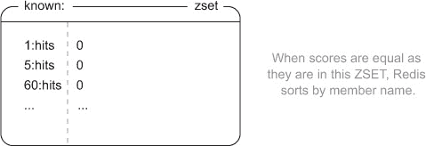

现在我们知道了计数器的结构是什么样的，接下来会发生什么呢？对于每个时间切片精度，我们将向已知的 `ZSET` 添加对精度和计数器名称的引用，并将适当的时窗计数增加适当的 `HASH` 中的计数。我们的更新计数器的代码如下。

##### 列表 5.3\. `update_counter()` 函数

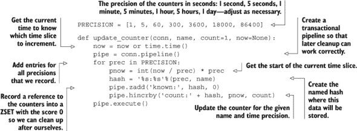

更新计数器信息并不那么糟糕；只需为每个时间切片精度执行一个 `ZADD` 和 `HINCRBY`。并且获取命名计数器和特定精度的信息也很简单。我们使用 `HGETALL` 获取整个 `HASH`，将我们的时间切片和计数器转换回数字（它们都作为字符串返回），按时间排序，并最终返回值。下一个列表显示了获取计数器数据的代码。

##### 列表 5.4\. `get_counter()` 函数

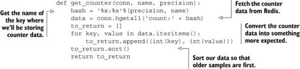

我们确实做了我们所说的。我们获取了数据，根据时间顺序排列，并将其转换回整数。让我们看看我们是如何防止这些计数器保留太多数据的。

##### 清理旧计数器

现在我们已经将所有计数器写入 Redis，并且可以轻松地获取我们的计数器。但是，随着我们更新计数器，如果我们不执行任何清理，我们最终会耗尽内存。因为我们事先考虑到了这一点，所以我们把我们已知的计数器列表写入到已知的 `ZSET` 中。要清理计数器，我们需要遍历这个列表并清理旧条目。

| |
| --- |

##### 为什么不使用 `EXPIRE` 命令呢？

`EXPIRE` 命令的一个限制是它只适用于整个键；我们无法使键的部分过期。而且因为我们选择将数据结构化，使得计数器 X 的精度 Y 在所有时间都存储在单个键中，我们必须定期清理计数器。如果你有雄心壮志，你可能想尝试重新结构化计数器，以改变数据布局以使用标准的 Redis 过期机制。

| |
| --- |

在处理和清理旧计数器时，有一些事情需要注意。以下列表显示了一些我们在清理旧计数器时需要特别注意的重要事项：

+   新的计数器可以随时添加。

+   可能会同时进行多次清理。

+   每分钟尝试清理每日计数器是一种浪费。

+   如果计数器没有更多数据，我们就不应该再尝试清理它。

考虑到所有这些因素，我们将构建一个类似于我们在第二章中编写的守护进程函数。像以前一样，我们将反复循环，直到系统被告知退出。为了帮助在清理期间最小化负载，我们将尝试大约每分钟清理一次旧计数器，并且也会按照它们创建新条目的大致时间表来清理旧计数器，除了每分钟获得新条目次数超过一次的计数器。如果一个计数器的时长为 5 分钟，我们将尝试每 5 分钟从这个计数器中清理旧条目。对于新条目频率更高的计数器（在我们的例子中是 1 秒和 5 秒），我们将每分钟清理一次。

要遍历计数器，我们将使用 `ZRANGE` 逐个获取已知的计数器。要清理计数器，我们将获取给定计数器的所有起始时间，计算哪些项目是在计算截止时间（120 个样本之前）之前的，并将它们删除。如果给定计数器没有更多数据，我们将从已知的 `ZSET` 中删除计数器引用。解释这个过程很简单，但代码的细节显示了某些边缘情况。查看此列表以详细了解清理代码。

##### 列表 5.5. `clean_counters()` 函数

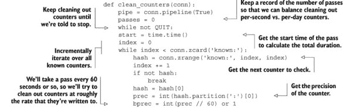


如前所述，我们逐个遍历计数器的`ZSET`，寻找需要清理的项目。我们只清理这次遍历中应该清理的计数器，因此我们提前进行这个检查。然后我们获取计数器数据并确定（如果有的话）应该清理什么。在必要时清理旧数据后，如果我们认为不应该有任何剩余数据，我们将验证计数器没有更多数据，并将其从我们的计数器`ZSET`中删除。最后，在遍历所有计数器之后，我们计算完成一次遍历所需的时间，然后睡去剩余的分钟，直到下一次遍历。

现在我们有了计数器数据，正在对其进行清理，并且可以获取它，现在的问题只是构建一个用于消费数据的接口。遗憾的是，这部分内容超出了本书的范围，但有一些可用的 JavaScript 绘图库可以帮助你在网络端进行（我在个人和专业使用中与 jqplot [[`www.jqplot.com/`](http://www.jqplot.com/)]、Highcharts [[`www.highcharts.com/`](http://www.highcharts.com/)]、dygraphs [[`dygraphs.com/`](http://dygraphs.com/)]和 D3 [[`d3js.org/`](http://d3js.org/)]有很好的体验）。

在处理真实网站中的复杂深度时，知道一个页面每天被点击数千次可以帮助我们决定该页面应该被缓存。但如果该页面渲染需要 2 毫秒，而另一个页面流量只有十分之一，但渲染需要 2 秒，我们则可以将注意力转向优化较慢的页面。在下一节中，我们将方法从保持精确的计数器（它给我们随时间变化的数据）转变为保持汇总统计数据，以帮助我们做出更细致的优化决策。

#### 5.2.2. 在 Redis 中存储统计数据

实话实说，我个人已经实现了五种不同的在 Redis 中存储统计数据的方法。这里描述的方法从那些方法中吸取了许多好的想法，并以一种允许最大灵活性和扩展机会的方式将它们结合起来。我们将要构建什么？

我们将构建一个方法来存储与我们的`log_common()`函数（第 5.1.2 节中的当前小时和上一小时）具有相似范围的统计数据。我们将收集足够的信息来跟踪记录的最小值、最大值、平均值、标准差、样本计数和值的总和。我们记录如此多的信息是因为我们可以几乎保证，如果我们没有记录它，我们可能需要它。

对于给定的命名上下文和类型，我们将在`ZSET`中存储一组值。我们不会使用`ZSET`来排序分数，而是使用其与其他`ZSET`进行并集的能力，仅保留交集中项目的`MIN`或`MAX`。我们将为该上下文和类型存储的精确信息是最小值、最大值、值的计数、值的总和以及值的平方和的总和。有了这些信息，我们可以计算平均值和标准差。图 5.3 显示了`ProfilePage`上下文中包含此信息的`ZSET`示例，以及`AccessTime`的统计信息。

##### 图 5.3.配置文件页面的示例访问时间统计。记住，`ZSET`是按分数排序的，这就是为什么我们的顺序看起来与我们描述的不一样。

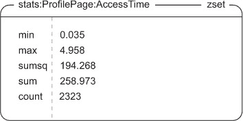

既然我们已经知道了将要存储的数据类型，我们该如何将这些数据放入其中呢？我们将像处理我们常见的日志一样开始，检查当前数据是否为正确的小时，如果不是，则将旧数据移动到存档中。然后，我们将构建两个临时的`ZSET`——一个包含最小值，另一个包含最大值——并使用`ZUNIONSTORE`将它们与当前的统计信息结合，分别进行`MIN`和`MAX`的聚合。这将使我们能够快速更新数据，而无需`WATCH`一个可能频繁更新的统计键。在清理这些临时`ZSET`之后，我们将然后对`statsZSET`的`count`、`sum`和`sumsq`成员执行`ZINCRBY`操作。执行此操作的代码如下所示。

##### 列表 5.6. `update_stats()`函数

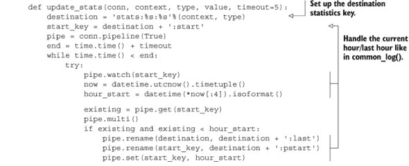

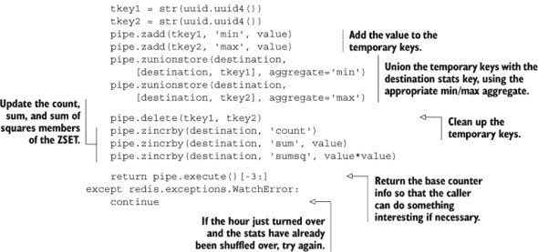

我们可以忽略代码列表的前半部分，因为它是我们`log_common()`函数中滚动代码的逐字复制，来自第 5.1.2 节。后半部分正好做了我们描述的事情：创建临时的`ZSET`，使用适当的聚合与目标`ZSET`进行`ZUNIONSTORE`操作，清理临时`ZSET`，然后添加我们的标准统计信息。但是，关于如何提取统计信息呢？

为了提取信息，我们需要从`ZSET`中提取所有值，然后计算平均值和标准差。平均值简单地是`sum`成员除以`count`成员。但标准差更复杂。通过一些工作，我们可以从我们拥有的信息中推导出标准差，尽管为了简洁起见，我不会解释背后的数学。我们获取统计信息的代码如下所示。

##### 列表 5.7. `get_stats()`函数

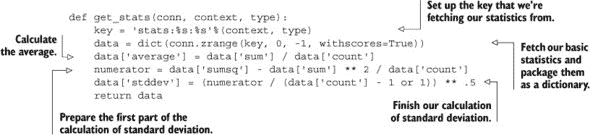

除了计算标准差之外，`get_stats()`函数并不令人惊讶。对于那些花了一些时间研究标准差维基百科页面的人来说，甚至计算标准差也不应该那么令人惊讶。但是，由于所有这些统计信息都被存储起来，我们如何知道应该查看哪些信息呢？我们将在下一节回答这个问题以及更多问题。

#### 5.2.3\. 简化我们的统计记录和发现

现在我们已经将统计数据存储在 Redis 中——接下来是什么？更具体地说，现在我们有了关于（例如）每个页面的访问时间的信息，我们如何发现哪些页面的平均生成时间较长？或者我们如何知道生成页面比以往任何时候都要长？简单的答案是，我们需要以让我们发现这两种情况发生的方式存储更多信息，我们将在本节中探讨这一点。

如果我们要记录访问时间，那么我们需要计算访问时间。我们可以花费时间在各个地方添加访问时间计算，然后添加代码来记录访问时间，或者我们可以实现一些帮助我们计算和记录访问时间的功能。同样的辅助工具还可以使这些信息在（例如）最慢的页面访问`ZSET`中可用，甚至可以报告与其他访问时间相比访问时间较长的页面。

为了帮助我们计算和记录访问时间，我们将编写一个 Python 上下文管理器^([1])，它将包装我们想要计算和记录访问时间的代码。这个上下文管理器将获取当前时间，让包装的代码执行，然后计算执行的总时间，将其记录在 Redis 中，并更新最高访问时间上下文的`ZSET`。下面的列表显示了执行这些操作的上下文管理器。

> ¹ 在 Python 中，*上下文管理器*是一个特别定义的函数或类，它会在执行给定代码块之前和之后执行其部分。例如，这允许轻松打开文件并自动关闭文件。

##### 列表 5.8\. `access_time()`上下文管理器

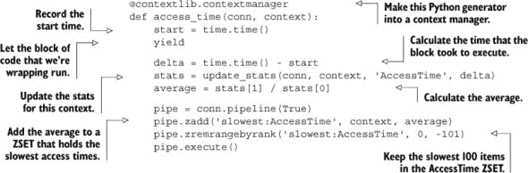

在`access_time()`上下文管理器中发生了一些魔法般的事情，看到它实际应用可能会帮助我们理解其工作原理。以下代码展示了如何使用`access_time()`上下文管理器来记录通过类似回调方法（作为中间件或插件的一部分）提供的网页的访问时间，这些方法在我们第二章的示例中使用过：


即使你还不理解如何创建上下文管理器，看到这个例子后，你也应该至少知道如何使用它。在这个例子中，我们使用了访问时间上下文管理器来计算生成网页的总时间。这个上下文管理器也可以用来记录数据库查询所需的时间或渲染模板所需的时间。作为一个练习，你能想到其他类型的上下文管理器，它们可以记录有用的统计数据吗？或者你能在`recent_log()`中添加报告超过平均两个标准差以上的访问时间？

| |
| --- |

##### 在现实世界中收集统计数据和计数器

我知道我们刚刚花费了几页的篇幅来讨论如何收集关于我们生产系统操作的重要统计数据，但让我提醒你，有一些现成的软件包是专门用于收集和绘制计数器和统计数据的。我个人最喜欢的是 Graphite ([`graphite.wikidot.com/`](http://graphite.wikidot.com/))，在你花费太多时间构建自己的数据绘图库之前，你可能需要下载并安装它。

| |
| --- |

现在我们已经将关于我们应用程序状态的各种重要信息记录到 Redis 中，了解更多的访客信息可以帮助我们回答其他问题。

### 5.3\. IP 到城市和国家的查找

当我们在 Redis 中收集统计数据和日志时，我们一直在收集关于我们系统中访客行为的资料。但我们一直忽略了访客行为中最重要的一部分——访客来自哪里。在本节中，我们将构建一组函数，我们可以使用这些函数来解析 IP 到位置数据库，并且我们将编写一个函数来查找 IP 地址以确定访客的城市、地区（州）和国家。让我们来看一个例子。

随着假游戏公司游戏的访客数量增加，玩家来自世界各地来访问和玩游戏。尽管像 Google Analytics 这样的工具已经帮助假游戏公司了解他们的用户来自哪些主要国家，但他们想了解城市和州以更好地了解他们的用户。我们的任务是使用 IP 地址到城市数据库之一，并将其与 Redis 结合，以发现玩家的位置。

我们使用 Redis 而不是典型的关系型数据库，因为 Redis 通常在这些（以及其他）用例中会更快。我们使用 Redis 而不是本地查找表，因为定位用户所需的信息量足够大，以至于在应用程序启动时加载表是一个相对昂贵的操作。要开始使用我们的查找表，我们首先需要将表加载到 Redis 中。

#### 5.3.1\. 加载位置表

对于开发数据，我已经下载了来自 [`dev.maxmind.com/geoip/geolite`](http://dev.maxmind.com/geoip/geolite) 的免费 IP 到城市数据库。此数据库包含两个重要文件：GeoLiteCity-Blocks.csv，其中包含 IP 地址范围和这些范围的城市 ID 的信息，以及 GeoLiteCity-Location.csv，其中包含城市 ID 到城市名称、地区/州/省名称、国家名称以及一些我们不会使用的信息的映射。

我们首先构建一个查找表，使我们能够将 IP 地址转换为城市 ID。然后我们构建第二个查找表，使我们能够将城市 ID 转换为实际的城市信息（城市信息还将包括地区和国家信息）。

允许我们找到 IP 地址并将其转换为城市 ID 的表将从单个 `ZSET` 构建，该 `ZSET` 以特殊城市 ID 作为成员，并以 IP 地址的整数值作为分数。为了使我们能够从 IP 地址映射到城市 ID，我们将点分十进制格式的 IP 地址转换为整数分数，通过将每个八位字节作为无符号 32 位整数中的一个字节，第一个八位字节是最高位。执行此操作的代码如下。

##### 列表 5.9\. `ip_to_score()` 函数

```
def ip_to_score(ip_address):
    score = 0
    for v in ip_address.split('.'):
        score = score * 256 + int(v, 10)
    return score
```

在我们获得分数后，首先会将 IP 地址映射到城市 ID。为了从每个普通城市 ID 构建一个唯一的城市 ID（因为多个 IP 地址范围可以映射到同一个城市 ID），我们会在 `_` 字符后面附加已经添加到 `ZSET` 中的条目数量，如下一列表所示。

##### 列表 5.10\. `import_ips_to_redis()` 函数

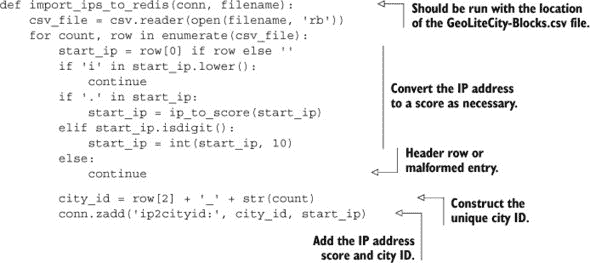

当我们通过调用 `import_ips_to_redis()` 函数将所有 IP 地址加载后，我们将创建一个 `HASH`，将城市 ID 映射到城市信息，如下一列表所示。我们将以 JSON 编码的列表形式存储城市信息，因为我们的条目都是固定格式，并且不会随时间改变。

##### 列表 5.11\. `import_cities_to_redis()` 函数

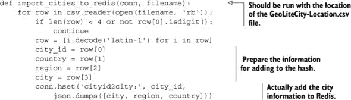

现在我们已经将所有信息存储在 Redis 中，我们可以开始查找 IP 地址。

#### 5.3.2\. 查找城市

为了支持查找 IP 地址，我们在 `ZSET` 中添加了整数分数来表示给定城市 ID 的 IP 地址范围的开始。为了找到给定 IP 地址的城市，我们将 IP 地址映射到类似计算出的分数，然后找到具有最大起始 IP 地址小于或等于我们传递的 IP 地址的城市 ID。我们可以使用 `ZREVRANGEBYSCORE` 并将可选的 `START` 和 `NUM` 参数分别设置为 0 和 1 来获取此信息。在我们发现城市 ID 后，我们可以从我们的 `HASH` 中获取城市信息。我们用于查找 IP 地址所在城市的函数如下。

##### 列表 5.12\. `find_city_by_ip()` 函数


我们现在可以根据 IP 地址查找城市信息，并开始分析我们的用户来自哪里。这种将数据转换为整数以用于`ZSET`的方法很有用，可以极大地简化单个项目或范围的发现。我们将在第七章中更多地讨论这类数据转换。但就目前而言，让我们看看如何使用 Redis 帮助我们找到并连接到其他服务器和服务。

### 5.4\. 服务发现和配置

随着你对 Redis 和其他服务的使用随着时间的推移而增长，你最终会面临一个情况，即保持配置信息可能会变得难以控制。当你只有一个 Redis 服务器、一个数据库服务器和一个 Web 服务器时，这并不是什么大问题。但是，当你有一个 Redis 主服务器和一些从服务器，或者为不同的应用程序有不同的 Redis 服务器，甚至有主从数据库服务器时，保持所有这些配置可能会变得很麻烦。

通常情况下，连接到不同服务和服务器所需的配置信息包含在存储在磁盘上的配置文件中。在机器故障、网络连接中断或其他原因导致我们需要连接到不同的服务器时，我们通常需要更新多个位置中的一个或多个配置文件。在本节中，我们将讨论如何将大部分配置从文件中移出，放入 Redis 中，这将使应用程序几乎可以自行配置。

让我们从简单的实时配置开始，看看 Redis 如何帮助我们。

#### 5.4.1\. 使用 Redis 存储配置信息

为了了解配置管理可能有多困难，我们只需看看最简单的配置：一个标志来告诉我们的 Web 服务器我们是否在维护中。如果是这样，我们就不应向数据库发送请求，而应向访客返回一个简单的“抱歉，我们正在维护中；稍后再试”的消息。如果网站不在维护中，所有正常的 Web 服务行为都应该发生。

在典型情况下，更新那个单个标志可能会迫使我们向所有 Web 服务器推送更新的配置文件，并可能迫使我们重新加载所有服务器的配置，如果不是迫使我们的应用程序服务器重启。

而不是试图随着服务数量的增长编写和维护配置文件，让我们将配置写入 Redis。通过将配置放入 Redis 并将我们的应用程序编写为从 Redis 获取配置信息，我们不再需要编写推送配置信息的工具，并导致我们的服务器和服务重新加载该配置。

为了实现这种简单的行为，我们假设我们已经构建了一个中间件层或插件，就像我们在第二章中用于缓存的那样，如果简单的`is_under_maintenance()`函数返回`True`，它将返回我们的维护页面；如果返回`False`，它将像正常一样处理请求。我们的实际函数将检查一个名为`is-under-maintenance`的键。如果该键中存储了任何值，我们将返回`True`；否则，我们返回`False`。为了帮助减少在 Web 服务器负载下对 Redis 的负载（因为人们喜欢在得到维护页面时刷新），我们只每秒更新一次信息。我们的函数可以在下面的列表中看到。

##### 列表 5.13\. `is_under_maintenance()`函数

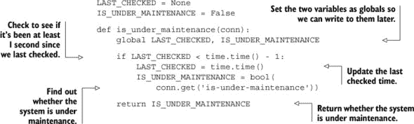

将该功能插入到我们应用程序的正确位置后，我们可以在 1 秒内影响数千个 Web 服务器的行为。我们选择 1 秒是为了帮助减少对 Redis 的负载，这对于流量非常大的网站来说是有帮助的，但如果我们的需求需要更快的更新，我们可以减少或移除该功能的一部分。这看起来像是一个玩具示例，但它展示了将配置信息保存在一个常用位置中的力量。但关于更复杂的配置选项呢？

#### 5.4.2\. 每个应用程序组件一个 Redis 服务器

在我们不断增加 Redis 的使用过程中，无数的开发者发现，在某个时刻，我们会超出我们最初的一个 Redis 服务器。也许我们需要记录更多信息，也许我们需要更多的缓存空间，或者也许我们已经跳到了下一章中描述的更高级的服务之一。无论出于什么原因，我们都需要更多的服务器。

为了帮助简化向更多服务器过渡的过程，我建议为应用程序的每个独立部分运行一个 Redis 服务器——一个用于日志记录，一个用于统计，一个用于缓存，一个用于 cookies，等等。请注意，您可以在一台机器上运行多个 Redis 服务器；它们只需要在不同的端口上运行。或者，如果您想减少系统管理负担，您也可以在 Redis 中使用不同的“数据库”。无论如何，通过将不同的数据分散到不同的键空间中，您向更多或更大的服务器过渡的过程将得到一定程度的简化。不幸的是，随着服务器和/或 Redis 数据库数量的增加，管理和分配所有这些服务器的配置信息变得更加繁琐。

在上一节中，我们使用了 Redis 作为我们配置信息的来源，以确定是否应该提供维护页面。我们同样可以使用 Redis 来获取关于其他 Redis 服务器的信息。更具体地说，让我们使用一个已知的 Redis 服务器作为配置信息的目录，以发现如何连接到所有提供不同应用程序或服务组件数据的其他 Redis 服务器。在此过程中，我们将以这种方式构建它，以便当配置发生变化时，我们将连接到正确的服务器。我们的实现将比这个示例所要求的更通用，但我相信，在你开始使用这种方法获取配置信息后，你将开始将其用于非 Redis 服务器和服务。

我们将构建一个函数，它将从以服务类型和该服务针对的应用程序组件命名的键中获取 JSON 编码的配置值。例如，如果我们想获取存储统计数据的 Redis 服务器的连接信息，我们将获取键 `config:redis:statistics`。以下列表显示了设置配置的代码。

##### 列表 5.14. `set_config()` 函数

```
def set_config(conn, type, component, config):
    conn.set(
        'config:%s:%s'%(type, component),
        json.dumps(config))
```

使用这个 `set_config()` 函数，我们可以设置任何可 JSON 编码的配置。通过语义的轻微变化以及一个与我们的早期 `is_under_maintenance()` 函数结构相似的 `get_config()` 函数，我们可以替换 `is_under_maintenance()`。请参考以下列表，以获取与 `set_config()` 匹配的函数，并允许我们根据需要本地缓存配置信息 1 秒、10 秒或 0 秒。

##### 列表 5.15. `get_config()` 函数

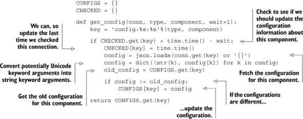

现在我们已经有一对获取和设置配置的函数，我们可以更进一步。我们开始存储和检索配置，以便设置和创建连接到各种不同的 Redis 服务器。但到目前为止，我们几乎每个函数的第一个参数都是一个连接参数。而不是需要手动获取我们使用的各种服务的连接，让我们构建一个方法来帮助我们自动连接到这些服务。

#### 5.4.3. 自动 Redis 连接管理

手动创建和传递 Redis 连接可能会很困难。我们不仅需要反复引用配置信息，而且如果我们使用上一节中的配置管理函数，我们仍然需要获取配置，连接到 Redis，并在完成后以某种方式处理连接。为了简化所有这些连接的管理，我们将编写一个装饰器，它将负责连接到我们所有的 Redis 服务器（除了配置服务器）。

| |
| --- |

##### 装饰器

在 Python 中，有一种将函数 X 传递给另一个函数 Y 的语法。这个函数 Y 被称为*装饰器*。装饰器有机会改变函数 X 的行为。一些装饰器验证参数，其他装饰器注册回调，甚至还有其他装饰器管理连接，就像我们打算做的那样。

| |
| --- |

我们的装饰器将接受一个命名配置作为参数，这将生成一个包装器，当在实际函数上调用时，将包装该函数，使得后续调用将自动连接到适当的 Redis 服务器，并且该连接将连同后来提供的所有其他参数一起传递给包装函数。下一列表中包含了我们的`redis_connection()`函数的源代码。

##### 列表 5.16。`redis_connection()`函数/装饰器


| |
| --- |

##### 结合`*args`和`**kwargs`

在第一章中，我们首先了解了 Python 中的默认参数。但在这里，我们正在结合两种不同的参数传递形式。如果你理解起来有困难（这本质上是在函数定义中的`args`和`kwargs`变量中捕获所有位置参数和命名参数，并将所有位置参数和命名参数传递给被调用的函数），那么你应该花些时间通过这个缩短的 URL 学习 Python 语言教程：[`mng.bz/KM5x`](http://mng.bz/KM5x)。

| |
| --- |

我知道这个嵌套函数组一开始可能会让人感到困惑，但实际上并没有那么糟糕。我们有一个函数，`redis_connection()`，它接受命名应用程序组件并返回一个包装函数。然后，这个包装函数被用来调用我们想要传递连接的函数（即包装函数），然后返回函数调用者。这个调用者处理获取配置信息、连接到 Redis 和调用我们的包装函数的所有工作。虽然描述起来很复杂，但实际上使用它很方便，就像你在下一列表中看到的那样，将其应用于第 5.1.1 节中的`log_recent()`函数。

##### 列表 5.17。装饰过的`log_recent()`函数

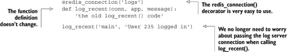

| |
| --- |

##### 装饰器

除了列表 5.16 中的`*args`和`**kwargs`的奇怪参数传递之外，我们还使用了语法来“装饰”日志函数。也就是说，我们传递一个函数给装饰器，装饰器在返回原始函数或其它东西之前对函数进行一些操作。你可以阅读有关正在发生的事情及其原因的详细信息，请参阅[`www.python.org/dev/peps/pep-0318/`](http://www.python.org/dev/peps/pep-0318/)。

| |
| --- |

现在你已经看到了如何在`log_recent()`上使用`redis_connection()`装饰器，它并不那么糟糕，对吧？有了这种更好的处理连接和配置的方法，我们几乎从我们将要调用的每个函数中移除了一小部分代码。作为一个练习，尝试将这个装饰器添加到第 5.2.3 节中的`access_time()`上下文管理器中，这样我们就不需要传递连接了。请随意将此装饰器与其他书中的所有其他示例一起重用。

### 5.5. 摘要

本章中我们直接或间接讨论的所有主题都是为了支持应用程序而编写的。这些函数和装饰器旨在帮助您随着时间的推移开始使用 Redis 作为支持应用程序不同部分的方式。日志记录、计数器和统计信息可以提供对应用程序性能的直接洞察。IP 到位置查找可以告诉您您的消费者位于何处。存储服务发现和配置可以节省大量精力，因为不需要手动处理连接。

现在我们已经为支持 Redis 中的应用程序打下了坚实的基础，第六章将继续沿着这条路径深入到可以作为应用程序构建块使用的功能。

## 第六章. Redis 中的应用组件

*本章涵盖*

+   构建两个前缀匹配自动完成方法

+   创建分布式锁以提升性能

+   开发用于控制并发的计数信号量

+   适用于不同用例的两个任务队列

+   用于延迟消息传递的拉取消息

+   处理文件分发

在过去的几章中，我们介绍了一些基本用例和工具，以帮助在 Redis 中构建应用程序。在本章中，我们将探讨更多有用的工具和技术，致力于在 Redis 中构建更大的应用程序组件。

我们将首先构建自动完成函数，以便快速在短列表和长列表中查找用户。然后，我们将花一些时间仔细构建两种不同类型的锁，以减少数据竞争，提高性能，防止数据损坏，并减少浪费的工作。我们将构建一个延迟任务队列，稍后将其增强以允许使用我们刚刚创建的锁在特定时间执行任务。在任务队列的基础上，我们将构建两个不同的消息系统，以提供点对点和广播消息服务。然后，我们将重用第五章中较早的 IP 地址到城市/国家查找，并将其应用于通过 Redis 存储和分发的数十亿条日志条目。

每个组件都提供了可用的代码和解决方案，用于解决在两个示例公司背景下这些特定问题的解决方案。但我们的解决方案包含可用于其他问题的技术，并且我们的特定解决方案可以应用于各种个人、公共或商业项目。

首先，让我们看看一个名为假游戏公司的虚构网络游戏公司，该公司目前在 YouTwitFace（一个虚构的社会网络）上拥有超过一百万的日活跃玩家。稍后我们将探讨一个名为假车库创业公司的虚构网络/移动初创公司，它提供移动和网页即时通讯服务。

### 6.1. 自动完成

在网络世界中，*自动完成*是一种允许我们快速查找我们想要找到的东西的方法，而无需搜索。通常，它是通过获取我们输入的字母并找到所有以这些字母开头的单词来工作的。一些自动完成工具甚至可以让我们输入短语的开头，然后为我们完成整个短语。例如，谷歌搜索中的自动完成显示贝蒂·怀特在周六夜现场（SNL）的亮相仍然很受欢迎，即使是在多年之后（这并不令人惊讶——她是个火花）。它显示了我们最近访问并希望重新访问的 URL，并帮助我们记住登录名。所有这些功能以及更多都是为了帮助我们更快地获取信息。其中一些，如谷歌的搜索框，背后支持着数以 TB 计的远程信息。其他一些，如我们的浏览器历史记录和登录框，背后支持着更小的本地数据库。但它们都能以更少的劳动为我们提供我们想要的东西。

在本节中，我们将构建两种不同的自动完成类型。第一种使用列表来记住用户最近沟通的 100 个联系人，试图最小化内存使用。我们的第二种自动完成提供了更好的性能和可扩展性，适用于更大的列表，但每个列表使用的内存更多。它们在结构、使用的方法以及操作完成所需的时间上有所不同。让我们首先从最近联系人的自动完成开始。

#### 6.1.1. 最近联系人自动完成

这个自动完成的目的是保留每个玩家最近接触过的用户列表。为了增加游戏的社会性，并让人们快速找到并记住优秀的玩家，假游戏公司正在为其客户创建一个联系人列表，以便记住每个用户最近聊天的 100 个人。在客户端，当有人尝试开始聊天时，他们可以开始输入他们想要聊天的人的名字，自动完成将显示以他们输入的字符开头的用户屏幕名列表。图 6.1 展示了这种自动完成的示例。

##### 图 6.1. 最近联系人自动完成示例，显示以*je*开头的用户

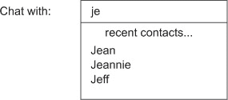

由于服务器上数百万的用户将各自拥有他们最近的 100 个联系人的列表，我们需要尽量减少内存使用，同时仍然提供快速添加和删除用户的能力。因为 Redis `LIST` 保持项目顺序的一致性，并且与一些其他结构相比，`LIST` 使用最少的内存，我们将使用它们来存储我们的自动完成列表。不幸的是，`LIST` 并没有提供足够的功能来在 Redis 内部实际执行自动完成，所以我们将实际的自动完成操作放在 Python 中执行。这让我们可以使用 Redis 以最少的内存存储和更新这些列表，而将相对容易的过滤操作留给 Python。

通常，我们需要对 Redis 执行三个操作来处理最近的联系人自动完成列表。第一个操作是添加或更新联系人，使他们成为最近联系的用户。要执行此操作，我们需要执行以下步骤：

> **1**. 如果存在，从列表中删除联系人。
> 
> **2**. 将联系人添加到列表的起始位置。
> 
> **3**. 如果列表现在有超过 100 项，则对其进行修剪。

我们可以使用 `LREM`、`LPUSH` 和 `LTRIM` 按此顺序执行这些操作。为了确保我们没有任何竞争条件，我们将使用 `MULTI`/`EXEC` 事务来包围我们的命令，就像我在第三章中描述的那样。完整的函数在接下来的列表中展示。

##### 列表 6.1\. `add_update_contact()` 函数


正如我提到的，我们从 `LIST` 中移除了用户（如果他们存在），然后将用户推送到 `LIST` 的左侧；然后我们修剪 `LIST` 以确保它不会超过我们的限制。

我们将要执行的第二个操作是，如果用户不想再能找到他们，就删除联系人。这是一个快速的 `LREM` 调用，如下所示：

```
def remove_contact(conn, user, contact):
    conn.lrem('recent:' + user, contact)
```

我们需要执行的最后一个操作是获取自动完成列表本身以找到匹配的用户。同样，由于我们将在 Python 中执行实际的自动完成处理，我们将获取整个 `LIST`，然后在 Python 中进行处理，如下所示。

##### 列表 6.2\. `fetch_autocomplete_list()` 函数


再次，我们获取整个自动完成 `LIST`，通过是否以必要的前缀开头进行过滤，并返回结果。这个特定的操作足够简单，以至于如果我们发现服务器在计算它上花费了太多时间，我们甚至可以将它推到客户端，只需要在更新时重新获取即可。

这种自动完成对于我们的特定例子来说将工作得很好。如果列表显著增大，它可能不会工作得很好，因为删除一个项目所需的时间与列表的长度成比例。但由于我们关注空间，并且明确将我们的列表限制在 100 个用户，它将足够快。如果你发现自己需要更大的最常使用或最少使用列表，你可以使用带有时间戳的`ZSET`。

#### 6.1.2. 地址簿自动完成

在上一个例子中，Redis 主要用于跟踪联系人列表，而不是实际执行自动完成。对于短列表来说，这是可以接受的，但对于较长的列表，检索成千上万或数百万个项目以找到少数几个将会是浪费。相反，对于包含许多项目的自动完成列表，我们必须在 Redis 内部找到匹配项。

回到“假游戏公司”，最近的联系人聊天自动完成是我们游戏中使用最频繁的社会功能之一。我们的第二大功能，游戏内邮件系统，正在逐渐受到关注。为了保持这种势头，我们将为邮件系统添加自动完成功能。但在我们的游戏中，我们只允许用户向与他们处于同一游戏内社交团体（我们称之为“公会”）的其他用户发送邮件。这有助于防止用户之间发送滥用和不请自来的信息。

公会可以扩展到数千名成员，所以我们不能使用我们旧的基于`LIST`的自动完成方法。但由于我们只需要每个公会一个自动完成列表，我们可以为每个成员使用更多的空间。为了最小化需要传输到正在自动完成的客户端的数据量，我们将在 Redis 内部使用`ZSET`执行自动完成前缀计算。

存储每个自动完成列表的方式将不同于你之前看到的其他`ZSET`使用方式。大多数情况下，我们将使用`ZSET`来快速判断一个项目是否在`ZSET`中，一个成员占据什么位置（或索引），以及快速从`ZSET`内部任何位置拉取一系列项目。这种使用方式的不同之处在于，我们所有的分数都将为零。通过将分数设置为零，我们使用了`ZSET`的二级特性：当分数相等时，`ZSET`按成员名称排序。当所有分数都是零时，所有成员将根据字符串的二元排序进行排序。为了实际执行自动完成，我们将插入小写的联系人名称。幸运的是，我们只允许用户在他们的名字中使用字母，所以我们不需要担心数字或符号。

我们该怎么办？让我们首先将名称视为一个排序后的字符串序列，如 `abc`、`abca`、`abcb`、... `abd`。如果我们正在寻找以 *abc* 为前缀的单词，我们实际上是在寻找在 `abbz`... 之后并且 `abd`... 之前的字符串。如果我们知道在 `abbz`... 之前的第一项和 `abd`... 之后的最后一项的排名，我们可以执行一个 `ZRANGE` 调用来获取它们之间的项。但是，因为我们不知道这两项中是否有任何一项存在，所以我们陷入了困境。为了摆脱困境，我们真正需要做的只是插入我们知道在 `abbz`... 之后并且 `abd`... 之前的项，找到它们的排名，执行我们的 `ZRANGE` 调用，然后移除我们的起始和结束成员。

好消息是，找到一个在 `abd` 之前但仍然在所有以 `abc` 为前缀的有效名称之后的项是很容易的：我们在前缀的末尾添加一个 `{`（左花括号）字符，得到 `abc{`。为什么是 `{`？因为它在 ASCII 码中是字母 *z* 后面的下一个字符。为了找到 `abc` 的起始范围，我们也可以将 `{` 添加到 `abb`，得到 `abb{`，但如果我们的前缀是 `aba` 而不是 `abc` 呢？我们如何找到一个在 `a` 之前的字符？我们从使用花括号中得到提示，并注意 ASCII 码中在 *a* 之前的是 `` ` ``（反引号）。所以如果我们的前缀是 `aba`，我们的起始成员将是 `` ab` ``，而我们的结束成员将是 `aba{`。

将所有这些放在一起，我们将通过将前缀的最后一个字符替换为它前面的字符来找到前缀的前驱。我们将通过连接一个花括号来找到前缀的后继。为了防止同时发生两个前缀搜索的问题，我们将一个花括号连接到我们的前缀（如果需要，用于后过滤端点项）。下面将展示一个可以生成这些类型范围的函数。

##### 列表 6.3\. `find_prefix_range()` 函数


我知道，花这么多段落描述我们要做什么，最后只留下几行实际实现它的代码，可能会让人感到惊讶。但如果我们看看我们在做什么，我们只是在我们的预排序字符序列中找到前缀的最后一个字符（使用 bisect 模块），然后查找它前面的字符。

| |
| --- |

##### 字符集和国际化

这种在 ASCII 中查找前后字符的方法对于只使用字符 *a*-*z* 的语言来说效果非常好。但是，当面对不在该范围内的字符时，你会遇到一些新的挑战。

首先，您需要找到一个方法将所有字符转换为字节；三种常见的编码包括 UTF-8、UTF-16 和 UTF-32（UTF-16 和 UTF-32 的大端和小端变体都被使用，但在此情况下只有大端版本有效）。其次，您需要找到您打算支持的字符范围，确保所选编码在编码版本中在您的支持范围之前至少留有一个字符，在所选范围之后也至少留有一个字符。第三，您需要使用这些字符来替换示例中的反引号字符 `` ` `` 和左花括号字符 `{`。

幸运的是，我们的算法并不关心字符的本地排序顺序，只关心编码。因此，您可以选择 UTF-8 或大端 UTF-16 或 UTF-32，使用空字符来替换反引号，并使用您的编码和语言支持的最大的值来替换左花括号。（某些语言绑定有些受限，只允许 UTF-16 最多到 Unicode 代码点 U+ffff，UTF-32 最多到 Unicode 代码点 U+2ffff。）

|  |
| --- |

在我们得到我们正在寻找的值的范围之后，我们需要将我们的结束点插入到 `ZSET` 中，找到这些新添加项目的排名，从中拉取一些项目（我们将最多获取 10 个项目以避免压倒用户），然后移除我们添加的项目。为了确保我们没有添加和移除相同的项，就像同一公会中的两个成员试图给同一用户发消息的情况一样，我们还将一个 128 位随机生成的 UUID 连接到我们的起始点和结束成员。为了确保当我们尝试查找和获取我们的范围时，`ZSET` 没有被更改，我们在插入端点后使用 `WATCH` 与 `MULTI` 和 `EXEC`。完整的自动完成功能在此处显示。

##### 列表 6.4\. `autocomplete_on_prefix()` 函数


大多数这个功能都是记账和设置。第一部分只是获取我们的起始点和结束点，然后将其添加到公会的自动完成 `ZSET` 中。当我们把所有东西都放在 `ZSET` 中后，我们 `WATCH` `ZSET` 以确保我们能够发现是否有人更改了它，获取起始点和结束点在 `ZSET` 中的排名，获取端点之间的项目，并在自己之后清理。

要添加和移除公会成员，很简单：我们只需要将用户从公会的 `ZSET` 中 `ZADD` 和 `ZREM`。这两个函数在此处显示。

##### 列表 6.5\. `join_guild()` 和 `leave_guild()` 函数

```
def join_guild(conn, guild, user):
    conn.zadd('members:' + guild, user, 0)

def leave_guild(conn, guild, user):
    conn.zrem('members:' + guild, user)
```

加入或离开公会，至少在自动完成方面，很简单。我们只需要在 `ZSET` 中添加或移除名称。

这种向`ZSET`添加项目以创建范围的方法——获取范围内的项目然后移除这些添加的项目——可能很有用。在这里，我们用它来实现自动完成，但这项技术也可以用于任意排序索引。在第七章（kindle_split_018.html#ch07）中，我们将讨论一种改进这些操作的技术，适用于几种不同类型的范围查询，这样可以避免在端点添加和移除项目。我们将稍后再讨论另一种方法，因为它只适用于某些类型的数据，而这种方法适用于任何类型数据的范围查询。

当我们将端点添加到`ZSET`时，我们需要小心其他用户同时尝试自动完成，这就是为什么我们使用`WATCH`命令的原因。随着负载的增加，我们可能需要经常重试我们的操作，这可能是浪费的。下一节将讨论一种避免重试、提高性能以及有时通过减少和/或用锁替换`WATCH`来简化我们代码的方法。

### 6.2. 分布式锁

通常，当你“锁定”数据时，你首先*获取*锁，这让你可以独占访问数据。然后你执行你的操作。最后，你*释放*锁，让其他人可以访问。这种获取、操作、释放的顺序在由线程访问的共享内存数据结构的上下文中相当知名。在 Redis 的上下文中，我们一直使用`WATCH`作为锁的替代品，我们称之为*乐观锁*，因为我们不是真正阻止其他人修改数据，而是在我们操作之前通知我们数据已被其他人更改。

在分布式锁中，我们有相同的获取、操作、释放操作，但与只有同一进程内的线程或同一机器上的进程知道的锁不同，我们使用不同机器上的不同 Redis 客户端可以获取和释放的锁。何时以及是否使用锁或`WATCH`将取决于特定的应用程序；有些应用程序不需要锁来正确运行，有些只需要在部分操作中使用锁，而有些则需要在每个步骤中都使用锁。

我们之所以花费大量时间用 Redis 而不是使用操作系统级锁、语言级锁等来构建锁，是因为范围的问题。客户端希望独占访问存储在 Redis 上的数据，因此客户端需要访问一个所有客户端都可以看到的锁——Redis。Redis*确实*有一个基本的锁作为命令集的一部分（`SETNX`）可用，我们使用了它，但它不是功能齐全的，并且不提供用户期望的分布式锁的高级功能。

在本节中，我们将讨论一个过载的`WATCH`ed 键如何导致性能问题，并逐步构建锁，直到我们可以替换某些情况下的`WATCH`。

#### 6.2.1. 为什么锁很重要

在我们自动完成功能的第一版中，我们从`LIST`中添加和移除商品。我们通过将多个调用包裹在`MULTI`/`EXEC`对中来做到这一点。回顾到第 4.6 节，我们首先在游戏内商品市场的背景下介绍了`WATCH`/`MULTI`/`EXEC`事务。如果你记得，市场结构为一个单一的`ZSET`，成员是一个对象和所有者 ID 的拼接，以及商品价格作为分数。每个用户都有自己的`HASH`，包含用户名、当前可用资金和其他相关信息的列。图 6.2 展示了市场、用户库存和用户信息的一个示例。

##### 图 6.2\. 来自第 4.6 节的市场结构。市场左侧有四个商品——ItemA、ItemC、ItemE 和 ItemG，价格分别为 35、48、60 和 73，卖家 ID 分别为 4、7、2 和 3。中间有两个用户，Frank 和 Bill，以及他们的当前资金，他们的库存位于右侧。


你记得，为了将商品添加到市场，我们需要`WATCH`卖家的库存以确保商品仍然可用，然后将商品添加到市场的`ZSET`中，并从用户的库存中移除。我们之前在第 4.4.2 节中展示的`list_item()`函数的核心如下。

##### 列表 6.6\. 来自第 4.4.2 节的`list_item()`函数


这段代码中的简短注释只是隐藏了大量的设置和`WATCH`/`MULTI`/`EXEC`处理，这些处理隐藏了我们所做事情的核心，这就是为什么我在这里省略了它。如果你觉得你需要再次查看那段代码，请随时跳转到第 4.4.2 节以刷新你的记忆。

现在，为了回顾我们的商品购买过程，我们`WATCH`市场和买家的`HASH`。在获取买家的总资金和商品价格后，我们验证买家是否有足够的钱。如果买家有足够的钱，我们在账户间转账，将商品添加到买家的库存中，并从市场中移除商品。如果买家没有足够的钱，我们取消交易。如果由于其他人向市场`ZSET`或买家`HASH`更改而引起`WATCH`错误，我们重试。以下列表展示了我们之前在第 4.4.3 节中展示的`purchase_item()`函数的核心。

##### 列表 6.7\. 来自第 4.4.3 节的`purchase_item()`函数


如前所述，我们省略了设置和`WATCH`/`MULTI`/`EXEC`处理，以专注于我们所做事情的核心。

为了看到在规模上锁的必要性，让我们花一点时间模拟在不同负载场景下的市场。我们将进行三次不同的运行：一个发布和一个购买过程，然后是五个发布过程和一个购买过程，最后是五个发布和五个购买过程。表 6.1 显示了这次模拟的结果。

##### 表 6.1\. 60 秒内高负载市场的性能

|   | 发布的商品 | 购买的商品 | 购买重试次数 | 每次购买的平均等待时间 |
| --- | --- | --- | --- | --- |
| 1 个发布者，1 个买家 | 145,000 | 27,000 | 80,000 | 14ms |
| 5 个发布者，1 个买家 | 331,000 | <200 | 50,000 | 150ms |
| 5 个发布者，5 个买家 | 206,000 | <600 | 161,000 | 498ms |

随着我们的系统负载过重，我们从一个列表和购买过程完成的每个销售的重试比率从大约 3 比 1 增加到 250 次重试。因此，完成一个销售的平均延迟从中等负载系统下的不到 10 毫秒增加到负载过重系统下的近 500 毫秒。这是一个完美的例子，说明了为什么`WATCH`/`MULTI`/`EXEC`事务有时在负载下无法扩展，这是由于在尝试完成事务时，我们失败并不得不一次又一次地重试。保持数据正确很重要，但完成工作也同样重要。为了克服这一限制并真正开始以规模进行销售，我们必须确保在任何时候只在一个市场上列出或销售一个商品。我们通过使用锁来实现这一点。

#### 6.2.2\. 简单锁

在我们锁的第一个简单版本中，我们将注意几个不同的潜在故障场景。当我们真正开始构建锁时，我们不会立即处理所有故障。相反，我们将尝试使基本的获取、操作和释放过程正确工作。在我们完成这项工作并证明使用锁实际上可以改善性能之后，我们将解决我们尚未解决的任何故障场景。

在使用锁的过程中，有时客户可能因为各种原因而无法释放锁。为了防止我们的客户崩溃并留下已获取状态的锁，我们最终会添加一个**超时**，如果在给定时间内持有锁的进程没有完成，锁将自动释放。

许多 Redis 用户已经了解锁、锁定和锁超时。但遗憾的是，Redis 中许多锁的实现只**基本上**是正确的。基本上正确的锁的问题是它们会在我们意想不到的情况下失败，正是我们不想它们失败的时候。以下是一些可能导致不正确行为的情况，以及行为不正确的方式：

+   一个进程获取了锁，操作了数据，但耗时过长，锁被自动释放。进程不知道它已经失去了锁，甚至可能释放了其他进程已经获取的锁。

+   一个进程获取了一个耗时较长的操作锁并崩溃了。其他想要锁的进程不知道哪个进程持有锁，因此无法检测到进程失败，并浪费了等待锁释放的时间。

+   一个进程持有锁，但超时了。其他进程尝试同时获取锁，并且多个进程能够获取到锁。

+   由于第一和第三种情况的综合作用，现在许多进程都持有锁，并且所有进程都认为自己是唯一的持有者。

即使这些问题的发生概率仅为百万分之一，因为 Redis 在最新硬件上每秒可以执行 100,000 次操作（在高端硬件上高达 225,000 次操作），在重负载下这些问题仍然可能发生，^([1]) 因此正确地实现锁机制非常重要。

> ¹ 经过测试几个可用的 Redis 锁实现，这些实现包括对超时的支持，我能够通过五个客户端在 10 秒内获取和释放相同的锁，至少在半数锁实现中诱导出锁重复。

#### 6.2.3\. 在 Redis 中构建锁

在 Redis 中构建一个*基本正确*的锁是容易的。在 Redis 中构建一个*完全正确*的锁并不困难，但需要格外小心我们用来构建它的操作。在这个第一个版本中，我们不会处理锁超时的情况，或者锁持有者崩溃而没有释放锁的情况。不用担心；我们将在下一节中讨论这些情况，但现在，让我们先确保基本的锁机制正确无误。

确保没有其他代码可以运行的第一个步骤是获取锁。用于获取锁的自然构建块是`SETNX`命令，它只有在键不存在时才会设置值。我们将设置一个唯一的标识符以确保没有其他进程可以获取锁，我们将使用的唯一标识符是一个 128 位的随机生成的 UUID。

如果我们最初未能获取锁，我们将重试，直到获取锁或直到指定的超时时间过去，以先到者为准，如下所示。

##### 列表 6.8\. `acquire_lock()`函数


如描述所述，我们将尝试使用`SETNX`来设置锁键的值，前提是它尚未存在。在失败的情况下，我们将继续尝试，直到耗尽时间（默认为 10 秒）。

现在我们有了锁，我们可以执行买卖操作而不会因为`WATCH`错误而受阻。我们将获取锁，就像之前一样，检查物品的价格，确保买家有足够的钱，如果有，就转移钱和物品。完成后，我们释放锁。这个代码的示例见下文。

##### 列表 6.9. `purchase_item_with_lock()`函数


通过查看代码列表，几乎感觉我们是在锁定操作。但不要被误导——我们是在锁定市场数据，并且锁必须在操作数据时存在，这就是为什么它围绕着执行操作的代码。

要释放锁，我们必须至少像获取锁时那样小心。在我们获取锁和尝试释放锁之间，有人可能对锁做了坏事。为了释放锁，我们需要`WATCH`锁键，然后检查确保删除之前设置的值仍然是相同的。这也防止了我们多次释放锁。下一个示例是`release_lock()`函数。

##### 列表 6.10. `release_lock()`函数


我们采取了与最初进行货币转移时相同的许多步骤来确保我们的锁没有改变。但如果你长时间思考我们的释放锁函数，你将（合理地）得出结论，除了非常罕见的情况外，我们不需要重复循环。但下一个支持超时的获取锁函数版本，如果意外地与早期版本（也不太可能，但代码中任何事都可能发生），可能会导致释放锁事务失败，并且可能使锁保持在获取状态的时间比必要的更长。所以，为了格外小心，并尽可能保证在各种情况下正确，我们将采取谨慎的态度。

在我们用锁封装了调用之后，我们可以执行与之前相同的买卖模拟。在表 6.2 中，我们添加了使用基于锁的买卖代码的新行，这些行位于我们之前的行下方。

##### 表 6.2. 60 秒内锁定的性能

|   | 列出的物品 | 购买的物品 | 购买重试次数 | 每次购买的平均等待时间 |
| --- | --- | --- | --- | --- |
| 1 个列表者，1 个买家，无锁 | 145,000 | 27,000 | 80,000 | 14ms |
| 1 个列表者，1 个买家，使用锁 | 51,000 | 50,000 | 0 | 1ms |
| 5 个列表者，1 个买家，无锁 | 331,000 | <200 | 50,000 | 150ms |
| 5 个列表者，1 个买家，使用锁 | 68,000 | 13,000 | <10 | 5ms |
| 5 个列表者，5 个买家，无锁 | 206,000 | <600 | 161,000 | 498ms |
| 5 个列表者，5 个买家，使用锁 | 21,000 | 20,500 | 0 | 14ms |

尽管我们通常完成的列表项目总数较少，但我们从未重试，并且我们的列表项目与购买项目的数量接近列表者与买家的数量比率。此时，我们正在运行不同列表和购买过程之间的竞争极限。

#### 6.2.4. 细粒度锁定

当我们引入锁和锁定时，我们只担心提供与可用的`WATCH`命令相同的锁定粒度——在更新的市场键级别。但由于我们手动构建锁，并且我们更关心项目是否仍在市场上，而不是整个市场，我们实际上可以在更细的级别上锁定。如果我们用针对要购买或出售的特定项目的锁替换市场级别的锁，我们可以减少锁定竞争并提高性能。

让我们查看表 6.3 中的结果，该表与表 6.2 产生的模拟相同，只是对所列或单独出售的项目进行了锁定，而不是对整个市场进行锁定。

##### 表 6.3. 60 秒内细粒度锁定的性能

|   | 列表项目 | 购买项目 | 购买重试 | 平均每次购买等待时间 |
| --- | --- | --- | --- | --- |
| 1 个列表，1 个买家，无锁定 | 145,000 | 27,000 | 80,000 | 14ms |
| 1 个列表，1 个买家，带锁定 | 51,000 | 50,000 | 0 | 1ms |
| 1 个列表，1 个买家，带细粒度锁定 | 113,000 | 110,000 | 0 | <1ms |
| 5 个列表，1 个买家，无锁定 | 331,000 | <200 | 50,000 | 150ms |
| 5 个列表，1 个买家，带锁定 | 68,000 | 13,000 | <10 | 5ms |
| 5 个列表，1 个买家，带细粒度锁定 | 192,000 | 36,000 | 0 | <2ms |
| 5 个列表，5 个买家，无锁定 | 206,000 | <600 | 161,000 | 498ms |
| 5 个列表，5 个买家，带锁定 | 21,000 | 20,500 | 0 | 14ms |
| 5 个列表，5 个买家，带细粒度锁定 | 116,000 | 111,000 | 0 | <3ms |

在细粒度锁定的情况下，无论列表和购买过程的数量如何，我们都执行了 220,000–230,000 次列表和购买操作。我们没有重试，即使在满载的情况下，我们看到的延迟也少于 3 毫秒。我们的列表到售出比率再次几乎与我们的列表到购买过程比率完全相同。更好的是，我们从未遇到过没有锁时的情况，那时竞争如此激烈，延迟飙升，商品很少售出。

让我们花点时间看看我们的数据，通过几个图表来观察相对规模。在图 6.3 中，我们可以看到，与基于`WATCH`的方法相比，两种锁定方法在所有相对负载下都导致购买的商品数量显著增加。

##### 图 6.3. 在 60 秒内完成的购买物品。由于系统过载，此图呈 V 形，因为当我们有五个列表过程对应一个购买过程（在中间样本中显示为 5L/1B）时，列表物品与购买物品的比例大致相同，为 5 比 1。


观察图 6.4，我们可以看到基于`WATCH`的方法必须执行成千上万昂贵的重试才能完成少量的销售。

##### 图 6.4. 在 60 秒内尝试购买物品时的重试次数。两种类型的锁都没有重试，因此我们看不到“带锁”的线条，因为它被细粒度锁的线条隐藏了。


在图 6.5 中，我们可以看到，由于`WATCH`竞争，导致了大量的重试和购买完成的数量低，不使用锁的延迟显著增加。

##### 图 6.5. 购买的平均延迟；时间以毫秒为单位。两种类型的锁的最大延迟都低于 14ms，这就是为什么两种锁定方法都难以看到并且紧贴底部——我们没有锁的过载系统的平均延迟接近 500ms。


这些模拟和这些图表总体上表明，在重负载下，使用锁可以减少重试次数，减少延迟，提高性能，并且可以在我们需要的粒度上进行调整。

我们的模拟是有限的。它没有模拟的一个主要情况是，由于许多买家在等待他人而无法购买物品。它也没有模拟一种称为*狗群效应*的现象，当事务完成时间变长时，更多的交易重叠并尝试完成。这将增加单个事务完成所需的时间，从而增加时间限制事务失败的机会。这将大大增加所有事务的失败和重试率，但在我们基于`WATCH`的市场买卖版本中尤其有害。

在整个结构或结构的小部分上使用锁的选择可能是容易的。在我们的案例中，我们关注的临界数据是整个结构的一小部分（市场中的一个物品），因此锁定这一小部分是有意义的。有些情况下，不仅仅是一小部分，或者当锁定结构的多个部分可能是有意义的时候。这就是选择锁定小部分数据或整个结构变得困难的地方；使用多个小锁可能导致死锁，这可能会阻止任何工作执行。

#### 6.2.5. 带超时的锁

如前所述，我们的锁不处理锁持有者在未释放锁的情况下崩溃或锁持有者失败并永久持有锁的情况。为了处理崩溃/故障情况，我们在锁中添加了超时。

为了给我们的锁定设置超时，我们将使用 `EXPIRE` 来让 Redis 自动计时。将 `EXPIRE` 放在锁定获取后立即执行是自然的，我们会这样做。但如果我们的客户端意外崩溃（对我们来说最糟糕的情况是发生在 `SETNX` 和 `EXPIRE` 之间），我们仍然希望锁定最终能够超时。为了处理这种情况，任何客户端在无法获取锁定时，都会检查锁定的过期时间，如果尚未设置，则设置它。因为客户端在无法获取锁定时会检查和设置超时，所以锁定将始终具有超时，最终会过期，让其他客户端获取超时锁。

如果多个客户端同时设置过期时间会怎样？它们将几乎同时运行，因此过期时间将被设置为相同的时间。

在我们之前的 `acquire_lock()` 函数中添加过期时间，得到了这里显示的更新后的 `acquire_lock_with_timeout()` 函数。

##### 列表 6.11. `acquire_lock_with_timeout()` 函数


这个新的 `acquire_lock_with_timeout()` 处理超时。它确保锁定按需过期，并且不会被从合法持有客户端那里窃取。更好的是，我们之前在释放锁定函数中做得很聪明，它仍然有效。

| |
| --- |

##### 注意

到 Redis 2.6.12 版本为止，`SET` 命令增加了选项来支持 `SETNX` 和 `SETEX` 功能的组合，这使得我们的锁定获取函数变得简单。我们仍然需要复杂的释放锁定函数来保持正确性。

| |
| --- |

在 第 6.1.2 节 中，当我们使用 `ZSET` 构建地址簿自动完成功能时，我们经历了一些麻烦来创建起始和结束条目以添加到 `ZSET` 中以获取范围。我们还对数据进行后处理，以删除带有花括号 `{}` 的条目，因为可能同时进行其他自动完成操作。而且因为可能同时进行其他操作，我们使用了 `WATCH` 以便可以重试。这些操作中的每一个都增加了我们函数的复杂性，如果使用锁定的话，这些复杂性是可以简化的。

在其他数据库中，锁定是一个基本操作，它被支持和自动执行。正如我之前提到的，使用 `WATCH`、`MULTI` 和 `EXEC` 是实现乐观锁的一种方式——我们实际上并没有锁定数据，但如果在我们操作之前有人修改了它，我们会收到通知并且我们的更改会被取消。通过在客户端添加显式锁定，我们可以获得一些好处（更好的性能、更熟悉的编程概念、易于使用的 API 等等），但我们需要记住，Redis 本身并不尊重我们的锁定。我们需要一致地使用我们的锁定，以及或代替 `WATCH`、`MULTI` 和 `EXEC`，以保持数据的一致性和正确性。

现在我们已经构建了一个带有超时的锁，让我们看看另一种类型的锁，称为*计数信号量*。它不像常规锁那样被广泛使用，但当我们需要同时给多个客户端提供相同的信息时，它就是这项工作的完美工具。

### 6.3. 计数信号量

*计数信号量*是一种锁，允许你将可以并发访问资源的进程数量限制为某个固定数。你可以将我们刚刚创建的锁视为一个限制为 1 的计数信号量。通常，计数信号量用于限制一次可以使用的资源数量。

与其他类型的锁一样，计数信号量需要被获取和释放。首先，我们获取信号量，然后执行我们的操作，最后释放它。但是，如果我们通常在锁不可用时会等待，那么如果信号量不能立即可用，通常会立即失败。例如，假设我们想要允许五个进程获取信号量。如果第六个进程尝试获取它，我们希望该调用尽早失败并报告资源正忙。

我们将像在第 6.2 节中处理分布式锁定一样，逐步通过这一节。我们将逐步构建计数信号量，直到我们有一个完整且正确的信号量。

让我们以假游戏公司为例。随着其市场成功的持续增长，假游戏公司收到了用户请求，希望从游戏外部访问有关市场的信息，以便他们可以在不登录游戏的情况下买卖物品。执行这些操作的 API 已经编写完成，但我们的任务是构建一个机制，限制每个账户一次从超过五个进程访问市场。

在我们构建了计数信号量之后，我们确保用适当的`acquire_semaphore()`和`release_semaphore()`对传入的 API 调用进行包装。

#### 6.3.1. 构建基本的计数信号量

在构建计数信号量时，我们会遇到与其他类型锁定相同的一些问题。我们必须决定谁获得了锁，如何处理持有锁的进程崩溃的情况，以及如何处理超时。如果我们不关心超时，或者处理信号量持有者可以不释放信号量而崩溃的情况，我们可以以几种不同的方式方便地构建信号量。不幸的是，这些方法在长期内不会带给我们任何有用的东西，所以我将描述一种方法，我们将逐步改进它以提供完整的功能集。

在我们想要在 Redis 中处理超时的大多数情况下，我们通常会考虑两种不同的方法。要么我们会使用`EXPIRE`，就像我们使用标准锁那样，要么我们会使用`ZSET`s。在这种情况下，我们想使用`ZSET`s，因为这允许我们在单个结构中保留关于多个信号量持有者的信息。

更具体地说，对于每个尝试获取信号量的进程，我们将生成一个唯一的标识符。这个标识符将是`ZSET`的成员。对于分数，我们将使用进程尝试获取信号量的时间戳。我们的信号量`ZSET`将类似于图 6.6。

##### 图 6.6\. 基本信号量 `ZSET`


当一个进程想要尝试获取信号量时，它首先生成一个标识符，然后进程使用当前时间戳作为分数将标识符添加到`ZSET`中。在添加标识符后，进程然后检查其标识符的*排名*。如果返回的排名低于允许的总数（Redis 在排名上使用 0 索引），则调用者已获取信号量。否则，调用者没有信号量，必须从`ZSET`中删除其标识符。为了处理超时，在我们将标识符添加到`ZSET`之前，我们首先清除任何时间戳早于我们的超时数值的条目。获取信号量的代码将在下一部分展示。

##### 列表 6.12\. `acquire_semaphore()`函数


我们的代码按照我之前描述的方式进行：生成标识符，清除任何超时的信号量，将其标识符添加到`ZSET`中，并检查其排名。这并不令人惊讶。

释放信号量很简单：我们从`ZSET`中移除标识符，如下一列表所示。

##### 列表 6.13\. `release_semaphore()`函数


这个基本的信号量工作得很好——它简单，而且非常快。但是，如果我们有多个主机，依赖于每个进程都能访问相同的系统时间来获取信号量可能会引起问题。对于我们特定的用例来说，这不是一个大问题，但如果有两个系统 A 和 B，其中 A 比 B 快 10 毫秒，那么如果 A 获得了最后一个信号量，而 B 试图在 10 毫秒内获取一个信号量，B 实际上会“偷走”A 的信号量，而 A 却不知道。

任何时候，当我们有一个锁或信号量，其中系统时钟的微小差异会极大地影响谁能获得锁时，这个锁或信号量被认为是*不公平的*。不公平的锁和信号量可能导致本应获得锁或信号量的客户端永远无法获得，这是我们将在下一节中解决的问题。

#### 6.3.2\. 公平信号量

由于我们无法假设所有系统的系统时钟在所有系统上都是完全相同的，我们之前的基本计数信号量将会有问题，即系统时钟较慢的系统的客户端可能会从系统时钟较快的系统的客户端那里窃取信号量。每当有这种敏感性时，锁定本身就会变得不公平。我们希望将不正确系统时间对获取信号量的影响减少到只要系统在 1 秒内，系统时间就不会导致信号量盗窃或提前过期。

为了最小化不一致的系统时间问题，我们将添加一个计数器和第二个 `ZSET`。计数器创建了一个稳步增加的计时器机制，确保首先增加计数器的那个应该获得信号量。然后我们通过使用一个“所有者” `ZSET`，其中计数器产生的值作为分数，检查我们的标识符在新 `ZSET` 中的排名，以确定哪个客户端获得了信号量。新的所有者 `ZSET` 出现在 图 6.7 中。

##### 图 6.7\. 公平信号量所有者 `ZSET`


我们继续以与我们的基本信号量相同的方式处理超时，即通过从系统时间 `ZSET` 中删除条目。我们通过使用 `ZINTERSTORE` 和 `WEIGHTS` 参数将那些超时传播到新的所有者 `ZSET`。

在 列表 6.14 中将所有内容整合在一起，我们首先通过从超时 `ZSET` 中删除旧条目来超时一个条目，然后交集超时 `ZSET` 与所有者 `ZSET`，保存到并覆盖所有者 `ZSET`。然后我们增加计数器并将我们的计数器值添加到所有者 `ZSET`，同时将我们的当前系统时间添加到超时 `ZSET`。最后，我们检查我们在所有者 `ZSET` 中的排名是否足够低，如果是这样，我们就有了信号量。如果不是，我们从所有者和超时 `ZSET` 中删除我们的条目。

##### 列表 6.14\. `acquire_fair_semaphore()` 函数


此函数有几个不同的部分。我们首先清理超时的信号量，更新所有者 `ZSET` 并获取此项目的下一个计数器 ID。在我们将时间添加到超时 `ZSET` 并将我们的计数器值添加到所有者 `ZSET` 之后，我们准备检查我们的排名是否足够低。

|  |
| --- |

##### 32 位平台上的公平信号量

在 32 位 Redis 平台上，整数计数器限制为 2³¹ - 1，即标准有符号整数限制。在最坏的情况下，在高度使用的信号量上，溢出情况可能大约每 2 小时发生一次。尽管有多种解决方案，但最简单的是将任何使用基于计数器 ID 的机器切换到 64 位平台。

|  |
| --- |

让我们看看 图 6.8，它显示了当进程 ID 8372 在时间 1326437039.100 想要获取信号量，并且限制为 5 时执行的操作序列。

##### 图 6.8. `acquire_fair_semaphore()` 的调用序列


释放信号量几乎和以前一样简单，但现在我们从所有者和超时 `ZSET`s 中移除我们的标识符，如以下列表所示。

##### 列表 6.15. `release_fair_semaphore()` 函数


如果我们想偷懒，在大多数情况下，我们只需从超时 `ZSET` 中移除我们的信号量标识符；我们在获取序列中的一步是刷新所有者 `ZSET` 以移除不再超时 `ZSET` 中的标识符。但仅仅通过从超时 `ZSET` 中移除我们的标识符，就有可能（虽然很少，但有可能）我们移除了条目，而 `acquire_fair_semaphore()` 正在更新所有者 `ZSET` 的部分和它将自身标识符添加到超时和所有者 `ZSET`s 之间。如果是这样，这可能会阻止它在应该能够获取信号量时获取它。为了确保尽可能多的情况下行为正确，我们将坚持从两个 `ZSET`s 中移除标识符。

现在我们有一个不需要所有主机具有相同系统时间的信号量，尽管系统时间需要在 1 到 2 秒内，以确保信号量不会过早、过晚或根本不会超时。

#### 6.3.3. 刷新信号量

当市场 API 正在完成时，决定应该有一个方法让用户流式传输所有发生的商品列表，以及所有实际发生的购买流。我们创建的信号量方法仅支持 10 秒的超时，主要是为了处理超时和可能在我们这边的问题。但 API 流部分的用户希望保持连接超过 10 秒，因此我们需要一个刷新信号量的方法，以便它不会超时。

由于我们已经将超时 `ZSET` 与所有者 `ZSET` 分离，我们实际上可以通过更新超时 `ZSET` 中的时间来快速刷新超时，如下面的列表所示。

##### 列表 6.16. `refresh_fair_semaphore()` 函数


只要我们没有超时，我们就能刷新信号量。如果我们以前超时了，我们将让信号量丢失并报告给调用者它已经丢失。当使用可能刷新的信号量时，我们需要小心，以确保经常刷新以避免信号量丢失。

现在我们有了获取、释放和刷新公平信号量的能力，是时候处理我们的最后一个竞争条件了。

#### 6.3.4. 防止竞争条件

当你在第 6.2 节中构建锁时，处理导致重试或数据损坏的竞争条件可能很困难。在这种情况下，我们创建的信号量具有我们之前提到的竞争条件，这可能导致操作不正确。

我们可以在以下示例中看到问题。如果我们有两个进程 A 和 B 正在尝试获取一个剩余的信号量，并且 A 首先增加计数器，但 B 将其标识符添加到 `ZSET`s 并首先检查其标识符的排名，那么 B 将获得信号量。当 A 然后添加其标识符并检查其排名时，它将从 B 那里“窃取”信号量，但 B 不会知道直到它尝试释放或更新信号量。

当我们使用系统时钟作为获取锁的方式时，这种类型的竞态条件出现的可能性以及导致超过期望的信号量所有者数量的情况与系统时间之间的差异有关——差异越大，可能性越大。在引入带有所有者 `ZSET` 的计数器后，这个问题变得不太可能（仅仅是因为移除了系统时钟作为变量），但由于我们有多次往返，它仍然可能。

为了完全处理 Redis 中信号量的所有可能的竞态条件，我们需要重用 第 6.2.5 节 中构建的带有超时的早期分布式锁。我们需要使用我们之前的锁来帮助构建一个正确的计数信号量。总的来说，为了获取信号量，我们首先尝试使用短超时获取信号量的锁。如果我们获得了锁，然后我们使用计数器、所有者 `ZSET` 和系统时间 `ZSET` 执行正常的信号量获取操作。如果我们未能获取锁，那么我们说我们也未能获取信号量。执行此操作的代码如下。

##### 列表 6.17\. `acquire_semaphore_with_lock()` 函数

```
def acquire_semaphore_with_lock(conn, semname, limit, timeout=10):
    identifier = acquire_lock(conn, semname, acquire_timeout=.01)
    if identifier:
        try:
            return acquire_fair_semaphore(conn, semname, limit, timeout)
        finally:
            release_lock(conn, semname, identifier)
```

我知道，走了这么远最后却需要使用锁来结束，这可能会让人失望。但这就是 Redis 的特点：通常有几种方法可以解决相同或类似的问题，每种方法都有不同的权衡。以下是我们构建的不同计数信号量的权衡之一：

+   如果你对使用系统时钟感到满意，不需要刷新信号量，并且可以偶尔超出限制，那么你可以使用我们创建的第一个信号量。

+   如果你只能真正信任系统时钟在 1 或 2 秒内，但仍然可以偶尔超出信号量限制，那么你可以使用第二个。

+   如果你需要你的信号量每次都正确，那么你可以使用锁来保证正确性。

现在我们已经使用 第 6.2 节 中的锁来帮助我们解决竞态条件，我们可以根据需要选择对信号量限制的严格程度。通常来说，坚持使用最后一个、最严格的版本是个好主意。不仅最后一个信号量实际上是正确的，而且我们可能通过使用更简单的信号量节省的时间，我们可能会因为使用过多的资源而失去。

在本节中，我们使用了信号量来限制在任何时候可以运行的 API 调用数量。另一个常见的用例是限制对数据库的并发请求，以减少单个查询时间并防止我们像在第 6.2.4 节结尾所讨论的那样发生堆叠。另一种常见的情况是我们试图从服务器下载许多网页，但它们的 robots.txt 文件表示我们一次只能进行（例如）三个请求。如果我们有多个客户端下载网页，我们可以使用信号量来确保我们不会过度推压特定的服务器。

随着我们完成构建锁和信号量以帮助提高并发执行性能的工作，现在是时候讨论在更多情况下使用它们了。在下一节中，我们将构建两种不同类型的任务队列，用于延迟和并发任务执行。

### 6.4\. 任务队列

在处理来自网络客户端的请求时，有时操作所需的时间比我们愿意立即花费的时间更长。我们可以通过将关于要执行的任务的信息放入队列中，稍后处理，来推迟这些操作。这种方法将工作推迟到某个任务处理器称为*任务队列*。目前，有许多专门为任务队列设计的软件（ActiveMQ、RabbitMQ、Gearman、Amazon SQS 等），但在不需要队列的情况下，也有创建任务队列的临时方法。如果你曾经有过一个 cron 作业，它会扫描数据库表以查找在特定日期/时间之前或之后被修改/检查过的账户，并根据查询结果执行某些操作，那么你已经创建了一个任务队列。

在本节中，我们将讨论两种不同类型的任务队列。我们的第一个队列将构建成以尽可能快的速度按插入顺序执行任务。我们的第二种队列类型将具有将任务调度到未来某个特定时间执行的能力。

#### 6.4.1\. 先进先出队列

在队列的世界中，除了任务队列之外，通常讨论几种不同的队列类型——先进先出（FIFO）、后进先出（LIFO）和优先队列。我们将首先探讨先进先出队列，因为它为我们对队列的第一轮尝试提供了最合理的语义，易于实现，并且速度快。稍后，我们将讨论添加粗粒度优先级的方法，甚至更晚，基于时间的队列。

让我们再次回顾一下 Fake Game Company 的一个例子。为了鼓励用户在他们通常不会玩游戏的时候玩游戏，Fake Game Company 决定添加一个选项，让用户可以选择接收有关已完成或超时的市场销售的电子邮件。由于外发电子邮件是那些可能具有非常高的延迟并且可能失败的互联网服务之一，我们需要将发送已完成或超时销售电子邮件的操作从这些操作的典型代码流中分离出来。为此，我们将使用任务队列来记录需要发送电子邮件的人以及原因，并实现一个可以并行运行的工作进程，以便在发送邮件服务器变慢时一次发送多封电子邮件。

我们将要编写的队列只需要以先进先出的方式发送电子邮件，并记录成功和失败的情况。正如我们在第三章 chapters 3 和第五章 chapters 5 中所讨论的，Redis `LIST`s 允许我们使用 `RPUSH`/`LPUSH` 和 `RPOP`/`LPOP` 从队列的两端推送和弹出项目。对于我们的电子邮件队列，我们将使用 `RPUSH` 将要发送的电子邮件推送到队列的右侧，并使用 `LPOP` 从队列的左侧弹出它们。（我们这样做是因为对于从左到右阅读的语言的读者来说，这在视觉上是有意义的。）由于我们的工作进程只执行此电子邮件操作，我们将使用带有 30 秒超时的阻塞版本列表弹出，即 `BLPOP`。为了简单起见，我们将只处理项目已售出的消息，但添加发送超时电子邮件的支持也很容易。

我们的队列将简单地是一个 JSON 编码的数据块列表，其外观类似于 图 6.9。

##### 图 6.9\. 使用 `LIST` 的先进先出队列


要将项目添加到队列中，我们将收集所有必要的信息，使用 JSON 进行序列化，并将结果 `RPUSH` 到我们的电子邮件队列中。与前面的章节一样，我们使用 JSON，因为它可读性好，并且大多数语言都有快速库用于 JSON 的转换。将电子邮件推送到项目已售出电子邮件任务队列的函数将在下一个列表中显示。

##### 列表 6.18\. `send_sold_email_via_queue()` 函数


向 `LIST` 队列中添加消息不应令人惊讶。

从队列中发送电子邮件很简单。我们使用 `BLPOP` 从电子邮件队列中提取项目，准备电子邮件，最后发送。下面的列表显示了我们的执行此操作的函数。

##### 列表 6.19\. `process_sold_email_queue()` 函数


同样，从队列中拉取消息后实际发送电子邮件也不足为奇。但是，执行多种类型的任务呢？

##### 多个可执行任务

由于 Redis 只给单个调用者提供一个弹出的项目，我们可以确信没有邮件被重复发送两次。因为我们只把要发送的邮件消息放入队列，所以我们的工作进程很简单。对于某些情况，为每种类型的消息使用单个队列并不罕见，但对于其他情况，有一个能够处理许多不同类型任务的单一队列可能更加方便。以 列表 6.20 中的工作进程为例：它监视提供的队列，并将 JSON 编码的函数调用派发到一组已知的已注册回调之一。要执行的项目将具有以下形式：`['FUNCTION_NAME', [ARG1, ARG2, ...]]`。

##### 列表 6.20\. `worker_watch_queue()` 函数


使用这个通用的工作进程，我们的邮件发送器可以写成回调函数，并与其他回调函数一起传递。

##### 任务优先级

有时在处理队列时，有必要在执行其他操作之前优先处理某些操作。在我们的例子中，我们可能想在发送关于已完成的销售的邮件之前发送关于即将到期的销售的邮件。或者，我们可能在发送即将到来的特别活动的邮件之前发送密码重置邮件。记住 `BLPOP`/`BRPOP` 命令——我们可以提供多个 `LIST`，从中弹出项目；第一个有项目的 `LIST` 将会弹出其第一个项目（或使用 `BRPOP` 时的最后一个项目）。

假设我们想要设置三个优先级级别：高、中、低。如果高优先级的项目可用，则应执行高优先级项目。如果没有高优先级项目，则应执行中优先级级别的项目。如果没有高优先级和中优先级的项目，则应执行低优先级级别的项目。查看我们之前的代码，我们可以更改两行，以便在更新的列表中实现这一点。

##### 列表 6.21\. `worker_watch_queues()` 函数


通过使用多个队列，可以轻松实现优先级。在某些情况下，使用多个队列作为分离不同队列项目（如公告邮件、通知邮件等）的方式，而不希望“公平”。在这种情况下，偶尔重新排序队列列表以使所有队列都更加公平是有意义的，特别是在一个队列相对于其他队列可以快速增长的情况下。

如果你使用 Ruby，你可以使用 GitHub 程序员发布的开源包 Resque。它使用 Redis 为基于 Ruby 的队列使用列表，这与我们在这里讨论的类似。Resque 在我们提供的 11 行函数之上提供了许多额外的功能，所以如果你使用 Ruby，你应该检查一下。无论如何，Redis 中还有更多关于队列的选项，你应该继续阅读。

#### 6.4.2\. 延迟任务

对于基于列表的队列，我们可以处理每个队列的单次调用、每个队列的多个回调，并且我们可以处理简单的优先级。但有时我们需要更多。假想游戏公司决定在他们的游戏中添加一个新功能：延迟销售。玩家不是现在就上架物品，而是可以告诉游戏在未来上架物品。我们的任务是更改或替换我们的任务队列，使其能够提供此功能。

我们有几种不同的方法可以为队列项添加延迟。以下是三种最直接的方法：

+   我们可以在队列项中包含一个执行时间，如果工作进程看到执行时间晚于现在的项，它可以等待一段时间，然后重新入队该项。

+   工作进程可以为任何它已经看到并需要在将来执行的项目保留一个本地等待列表，并且每次它通过 while 循环时，它都可以检查该列表以查找任何需要执行的超出项。

+   通常当我们谈论时间时，我们通常会从 `ZSET` 开始谈论。如果我们想要在未来执行任何项目，我们将其添加到 `ZSET` 而不是 `LIST` 中，其分数为我们希望它执行的时间，会怎样呢？然后我们有一个检查现在应该执行的项目的过程，如果有，该过程将该项目从 `ZSET` 中移除，并将其添加到适当的 `LIST` 队列中。

我们不能像第一种方法那样等待/重新入队项，因为这会浪费工作进程的时间。我们也不能像第二种方法那样创建一个本地等待列表，因为如果工作进程因无关原因崩溃，我们将丢失它所知道的任何挂起的任务项。我们将使用第三种方法中描述的二级 `ZSET`，因为它简单、直接，并且我们可以使用 第 6.2 节 中的锁来确保移动是安全的。

`ZSET` 队列中的每个延迟项都将是一个包含四个元素的 JSON 编码列表：一个唯一标识符、应插入该项的队列名称、要调用的回调函数名称以及传递给回调函数的参数。我们包含唯一标识符是为了方便区分所有调用，并允许我们在需要时添加可能的报告功能。该项的分数将是该项应该执行的时间。如果该项可以立即执行，我们将该项插入到列表队列中。对于我们的唯一标识符，我们再次使用一个 128 位随机生成的 UUID。创建（可选）延迟任务的代码将在下面展示。

##### 列表 6.22\. `execute_later()` 函数


当队列项需要立即执行时，我们继续使用旧的基于列表的队列。但如果我们需要延迟该项，我们将该项添加到延迟的 `ZSET` 中。延迟队列中要发送的电子邮件示例可以在 图 6.10 中看到。

##### 图 6.10\. 使用`ZSET`的延迟任务队列


不幸的是，在 Redis 中并没有一个方便的方法可以阻塞在`ZSET`上，直到分数低于当前的 Unix 时间戳，因此我们需要手动轮询。由于延迟项只进入单个队列，我们只需获取具有分数的第一个项。如果没有项，或者项仍然需要等待，我们将等待一段时间后再次尝试。如果有项，我们将根据项中的标识符（一个细粒度锁）获取锁，将项从`ZSET`中移除，并将项添加到适当的队列中。通过将项移动到队列而不是直接执行，我们只需要在任何时候运行一两个这样的任务（而不是像我们有那么多工作者那样），因此我们的轮询开销保持较低。轮询我们的延迟队列的代码如下所示。

##### 列表 6.23\. `poll_queue()`函数


如列表 6.23 所示，由于`ZSET`没有像`LIST`那样的阻塞弹出机制，我们需要循环并重试从队列中获取项。这可能会增加网络和执行工作的处理器的负载，但由于我们只使用一两个这样的轮询器将项从`ZSET`移动到`LIST`队列，我们不会浪费太多资源。如果我们进一步想要减少开销，我们可以添加一个自适应方法，在一段时间内没有看到任何项时增加睡眠时间，或者我们可以使用下一个项计划的时间来帮助确定睡眠时间，将其限制在 100 毫秒以内，以确保仅稍后计划的任务能够及时执行。

##### 尊重优先级

在基本意义上，延迟任务具有与我们的先进先出队列相同的优先级。因为它们将回到它们原始的目的地队列，所以将以相同的优先级执行。但如果我们想让延迟任务在执行时间到来后尽快执行呢？

实现这一点的最简单方法是为调度任务添加一些额外的队列，使它们能够跳到队列的前面。如果我们有高、中、低优先级的队列，我们还可以创建高延迟、中延迟和低延迟队列，这些队列作为`["高延迟", "高", "中延迟", "中", "低延迟", "低"]`传递给`worker_watch_queues()`函数。每个延迟队列都紧接在其非延迟等效队列之前。

一些朋友可能会想，“如果我们让他们跳到队列的前面，为什么不直接使用 `LPUSH` 而不是 `RPUSH` 呢？”假设我们的所有工作者都在处理中等队列的任务，并且需要几秒钟才能完成。假设我们还有三个找到的延迟任务，它们被 `LPUSH` 到中等队列的前面。第一个被推入，然后是第二个，然后是第三个。但在中等队列中，即将被推入的第三个任务将首先执行，这违反了我们希望尽早执行的任务应该尽早执行的想法。

如果你使用 Python 并且对这种队列感兴趣，我编写了一个名为 `RPQueue` 的包，它提供了类似于前面代码片段的延迟任务执行语义。它还包括更多功能，所以如果你需要一个队列并且已经在使用 Redis，请查看 [`github.com/josiahcarlson/rpqueue/`](http://github.com/josiahcarlson/rpqueue/)。

当我们使用任务队列时，有时我们需要我们的任务通过某种消息系统向应用程序的其他部分报告。在下一节中，我们将讨论创建可以用于向单个收件人发送消息或用于许多发送者和接收者之间通信的消息队列。

### 6.5. 拉取消息

在两个或多个客户端之间发送和接收消息时，有两种常见的方式来观察消息的传递方式。一种方法称为 *推送消息*，它使得发送者花费一些时间确保所有消息的收件人都收到了消息。Redis 内置了处理推送消息的命令，称为 `PUBLISH` 和 `SUBSCRIBE`，我们在第三章中讨论了它们的缺点和使用方法。第三章.^([2]) 第二种方法称为 *拉取消息*，它要求消息的收件人去获取消息。通常，消息会在一种类似邮箱的地方等待收件人去取。

> ² 简而言之，这些缺点是客户端必须始终连接才能接收消息，断开连接可能导致客户端丢失消息，而且 Redis 的旧版本如果有一个慢速订阅者，可能会变得不可用、崩溃或被杀死。

虽然推送消息可能很有用，但当我们因为某种原因无法始终连接客户端时，我们会遇到问题。为了解决这个问题，我们将编写两种不同的拉取消息方法，这些方法可以用作 `PUBLISH`/`SUBSCRIBE` 的替代。

我们首先从单收件人消息开始，因为它与我们的先进先出队列有很多共同之处。在本节的后半部分，我们将转向一种可以有多位消息收件人的方法。有了多位收件人，当我们需要消息到达所有收件人时，即使他们已经断开连接，我们也可以替换 Redis 的 `PUBLISH` 和 `SUBSCRIBE`。

#### 6.5.1. 单收件人发布/订阅替代

我们在 Redis 中发现的常见模式是，我们有一类或另一类的客户端（服务器进程、聊天中的用户等）会监听或等待它们自己的通道上的消息。他们是唯一接收这些消息的人。许多程序员最终会使用 Redis 的`PUBLISH`和`SUBSCRIBE`命令来发送消息和等待消息。但如果我们需要接收消息，即使在面对连接问题时，`PUBLISH`和`SUBSCRIBE`也帮不上我们太多忙。

脱离我们游戏公司的焦点，假车库创业公司希望发布一个移动消息应用。这个应用将连接到他们的网络服务器，发送和接收类似 SMS/MMS 的消息（基本上是文本或图片消息的替代品）。网络服务器将处理身份验证和与 Redis 后端的通信，Redis 将处理消息的路由/存储。

每条消息只会被单个客户端接收，这极大地简化了我们的问题。为了以这种方式处理消息，我们为每个移动客户端使用一个单独的`LIST`。发送者将消息放入收件人的`LIST`中，而每当收件人的客户端发起请求时，它会获取最新的消息。利用 HTTP 1.1 的请求管道能力，或者更现代的 WebSocket 支持，我们的移动客户端可以请求所有等待的消息（如果有），可以一次请求一个，或者可以获取 10 条消息并使用`LTRIM`来移除前 10 条。

由于你已经知道如何从前面的章节中推入和弹出列表项，最近的是从 6.4.1 节中的先进先出队列，我们将跳过发送消息的代码，但一个用户 jack451 的示例传入消息队列在图 6.11 中展示。

##### 图 6.11\. jack451 有一些来自 Jill 和他母亲的待读消息。


使用`LIST`，如果收件人最近没有连接，没有收到他们的上一条消息，或者可能有太多待处理消息，发送者也可以得到通知；所有这些只需检查收件人的`LIST`中的消息。如果系统限制在收件人需要始终连接的情况下，就像`PUBLISH`/`SUBSCRIBE`那样，消息就会丢失，客户端不知道他们的消息是否送达，慢速客户端可能导致输出缓冲区无限增长（在 Redis 的旧版本中）或断开连接（在 Redis 的新版本中）。

在处理完单收件人消息后，现在是时候讨论当我们想要给定的通道有多个监听者时，如何替换`PUBLISH`和`SUBSCRIBE`了。

#### 6.5.2\. 多收件人发布/订阅替代方案

单个接收者消息很有用，但当我们有多个接收者时，它并不能帮助我们完全替代`PUBLISH`和`SUBSCRIBE`命令。为了做到这一点，我们需要转变我们的问题。在许多方面，Redis 的`PUBLISH`/`SUBSCRIBE`就像群聊，其中某人是否连接决定了他们是否在群聊中。我们希望消除“始终需要连接”的要求，我们将在聊天的上下文中实现它。

让我们看看假车库创业公司接下来的问题。在快速实现了他们的用户对用户消息系统后，假车库创业公司意识到，虽然取代短信是好的，但他们收到了许多添加群聊功能的要求。就像以前一样，他们的客户可能随时连接或断开连接，所以我们不能使用内置的`PUBLISH`/`SUBSCRIBE`方法。

每个新的群聊都将有一组群消息的原始接收者，用户可以根据需要加入或离开群组。关于哪些用户在聊天中的信息将存储为一个`ZSET`，其中成员是接收者的用户名，值是用户在聊天中收到的最高消息 ID。单个用户参与的聊天也将存储为一个`ZSET`，其中成员是用户所属的组，分数是用户在该聊天中收到的最高消息 ID。一些用户和聊天的信息可以在图 6.12 中看到。

##### 图 6.12。一些示例聊天和用户数据。聊天`ZSET`s 显示了用户和他们已看到的该聊天中的最大消息 ID。已查看`ZSET`s 按用户列出聊天 ID，同样，它们在给定聊天中已看到的最大消息 ID。


正如你所见，用户 jason22 已经看到了在聊天:827 中发送的六条聊天消息中的五条，其中 jason22 和 jeff24 正在参与。

##### 创建聊天会话

聊天会话的内容本身将存储在`ZSET`s 中，其中消息作为成员，消息 ID 作为分数。为了创建并启动一个聊天，我们将增加一个全局计数器以获取一个新的聊天 ID。然后，我们将创建一个包含所有我们想要包含的用户`ZSET`，其中查看 ID 为 0，并将该组添加到每个用户的组列表`ZSET`中。最后，我们将通过将消息放置在聊天`ZSET`中来向用户发送初始消息。创建聊天的代码如下所示。

##### 列表 6.24。`create_chat()`函数


关于可能令人惊讶的唯一事情可能就是我们在调用`dict()`对象构造函数时使用所谓的*生成器表达式*。这个快捷方式让我们可以快速构建一个字典，该字典将用户映射到一个初始值为 0 的分数，`ZADD`可以在单个调用中接受。

| |
| --- |

##### 生成器表达式和字典构建

Python 字典可以通过传递一系列值对的序列轻松构建。一对中的第一个项目成为键；第二个项目成为值。列表 6.24 展示了一些看起来有些奇怪的代码，其中我们实际上在行内生成传递给字典的序列。这种类型的序列生成称为*生成器表达式*，你可以在 [`mng.bz/TTKb`](http://mng.bz/TTKb) 上了解更多相关信息。

| |
| --- |

##### 发送消息

要发送消息，我们必须获取一个新的消息 ID，然后将消息添加到聊天消息的 `ZSET` 中。不幸的是，发送消息存在竞争条件，但使用 第 6.2 节 中的锁可以轻松处理。我们使用锁发送消息的函数如下所示。

##### 列表 6.25\. `send_message()` 函数


发送聊天消息所涉及的大部分工作都是准备要发送的信息本身；实际上发送消息涉及将其添加到 `ZSET`。我们在打包消息构建和添加到 `ZSET` 时使用锁定，原因与我们需要在之前的计数信号量中使用锁的原因相同。通常，当我们需要将 Redis 中的值用于构建要添加到 Redis 的另一个值时，我们可能需要使用 `WATCH`/`MULTI`/`EXEC` 事务或锁来消除竞争条件。我们在这里使用锁，原因与最初开发它的原因相同。

现在我们已经创建了聊天并发送了初始消息，用户需要了解他们参与的聊天信息以及待处理消息的数量，并且他们需要实际接收这些消息。

##### 获取消息

要获取用户的全部待处理消息，我们需要使用 `ZRANGE` 从用户的 `ZSET` 中获取群组 ID 和已看到的消息 ID。当我们有了群组 ID 和用户已看到的消息后，我们可以在所有的消息 `ZSET` 上执行 `ZRANGEBYSCORE` 操作。在获取聊天消息后，我们使用正确的 ID 和群组 `ZSET` 中的用户条目更新已看到 `ZSET`，然后我们继续清理群聊中所有用户已收到的消息，如下所示列表所示。

##### 列表 6.26\. `fetch_pending_messages()` 函数


获取待处理消息主要是迭代用户的所有聊天，提取消息，并清理所有用户在聊天中已看到的消息。

##### 加入和离开聊天

我们已经从群聊中发送和获取了消息；剩下的是加入和离开群聊。要加入群聊，我们获取聊天最近的消息 ID，并将聊天信息添加到用户的已看到 `ZSET` 中，分数为最近的消息 ID。我们还将用户添加到群组的成员列表中，同样分数为最近的消息 ID。请参阅下一列表中的加入群聊的代码。

##### 列表 6.27\. `join_chat()`函数


加入聊天只需要将适当的引用添加到用户的聊天中，以及将聊天添加到用户已看到的`ZSET`中。

要从群聊中移除用户，我们从聊天`ZSET`中移除用户 ID，并从用户已看到的`ZSET`中移除聊天。如果没有更多用户在聊天`ZSET`中，我们将删除消息`ZSET`和消息 ID 计数器。如果有用户剩余，我们再次遍历并清理所有用户都已看到的任何旧消息。离开聊天的函数如下所示。

##### 列表 6.28\. `leave_chat()`函数


当用户离开聊天时进行清理并不困难，但需要处理许多细节，以确保我们不会在某处泄露`ZSET`或 ID。

我们现在已经在 Redis 中完成了一个完整的多个接收者拉取消息系统的创建。虽然我们是从聊天的角度来考虑的，但这个相同的方法可以用来自动替换`PUBLISH`/`SUBSCRIBE`功能，当你希望接收者在断开连接期间也能接收到发送的消息时。通过一些工作，我们可以用`LIST`替换`ZSET`，并将我们的锁使用从发送消息转移到旧消息清理。我们使用`ZSET`的原因是它使我们免于为每次聊天获取当前消息 ID。此外，通过让发送者做更多的工作（在发送消息时锁定），多个接收者可以免于在清理时请求更多数据并锁定，这将提高整体性能。

我们现在有一个多个接收者消息系统来替换群聊中的`PUBLISH`和`SUBSCRIBE`。在下一节中，我们将用它作为发送 Redis 中可用键名信息的方式。

### 6.6\. 使用 Redis 分发文件

在构建分布式软件和系统时，通常需要在多台机器上复制、分发或处理数据文件。使用现有工具，有几种不同的常见方法来完成这项工作。如果我们有一个始终会存储要分发文件的单一服务器，使用 NFS 或 Samba 挂载路径或驱动器并不罕见。如果我们有内容逐渐变化的小文件，也常见使用名为 Rsync 的软件来最小化系统间传输的数据量。偶尔，当需要在多台机器之间分发许多副本时，可以使用名为 BitTorrent 的协议，通过将文件部分分发到多台机器来减少服务器的负载，然后这些机器之间共享它们的部分。

不幸的是，所有这些方法都有显著的设置成本和相对价值。NFS 和 Samba 可以很好地工作，但两者在网络连接不完美（甚至如果它们是完美的）时都可能存在重大问题，因为这两种技术通常与操作系统集成。Rsync 旨在处理间歇性连接问题，因为每个文件或文件集可以部分传输并恢复，但它需要在处理开始之前下载完整的文件，并且需要将我们的软件与 Rsync 接口以获取文件（这可能是也可能不是问题）。尽管 BitTorrent 是一项惊人的技术，但它只有在我们的服务器发送遇到限制或我们的网络利用率不足时才能真正帮助。它还依赖于将我们的软件与可能不在所有平台上都可用且可能没有方便的文件获取方法的 BitTorrent 客户端接口。

所述的三个方法都需要设置和维护用户、权限和/或服务器。因为我们已经安装、运行并可用 Redis，我们将使用 Redis 来分发文件。通过使用 Redis，我们绕过了某些其他软件存在的问题：我们的客户端很好地处理连接问题，我们可以直接使用我们的客户端获取数据，并且可以立即开始处理数据（无需等待整个文件）。

#### 6.6.1\. 按地理位置聚合用户

让我们花一点时间回顾一下我们之前为假游戏公司解决的问题。得益于我们在第五章中提到的 IP 到城市的查找功能，假游戏公司发现自己需要重新解析许多 GB 的日志文件。他们希望在不同维度上对用户访问模式进行时间聚合：按国家、按地区、按城市等。由于我们需要在实时新数据上运行此操作，我们已实现了回调来执行聚合操作。

如您从第五章（kindle_split_016.html#ch05）中可能记得的那样，假游戏公司已经存在大约 2 年了。他们每天大约有 100 万用户，但每个用户每天大约有 10 个事件。这给我们带来了大约 73 亿条日志行需要处理。如果我们使用之前的方法之一，我们会将日志文件复制到需要处理数据的各种机器上，然后开始处理日志文件。这可以工作，但我们需要复制数据，这可能会延迟处理，并在处理数据的每台机器上使用存储空间，这些空间后来需要清理。

在这个特定案例中，我们不是复制文件，而是可以编写一个一次性的 map-reduce^([3])过程来处理所有这些数据。但是，由于 map-reduces 旨在在要处理的项目之间不共享内存（每个项目通常是一条日志行），我们可能会花费比手动编写并共享内存更多的时间。更具体地说，如果我们把 IP 到城市的查找表加载到 Python 内存中（我们只想在有很多处理要做的情况下这样做，我们确实有），我们每秒可以执行大约 200k 个 IP 到城市 ID 的查找，这比我们期望单个 Redis 实例响应相同查询的速度要快。此外，为了与 map-reduce 扩展，我们至少需要运行几个 Redis 实例来跟上 map-reduces。

> ³ MapReduce（或 Map/Reduce）是由谷歌推广的一种分布式计算类型，它可以为某些问题提供高性能和简单性。

已经排除了处理这种问题的三种标准方法（NFS/Samba、复制文件、map-reduce），让我们看看我们实际上需要解决的其他实际问题。

##### 本地聚合数据

为了高效处理那么多的日志条目，我们需要在更新 Redis 之前本地缓存聚合数据，以最小化往返次数。为什么？如果我们每天需要处理大约 1000 万条日志行，那么这就意味着大约有 1000 万次写入 Redis。如果我们按国家每天进行本地聚合（考虑到大约有 300 个国家），我们就可以写入 Redis 的值只有 300 个。这将显著减少 Redis 之间的往返次数，减少处理的命令数量，从而减少总处理时间。

如果我们不进行任何关于本地缓存的智能操作，并且我们想要计算 10 个聚合，我们可能需要大约 10 天的时间来处理所有数据。但是，任何国家或地区级别的东西都可以在发送到 Redis 之前完全（对于一天）进行聚合。而且，由于我们样本数据集中大约有 35 万个城市，这 10%的城市（用户占我们游戏用户的 90%以上），我们也可以本地缓存任何城市级别的聚合。因此，通过执行本地缓存聚合，我们不会受到 Redis 聚合吞吐量的限制。

假设我们已经从第 5.3 节缓存了 IP 查找的`ZSET`和`HASH`表副本，我们只需要担心聚合数据。让我们从包含 IP 地址、日期、时间和执行的操作的日志行开始，类似于以下片段：

```
173.194.38.137 2011-10-10 13:55:36 achievement-762
```

给定这种形式的日志行，让我们按国家每天汇总这些行。为此，我们将接收行作为调用的一部分并增加适当的计数器。如果日志行是空的，那么我们将说这一天的数据已经完成，我们应该写入 Redis。执行此聚合的源代码如下所示。

##### 列表 6.29\. 用于每日国家级别聚合的本地聚合回调


现在我们已经编写并看到了这些聚合函数中的一个，其余的相当相似，并且同样容易编写。让我们继续探讨更有趣的话题，比如我们如何通过 Redis 发送文件。

#### 6.6.2\. 发送文件

为了将日志数据传递给日志处理器，我们将有两个不同的组件在数据上操作。第一个是一个脚本，它将取日志文件并将它们放入 Redis 下的命名键中，使用我们的第 6.5.2 节中的群聊方法发布键的名称到聊天频道，并在它们完成时等待通知（以不使用比我们的 Redis 机器更多的内存）。它将等待一个通知，即与存储在 Redis 中的文件名称相似的键的值等于 10，这是我们的聚合过程数量。复制日志并清理自身的函数如下所示。

##### 列表 6.30\. `copy_logs_to_redis()` 函数


将日志复制到 Redis 需要很多详细的步骤，主要涉及注意不要一次性将太多数据放入 Redis，并在所有客户端读取完文件后适当地清理。通知日志处理器有新文件准备好的实际方面是容易的，但设置、发送和清理相当详细。

#### 6.6.3\. 接收文件

处理过程的第二部分是一组函数和生成器，将从群聊中获取日志文件名。在接收到每个名称后，它将直接从 Redis 处理日志文件，并更新复制过程等待的键。这还将对每条传入的行调用我们的回调函数，更新我们的聚合。下一个列表显示了这些函数中的第一个代码。

##### 列表 6.31\. `process_logs_from_redis()` 函数


接收关于日志文件的信息是直接的，尽管我们将实际从 Redis 读取文件的繁重工作推迟到生成日志行序列的辅助函数中。我们还需要小心地通过增加日志文件的计数器来通知文件发送者；否则，文件发送过程将不知道清理完成的日志文件。

#### 6.6.4\. 处理文件

我们正在将一些解码文件的工怍推迟到返回数据生成器的函数中。`readlines()` 函数接受连接、键和一个块迭代回调函数。它将迭代由块迭代回调函数产生的数据块，发现行分隔符，并产生行。当提供如 列表 6.32 中的块时，它找到块中最后一个行结束符，然后分割到该最后一个行结束符的行，逐行产生。完成时，它保留任何部分行以附加到下一个块的开头。如果没有更多数据，它单独产生最后一个行。Python 中还有其他查找行分隔符和提取行的方法，但 `rfind()`/`split()` 组合比其他方法更快。

##### 列表 6.32\. `readlines()` 函数


对于我们更高层次的行生成函数，我们正在迭代由两个读取器之一产生的块，这使我们能够专注于查找行分隔符。

| |
| --- |

##### 带有 `yield` 的生成器

列表 6.32 展示了使用 `yield` 语句的 Python 生成器的第一次实际应用。通常，这允许 Python 暂停和恢复代码的执行，主要是为了允许轻松地对数据序列或伪序列进行迭代。有关生成器如何工作的更多详细信息，您可以访问带有此简短网址的 Python 语言教程：[`mng.bz/Z2b1`](http://mng.bz/Z2b1)。

| |
| --- |

两个产生块数据的回调函数，`readblocks()` 和 `readblocks_gz()`，将从 Redis 读取数据块。第一个函数直接产生块，而另一个函数会自动解压缩 gzip 文件。我们将使用这种特定的分层分离，以便提供最有用和可重用的数据读取方法。下面的列表展示了 `readblocks()` 生成器。

##### 列表 6.33\. `readblocks()` 生成器


`readblocks()` 生成器主要是为了在我们的块读取上提供抽象，这允许我们稍后用其他类型的读取器替换它，比如可能是文件系统读取器、memcached 读取器、`ZSET` 读取器，或者在我们的情况下，处理 Redis 中 gzip 文件的块读取器。下一个列表展示了 `readblocks_gz()` 生成器。

##### 列表 6.34\. `readblocks_gz()` 生成器


`readblocks_gz()` 函数的大部分代码是 gzip 头部解析代码，这是不幸必要的。对于日志文件（如我们正在解析的），gzip 可以提供 2-5 倍的存储空间需求减少，同时提供相当高速的解压缩。尽管更现代的压缩方法能够更好地压缩（bzip2、lzma/xz 以及许多其他方法）或更快（lz4、lzop、snappy、QuickLZ 以及许多其他方法），但没有其他方法像 bzip2 那样广泛可用，或者具有如此有用的压缩比和 CPU 利用率权衡选项。

### 6.7\. 概述

在本章中，我们已经探讨了六个主要主题，但在审视这些主题时，我们实际上解决了九个不同的问题。在可能的情况下，我们采取了步骤从前面的部分借用想法和功能，以构建更多有用的工具，同时试图强调我们用于一个解决方案的技术也可以用于解决其他问题。

如果你从这个章节中带走一个概念，那就是尽管`WATCH`是一个有用的命令，它是内置的，方便的，等等，但能够从第 6.2 节访问一个工作分发的锁实现可以使并发 Redis 编程变得容易得多。能够在比整个键更细的粒度上锁定可以减少竞争，并且能够围绕相关操作进行锁定可以减少操作复杂性。我们在回顾的市场示例第 4.6 节和我们的延迟任务队列第 6.4.2 节中看到了性能改进和操作简化。

如果有一个概念你应该记住，并认真对待，并在未来应用，那就是通过一点努力，你可以用 Redis 构建可重用的组件。我们在计数信号量、延迟任务队列和我们的多接收者 pub/sub 替换中明确重用了锁。当我们使用 Redis 分发文件时，我们也重用了我们的多接收者 pub/sub 替换。

在下一章中，我们将继续使用 Redis 构建更高级的工具，编写可以用于从文档索引和搜索（带有评分索引和排序）到广告定位系统，再到求职搜索系统的代码。向前看，我们将在后面的章节中重用一些这些组件，所以请留意，并记住构建 Redis 的可重用组件并不困难。

## 第七章\. 基于搜索的应用

*本章涵盖*

+   在 Redis 中进行搜索

+   评分搜索结果

+   广告定位

+   求职

在过去的几章中，我介绍了一系列可以用 Redis 解决的问题和问题。Redis 在解决我通常称之为*基于搜索的问题*的一类问题中特别有用。这类问题主要涉及使用`SET`和`ZSET`交集、并集和差集操作来找到符合指定标准的项目。

在本章中，我将介绍使用 Redis `SET`s 进行内容搜索的概念。然后，我们将讨论根据几个不同的选项对搜索结果进行评分和排序。在解决所有基础知识之后，我们将深入探讨如何使用 Redis 创建一个基于搜索知识的广告定位引擎。在结束本章之前，我们将讨论一种在求职过程中匹配或超过一组要求的方法。

整个章节中的问题集将向您展示如何快速搜索和过滤数据，并扩展您对可用于组织和搜索您自己的信息的技术的了解。首先，让我们谈谈在 Redis 中我们所说的搜索是什么意思。

### 7.1\. 在 Redis 中搜索

在文本编辑器或文字处理软件中，当您想要搜索一个单词或短语时，软件将扫描文档以查找该单词或短语。如果您曾经使用过 Linux、Unix 或 OS X 中的 `grep`，或者如果您使用过 Windows 内置的文件搜索功能来查找包含单词或短语的文件，您会注意到，随着要搜索的文档数量和大小增加，搜索文件所需的时间会更长。

与在本地计算机上搜索不同，尽管网络上的网页或其他内容的大小和数量显著更大，但搜索网页或其他内容仍然非常快。在本节中，我们将探讨如何改变我们对数据搜索的看法，并随后通过 Redis 几乎任何基于单词或关键词的内容搜索来减少搜索时间。

作为帮助客户解决问题的一部分努力，假车库创业公司为用户支持创建了一个故障排除文章的知识库。随着过去几个月文章数量和种类的增加，之前的基于数据库的搜索速度大幅下降，现在是时候想出一个快速搜索这些文档的方法了。我们决定使用 Redis，因为它拥有构建内容搜索引擎所需的所有功能。

我们的第一步是讨论我们如何能够比逐字扫描文档快得多地进行搜索。

#### 7.1.1\. 基本搜索理论

要比扫描文档更快地搜索单词，需要在事先对文档进行预处理。这个预处理步骤通常被称为 *索引*，而我们创建的结构被称为 *倒排索引*。在搜索领域，倒排索引是众所周知的，并且是我们互联网上几乎每个搜索引擎的基础结构。在许多方面，我们可以将这个过程视为产生类似于本书末尾索引的东西。我们在 Redis 中创建倒排索引主要是因为 Redis 具有适合倒排索引的本地结构：`SET` 和 `ZSET`。^([1])

> ¹ 尽管在关系数据库中，可以通过结构良好的表和唯一索引来模拟 `SET` 和 `ZSET`，但使用 SQL 模拟 `SET` 或 `ZSET` 的交集、并集或差集对于超过几个术语来说很繁琐。

更具体地说，文档集合的倒排索引将取每个文档中的单词，并创建表格来说明哪些文档包含哪些单词。因此，如果我们有两个文档，docA 和 docB，分别包含标题`lord of the rings`和`lord of the dance`，我们将为`lord`创建一个包含 docA 和 docB 的`SET`。这表示 docA 和 docB 都包含单词`lord`。我们两个文档的完整倒排索引显示在图 7.1 中。

##### 图 7.1\. docA 和 docB 的倒排索引


知道我们索引操作的最终结果是 Redis `SET`的集合是有帮助的，但了解我们如何到达这些`SET`也很重要。

##### 基本索引

为了构建我们的文档`SET`，我们必须首先检查我们的文档中的单词。从文档中提取单词的过程称为*解析*和*标记化*；我们正在生成一组标记（或单词），以标识文档。

产生标记化的方法有很多种。用于网页的方法可能与用于关系数据库行的方法不同，也可能与文档存储中的文档不同。我们将保持简单，考虑至少有两个字符长的字母字符和撇号(`'`)的单词。这涵盖了英语语言中的大多数单词，除了*I*和*a*，我们将忽略它们。

在标记化过程中常见的附加操作是移除称为*停用词*的单词。停用词是那些在文档中频繁出现，不提供大量信息的单词，搜索这些单词会返回太多文档，没有实际用途。通过移除停用词，我们不仅可以提高搜索性能，还可以减少索引的大小。图 7.2 显示了标记化和停用词移除的过程。

##### 图 7.2\. 将文本标记化为单词的过程，然后移除停用词，如图所示，是在本节早期版本的一个段落上运行的结果


在此过程中的一个挑战是制定一个有用的停用词列表。每个文档组都会有不同的统计数据，说明哪些单词最常见，这些统计数据可能或可能不会影响停用词。作为列表 7.1 的一部分，我们包括了一个停用词列表（从[`www.textfixer.com/resources/`](http://www.textfixer.com/resources/)获取），以及用于标记化和索引文档的函数，同时考虑了我们想要移除的停用词。

##### 列表 7.1\. 用于标记化和索引文档的函数


如果我们将先前的 docA 和 docB 示例通过更新的标记化和索引步骤列表 7.1 运行，而不是有五个对应于`lord`、`of`、`the`、`rings`和`dance`的`SET`，我们只会得到`lord`、`rings`和`dance`，因为`of`和`the`都是停用词。

|  |
| --- |

##### 从索引中删除文档

如果你处于文档内容可能随时间变化的情况，你将想要添加功能，在重新索引项目之前自动从索引中删除文档，或者一个智能更新那些文档应该添加或删除的倒排索引的方法。一种简单的方法是使用`SET`命令更新一个键，该键包含文档被索引下的 JSON 编码单词列表，以及一些代码，在`index_document()`开始时根据需要取消索引。

| |
| --- |

现在我们有了为我们的知识库文档生成倒排索引的方法，让我们看看我们如何可以搜索我们的文档。

##### 基本搜索

在索引中搜索单个单词很简单：我们从该单词的`SET`中获取文档集合。但如果我们想找到包含两个或更多单词的文档呢？我们可以获取所有这些单词的文档`SET`，然后尝试找到所有`SET`中都存在的文档，但正如我们在第三章中讨论的那样，Redis 中有两个直接执行此操作的命令：`SINTER`和`SINTERSTORE`。这两个命令将发现所有提供的`SET`中的项目，并且在我们的例子中，将发现包含所有单词的文档`SET`。

使用倒排索引和`SET`交集的一个令人惊奇之处不在于我们可以找到什么（我们正在寻找的文档），甚至不是它如何快速找到结果——而是搜索完全忽略了多少信息。当像文本编辑器一样搜索文本时，会检查很多无用的数据。但使用倒排索引，我们已知哪些文档包含每个单独的单词，而问题仅仅在于过滤掉那些包含我们正在寻找的所有单词的文档。

有时我们想要搜索具有相似含义的项目，并将它们视为相同，这我们称之为*同义词*（至少在这个上下文中）。为了处理这种情况，我们再次获取所有这些单词的文档`SET`，并找到所有唯一的文档，或者我们可以使用另一个内置的 Redis 操作：`SUNION`或`SUNIONSTORE`。

有时，我们想要搜索包含某些单词或短语的文档，但想要排除包含其他单词的文档。Redis 也有针对这种情况的`SET`操作：`SDIFF`和`SDIFFSTORE`。

使用 Redis 的`SET`操作和一些辅助代码，我们可以对文档执行任意复杂的单词查询。列表 7.2 提供了一组辅助函数，这些函数将执行给定单词的`SET`交集、并集和差集操作，并将它们存储在具有默认 30 秒过期时间的临时`SET`中。

##### 列表 7.2\. `SET`交集、并集和差集操作辅助函数


每个`intersect()`、`union()`和`difference()`函数都会调用另一个辅助函数，该函数实际上执行所有繁重的工作。这是因为它们本质上都做同样的事情：设置键，进行适当的`SET`调用，更新过期时间，并返回新的`SET`的 ID。另一种可视化我们在执行三个不同的`SET`操作`SINTER`、`SUNION`和`SDIFF`时发生的事情的方法是查看图 7.3，它显示了在维恩图上的等效操作。

##### 图 7.3\. SET 交集、并集和差集调用，就像它们在维恩图中操作一样


这一切对于编程搜索引擎都是必要的，但解析搜索查询又是怎么回事呢？

##### 解析和执行搜索

我们几乎拥有了执行索引和搜索所需的所有部件。我们有分词、索引以及交集、并集和差集的基本函数。剩下的部分是将文本查询转换为搜索操作。就像我们之前对文档的分词一样，有许多方法可以对搜索查询进行分词。我们将使用一种允许搜索包含所有提供单词的文档的方法，支持同义词和不想要的单词。

基本搜索将关于找到包含所有提供单词的文档。如果我们只有一个单词列表，那就是一个简单的`intersect()`调用。在我们想要移除不想要的单词的情况下，我们将说任何以减号字符（`-`）开头的单词都将通过`difference()`被移除。为了处理同义词，我们需要一种方式来说“这个词是同义词”，我们将通过在单词前使用加号（`+`）字符前缀来表示。如果我们看到一个加号字符引导一个单词，它将被认为是紧随其后的单词的同义词（跳过任何不想要的单词），并且我们将同义词分组在一起，在高级`intersect()`调用之前执行`union()`。

将所有这些组合起来，其中`+`表示同义词，`-`表示不想要的词，下一个列表显示了将查询解析为 Python 列表的代码，该列表描述了应被视为相同的词，以及一个包含不想要的词的列表。

##### 列表 7.3\. 解析搜索查询的函数


为了让这个解析函数得到一些锻炼，让我们假设我们想要在我们的知识库中搜索聊天连接问题。我们真正想要搜索的是包含`connect`、`connection`、`disconnect`或`disconnection`以及`chat`的文章，但由于我们不使用代理，我们想要跳过包含`proxy`或`proxies`的任何文档。以下是一个示例交互，展示了查询（格式化为组以便于阅读）：

```
>>> parse('''
connect +connection +disconnect +disconnection
chat
-proxy -proxies''')
([['disconnection', 'connection', 'disconnect', 'connect'], ['chat']],
['proxies', 'proxy'])
>>>
```

我们的解析函数正确提取了 connect/disconnect 的同义词，将 `chat` 单独列出，并发现了我们不想要的 `proxy` 和 `proxies`。我们不会将解析结果传递出去（除非需要调试），而是将 `parse()` 函数作为 `parse_and_search()` 函数的一部分调用，该函数根据需要 `union()` 合并单个同义词列表，`intersect()` 合并最终列表，并使用 `difference()` 必要时移除不想要的单词。完整的 `parse_and_search()` 函数在下一列表中展示。

##### 列表 7.4\. 解析查询和搜索文档的函数


和之前一样，最终结果将是包含匹配我们搜索参数的文档的 `SET` 的 ID。假设 Fake Garage Startup 已经正确使用我们之前的 `index_document()` 函数索引了所有文档，`parse_and_search()` 将执行所需的搜索。

现在我们有一个能够根据给定一组标准搜索文档的方法。但最终，当有大量文档时，我们希望按特定顺序查看它们。为了做到这一点，我们需要学习如何对搜索结果进行排序。

#### 7.1.2\. 排序搜索结果

现在我们有了在索引文档中任意搜索单词的能力。但搜索只是检索我们所需信息的第一步。在我们获得文档列表之后，我们需要决定每个文档中哪些信息足够重要，以确定其相对于其他匹配文档的位置。这个问题在搜索领域通常被称为 *相关性*，确定一篇文章是否比另一篇文章更相关的一种方法是比较哪篇文章更新得更频繁。让我们看看我们如何将这一点包含在我们的搜索结果中。

如果你还记得 第三章，Redis 的 `SORT` 调用允许我们对 `LIST` 或 `SET` 的内容进行排序，可能还会引用外部数据。对于 Fake Garage Startup 知识库中的每篇文章，我们还会包含一个 `HASH`，用于存储有关文章的信息。我们将存储的文章信息包括标题、创建时间戳、文章最后更新时间戳以及文档的 ID。一个示例文档出现在 图 7.4 中。

##### 图 7.4\. 存储在 `HASH` 中的示例文档


以这种格式存储文档后，我们可以使用 `SORT` 命令按几个不同的属性之一进行排序。我们一直将结果 `SET`s 的过期时间作为清理它们的一种方式，在我们完成使用后不久就清理掉。但对我们最终的 `SORT` 排序结果，我们可以保留这个结果更长时间，同时允许重新排序，甚至在不重新执行搜索的情况下分页浏览结果。我们用于集成这种缓存和重新排序的函数可以在以下列表中看到。

##### 列表 7.5\. 解析和搜索的函数，对结果进行排序


在搜索和排序时，我们可以通过更新 `start` 和 `num` 参数来分页浏览结果；使用 `sort` 参数更改排序属性（和顺序）；使用 `ttl` 参数缓存结果更长时间或更短时间；并使用 `id` 参数引用先前的搜索结果（以节省时间）。

虽然这些函数不会让我们创建一个能与 Google 竞争的搜索引擎，但这个问题和解决方案最初让我开始使用 Redis。`SORT` 的限制导致使用 `ZSET`s 来支持更复杂的文档排序形式，包括组合得分以实现复合排序顺序。

### 7.2\. 排序索引

在上一节中，我们主要讨论了搜索，以及通过引用存储在 `HASH` 中的数据来排序结果的能力。这种排序在我们有一个表示我们感兴趣的排序顺序的实际字符串或数字时效果很好。但如果我们想要排序的顺序是由几个不同的得分组合而成的呢？在本节中，我们将讨论使用 `SET`s 和 `ZSET`s 结合多个得分的方法，这比调用 `SORT` 提供更大的灵活性。

回顾一下，当我们使用 `SORT` 并从 `HASH` 中获取数据以进行排序时，`HASH` 的行为类似于关系数据库中的行。如果我们将我们文章的所有更新时间拉入一个 `ZSET`，我们可以通过使用 `ZINTERSTORE` 将我们的早期结果 `SET` 与更新时间 `ZSET` 进行交集来按更新时间对文章进行排序，使用 `MAX` 进行聚合。这是因为 `SET` 可以作为 `ZSET` 交集或联合的一部分参与，就像每个元素都有一个得分为 1 一样。

#### 7.2.1\. 使用 ZSET 对搜索结果进行排序

正如我们在 第一章 中所见并在 第三章 中所讨论的，`SET`s 实际上可以作为 `ZSET` 命令 `ZINTERSTORE` 和 `ZUNIONSTORE` 的参数提供。当我们向这些命令传递 `SET`s 时，Redis 会将 `SET` 成员视为具有得分为 1。目前，我们不会担心我们操作中 `SET` 的得分，但稍后我们会关注这个问题。

在本节中，我们将讨论如何使用 `SET`s 和 `ZSET`s 一起进行两部分的搜索和排序操作。当你阅读完本节后，你将了解为什么以及如何将分数组合到文档搜索中作为一部分。

让我们考虑一种情况，即我们已经执行了搜索并得到了我们的结果 `SET`。我们可以使用 `SORT` 命令来排序我们的结果，但这意味着我们一次只能根据单个值进行排序。能够轻松地根据单个值进行排序是我们最初开始使用索引进行排序的原因之一。

但假设我们想要添加对知识库文章进行投票的功能，以表明它们是否有用。我们可以将投票计数放入文章散列中，并像以前一样使用 `SORT`。这是合理的。但如果我们还想根据最新性和投票的组合进行排序呢？我们可以像在第一章（kindle_split_011.html#ch01）中做的那样，预先定义每个投票的分数增加。但如果我们没有足够的信息来了解分数应该随着每次投票增加多少，那么在早期选择分数将迫使我们后来在找到正确的数字时重新计算。

相反，我们将保留文章最后更新时间的 `ZSET` 以及文章收到的投票数的 `ZSET`。这两个都将使用知识库文章的文章 ID 作为 `ZSET` 的成员，分别以更新时间或投票计数作为分数。我们还将向下一个列表中定义的更新后的 `search_and_zsort()` 函数传递类似的参数，以计算仅针对更新时间、仅针对投票计数或几乎任何两种之间的相对平衡的排序顺序。

##### 列表 7.6\. 基于投票和更新时间进行搜索和排序的更新函数


我们的 `search_and_zsort()` 工作方式与早期的 `search_and_sort()` 类似，主要区别在于我们如何排序/排序我们的结果。我们不是调用 `SORT`，而是执行 `ZINTERSTORE` 操作，平衡搜索结果 `SET`、更新时间 `ZSET` 和投票 `ZSET`。

作为 `search_and_zsort()` 的一部分，我们使用了一个辅助函数来处理临时 ID 的创建、`ZINTERSTORE` 调用和结果 `ZSET` 的过期时间设置。`zintersect()` 和 `zunion()` 辅助函数将在下面展示。

##### 列表 7.7\. 执行 `ZSET` 交集和并集的一些辅助函数


这些辅助函数与我们的 `SET`-based 辅助函数类似，主要区别在于我们传递一个字典来指定分数，因此我们需要做更多的工作来正确地前缀所有输入键。

|  |
| --- |

**练习：文章投票**

在本节中，我们使用了`ZSET`来处理文章的时间和投票数的组合。你还记得在第一章中我们也做了类似的事情，尽管我们没有进行搜索，但我们确实处理了文章组。你能更新`article_vote()`、`post_articles()`、`get_articles()`和`get_group_articles()`，以便我们可以随时更新每个投票的分数吗？

|  |
| --- |

在本节中，我们讨论了如何将`SET`和`ZSET`结合起来，根据投票数和更新时间计算一个简单的复合分数。尽管我们使用了 2 个`ZSET`作为分数的来源，但我们没有理由不能使用 1 个或 100 个。这完全取决于我们想要计算什么。

如果我们试图完全用更灵活的`ZSET`来替换`SORT`和`HASH`，我们几乎会立即遇到一个问题：`ZSET`中的分数必须是浮点数。但我们可以通过将我们的非数字数据转换为数字来处理这个问题。

#### 7.2.2. 使用 ZSET 进行非数值排序

字符串之间的典型比较操作将逐个字符地检查两个字符串，直到找到一个不同的字符，一个字符串没有字符了，或者它们被发现是相等的。为了提供与字符串数据相同的排序功能，我们需要将字符串转换为数字。在本节中，我们将讨论将字符串转换为数字的方法，这些方法可以与 Redis 的`ZSET`一起使用，以便根据字符串前缀进行排序。阅读本节后，你应该能够使用字符串对`ZSET`搜索结果进行排序。

在将字符串转换为数字的第一步中，我们需要了解我们能做什么的限制。因为 Redis 使用 IEEE 754 双精度浮点值来存储分数，所以我们最多只能存储 64 位。由于双精度表示数字的方式中存在一些细微差别，我们无法使用所有 64 位。技术上，我们可以使用超过 63 位的值，但这并不会给我们带来比 63 位显著更多的空间，并且在我们的情况下，我们将为了简单起见只使用 48 位。使用 48 位将我们的数据限制在 6 个字节的前缀，这通常足够了。

为了将我们的字符串转换为整数，我们将字符串修剪到六个字符（如果需要的话），将每个字符转换为它的 ASCII 值。然后我们将值扩展到六个条目，对于少于六个字符的字符串。最后，我们将所有值组合成一个整数。我们将字符串转换为分数的代码将在下面看到。

##### 列表 7.8。一个将字符串转换为数值分数的函数


我们的大多数 `string_to_score()` 函数应该是直截了当的，除了可能使用 -1 作为小于六个字符的字符串的填充值，以及我们在将每个字符值添加到分数之前使用 257 作为乘数。对于许多应用来说，能够区分 `hello\\0` 和 `hello` 可能很重要，因此我们采取措施来区分这两个字符串，主要是通过将所有 ASCII 值加 1（使空字符为 1），并使用 0（-1 + 1）作为短字符串的填充值。作为额外的好处，我们使用一个额外的位来告诉我们字符串是否超过六个字符长，这有助于我们处理类似的六字符前缀。^([2)]

> ² 如果我们不关心区分 `hello\\0` 和 `hello`，那么我们就不需要填充值。如果我们不需要填充值，我们可以将我们的乘数 257 替换为 256，并去掉 +1 调整。但是，有了填充值，我们实际上使用了额外的 .0337 比特来让我们区分短字符串和包含空字符的字符串。并且当与用于区分我们是否有超过六个字符的字符串的额外比特结合时，我们实际上使用了 49.0337 个总比特。

通过将字符串映射到分数，我们能够得到比我们字符串前六个字符更长的前缀比较。对于非数值数据，这基本上是我们可以在不进行大量数值运算的情况下合理做到的，而且不会遇到非 Python 库传输大整数（可能或可能未转换为双精度浮点数）的问题。

当使用从字符串派生出的分数时，这些分数并不总是适用于与其他分数结合，通常仅适用于定义单个排序顺序。请注意，这是因为我们从字符串中产生的分数实际上并不代表任何意义，除了定义一个排序顺序。

|  |
| --- |

**练习：使用字符串作为分数自动完成**

在 第 6.1.2 节 中，我们使用了分数设置为 0 的 `ZSET`，以便我们可以在用户名上执行前缀匹配。我们必须向 `ZSET` 中添加项目，并使用 `WATCH`/`MULTI`/`EXEC` 或我们在 第 6.2 节 中提到的锁来确保我们获取正确的范围。但如果我们向名称本身使用 `string_to_score()` 得到的分数添加名称，我们就可以通过使用 `ZRANGEBYSCORE` 来绕过在某人寻找最多六个字符的前缀时使用 `WATCH`/`MULTI`/`EXEC` 和锁。我们之前计算出的端点被转换成分数，正如刚刚演示的那样。尝试重写我们的 `find_prefix_range()` 和 `autocomplete_on_prefix()` 函数，以使用 `ZRANGEBYSCORE` 代替。

|  |
| --- |
|  |

**练习：使用较长的字符串自动完成**

在本节和之前的练习中，我们将任意二进制字符串转换为分数，这限制了我们只能使用六字符前缀。通过减少输入字符串中的有效字符数量，我们不需要为每个输入字符使用完整的 8+位。尝试想出一个方法，如果我们只需要在小型字母字符上进行自动完成，我们可以使用超过六字符的前缀。

| |
| --- |

现在我们可以在任意数据上排序，你已经看到了如何使用权重来调整和组合数值数据，你现在可以阅读关于我们如何使用 Redis `SET`s 和`ZSET`s 进行广告定位的内容。

### 7.3. 广告定位

在互联网上无数的网站上，我们看到以文本片段、图片和视频形式存在的广告。这些广告作为支付网站所有者服务的一种方式——无论是搜索结果、关于旅游目的地的信息，甚至是查找单词的定义。

在本节中，我们将讨论使用`SET`s 和`ZSET`s 来实现广告定位引擎。当你阅读完本节后，你至少会基本了解如何使用 Redis 构建广告投放平台。尽管有各种方法可以在没有 Redis 的情况下构建广告定位引擎（使用 C++、Java 或 C#编写的自定义解决方案很常见），但使用 Redis 构建广告定位引擎是快速启动广告网络的一种方法。

如果你已经按顺序阅读了这些章节，你已经看到了各种问题和解决方案，几乎所有这些问题和解决方案都是更大项目和大问题的简化版本。但在这个部分，我们不会简化任何东西。我们将基于我在生产环境中构建和运行了几个月的软件，构建一个几乎完整的广告投放平台。唯一缺少的主要部分是网络服务器、广告和流量。

在我们开始构建广告服务器本身之前，让我们首先谈谈广告服务器是什么以及它做什么。

#### 7.3.1. 什么是广告服务器？

当我们谈论广告服务器时，我们真正指的是一种有时规模不大但复杂的科技。每次我们访问带有广告的网页时，无论是网络服务器本身还是我们的网络浏览器，都会向远程服务器请求该广告。这个广告服务器将提供各种信息，关于如何找到可以赚取最多点击、浏览或行动（我稍后会解释这些）的广告。

为了选择特定的广告，我们的服务器必须提供定位参数。服务器通常会接收至少关于观众位置的基本信息（至少基于我们的 IP 地址，有时基于我们的手机或电脑的 GPS 信息），我们正在使用的操作系统和网页浏览器，可能是我们所在页面的内容，以及我们可能在当前网站上访问的最后几个页面。

我们将专注于构建一个广告定位平台，该平台只有少量关于观众位置和访问页面内容的基本信息。在我们看到如何从这些信息中选择广告之后，我们可以在以后添加其他定位参数。

| |
| --- |

##### 有预算的广告

在典型的广告定位平台中，每个广告都会分配一个预算，用于在一定时间内花费。我们在此不涉及预算或会计问题，因此两者都需要构建。通常，预算至少应尝试在时间上分散，作为一个实际的方法，我发现每小时添加广告总预算的一部分（不同广告在不同时间通过小时进行预算）效果很好。

| |
| --- |

我们将广告返回给用户的第一步是首先将广告放入我们的平台中。

#### 7.3.2\. 索引广告

广告索引的过程与其他内容的索引过程没有太大区别。主要区别在于我们不是要返回一系列广告（或搜索结果）；我们只想返回单个广告。还有一些次要的区别，即广告通常需要一些定位参数，如位置、年龄或性别。

如前所述，我们只会根据位置和内容进行定位，因此本节将讨论如何根据位置和内容索引广告。当你了解了如何根据位置和内容进行索引和定位后，根据年龄、性别或最近的行为进行定位应该类似（至少在索引和定位方面）。

在我们讨论如何索引广告之前，我们必须首先确定如何以一致的方式衡量广告的价值。

##### 计算广告的价值

网页上显示的三大广告类型是：*按观看付费*、*按点击付费*和*按行动付费*（或获取）。按观看付费广告也称为*CPM*或*每千次展示成本*，按广告本身每 1,000 次观看支付固定费用。按点击付费，或称*CPC*，广告按点击广告本身支付固定费用。按行动付费，或称*CPA*，广告根据在广告目标网站上执行的操作支付有时变化的费用。

##### 使价值一致

为了极大地简化我们对展示特定广告价值的计算，我们将所有类型的广告转换为相对于 1,000 次观看的价值，生成所谓的*估计 CPM*，或*预估 CPM*。CPM 广告是最简单的，因为它们每千次观看的价值已经提供，所以 eCPM = CPM。但对于 CPC 和 CPA 广告，我们必须计算 eCPM。

##### 计算 CPC 广告的估计 CPM

如果我们有一个 CPC 广告，我们从其每次点击成本开始，比如说 0.25 美元。然后我们乘以广告的点击率（CTR）。点击率是广告收到的点击次数除以广告收到的展示次数。然后我们乘以这个结果，再乘以 1,000 来得到该广告的预估 CPM。如果我们的广告有 0.2%的 CTR，即 0.002，那么我们的计算可能如下：0.25 × 0.002 × 1000 = $0.50 eCPM。

##### 计算 CPA 广告的预估 CPM

当我们有一个 CPA 广告时，计算方法与 CPC 值计算有些相似。我们从广告的点击率（CTR）开始，比如说 0.2%。然后我们乘以用户在广告商目标页面上执行动作的概率，可能是 10%或 0.1。然后我们再乘以执行动作的价值，再次乘以 1,000 来得到我们的预估 CPM。如果我们 CPA 是 3 美元，我们的计算如下：0.002 × 0.1 × 3 × 1000 = $0.60 eCPM。

下一个示例展示了计算 CPC 和 CPA 广告 eCPM 的两个辅助函数。

##### 列表 7.9\. 将 CPC 和 CPA 广告信息转换为 eCPM 的辅助函数


注意，在我们的辅助函数中，我们直接使用了点击次数、展示次数和动作，而不是计算的 CTR。这使得我们可以将这些值直接保留在我们的会计系统中，只在需要时计算 eCPM。另外，请注意，对于我们的用途，CPC 和 CPA 是相似的，主要区别在于对于大多数广告，动作的数量通常远低于点击次数，但每个动作的价值通常远大于每次点击的价值。

现在我们已经计算了广告的基本价值，让我们索引一个广告，为定位做准备。

##### 将广告插入索引

当定位广告时，我们将有一组可选和必选的定位参数。为了正确定位广告，我们的广告索引必须反映定位要求。由于我们有两种定位选项——位置和内容——我们将说位置是必需的（在市、州或国家层面），但广告与页面内容之间的任何匹配项将是可选的，并且是额外的奖励。3

> ³ 如果广告文案与页面内容匹配，那么广告看起来就像页面一样，并且比看起来不像页面内容的广告更有可能被点击。

我们将使用我们在第 7.1 节和 7.2 节中定义的相同搜索函数，但索引选项略有不同。我们还将假设你已经按照第四章中的建议，根据需要将不同类型的服务分配到不同的机器（或数据库）上，这样你的广告定位索引就不会与其他内容索引重叠。

如第 7.1 节中所述，我们将创建使用`SET`和`ZSET`来存储广告 ID 的倒排索引。我们的`SET`将包含所需的位置定位，这不会提供额外的奖金。当我们谈论从用户行为中学习时，我们将深入了解我们如何计算每个匹配词的奖金，但最初我们不会包括任何我们的定位奖金术语，因为我们不知道它们可能对广告的整体价值贡献多少。我们的广告索引函数如下所示。

##### 列表 7.10\. 在位置和广告内容上定位广告的索引方法


如列表所示并在注释中描述的，我们对列表做了三个重要的补充。第一个是广告实际上可以有多个目标位置。这是为了允许一个广告同时针对多个位置（如多个城市、州或国家）中的任何一个进行定位。

第二个是我们将保留一个字典，其中包含整个系统中平均点击和动作的数量信息。这使我们能够在广告甚至在系统中被看到之前，对 CPC 和 CPA 广告的 eCPM 做出合理的估计。⁴

> ⁴ 估计期望值（这本身可能就是一个估计）可能看起来有些奇怪，但关于定位广告的一切本质上都是基于某种统计学的。这就是那种基本原理可以让我们走得很远的情况之一。

最后，我们还将保留一个`SET`，其中包含我们可以在广告中可选定位的所有术语。我将这些信息作为稍后了解用户行为的先导。

现在是时候搜索和发现与广告请求匹配的广告了。

#### 7.3.3\. 定位广告

如前所述，当我们收到定位广告的请求时，我们通常是在寻找与观看者位置匹配的最高 eCPM 广告。除了根据位置匹配广告外，我们还将收集并使用有关页面内容与广告内容匹配的统计数据，以及这些统计数据如何影响广告的 CTR。使用这些统计数据，与网页内容匹配的广告中的内容可以产生额外的奖金，从而有助于计算 CPC 和 CPA 广告的 eCPM，这可能导致这些类型的广告被展示得更多。

在展示任何广告之前，我们不会对我们的网页内容有任何额外的评分。但随着我们展示广告，我们将了解哪些广告中的术语有助于或损害广告的预期性能，这将使我们能够改变每个可选定位术语的相对价值。

为了执行定位，我们将所有相关的位置`SET`进行联合，以生成一组初始广告，这些广告应该展示给观众。然后我们将解析将要展示广告的页面内容，添加任何相关的奖金，并最终计算观众可能看到的所有广告的总 eCPM。在我们计算出这些 eCPM 之后，我们将获取最高 eCPM 广告的广告 ID，记录一些关于我们定位的统计数据，并返回广告本身。我们的定位广告代码如下所示。

##### 列表 7.11\. 基于位置和页面内容奖金的广告定位


在这个第一个版本中，我们隐藏了基于位置匹配和基于术语添加奖金的详细细节，以便我们能够理解整体流程。我之前没有提到的是，我们还将生成一个*目标 ID*，这是一个代表广告定位特定执行的 ID。这个 ID 将允许我们跟踪后续的点击，帮助我们了解哪些广告定位部分可能对总点击量做出了贡献。

如前所述，为了根据位置进行匹配，我们将对观众来源的位置（城市、州、国家）执行`SET`联合操作。在此期间，我们还将计算这些广告的基础 eCPM，而不应用任何奖金。执行此操作的代码如下所示。

##### 列表 7.12\. 基于位置定位广告的辅助函数


这段代码列表确实做了我所说的：它找到与观众位置匹配的广告，并基于页面内容计算所有这些广告的 eCPM，而不应用任何基于内容的奖金。这个列表可能令人惊讶的唯一一点是我们将一个有趣的自定义`_execute`关键字参数传递给`zintersect()`函数，这延迟了计算广告 eCPM 的实际操作直到稍后。等待直到稍后的目的是帮助最小化客户端和 Redis 之间的往返次数。

##### 计算定位奖金

定位有趣的部分不是位置匹配，而是计算奖金。我们试图发现要添加到广告 eCPM 中的金额，基于页面内容中的单词与广告中匹配的单词。我们假设我们已经为每个广告中的每个单词预先计算了一个奖金（作为学习阶段的一部分），存储在每个单词的`ZSET`中，成员是广告 ID，分数是要添加到 eCPM 中的金额。

这些基于单词、每个广告的 eCPM 奖金具有这样的值，即广告在包含该单词的页面上展示时的平均 eCPM 是单词的 eCPM 奖金加上广告已知的平均 CPM。不幸的是，当广告中的多个单词与页面内容匹配时，添加所有 eCPM 奖金给我们的是一个总 eCPM 奖金，这可能与现实相差甚远。

我们有基于单词匹配的 eCPM 奖金，每个单词都是基于单个单词匹配页面内容，或者与广告中的任何一个或多个其他单词。我们真正想要找到的是 eCPM 的加权平均值，其中每个单词的权重是单词匹配页面内容的次数。不幸的是，我们无法使用 Redis `ZSET`s 执行加权平均值计算，因为我们不能将一个`ZSET`除以另一个。

从数值上讲，加权平均值位于几何平均值和算术平均值之间，这两个值都是对组合 eCPM 的合理估计。但是，当匹配词的数量变化时，我们无法计算这两个平均值。广告的真实 eCPM 的最佳估计是找到最大和最小奖金，计算这两个的平均值，并将其作为多个匹配词的奖金。

|  |
| --- |

##### 具有数学上的严谨性

从数学上讲，我们通过平均最大和最小单词奖金来确定整体奖金的方法并不严谨。具有一组匹配词的 eCPM 的真实数学期望与我们计算的不同。我们选择使用这种数学上不严谨的方法，因为它能让我们得到一个合理的答案（单词的加权平均值确实在最小值和最大值之间），而且相对较少的工作。如果你选择使用这种奖金方法以及我们后面的学习方法，请记住，有更好的方法来定位广告和从用户行为中学习。我选择这种方法是因为它易于编写，易于学习，也易于改进。

|  |
| --- |

我们可以通过使用带有`MAX`和`MIN`聚合的`ZUNIONSTORE`来计算最大和最小奖金。我们还可以通过将它们作为`ZUNIONSTORE`操作的一部分，使用聚合`SUM`，并且每个权重为.5 来计算它们的平均值。我们的函数用于将奖金词 eCPMs 与广告的基础 eCPM 结合，可以在下一列表中看到。

##### 列表 7.13. 计算包括内容匹配奖金的广告的 eCPM


如前所述，我们继续将`_execute`参数传递给`target_ads()`调用，以延迟执行我们的各种`ZINTERSTORE`和`ZUNIONSTORE`操作。可能令人困惑的一点是我们使用`ZINTERSTORE`在位置定向广告和奖金之间，然后是一个最终的`ZUNIONSTORE`调用。虽然我们可以通过对所有奖金`ZSET`s 执行一个`ZUNIONSTORE`，然后是一个单一的`ZINTERSTORE`调用（以匹配位置）来执行更少的调用，但大多数广告定向调用通过执行许多较小的交集然后进行合并将表现得更好。

这两种方法的区别在图 7.5 中得到了说明，该图显示，当我们进行并集操作后再进行交集操作时，会检查所有相关词语奖励`ZSET`中的所有数据。与之相比，图 7.6 显示，当我们先进行交集操作后再进行并集操作时，Redis 将检查的数据量要少得多，以产生相同的结果。

##### 图 7.5。在执行并集-交集计算广告定位奖励时检查的数据包括所有相关词语奖励`ZSET`中的广告，即使这些广告不符合位置匹配要求。


##### 图 7.6。在执行交集-并集计算广告定位奖励时检查的数据仅包括之前匹配的广告，这显著减少了 Redis 需要处理的数据量。


在我们定位广告后，我们得到了一个`target_id`和一个`ad_id`。这些 ID 将被用来构建一个包含这两条信息的广告响应，除了获取广告副本、格式化结果并将其返回到请求网页或客户端外。

|  |
| --- |

**练习：无匹配内容**

如果你仔细关注`target_ads()`在列表 7.11 和 7.13 中的`finish_scoring()`流程，你会注意到我们没有努力处理广告在内容中没有匹配词语的情况。在这种情况下，产生的 eCPM 实际上是返回该广告的所有调用平均 eCPM。不难看出，这可能会导致展示不应该展示的广告。你能修改`finish_scoring()`以考虑那些没有匹配任何内容的广告吗？

|  |
| --- |

我们从列表 7.11 中尚未定义的`target_ads()`函数的部分是`record_targeting_result()`，我们现在将作为广告定位的学习阶段来检查它。

#### 7.3.4. 从用户行为中学习

当广告展示给用户时，我们有机会深入了解什么因素会导致有人点击广告。在上一个章节中，我们讨论了使用词语作为奖励来提升已经匹配到所需位置的广告。在本节中，我们将讨论如何记录这些词语和被定位的广告的信息，以发现关于用户行为的基本模式，从而开发出按词语、按广告定位的奖励。

你应该问自己一个关键问题：“为什么我们在网页内容中使用词语来尝试找到更好的广告？”简单的理由是广告投放完全关乎上下文。如果一个网页的内容与儿童玩具的安全相关，展示一辆跑车广告可能不会效果很好。通过将广告中的词语与网页内容中的词语相匹配，我们可以快速简单地实现一种上下文匹配。

在这次讨论中需要记住的一点是我们并不试图做到完美。我们并不是试图完全解决广告定位和学习问题；我们试图构建一些能够通过简单直接的方法“相当好”工作的东西。因此，我们关于这并不数学上严谨的笔记仍然适用。

##### 记录观看次数

我们学习过程的第一步是记录我们之前从列表 7.11 中调用的`record_targeting_result()`函数的广告定位结果。总的来说，我们将记录一些关于广告定位结果的信息，我们稍后会使用这些信息来帮助我们计算点击率、行动率和最终每个单词的 eCPM 奖励。我们将记录以下内容：

+   与给定广告一起被定位的单词

+   某个特定广告被定位的总次数

+   广告中某个单词在奖励计算中出现的总次数

为了记录这些信息，我们将存储一个表示被定位单词的`SET`，并为每个广告的单词和广告被看作是单一`ZSET`的一部分的次数进行计数。我们记录这些信息的代码如下。

##### 列表 7.14。记录我们定位广告后的结果的方法


那个函数做了我们所说的所有事情，你会注意到一个对`update_cpms()`的调用。这个`update_cpms()`函数在广告每次从调用中返回时被调用第 100 次。这个函数实际上是学习阶段的核心——它将数据写回到我们每个单词、每个广告定位的奖励`ZSET`s 中。

我们很快就会更新广告的 eCPM，但首先，让我们看看点击广告会发生什么。

##### 记录点击和行动

当我们记录观看次数时，我们正在记录计算 CTR 所需数据的一半。我们需要记录的另一半数据是关于点击本身的信息，或者在按行动付费的广告的情况下，是关于行动的信息。从数值上来说，这是因为我们的 eCPM 计算基于以下公式：（点击或行动的价值）×（点击或行动次数）/观看次数。如果没有记录点击和行动，我们价值计算的分母为 0，因此我们无法发现任何有用的信息。

当有人实际点击广告，在他们被重定向到最终目的地之前，我们将记录点击在广告类型的总聚合中，以及广告是否被点击以及哪些单词与被点击的广告匹配。我们还将记录关于行动的相同信息。我们记录点击的函数如下。

##### 列表 7.15。记录广告点击的方法


你会注意到记录函数中有一些我们之前没有提到的部分。特别是，当我们收到 CPA 广告的点击或操作时，我们将刷新广告定位调用中作为一部分的单词的过期时间。这将允许在点击到目标网站后的 15 分钟内计算随后的操作。

另一个变化是我们将可选地记录 CPA 广告的此调用中的操作；在这种情况下，我们将假设此函数通过将`action`参数设置为`True`来调用。

最后，我们将为每个点击/操作调用`update_cpms()`函数，因为它们大约每 100-2000 次浏览（或更多）发生一次，所以相对于浏览量，每个单独的点击/操作都很重要。

| |
| --- |

**练习：改变我们计数点击和操作的方式**

在列表 7.15 中，我们定义了一个`record_click()`函数，为作为被点击广告一部分的目标单词增加 1。你能想到一个可能更有意义的数字添加到单词中吗？提示：你可能想考虑这个数字与匹配单词的计数相关。你能更新`finish_scoring()`和`record_click()`以考虑这个新的点击/操作值吗？

| |
| --- |

为了完成我们的学习过程，我们只需要定义我们的最终`update_cpms()`函数。

##### 更新 eCPM

我们已经讨论并使用`update_cpms()`函数好几个部分了，希望你已经对它内部发生的事情有了大概的了解。无论如何，我们将逐步讲解如何更新我们的按词、按广告的额外 eCPM，以及如何更新我们的按广告 eCPM。

更新我们的 eCPM 的第一步是知道广告本身的点击率。因为我们记录了每个广告的点击和浏览总数，所以我们有通过从相关的`ZSET`s 中提取这两个分数来计算点击率的点击率。通过将这个点击率与广告的实际价值相结合，我们从广告的基础值`ZSET`中获取它，我们可以计算广告在所有点击和浏览中的 eCPM。

更新我们的 eCPM 的第二步是知道广告本身匹配的单词的 CTR。同样，因为我们记录了涉及广告的所有浏览和点击，所以我们有这些信息。并且因为我们有广告的基础值，我们可以计算 eCPM。当我们有单词的 eCPM 时，我们可以从它中减去广告的 eCPM 来确定匹配单词带来的奖金。这个差异就是添加到按词、按广告额外`ZSET`s 中的值。

对于操作，我们执行与点击相同的计算，唯一的区别是我们使用操作计数`ZSET`s 而不是点击计数`ZSET`s。我们的更新点击和操作 eCPM 的方法可以在下一个列表中看到。

##### 列表 7.16\. 更新广告 eCPM 和按词 eCPM 奖金的方法


| |
| --- |

**练习：优化 eCPM 计算**

在列表 7.16 中，我们根据被定位的单词数量执行了相对数量的 Redis 往返操作。更具体地说，我们执行了单词数量加三次往返。在大多数情况下，这应该是相对较小的（考虑到大多数广告不会有很多内容或相关关键词）。但即便如此，其中一些往返操作是可以避免的。你能更新 `update_cpms()` 函数，使其总共只进行三次往返吗？

|  |
| --- |

在我们的 `update_cpms()` 函数中，我们更新了全局的按类型点击率和行动率，每个广告的 eCPM，以及每个单词、每个广告的奖金 eCPM。

随着我们的广告定位过程的学习部分现已完成，我们现在从头开始构建了一个完整的广告定位引擎。这个引擎将随着时间的推移而学习，随着时间的推移调整它返回的广告，以及更多。我们可以对这个引擎进行许多可能的添加或更改，以使其表现更好，其中一些在练习中提到，还有一些将在下面列出。这些都是使用 Redis 构建的开始点：

+   随着时间的推移，每个广告的总点击次数和浏览次数将稳定在某个特定的比率周围，后续的点击和浏览不会显著改变这个比率。广告的实际点击率（CTR）将根据一天中的时间、一周中的日子等因素而变化。考虑定期降低广告的点击/行动和浏览计数，就像我们在第 2.5 节中的 `rescale_viewed()` 调用所做的那样。这个相同的概念也适用于我们的全球预期点击率。

+   为了将学习能力扩展到仅仅一个计数之外，考虑对过去一天、一周和其他时间切片进行计数。同时考虑根据它们的时间长度以不同的方式权衡这些时间切片。你能想出一个方法来学习不同年龄的计数的适当权重吗？

+   所有的大型广告网络都使用第二价格拍卖来对特定的广告位置进行收费。更具体地说，而不是按每次点击、每千次浏览或每次行动收取固定费用，你收取的费率与被定位的第二高价值广告相关。

+   在大多数广告网络中，将有一组广告在给定的关键词组用完资金后轮流占据最高价值的位置。这些广告之所以存在，是因为它们的高价值和点击率赢得了顶级位置。这意味着没有足够高价值的新的广告永远不会被看到，因此网络永远不会发现它们。而不是 100%的时间选择最高 eCPM 的广告，取而代之的是，取前 100 个广告，并在 10%-50%的时间内（根据你想要如何平衡学习真实 eCPM 和赚取最多金钱）根据它们 eCPM 的相对价值来选择广告。

+   当广告最初被放入系统中时，我们对预期的 eCPM 知之甚少。我们通过使用相同类型所有广告的平均 CTR 来简要解决这个问题，但一旦有单个点击进来，这就不重要了。另一种方法是将给定广告类型的平均 CTR 与基于广告已看到的查看次数的广告看到的 CTR 混合。在广告有足够的查看次数（通常是 2,000-5,000 次查看）之前，可以使用简单的倒数线性或倒数 S 形关系。

+   除了在学习过程中将给定广告类型的平均 CTR 与广告的 CTR 混合之外，正在达到初始 2,000-5,000 次查看的广告可以人为地提高其 CTR/eCPM。这可以确保系统有足够的流量来学习广告的实际 eCPM。

+   我们学习每个单词奖励的方法类似于贝叶斯统计。我们可以使用真实的贝叶斯统计、神经网络、关联规则学习、聚类或其他技术来计算奖励。这些其他方法可能提供更数学上严谨的结果，这可能会导致更好的点击率（CTR），最终赚取更多的钱。

+   在我们的代码列表中，我们记录了查看、点击和操作，作为返回广告或处理任何类型重定向的调用的一部分。这些操作可能需要很长时间才能执行，因此应该在调用返回后作为外部任务处理，正如我们在第 6.4 节中讨论的那样。

如你所见，我们可以对这个平台进行许多改进。但作为一个初步的尝试，我们提供的内容可以帮助你开始了解和构建互联网下一代广告定位平台。

现在你已经了解了如何构建广告定位平台，让我们继续看看如何使用搜索工具来寻找候选人符合资格的工作，作为求职工具的一部分。

### 7.4. 求职

如果你和我一样，你过去某个时候一定花时间浏览过分类广告和在线求职页面，或者使用招聘机构试图找工作。检查的第一件事（在位置之后）是所需的经验和/或技能。

在本节中，我们将讨论使用 Redis 的`SET`s 和`ZSET`s 来寻找候选人拥有所有所需技能的工作。当你阅读完本节后，你将了解另一种思考问题的方法，这符合 Redis 数据模型。

作为解决这个问题的一种方法，我们将说假车库创业公司正在扩展其服务，试图将他们的个人和群组聊天客户吸引到使用他们的系统来找工作。最初，他们只提供用户搜索他们有资格担任的职位的可能性。

#### 7.4.1. 逐个处理问题

初看这个问题，我们可能会考虑一个直接的解决方案。从每个工作都有其自己的`SET`开始，其中成员是该工作所需的技能。为了检查候选人是否具备特定工作的所有要求，我们会将候选人的技能添加到一个`SET`中，然后执行工作和候选人技能的`SDIFF`。如果结果`SDIFF`中没有技能，那么用户就有完成这份工作所需的所有资格。添加工作并检查给定技能集是否足够完成该工作的代码如下所示。

##### 列表 7.17\. 当候选人满足所有要求时寻找工作的潜在解决方案


再次解释，我们是在检查这份工作是否需要候选人没有的任何技能。这个解决方案是可以的，但它有一个缺点，那就是为了找到给定候选人的所有工作，我们必须逐个检查每份工作。这无法扩展，但存在解决方案。

#### 7.4.2\. 以搜索的方式处理问题

在第 7.3.3 节中，我们使用了`SET`s 和`ZSET`s 作为可选定位参数的累加奖励的持有者。如果我们小心，我们也可以为一系列必需的定位参数组做同样的事情。

而不是讨论具有技能的工作，我们需要像本章中描述的其他搜索问题一样，将问题反过来。我们以每个技能一个`SET`开始，其中存储了所有需要该技能的工作。在一个所需技能`ZSET`中，我们存储了工作所需的技能总数。设置我们索引的代码如下所示。

##### 列表 7.18\. 基于所需技能索引工作的函数


这个索引函数应该会让你想起我们在第 7.1 节中使用的文本索引函数。唯一的重大区别是我们向`index_job()`提供了预处理过的技能，并且我们在一个`ZSET`中添加了一个成员，该`ZSET`记录了每个工作所需的技能数量。

为了执行搜索以找到候选人具备所有技能的工作，我们需要像在第 7.3.3 节中为广告定位的奖励进行搜索那样处理搜索。更具体地说，我们将对技能`SET`s 执行`ZUNIONSTORE`操作，以计算每个工作的总分数。这个分数代表了候选人为每个工作拥有的技能数量。

因为我们有一个包含所需技能总数的`ZSET`，我们可以然后执行候选人的`ZSET`和所需技能`ZSET`之间的`ZINTERSTORE`操作，权重分别为-1 和 1。在最终结果`ZSET`中，任何得分为 0 的工作 ID 都是候选人具备所有所需技能的工作。实现搜索操作的代码如下所示。

##### 列表 7.19\. 找到候选人符合资格的所有工作


再次，我们首先为每个职位找到分数。在得到每个职位的分数后，我们从匹配所需的总分数中减去每个职位的分数。在最终结果中，任何`ZSET`分数为 0 的职位都是候选人拥有所有技能的职位。

根据正在进行的职位和搜索的数量，我们的职位搜索系统可能或可能不会像我们需要的那么快，特别是当有大量职位或搜索时。但如果我们应用第九章中将要讨论的分区技术，我们可以将大计算分解成小块，并逐步计算部分结果。或者，如果我们首先找到要搜索职位的地点中的`SET`，我们可以执行与第 7.3.3 节中广告定位相同的优化，这可能会大大提高职位搜索性能。

| |
| --- |

**练习：经验水平**

简单所需技能列表的自然扩展是对技能水平从入门级到中级，再到专家，以及更高级别的理解。你能想出一个使用额外的`SET`来提供能力的方法，例如，让一个技能处于中级水平的人找到需要入门级或中级水平候选人的职位吗？

| |
| --- |
| |

**练习：工作经验年数**

专业知识水平可能很有用，但另一种看待某人经验量的方式是他们使用该技能的年数。你能构建一个支持处理任意年数工作经验的替代版本吗？

| |
| --- |

### 7.5\. 概述

在本章中，你学习了如何使用`SET`操作执行基本搜索，然后根据`HASH`中的值或潜在的复合值（使用`ZSET`）对结果进行排序。你继续执行构建和更新广告定位网络信息的步骤，并以对搜索结果评分的想法进行职位搜索作为结束。

尽管本章介绍的问题可能都是新的，但你现在应该已经习惯了 Redis 帮助你解决意外广泛的各类问题的能力。在其他数据库中，你实际上只有一个工具可以使用。但与 Redis 相比，五种数据结构和 pub/sub 为你提供了一个完整的工具箱来使用。

在下一章中，我们将继续使用 Redis `HASH`和`ZSET`作为构建一个完全功能性的 Twitter 克隆的基础。

## 第八章\. 构建简单的社交网络

*本章涵盖*

+   用户和状态

+   主时间线

+   关注者/被关注者列表

+   发布或删除状态更新

+   流式 API

在本章中，我们将介绍构建一个几乎提供所有 Twitter 后端级别功能系统的数据结构和概念。本章的目的不是让你构建一个可以扩展到 Twitter 规模的网站，但我们介绍的方法应该能让你更好地理解社交网络是如何从简单的结构和数据构建起来的。

我们将从这个章节开始，讨论用户和状态对象，它们是我们应用程序中几乎所有信息的基石。从那里，我们将讨论主页时间线和关注者/被关注者列表，它们是状态消息或用户的序列。继续下去，我们将处理发布状态消息、关注/取消关注某人以及删除帖子，这涉及到操作这些列表。最后，我们将构建一个完整的流式 API，配合 Web 服务器，以鼓励社交网络用户使用和玩弄数据。

在上一章中，我们花费了大量时间构建一个广告定位引擎，该引擎将用户输入的数据（广告及其价格）与点击行为数据相结合，以优化广告收入。广告定位引擎是查询密集型的，因为每个请求都可能引起大量的计算。在这个类似 Twitter 的平台中，我们将尽力在有人感兴趣查看页面时做尽可能少的工作。

要开始，让我们构建将包含我们用户感兴趣的大部分数据的基结构。

### 8.1\. 用户和状态

当用户与 Twitter 互动时，两种类型的对象包含最重要的信息：用户和状态消息。用户对象包含基本身份信息，以及关于关注者数量、发布的状态消息数量等聚合数据。用户对象之所以重要，是因为它们是其他所有可用或有趣的数据的起点。状态消息也很重要，因为它们是个人表达自己和相互交流的方式，也是社交网络的真实内容。

在本节中，我们将讨论将存储在用户和状态消息对象中的数据以及我们将如何存储它们。我们还将查看一个创建新用户的函数。

我们的第一步是定义和创建用户结构。

#### 8.1.1\. 用户信息

在各种在线服务和社交网络中，用户对象可以是其他所有东西的基本构建块。我们的 Twitter 类似产品也不例外。

我们将在 Redis 中以 `HASH` 的形式存储用户信息，类似于我们在第一章中存储文章的方式。我们将存储的数据包括用户的用户名、他们有多少关注者、他们关注了多少人、他们发布了多少条状态消息、他们的注册日期以及我们决定存储的其他任何元信息。一个包含用户 dr_josiah（我的 Twitter 用户名）信息的示例 `HASH` 如图 8.1 所示。

##### 图 8.1\. 存储在 `HASH` 中的示例用户信息


从这张图中，你可以看到我有一些谦虚的关注者数量，以及其他信息。当新用户注册时，我们只需要创建一个具有以下内容的对象，关注者和帖子计数设置为零，一个新的注册时间戳，以及相关的用户名。执行此初始创建的函数如下所示。

##### 列表 8.1\. 如何创建新的用户资料 `HASH`


在我们的函数中，我们执行了在用户的 `HASH` 中设置初始用户信息的预期操作，但我们还获取了用户登录名的锁。这个锁是必要的：它保证了我们不会有两个请求同时尝试创建具有相同登录名的用户。锁定后，我们验证登录名是否已被其他用户占用。如果该名称未被占用，我们将为用户生成一个新的唯一 ID，将登录名添加到登录名到用户 ID 的映射中，然后创建用户的 `HASH`。

|  |
| --- |

##### 敏感用户信息

由于用户 `HASH` 将会被无数次地用于渲染模板或直接作为 API 请求的响应，我们不会在这个 `HASH` 中存储敏感用户信息。目前，我们将假设散列密码、电子邮件地址等存储在其他键或完全不同的数据库中。

|  |
| --- |

我们已经完成了用户的创建和设置他们所有必要的元信息。从这里开始，构建我们的类似 Twitter 的下一个步骤是状态消息本身。

#### 8.1.2\. 状态消息

正如我们之前提到的，虽然用户资料存储了关于个人的信息，但人们试图表达的想法存储在状态消息中。与用户信息一样，我们将在 `HASH` 中存储状态消息信息。

除了消息本身之外，我们还将存储状态消息发布的时间、发布该消息的用户 ID 和登录名（这样如果我们有一个状态对象，我们就不需要获取发布者的用户对象来发现他们的登录名），以及关于状态消息应存储的任何其他信息。图 8.2 显示了示例状态消息。

##### 图 8.2\. 存储在 `HASH` 中的示例状态消息


这就是基本状态消息所需的所有内容。创建此类状态消息的代码可以在下一列表中看到。

##### 列表 8.2\. 如何创建状态消息 `HASH`


在状态创建函数中并没有什么令人惊讶的事情发生。该函数检索用户的登录名，为状态消息获取一个新的 ID，然后将所有这些内容组合在一起并存储为 `HASH`。

我们将在 第 8.4 节 中讨论使状态消息对关注者可见，所以请耐心等待，因为我们现在检查最常用的状态消息列表视图：用户的 *主时间线*。

### 8.2\. 主时间线

当人们登录 Twitter 后，他们首先看到的是所谓的 *主时间线*。这是一份由用户及其所有关注的用户发布的状态消息列表。作为用户看到的主要入口点，这些数据应该尽可能容易检索。

在本节中，我们将讨论要存储在主时间线中的数据以及如何快速检索显示主时间线的信息。我们还将讨论其他重要的状态消息时间线。

如本章前面所述，我们希望尽可能快地检索给定视图所需的所有数据。对于主时间线，它将存储当前用户关注的用户发布的状态消息列表，我们将使用 `ZSET` 来存储状态 ID 作为 `ZSET` 成员，消息发布的时间戳用作分数。图 8.3 展示了一个示例主时间线。

##### 图 8.3\. 当有人访问类似 Twitter 网站上的主时间线时，他们会看到他们关注的用户最近发布的消息。这些信息存储为状态 ID/时间戳对的 `ZSET`。时间戳信息提供排序顺序，状态 ID 显示我们第二步要检索的信息。图 8.3 展示了一个示例主时间线。


由于主时间线仅引用状态消息——它不包含状态消息本身——因此我们检索最新发布状态消息的函数也必须检索状态消息数据。下一个列表显示了从主时间线检索一页消息的代码。

##### 列表 8.3\. 一个从时间线中检索一页最近状态消息的函数


该函数将从提供的时序中按倒序时间顺序检索状态消息，默认为主时间线。

第二个重要的时间线是用户发布的状态时间线。主时间线包括其他人的帖子，而用户的时间线将仅包括用户的帖子。这些时间线可以在访问用户个人资料时看到，并且是寻找有趣人的主要入口点。要从一个特定用户那里检索一页状态，我们可以调用相同的 `get_messages()` 函数，但在我们的调用中，我们将 `profile:` 作为 `timeline` 参数传递。

现在用户可以获取主页时间线，我们应该讨论如何管理某人关注的用户列表以及关注他们的用户列表。

### 8.3. 关注者/被关注者列表

类似于 Twitter 这样的平台的主要服务之一是让用户与他人分享他们的想法、观点和梦想。关注某人意味着你对阅读他们所说的话感兴趣，希望其他人也会想关注你。

在本节中，我们将讨论如何管理每个用户关注的用户列表以及关注他们的用户列表。我们还将讨论当用户开始或停止关注某人时，他们的主页时间线会发生什么变化。

在上一节中，当我们查看主页和简介时间线时，我们在`ZSET`中存储了状态 ID 和时间戳。为了保持关注者和被关注者列表，我们也将用户 ID 和时间戳存储在`ZSET`s 中，成员是用户 ID，分数是用户被关注的时间戳。图 8.4 展示了关注者和被关注者的一个示例。

##### 图 8.4。为了知道谁在关注一个用户，我们存储用户 ID/时间戳对在`ZSET`中。用户 ID 是关注该用户的人，时间戳是他们开始关注用户的时间。同样，一个用户关注的用户存储为用户 ID/时间戳对的`ZSET`，其中用户 ID 是被关注的人的用户 ID，时间戳是用户开始关注他们的时间。


当我们开始或停止关注一个用户时，需要更新关注者和被关注者的`ZSET`s，以及两个用户个人资料`HASH`中的计数。在这些`ZSET`s 和`HASH`更新后，我们需要将新关注的用户的状态消息 ID 从他们的个人资料时间线复制到我们的主页时间线中。这是为了确保我们在关注某人之后，能够立即看到他们的状态消息。下面的列表显示了关注某人的代码。

##### 列表 8.4。更新被关注者的主页时间线


| |
| --- |

##### 将元组列表转换为字典

作为`follow_user()`函数的一部分，我们获取了状态消息 ID 及其时间戳分数。因为这是一个成对的序列，我们可以直接将它们传递给`dict()`类型，这将创建一个键值对的字典。

| |
| --- |

这个函数按照我们之前描述的方式进行：我们将适当的用户 ID 添加到关注者和被关注者的`ZSET`s 中，获取关注者和被关注者的`ZSET`s 的大小，并从被关注者的个人资料时间线中获取最近的状态消息 ID。在获取所有数据后，我们更新用户个人资料`HASH`中的计数，并更新被关注者的主页时间线。

在跟随某人并阅读他们的状态消息一段时间后，我们可能会达到一个决定不再跟随他们的点。要停止跟随某人，我们执行本质上与我们之前讨论的相反的操作：从关注者和关注列表中移除 UID，移除状态消息，并再次更新关注者和关注者计数。停止跟随某人的代码在下面的列表中显示。

##### 列表 8.5. 停止关注用户的函数


在那个函数中，我们更新了关注者和关注者列表，更新了关注者和关注者计数，并更新了主页时间线以删除不再应该存在的状态消息。到目前为止，这完成了开始和停止关注用户所需的所有步骤。

|  |
| --- |

**练习：刷新时间线**

当某人停止关注另一用户时，一些状态消息将从前关注者的主页时间线中删除。当这种情况发生时，我们可以说，时间线中状态消息的数量少于预期是可以接受的，或者我们可以努力添加用户仍然关注的其他人的状态消息。你能编写一个函数，将状态消息添加到用户的时间线中，以保持其完整吗？提示：你可能想使用我们在第 6.4 节中定义的任务来减少从取消关注调用返回所需的时间。

|  |
| --- |
|  |

**练习：用户列表**

除了某人关注的用户列表之外，Twitter 还支持创建包含仅那些用户帖子时间线的额外命名用户列表。你能更新`follow_user()`和`unfollow_user()`以接受可选的“列表 ID”来存储这些新信息，创建创建自定义列表和获取自定义列表的函数吗？提示：把它想象成不同类型的关注者。加分项：你也能更新“刷新时间线”练习中的函数吗？

|  |
| --- |

现在我们可以在保持主页时间线更新的同时开始或停止关注用户，是时候看看当某人发布新的状态更新时会发生什么。

### 8.4. 发布或删除状态更新

在像 Twitter 这样的服务上，最基本的一项操作是发布状态消息。人们发布以分享他们的想法，人们阅读是因为他们对其他人正在发生的事情感兴趣。第 8.1.2 节展示了如何创建状态消息作为了解我们将存储的数据类型的先决条件，但没有展示如何将状态消息放入个人时间线或用户关注者的主页时间线中。

在本节中，我们将讨论状态消息发布后会发生什么，以便它能够进入该用户关注者的主页时间线。我们还将讨论如何删除状态消息。

你已经知道如何创建状态消息本身，但现在我们需要将状态消息 ID 放入我们所有粉丝的主时间线中。我们如何执行这个操作将取决于发布用户恰好拥有的粉丝数量。如果用户粉丝数量相对较少（比如说，最多 1,000 左右），我们可以立即更新他们的主时间线。但对于粉丝数量较多的用户（比如 1 百万，甚至有些用户在 Twitter 上有 2,500 万），直接尝试执行这些插入操作将比用户等待的时间更长。

为了让我们的调用快速返回，我们将做两件事。首先，我们将状态 ID 添加到前 1,000 名粉丝的主时间线中，作为发布状态消息的调用的一部分。根据类似 Twitter 这样的网站的统计数据，这应该可以处理至少 99.9%的所有发布用户（Twitter 的全局分析表明，大约有 10 万到 25 万用户拥有超过 1,000 名粉丝，这大约占活跃用户基础的 0.1%）。这意味着只有前 0.1%的用户需要额外的步骤。

其次，对于拥有超过 1,000 名粉丝的用户，我们将启动一个延迟任务，使用一个类似于我们在第 6.4 节中构建的系统。下面的列表显示了将状态更新推送到粉丝的代码。

##### 列表 8.6\. 更新用户的主时间线


注意，我们将状态更新分为两部分。第一部分调用列表 8.2 中的`create_status()`函数来实际创建状态消息，并将其添加到发布者的个人资料时间线中。第二部分实际上将状态消息添加到用户的粉丝时间线中，这将在下面展示。

##### 列表 8.7\. 更新用户粉丝的主时间线


第二个函数实际上是处理将状态消息推送到前 1,000 名粉丝的主时间线，并使用我们在第 6.4 节中定义的 API 启动一个延迟任务，用于超过前 1,000 名粉丝的粉丝。有了这些新函数，我们现在已经完成了发布状态更新并将其发送给所有用户粉丝所需的所有工具。

|  |
| --- |

**练习：更新列表**

在上一节中，我建议进行一个构建用户命名列表的练习。你能扩展`syndicate_message()`函数，使其也支持更新之前的状态列表时间线吗？

|  |
| --- |

让我们想象一下，我们发布了一条我们并不自豪的状态消息；我们需要做什么来删除它？

删除状态消息实际上相当简单。在`get_messages()`函数中从用户的首页或个人资料时间线返回获取到的状态消息之前，我们已经在使用 Python 的`filter()`函数过滤掉“空”状态消息。因此，要删除状态消息，我们只需要删除状态消息的`HASH`并更新用户发布的状态消息数量。删除状态消息的函数如下所示。

##### 列表 8.8. 删除先前发布的状态消息的函数


在删除状态消息并更新状态计数的同时，我们还从用户的主时间线和个人资料时间线中移除了该消息。虽然这从技术上讲不是必需的，但它确实允许我们在不费太多力气的情况下使这两个时间线保持更干净。

| |
| --- |

**练习：清理已删除的 ID**

随着状态消息被删除，"僵尸"状态消息 ID 仍然会出现在所有关注者的主时间线中。你能清理掉这些状态 ID 吗？提示：想想我们最初是如何发送这些消息的。加分项：也处理列表。

| |
| --- |

能够发布或删除状态消息，从普通用户的角度来看，基本上完成了类似 Twitter 的社会网络的初级功能。但为了完成体验，你可能还想考虑添加一些其他功能：

+   私人用户，以及请求关注某人的能力

+   收藏（考虑到推文的隐私性）

+   用户之间的直接消息

+   对消息进行回复，从而形成对话流程

+   消息的转发/转推

+   能够@提到用户或#标签想法

+   记录谁@提到了某人

+   举报和管控垃圾邮件和滥用行为

这些附加功能将有助于完善类似 Twitter 这样的网站的功能，但在某些情况下可能不是必需的。在超越 Twitter 提供的功能之外，一些社交网络已经选择了提供额外的功能，你可能需要考虑：

+   对状态消息进行点赞/+1 投票

+   根据重要性在时间线中移动状态消息

+   在预指定的用户组之间进行直接消息（如第 6.5.2 节中所述）

+   用户可以发布到和/或关注组时间线的组（公开组、私有组，甚至是公告风格的组）

现在我们已经构建了服务类似 Twitter 这样的网站的标准功能 API 的最后一块，让我们看看构建处理流式 API 请求的系统需要什么。

### 8.5. 流式 API

随着我们的社交网络开发继续进行，在某个时候，我们可能想了解更多关于正在发生的事情——也许是为了发现每小时发布多少帖子，最热门的话题，或者甚至是谁一直在被提及。一种方法是调用以收集这些信息。另一种方法是在执行所有操作的功能中记录这些信息。第三种方法，我们将在本节中探讨，是构建我们的函数以广播简单的事件，这些事件由事件监听器接收和处理以分析数据。

在本节中，我将描述如何构建一个与 Twitter 提供的流式 API 功能相似的流式 API 的后端。

与我们已构建的系统的其他部分不同，流式 API 是完全不同的功能组。我们在上一节中构建的函数旨在支持像 Twitter 这样的网站典型操作的目的是快速执行和完成。另一方面，流式 API 请求的目的是在更长的时间内返回数据。

大多数现代社交网络都提供通过某种形式的 API 从其系统中收集信息的能力。过去几年中，Twitter 显示出的一个优势是，通过向第三方提供实时事件，这些第三方可以开发出独特的、有趣的数据分析，而这些数据可能是 Twitter 本身没有时间或兴趣去开发的。

构建流式 API 的第一步是了解我们将要处理和生成哪些数据。

#### 8.5.1\. 要流式传输的数据

当人们在我们的社交网络中执行各种操作时，这些操作会在我们 API 定义的各种功能中被看到。特别是，我们花了大部分时间来构建关注/取消关注用户和发布/删除消息的能力。如果我们构建了社交网络的其他部分，我们也会发现由于用户行为而产生的各种其他*事件*。流式 API 的目的是随着时间的推移产生这些事件的序列，以便让客户端或其他服务了解整个网络中发生的一部分情况。

在构建流式 API 的过程中，必须做出各种决定，这些决定可以概括为三个主要问题：

+   应该公开哪些事件？

+   应该存在哪些访问限制（如果有）？

+   应该提供哪些过滤选项？

目前，我不会回答关于访问限制的第二个问题。这是一个我们需要在基于隐私和系统资源预期构建我们的社交网络时回答的问题。但我将回答其他两个问题。

由于我们专注于发布/删除消息和关注/取消关注用户，我们应该至少提供其中的一些事件。为了保持简单，我们现在只产生消息发布和删除事件。但基于我们创建和传递的结构，添加支持关注/取消关注事件或其他我们添加的动作的事件的功能应该是容易的。

我们将提供的过滤选项类型将与 Twitter 在公共方面提供的 API 功能和特性有显著的重叠。特别是，我们将提供过滤消息的能力，这些能力包括与关注（用户）、跟踪（关键词）和位置过滤等效的功能，以及类似于 Twitter 的*firehose*和*sample*流的一个随机选择的子集消息。

既然我们知道我们将能够访问哪些数据，让我们开始看看我们将如何提供这些数据。

#### 8.5.2\. 提供数据服务

在前面的章节中，当我们展示了调用 Redis 的函数时，我们基于这样一个假设：我们有一个现有的网络服务器，它将在正确的时间调用这些函数。在流式 API 的情况下，将流式数据传输到客户端的细节可能比将这些函数插入现有的网络服务堆栈要复杂得多。特别是，大多数网络服务器假设我们将一次性返回请求的整个响应，但这与流式 API 的情况肯定不同。

从流式 API 收到的响应是按状态消息逐个产生和匹配的。尽管现代技术如 WebSockets 和 SPDY 可以提供增量数据生产，甚至服务器端推送消息，但涉及的协议仍在最终确定过程中，许多编程语言中的客户端支持尚不完整。但是，有一种方法可以在 HTTP 服务器上产生增量内容——使用*分块*传输编码发送数据。

在本节中，我们将构建一个简单的网络服务器，它支持向能够处理分块 HTTP 响应的客户端进行流式传输。这是为了支持我们后面的章节，这些章节将实际实现流式消息数据的过滤选项。

要构建这个流式 HTTP 网络服务器，我们必须更深入地了解 Python 编程语言。在过去，我们试图将所有内容都保持为标准函数，甚至在 第六章 中，我们甚至开始使用生成器（那是在代码中包含 `yield` 的部分）。但在这里，我们必须使用 Python 类。这主要是因为我们不希望从头开始构建整个网络服务器，Python 已经包含了我们可以混合使用来处理网络服务所有困难部分的服务器。如果你在其他语言中使用过类，你将感到 Python 很舒适，因为 Python 中的类很相似。它们旨在封装数据，并提供操作数据的方法。在我们的情况下，我们想要使用的功能的大部分已经存在于现有的库中；我们只需要将它们连接起来。

##### 流式 HTTP 服务器

在 Python 中，我们有一系列可以混合使用的套接字服务器库，可以提供不同类型的功能。首先，我们将创建一个使用线程来分别处理每个传入请求的服务器。当服务器收到请求时，服务器将创建一个线程来执行请求处理器。这个请求处理器是我们将执行一些初始基本路由的地方，用于 `GET` 和 `POST` HTTP 请求。接下来的列表中展示了线程服务器和请求处理器。

##### 列表 8.9\. 我们流式 HTTP 服务器的服务器和请求处理器


我们没有编写启动服务器的代码，但稍后我们会涉及到这一点。现在，你可以看到我们定义了一个在每次请求时创建线程的服务器。这些线程在请求处理器对象上执行方法，最终导致执行 `do_GET()` 或 `do_POST()`，这两个方法处理两种主要的流式 API 请求类型：过滤和采样。

为了实际运行这个服务器，我们将使用一些 Python 魔法。这种魔法允许我们稍后导入一个模块来使用这些预定义的类，或者它允许我们直接运行模块以启动流式 API 服务器。让我们可以导入模块并以守护进程方式运行的代码可以在下一个列表中看到。

在你将这些两块代码放入文件并运行之前，请记住我们仍然缺少两个作为流式 API 服务器一部分调用的函数，`parse_identifier()` 和 `process_filters()`，我们将在下一部分介绍。

##### 列表 8.10\. 实际启动和运行流式 HTTP 服务器的代码


##### 识别客户端

这两个函数中的第一个是一种获取客户端识别信息的方法。这个基本方法从请求查询参数中提取一个标识符。对于生产场景，我们可能想要对标识符进行一些客户端验证。我们解析请求中标识符的简单方法可以在下一个列表中看到。

##### 列表 8.11\. 解析和存储客户端标识符的示例函数


该函数不应该有任何令人惊讶的操作；我们为查询参数（如果我们以后想使用它们）和标识符设置了一些初始值，解析查询参数，然后如果可用，从查询中存储标识符。

##### 处理 HTTP 流

我们请求的 HTTP 服务器部分还有一个最后的环节——实际上是发送过滤后的响应。为了准备逐个发送这些过滤消息，我们首先需要验证请求是否有效。假设一切正常，我们必须然后向客户端发送通知，我们将进入一个名为*分块传输编码*的 HTTP 模式，这将允许我们逐个发送消息，就像它们到来时一样。执行此验证并将流式消息实际传输到客户端的函数将在下面展示。

##### 列表 8.12\. 验证请求并将数据流式传输到客户端的函数


这个函数中的一些细节比较棘手，但基本思路是我们确保有一个标识符用于客户端，并获取特定调用所需的过滤参数。如果一切正常，我们随后会通知客户端我们将进行响应流传输，并将实际的过滤工作交给一个生成器，该生成器将产生符合过滤标准的消息序列。

这样，流式 HTTP 服务器就完成了。在下一节中，我们将构建过滤通过系统的消息的方法。

#### 8.5.3\. 过滤流式消息

到目前为止，我们已经构建了一个服务器来提供流式消息；现在，我们需要对消息进行过滤以进行流传输。我们过滤消息，使得发出请求的客户端只能看到他们感兴趣的消息。尽管我们的社交网络可能没有太多的流量，但像 Twitter、Facebook 甚至 Google+这样的网站每秒都会看到成千上万的事件。对于第三方和我们自己来说，发送所有这些信息的带宽成本可能相当高，因此只发送匹配的消息非常重要。

在本节中，我们将编写函数和类，以过滤要流式传输到客户端的发布消息。这些过滤器将连接到我们在 8.5.2 节中编写的流式 Web 服务器。正如我在 8.5 节开头提到的，我们将支持对所有消息的随机抽样和访问完整的数据流，以及针对特定用户、单词和消息位置的过滤。

如第三章中提到的，我们将使用 Redis 的`PUBLISH`和`SUBSCRIBE`来实现至少部分流式功能。更具体地说，当用户发布消息时，我们将`PUBLISH`发布消息信息到 Redis 中的通道。我们的过滤器将`SUBSCRIBE`到该通道，接收消息，并将匹配过滤器的消息返回给 Web 服务器以发送给客户端。

##### 更新状态消息的发布和删除

在我们继续前进之前，让我们首先更新我们的消息发布函数第 8.1.2 节和消息删除函数第 8.4 节，以便开始生成过滤消息。我们将在下一个列表中开始发布，显示我们已经添加了一行代码，该代码将消息发送出去进行过滤。

##### 列表 8.13。更新`create_status()`以支持流式过滤器，来自列表 8.2


只需再添加一行代码就可以在发布端添加流式支持。但删除怎么办？状态消息删除的更新如下所示。

##### 列表 8.14。更新`delete_status()`以支持流式过滤器，来自列表 8.8


初看之下，你可能想知道为什么我们想要将整个要删除的状态消息发送到通道进行过滤。从概念上讲，我们只需要将消息删除信息发送给在消息发布时收到状态消息的客户端。如果我们对删除消息执行与对新发布消息相同的过滤，那么我们可以始终向那些原本会收到原始消息的客户端发送消息删除通知。这确保了我们不需要保留发送给所有客户端的消息状态 ID 记录，从而简化了我们的服务器并减少了内存使用。

##### 接收用于过滤的流式消息

现在我们将状态消息的发布和删除信息发送到 Redis 中的通道，我们只需要订阅该通道即可开始接收过滤消息。正如第三章中所述，我们需要构建一个特殊的`pubsub`对象来订阅通道。当我们订阅了通道后，我们将执行过滤操作，并根据消息是发布还是删除产生两种不同的消息。处理这些操作的代码如下。

##### 列表 8.15。接收和处理流式消息的函数


如我之前所说，这个函数需要订阅 Redis 中的通道以接收状态消息的发布/删除通知。但它还需要处理流式客户端断开连接的情况，并且如果 Redis 尝试发送太多数据，它需要正确清理连接。

如我们在第三章中所述，Redis 服务器有一个设置可以确定支持订阅的最大输出缓冲区。为了确保我们的 Redis 服务器即使在重负载下也能正常运行，我们可能需要将`client-output-buffer-limit pubsub`设置得低于默认的每个连接 32 兆字节。设置限制的位置将取决于我们期望支持多少客户端以及 Redis 中还有多少其他数据。

##### 消息过滤

到目前为止，我们已经构建了其他所有层；现在剩下的就是实际编写过滤代码了。我知道，之前的准备工作很多，但你可能会惊讶地发现，实际上过滤消息在我们的任何情况下都不困难。为了创建过滤器，我们首先在列表 8.16 中定义我们的`create_filters()`函数，它将根据我们想要构建的过滤器将任务委托给多种过滤类之一。我们假设客户端发送的是合理的参数，但如果你考虑在生产环境中使用任何这些，你将想要添加验证和验证。

##### 列表 8.16\. 一个用于实际过滤器创建的分派工厂函数


没有什么令人惊讶的：我们正在区分不同的过滤器类型。我们将创建的第一个过滤器将是`sample`过滤器，它实际上将实现 Twitter 风格的`firehose`、`gardenhose`和`spritzer`访问级别的功能，以及介于它们之间的任何功能。采样过滤器的实现将在下面展示。

##### 列表 8.17\. 处理`firehose`、`gardenhose`和`spritzer`的函数


正如你所见，我们又开始使用类了，主要是因为我们需要将数据和行为封装在一起。这个定义采样的第一个类做了一件事——它使用一个由用户提供的标识符随机数生成器来选择它应该接受的状态消息的 ID。这允许采样过滤器接收一个消息的`deleted`通知，即使客户端已经断开连接（只要客户端在删除通知到来之前重新连接）。我们在这里使用 Python 集合来快速确定 ID 除以 100 的余数是否在我们想要接受的那组中，因为 Python 集合提供了 O(1)的查找时间，而 Python 列表是 O(n)。

继续进行，我们现在将构建`track`过滤器，它将允许用户跟踪状态消息中的单词或短语。类似于我们的列表 8.17 中的采样过滤器，我们将使用一个类来封装数据和过滤功能。过滤器类的定义在下面的列表中展示。

##### 列表 8.18\. 匹配在状态消息中发布的单词组的过滤器


关于跟踪过滤器唯一有趣的事情是确保如果有人想要匹配一组单词，过滤器将匹配消息中的*所有*单词，而不仅仅是*一些*单词。我们再次使用 Python 集合，就像 Redis `SET`s 一样，提供了计算交集的能力。

接下来是 `follow` 过滤器，我们试图匹配由一组用户中的一位用户发布的或消息中提及了其中一位用户的状态消息。实现用户匹配的类在此处展示。

##### 列表 8.19\. 由用户列表中的任何一位用户发布的或提及的消息


与之前一样，我们继续使用 Python 集合作为快速检查一个名称是否在我们寻找的名称集合中，或者是否任何要匹配的名称也包含在状态消息中的方法。

我们最终到达了位置过滤器。这个过滤器与其他过滤器不同之处在于我们没有明确讨论将位置信息添加到我们的状态消息中。但由于我们编写了 `create_status()` 和 `post_status()` 函数以接受额外的可选关键字参数，我们可以在不更改状态创建和发布函数的情况下添加更多信息。此可选数据的过滤器如下所示。

##### 列表 8.20\. 由经纬度范围定义的框内的消息


关于这个特定过滤器可能让您感到惊讶的唯一事情可能就是我们在准备用于过滤的框的方式。我们预计请求将提供以逗号分隔的数字序列作为位置框，其中每个四数字块定义了纬度和经度范围（最小经度、最小纬度、最大经度、最大纬度——顺序与 Twitter 的 API 相同）。

在构建了所有过滤器、一个工作的 Web 服务器以及所有其他后端 API 之后，现在轮到您来获取流量了！

### 8.6\. 摘要

在本章中，我们构建了使像 Twitter 这样的网站工作的主要功能。尽管这些结构不会扩展到 Twitter 的程度，但使用的方法可以轻松构建一个小型社交网络。有了用户与之交互的前端，您可以用您的朋友开始自己的社交网络！

如果您应该从本章中带走一件事，那就是即使是极其流行的网站也有可以用 Redis 内部可用的工具构建的功能。

在即将到来的第九章（kindle_split_021.html#ch09）到第十一章（kindle_split_023.html#ch11）中，我们将探讨帮助减少内存使用的方法、帮助扩展 Redis 读写负载的方法以及将 Redis 脚本化以简化（有时帮助扩展）应用程序的方法。这些事情将帮助扩展 Redis 应用程序，如我们的社交网络，超越预期的单机限制。我们沿着这条道路的第一步是第九章（kindle_split_021.html#ch09），在那里我将向您展示如何减少 Redis 的内存使用。
