## 第三部分\. 下一步

在这些最后一章中，你将了解许多 Redis 用户遇到的一些常见陷阱（降低内存使用、扩展性能和 Lua 脚本），以及如何使用标准技术解决这些问题。

## 第九章\. 降低内存使用

*本章涵盖*

+   短结构

+   分片结构

+   比特和字节打包

在本章中，我们将介绍三种重要的方法来帮助降低你在 Redis 中的内存使用。通过减少你在 Redis 中使用的内存量，你可以减少创建或加载快照、重写或加载只写文件、减少从服务器同步时间，以及在不增加额外硬件的情况下在 Redis 中存储更多数据。

> ¹ 快照、只写文件重写和从服务器同步都在第四章（[kindle_split_015.html#ch04](https://kindle_split_015.html#ch04)）中讨论。

我们将首先讨论在 Redis 中使用短数据结构如何导致数据表示更加高效。然后，我们将讨论如何应用称为 *分片* 的概念来帮助使一些较大的结构变小。² 最后，我们将讨论将固定长度数据打包到 `STRING` 中以实现更大的内存节省。

> ² 我们在这里使用分片主要是为了减少单个服务器上的内存使用。在第十章（[kindle_split_022.html#ch10](https://kindle_split_022.html#ch10)）中，我们将应用类似的技术，以允许增加多个 Redis 服务器上的读取吞吐量、写入吞吐量和内存分区。

当这些方法结合使用时，帮助我将内存使用从超过 70 个 GB，分布在三台机器上，降低到单台机器上的不到 3 个 GB。在我们通过这些方法时，请记住，我们的一些早期问题非常适合这些优化，我将在适用时指出。让我们从第一个也是最简单的方法开始，即减少内存使用的短结构。

### 9.1\. 短结构

降低 Redis 中内存使用的第一种方法很简单：使用短结构。对于 `LIST`、`SET`、`HASH` 和 `ZSET`，Redis 提供了一组配置选项，允许 Redis 以更节省空间的方式存储短结构。在本节中，我们将讨论这些配置选项，展示如何验证我们是否获得了这些优化，并讨论使用短结构的一些缺点。

当使用短的 `LIST`、`HASH` 和 `ZSET` 时，Redis 可以选择使用一种称为 *ziplist* 的更紧凑的存储方法。ziplist 是三种类型对象之一的无结构表示。与通常情况下存储双链表、哈希表或哈希表加跳表不同，Redis 存储数据的序列化版本，每次读取时都需要解码，每次写入时部分重新编码，并且可能需要在内存中移动数据。

#### 9.1.1\. 链表表示法

要理解为什么 ziplist 可能更高效，我们只需看看我们结构中最简单的，即 `LIST`。在一个典型的双向链表中，我们有称为 *nodes* 的结构，它们代表列表中的每个值。这些节点中的每一个都指向列表中前一个和下一个节点，以及节点中的字符串指针。每个字符串值实际上存储为三个部分：一个表示长度的整数，一个表示剩余空闲字节数的整数，以及字符串本身后跟一个空字符。图 9.1 中的例子显示了三个字符串值 `"one"`、`"two"` 和 `"ten"` 作为更大链表的一部分。

##### 图 9.1\. Redis 中 `LIST` 存储的长度

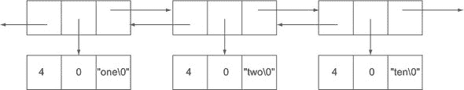

忽略一些细节（这些细节只会让链表看起来更糟糕），这三个各为三个字符长的字符串实际上将占用三个指针的空间，两个整数（长度和值中的剩余字节），加上字符串和额外的字节。在 32 位平台上，这需要 21 字节的开销来存储 3 个实际字节的数据（记住，这是一个低估了实际存储量的估计）。

另一方面，ziplist 表示将存储一系列长度、长度、字符串元素。第一个长度是前一个条目的大小（便于双向扫描），第二个长度是当前条目的大小，字符串是存储的数据本身。关于这些长度在实际中真正意味着什么还有一些其他细节，但就这三个示例字符串而言，长度将是 1 字节长，在这个例子中每个条目有 2 字节的开销。通过不存储额外的指针和元数据，ziplist 可以将开销从每个 21 字节减少到大约 2 字节（在这个例子中）。

让我们看看我们如何确保使用紧凑的 ziplist 编码。

##### 使用 ziplist 编码

为了确保这些结构仅在必要时使用以减少内存，Redis 包含了六个配置选项，如下所示，用于确定何时将 ziplist 表示用于 `LIST`、`HASH` 和 `ZSET`。

##### 列表 9.1\. 不同结构的 ziplist 表示的配置选项

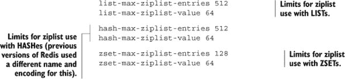

`LIST`、`HASH` 和 `ZSET` 的基本配置选项都是相似的，由 `-max-ziplist-entries` 设置和 `-max-ziplist-value` 设置组成。它们的语义在这三种情况下本质上都是相同的。`entries` 设置告诉我们，当 `LIST`、`HASH` 或 `ZSET` 中的项目数达到最大值时，它们将被编码为 ziplist。`value` 设置告诉我们每个单独条目可以有多大。如果这些限制中的任何一个被超过，Redis 将将 `LIST`、`HASH` 或 `ZSET` 转换为非 ziplist 结构（从而增加内存）。

如果我们使用的是默认配置的 Redis 2.6 版本，Redis 应该具有默认设置，这些设置与 列表 9.1 中提供的内容相同。让我们通过添加一些项目并检查其表示来玩转简单 `LIST` 对象的 ziplist 表示，如下一个列表所示。

##### 列表 9.2。如何确定一个结构是否存储为 ziplist

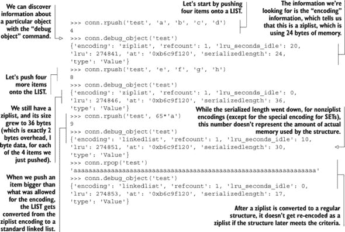

利用我们可用的新 `DEBUG OBJECT` 命令，发现一个对象是否存储为 ziplist 可以帮助减少内存使用。

你会注意到，特殊 ziplist 编码中显然缺少一个结构，那就是 `SET`。`SET` 也有紧凑的表示，但具有不同的语义和限制，我们将在下一部分介绍。

#### 9.1.2. `SET` 的 intset 编码

与 `LIST`、`HASH` 和 `ZSET` 的 ziplist 一样，对于短 `SET`，也存在紧凑的表示。如果我们的 `SET` 成员都可以解释为我们平台有符号长整数的范围之内的十进制整数，并且我们的 `SET` 足够短（我们稍后会提到），Redis 将将我们的 `SET` 存储为整数排序数组，或称为 *intset*。

通过将 `SET` 存储为排序数组，我们不仅具有低开销，而且所有标准的 `SET` 操作都可以快速执行。但是，多大才算太大？下一个列表显示了定义 intset 最大大小的配置选项。

##### 列表 9.3。配置 `SET` 的 intset 编码的最大大小

只要我们的整数 `SET` 小于我们配置的大小，Redis 就会使用 intset 表示来减少数据大小。以下列表显示了 intset 增长到太大时的发生情况。

##### 列表 9.4。当一个 intset 增长到太大时，它将以哈希表的形式表示。

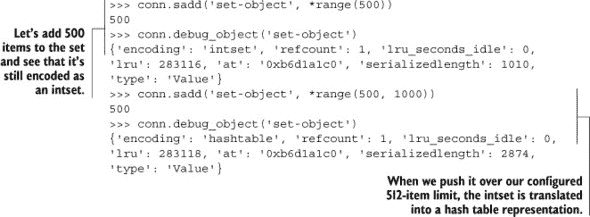

在前面 第 9.1 节 的介绍中，我提到，为了读取或更新使用紧凑 ziplist 表示的对象的一部分，我们可能需要解码整个 ziplist，并且可能需要移动内存中的数据。由于这些原因，读取和写入大型 ziplist 编码的结构可能会降低性能。intset 编码的 `SET` 也存在类似的问题，这不仅仅是因为编码和解码数据，而是因为我们需要在执行插入和删除操作时移动数据。接下来，我们将检查在操作长 ziplist 时的一些性能问题。

#### 9.1.3. 长 ziplist 和 intset 的性能问题

当我们的结构超过 ziplist 和 intset 的限制时，它们会自动转换为更典型的底层结构类型。这主要是因为随着这些结构的增长，操作它们的紧凑版本可能会变得缓慢。

为了亲自看看这是如何发生的，让我们首先将 `list-max-ziplist-entries` 设置更新为 110,000。这个设置比我们在实践中会用到的要大得多，但它确实有助于突出这个问题。在更新设置并重启 Redis 之后，我们将基准测试 Redis 以发现使用长 ziplist 编码 `LIST` 时可能出现的性能问题。

为了基准测试长 ziplist 编码 `LIST` 的行为，我们将编写一个函数来创建一个具有指定元素数量的 `LIST`。在 `LIST` 创建后，我们将反复调用 `RPOPLPUSH` 命令，将项目从 `LIST` 的右端移动到左端。这将给我们一个关于非常长的 ziplist 编码 `LIST` 上命令成本的下限。这个基准测试函数在下一个列表中展示。

##### 列表 9.5\. 我们用于基准测试不同大小的 ziplist 编码 `LIST` 的代码

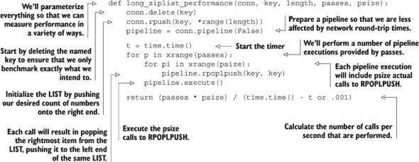

如前所述，此代码创建了一个给定大小的 `LIST`，然后执行一系列 `RPOPLPUSH` 命令。通过计算 `RPOPLPUSH` 调用次数除以所需时间，我们可以计算出在给定大小的 ziplist 编码 `LIST` 上可以执行的操作数。让我们用不断增加的列表大小运行这个基准测试，看看 ziplist 可以降低性能到什么程度。

##### 列表 9.6\. 随着 ziplist 编码 `LIST` 的增长，我们可以看到性能下降

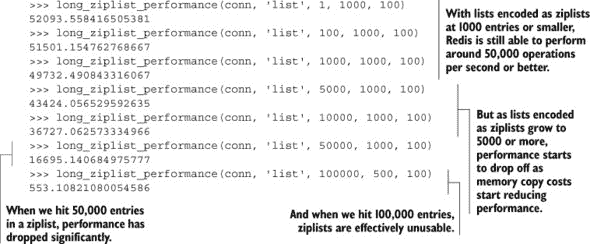

初看之下，你可能认为即使让 ziplist 增长到几千个元素，这也不是什么大问题。但这只展示了单个操作示例，我们只是从右端取出项目并将它们推到左端。ziplist 编码可以快速找到序列的右端或左端（尽管插入时移动所有项目会减慢我们），在这个小示例中，我们可以利用我们的 CPU 缓存。但是，当扫描列表以查找特定值时，比如我们的来自 第 6.1 节 的自动完成示例，或者获取/更新 `HASH` 的单个字段时，Redis 将不得不解码许多单个条目，CPU 缓存将不再那么有效。作为一个数据点，用 `LINDEX` 调用来替换我们的 `RPOPLPUSH` 命令，该命令从 `LIST` 的中间获取一个元素，当 `LIST` 至少有 5,000 个项目长时，其性能大约是 `RPOPLPUSH` 调用性能的一半。欢迎你自己尝试一下。

如果你将最大 ziplist 大小保持在 500–2,000 项范围内，并且将最大项目大小保持在 128 字节左右，你应该会得到合理的性能。我个人尝试将最大 ziplist 大小保持在 1,024 个元素，项目大小在 64 字节或更小。对于到目前为止我们使用的许多 `HASH` 用例，这些限制应该让你能够将内存使用量保持在较低水平，并将性能保持在较高水平。

当你为我们的示例之外的问题开发解决方案时，请记住，如果你能保持你的`LIST`、`SET`、`HASH`和`ZSET`的大小较小，你可以帮助降低内存使用，这可以使你能够使用 Redis 解决更广泛的问题。

| |
| --- |

##### 保持键名短

我之前没有提到的一点是，最小化键的长度，不仅在所有值的键部分，而且在`HASH`中的键、`SET`的成员和`ZSET`的条目以及`LIST`中的条目中。你的所有字符串越长，需要存储的数据就越多。一般来说，每当可能将相对简短的信息，如`user:joe`作为键或成员存储时，那比存储`username:joe`，甚至如果`user`或`username`是隐含的，存储`joe`更好。尽管在某些情况下可能没有太大差别，但如果你存储了数百万或数十亿条条目，那些额外的几兆字节或吉字节可能以后会有用。

| |
| --- |

现在你已经看到 Redis 中的短结构可以用来减少内存使用，在下一节中，我们将讨论分片大型结构，以便我们能够从 zip 列表和 intset 优化中获得更多问题的好处。

### 9.2. 分片结构

*分片*是一种众所周知的技术，它已被用于帮助许多不同的数据库扩展到更大的数据存储和处理负载。基本上，分片将你的数据分成更小的部分，基于一些简单的规则，然后根据数据分配到的分区将数据发送到不同的位置。

在本节中，我们将讨论将分片的概念应用于`HASH`、`SET`和`ZSET`以支持它们标准功能的一个子集，同时仍然让我们能够使用第 9.1 节中的小结构来减少内存使用。通常，我们不会将值 X 存储在键 Y 中，而是将 X 存储在键`Y:<shardid>`中。

| |
| --- |

##### 分片`LIST`

不使用 Lua 脚本进行`LIST`的分片是困难的，这就是为什么我们在这里省略了它。当我们第十一章中引入 Lua 脚本时，我们将构建一个支持从两端进行阻塞和非阻塞推送和弹出的分片`LIST`实现。

| |
| --- |
| |

##### 分片`ZSET`

与基本上所有操作都可以通过适度的工作（甚至使用 Lua 脚本的`LIST`）来支持的分片`HASH`和`SET`不同，命令如`ZRANGE`、`ZRANGEBYSCORE`、`ZRANK`、`ZCOUNT`、`ZREMRANGE`、`ZREMRANGEBYSCORE`等需要操作`ZSET`的所有分片来计算它们的最终结果。因为这些操作违反了几乎关于`ZSET`应该以多快的速度执行这些操作的几乎所有预期，所以分片`ZSET`并不一定非常有用，这就是为什么我们在这里基本上省略了它。

如果你需要为大型`ZSET`保留完整信息，但你实际上只对最高或最低得分的 X 进行查询，你可以像我们在 9.2.1 节中分片`HASH`一样分片你的`ZSET`：保留辅助的最高/最低得分`ZSET`s，你可以使用`ZADD`/`ZREMRANGEBYRANK`来更新它们，以保持有限（就像我们在第二章、第四章至第八章中之前所做的那样）。

如果你有大型搜索索引，你也可以使用分片`ZSET`来减少单命令延迟，尽管发现最终得分最高和最低的项目可能需要一系列潜在的`ZUNIONSTORE`/`ZREMRANGEBYRANK`对。

| |
| --- |

当分片结构时，我们可以决定支持单个结构的全部功能或仅支持标准功能的子集。为了简化起见，当我们在本书中分片结构时，我们只会实现标准结构提供的功能子集，因为实现完整功能可能会令人不知所措（从计算和代码量两个方面来看）。尽管我们只实现了功能子集，但我们将使用这些分片结构来为现有问题提供内存减少，或者以比其他方式更有效地解决新问题。

我们将讨论的第一个可分片结构是`HASH`。

#### 9.2.1\. HASHes

`HASH`的主要用途之一是以分组的方式存储简单的键/值对。在第 5.3 节中，我们开发了一种将 IP 地址映射到世界各地位置的方法。除了将 IP 地址映射到城市 ID 的`ZSET`之外，我们还使用了一个将城市 ID 映射到城市本身信息的单个`HASH`。该`HASH`在 2012 年 8 月版本的数据库中拥有超过 370,000 个条目，我们现在将对其进行分片。

要分片`HASH`表，我们需要选择一种数据分区方法。因为`HASH`本身有键，我们可以使用这些键作为信息源来分区键。为了分区我们的键，我们通常会在键本身上计算一个哈希函数，这将产生一个数字。根据我们想要在一个分片中放入多少键以及我们需要存储的总键数，我们将计算所需的分片数，并使用该数字以及我们的哈希值来确定数据将存储在哪个分片 ID 中。

对于数值键，我们假设键将大致上是顺序的并且紧密排列，并将它们分配给基于它们的数值键值的分片 ID（将数值相似的键保持在同一个分片中）。下一个列表显示了我们的函数，用于计算分片`HASH`的新键，给定基本键和`HASH`键`HASH`。

##### 列表 9.7\. 从基本键和次要条目键计算分片键的函数

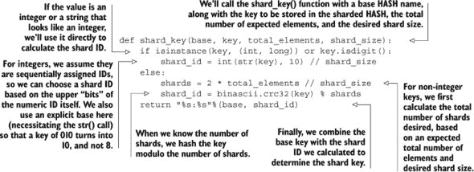

在我们的函数中，你会注意到对于非数值键，我们计算 CRC32 校验和。在这种情况下，我们使用 CRC32 是因为它返回一个简单的整数，无需额外工作，计算速度快（比 MD5 或 SHA1 哈希快得多），并且因为它在大多数情况下都足够好。

| |
| --- |

##### 保持 `total_elements` 和 `shard_size` 的一致性

当使用非数值键进行分片时，你会注意到我们使用 `total_elements` 值来计算所需的分片总数，除了用于数值和非数值键的 `shard_size`。这两条信息对于保持分片总数是必要的。如果你要更改这两个数字中的任何一个，那么分片数量（以及任何数据片段所属的分片）将发生变化。在可能的情况下，你不应该更改这两个值；或者当你更改它们时，你应该有一个将数据从旧数据分片移动到新数据分片的过程（这通常被称为 *resharding*）。

| |
| --- |

我们现在将使用我们的 `shard_key()` 来选择分片，作为以下列表中两个将像分片 `HASH` 上的 `HSET` 和 `HGET` 一样工作的函数的一部分。

##### 列表 9.8\. 分片 `HSET` 和 `HGET` 函数

这里没有太多复杂的内容；我们正在寻找存储或从 `HASH` 中检索数据的位置，并设置或获取值。为了更新我们之前的 IP 地址到城市查找调用，我们只需要在每个函数中替换一个调用。下一个列表显示了需要更新的我们之前函数的相应部分。

##### 列表 9.9\. 分片 IP 查找函数

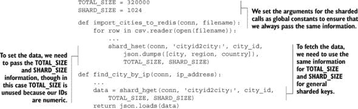

在 64 位机器上，存储我们所有城市的单个 `HASH` 大约占用 44 兆字节。但是，通过这些对分片数据的少量更改，将 `hash-max-ziplist-entries` 设置为 1024，将 `hash-max-ziplist-value` 设置为 256（列表中最长的城市/国家名称略超过 150 个字符），分片 `HASH` 一起大约占用 12 兆字节。这比数据大小减少了 70%，这将使我们能够存储比之前多 3.5 倍的数据。对于更短的键和值，你可能会看到更大的百分比节省（相对于实际存储的数据开销更大）。

| |
| --- |

##### 在 `HASH` 中存储 `STRING`s

如果你发现自己正在将大量相对较短的字符串或数字作为具有一致命名键（如 `namespace:id`）的普通 `STRING` 值存储，你可以在某些情况下将这些值存储在分片 `HASH` 中，以显著减少内存使用。

| |
| --- |
| |

**练习：添加其他操作**

正如你所见，在分片 `HASH` 中获取和设置值是很容易的。你能添加对分片 `HDEL`、`HINCRBY` 和 `HINCRBYFLOAT` 操作的支持吗？

| |
| --- |

我们刚刚完成了对大型 `HASH` 的分片以减少其内存使用。接下来，你将学习如何分片 `SET`s。

#### 9.2.2\. SETs

一个名为*map-reduce*的操作（我在第一章和第六章中提到过）的常见用途是计算网站的唯一访问者数量。而不是等到一天结束时才进行这个计算，我们可以在一天中实时更新唯一访问者的计数。在 Redis 中计算唯一访问者的一个方法使用`SET`，但存储许多唯一访问者的单个`SET`会非常大。在本节中，我们将通过分片`SET`s 来构建一种方法，以计算网站的唯一访问者数量。

首先，我们假设每个访问者都已经有一个唯一的标识符，类似于我们在第二章中为我们的登录会话 cookie 生成的 UUIDs。尽管我们可以直接将这些 UUIDs 用作`SET`的成员和作为使用第 9.2.1 节中的分片函数进行分片的键，但我们将会失去 intset 编码的好处。假设我们随机生成了我们的 UUIDs（就像我们在前面的章节中做的那样），我们可以使用 UUID 的前 15 个十六进制数字作为完整的键。这会引发两个问题：首先，我们为什么要这样做？其次，这为什么足够？

对于第一个问题（我们为什么要这样做），UUIDs 基本上是 128 位的数字，它们已经被格式化为易于阅读的形式。如果我们存储它们，我们将为每个唯一的访问者存储大约 16 字节（如果我们直接存储，则为 36 字节）。但是，通过只存储转换为数字的前 15 个十六进制数字^([3))，我们只为每个唯一的访问者存储 8 字节。因此，我们在一开始就节省了空间，这我们可能以后可以用在其他问题上。这也让我们可以使用 intset 优化来降低内存使用。

> 另一个很好的问题是为什么是 56 位而不是 64 位？这是因为 Redis 只会使用 intsets 来处理最多 64 位的有符号整数，将我们的 64 位无符号整数转换为有符号整数在大多数情况下并不值得。如果你需要额外的精度，可以查看 Python 的`struct`模块，并查看`Q`和`q`格式代码。

对于第二个问题（这为什么足够），它归结为所谓的*生日碰撞*。简单来说：两个 128 位随机标识符在前 56 位匹配的概率是多少？从数学上讲，我们可以精确地计算出这个概率，只要在给定的时间段（在我们的例子中是一天）内，我们有少于 2.5 亿的唯一访问者，我们最多有 1%的匹配概率（所以如果我们每天有 2.5 亿访问者，大约每 100 天会有大约 1 个人未被计算）。如果我们有少于 2500 万唯一访问者，那么不计算用户的概率会降低到我们需要运行网站大约 2739 年才可能错过计算一个用户。

既然我们已经决定使用 UUID 的前 56 位，我们将构建一个分区 `SADD` 函数，我们将将其用作更大块代码的一部分，以实际计数独立访客。在 列表 9.10 中的这个分区 `SADD` 函数将使用我们在 第 9.2.1 节 中使用的相同的分区键计算方法，修改为在数字 ID 前添加一个非数字字符以进行分区 ID 计算，因为我们的 56 位 ID 并不是紧密排列的（这是对数字 ID 的假设）。

##### 列表 9.10\. 我们将用作独立访客计数器一部分的分区 `SADD` 函数

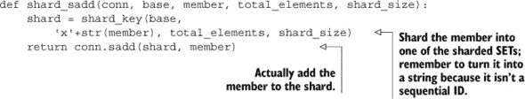

使用分区 `SADD` 函数后，我们现在可以保持独立访客计数。当我们想要计数一个访客时，我们首先根据会话 UUID 的前 56 位计算他们的较短 ID。然后我们确定今天的日期并将 ID 添加到今天的分区独立访客 `SET` 中。如果该 ID 之前不在 `SET` 中，我们将增加今天的独立访客计数。我们跟踪独立访客计数的代码将在下面的列表中展示。

##### 列表 9.11\. 一个用于按日跟踪独立访客数量的函数

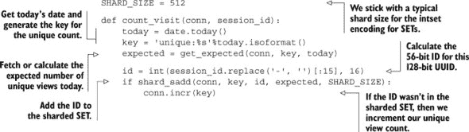

该函数的工作方式与描述的完全一致，尽管你会注意到我们调用了 `get_expected()` 来确定预期的每日访客数量。我们这样做是因为网页访问量可能会随时间变化，每天保持相同数量的分片不会随着我们的增长（或如果我们每天有显著少于一百万独立访客，则会缩小）而增长。

为了应对预期观众数量的每日变化，我们将编写一个函数，根据昨日的数量计算每一天的新预期独立访客数量。对于任何给定的一天，我们预计今天的访客数量至少比昨天多 50%，并向上取到下一个 2 的幂。我们计算这一值的代码将在下面展示。

##### 列表 9.12\. 基于昨日的数量计算今天的预期独立访客数量

该函数的大部分操作是读取和以某种方式处理数据，但总体结果是，我们通过将昨日的观看次数增加 50%，并向上取到下一个 2 的幂，来计算今天的预期独立观看次数。如果今天预期观看次数已经计算过，我们将使用那个值。

将这段代码与 100 万独立访客一起使用，Redis 将使用大约 9.5 兆字节来存储独立访客计数。如果没有分区，Redis 将使用 56 兆字节来存储相同的数据（单个 `SET` 中的 56 位整数 ID）。这通过分区减少了 83% 的存储空间，这将使我们能够在相同的硬件上存储 5.75 倍的数据。

|  |
| --- |

**练习：填写分区 `SET` API**

对于这个示例，我们只需要一个`SET`命令就可以确定给定日期的唯一访客数。你能添加分片`SREM`和`SISMEMBER`调用吗？加分项：假设你有两个具有相同预期项目总数和相同分片大小的分片`SET`s，你将具有相同数量的分片，并且相同的 ID 将在相同的分片 ID 中。你能添加`SINTERSTORE`、`SUNIONSTORE`和`SDIFFSTORE`的分片版本吗？

|  |
| --- |
|  |

##### 计算唯一访客数的其他方法

如果你拥有数字访客 ID（而不是 UUIDs），并且访客 ID 的最大值相对较低，那么你不必将访客信息存储为分片`SET`s，可以使用类似我们在下一节中描述的技术将它们存储为位图。一个用于计算基于位图的唯一访客数和其他有趣分析的 Python 库可以在[`github.com/Doist/bitmapist`](https://github.com/Doist/bitmapist)找到。

|  |
| --- |

在将大量整数`SET`s 分片以减少存储后，现在是时候学习如何将位和字节打包到`STRING`s 中。

### 9.3. 打包位和字节

当我们讨论分片`HASH`时，我简要提到，如果我们将短字符串或计数器作为`STRING`值存储，键如`namespace:id`，我们可以使用分片`HASH`作为减少内存使用的一种方式。但假设我们想要为顺序 ID 存储一个短固定量的信息。我们能否比分片`HASH`使用更少的内存？

在本节中，我们将使用分片 Redis `STRING`s 来存储具有顺序 ID 的大量用户的位置信息，并讨论如何对存储的数据执行聚合计数。此示例展示了我们如何使用分片 Redis `STRING`s 来存储，例如，Twitter 上用户的位置信息。

在我们开始存储数据之前，我们需要回顾四个命令，这些命令将使我们能够高效地打包和更新 Redis 中的`STRING`s：`GETRANGE`、`SETRANGE`、`GETBIT`和`SETBIT`。`GETRANGE`命令允许我们从存储的`STRING`中读取子字符串。`SETRANGE`将允许我们在较大的`STRING`的子字符串中设置数据。同样，`GETBIT`将获取`STRING`中单个位的值，而`SETBIT`将设置单个位。有了这四个命令，我们可以使用 Redis `STRING`s 以尽可能紧凑的格式存储计数器、固定长度字符串、布尔值等，而不需要压缩。简要回顾完毕后，让我们谈谈我们将存储哪些信息。

#### 9.3.1. 我们应该存储哪些位置信息？

当我提到位置时，你可能想知道我指的是什么。好吧，我们可以存储各种不同类型的位置。用 1 个字节，我们可以存储全球的国家级信息。用 2 个字节，我们可以存储地区/州级信息。用 3 个字节，我们可以存储几乎所有国家的地区邮政编码。而用 4 个字节，我们可以存储纬度/经度信息，精确到大约 2 米或 6 英尺。

应该使用哪种精度的级别将取决于我们的特定用例。为了简化，我们将从全球各国地区/州级信息的 2 个字节开始。作为一个起点，列表 9.13 展示了全球 ISO3 国家代码的一些基本数据，以及美国和加拿大的州/省信息。

##### 列表 9.13\. 我们可以根据需要扩展的基本位置表

我最初引入这些数据表是为了如果/当我们要为我们感兴趣的国家的州、地区、领地或省添加额外的信息时，进行格式和方法应该是显而易见的。查看数据表，我们最初将它们定义为字符串。但通过在没有任何参数的情况下调用字符串的 `split()` 方法，这些字符串被分割成列表。现在我们有一些初始数据，我们将如何按用户存储这些信息？

假设我们已经确定用户 139960061 居住在美国加利福尼亚州，并且我们想要为该用户存储此信息。为了存储信息，我们首先需要将数据打包成 2 个字节，这需要首先发现美国的代码，我们可以通过在我们的 `COUNTRIES` 列表中找到美国 ISO3 国家代码的索引来计算它。同样，如果我们有一个用户的州信息，并且我们也在我们的表中有了州信息，我们可以通过在表中找到它的索引来计算该州的代码。下一个列表显示了将国家/州信息转换为 2 个字节代码的函数。

##### 列表 9.14\. ISO3 国家代码

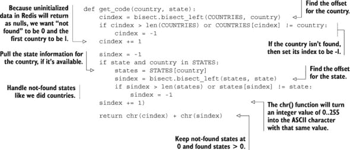

位置代码计算并不那么有趣或困难；这主要是找到查找表中的偏移量，然后处理“未找到”的数据。接下来，让我们谈谈实际存储我们的打包位置数据。

#### 9.3.2\. 存储打包数据

在我们有了打包的位置代码后，我们只需要使用 `SETRANGE` 将它们存储在 `STRING`s 中。但在这样做之前，我们必须稍微思考一下我们将要存储多少用户的信息。例如，假设 Twitter 今天有 7.5 亿用户（基于观察，最近创建的用户 ID 大于 7.5 亿）；我们需要超过 1.5 GB 的空间来存储所有 Twitter 用户的地理位置信息。尽管大多数操作系统都能够合理地分配大块内存，但 Redis 限制我们只能使用 512 MB 的 `STRING`s，而且由于 Redis 在设置超出现有 `STRING` 结尾的值时会清除数据，因此在长 `STRING` 的末尾设置第一个值将比预期的简单 `SETBIT` 调用花费更多时间。相反，我们可以使用与我们在 第 9.2.1 节 中使用的技术类似的方法，并将我们的数据分片存储在一系列 `STRING`s 中。

与我们分片 `HASH` 和 `SET` 不同，我们不需要担心通过保持我们的分片小于几千个元素来提高效率，因为我们可以直接访问一个元素而无需解码其他任何元素。同样，我们可以高效地向给定的偏移量写入。相反，我们的关注点更多地在于在大规模上提高效率——具体来说，是什么将潜在的内存碎片化与最小化所需键的数量平衡。在这个例子中，我们将为每个 `STRING` 存储关于 2²⁰ 个用户（略超过 100 万条记录）的地理位置信息，这将占用每个 `STRING` 大约 2 MB 的空间。在下一个列表中，我们可以看到更新用户地理位置信息的代码。

##### 列表 9.15\. 在分片 `STRING`s 中存储位置数据的函数

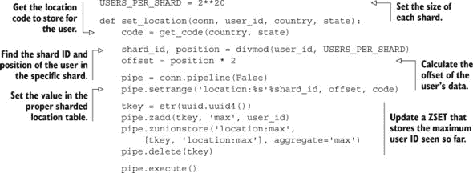

在大多数情况下，这里不应该有任何令人惊讶的内容。我们计算存储用户的位置代码，计算用户的分片和分片偏移量，然后将位置代码存储在用户正确的位置。唯一奇怪且可能看起来不必要的事情是我们还更新了一个 `ZSET`，该 `ZSET` 存储已看到的最高编号用户 ID。这在计算关于我们拥有的所有信息的聚合时非常重要（这样我们知道何时停止）。

#### 9.3.3\. 在分片 STRING 上计算聚合

为了计算聚合，我们有两种用例。要么我们将计算关于我们所知道的所有信息的聚合，要么我们将计算一个子集的聚合。我们将从计算整个群体的聚合开始，然后我们将编写计算较小群体聚合的代码。

要计算我们拥有的所有信息的聚合，我们将回收我们在第 6.6.4 节中编写的部分代码，特别是`readblocks()`函数，该函数从给定键读取数据块。使用此函数，我们可以执行单个命令并与 Redis 进行往返，一次获取成千上万用户的有关信息。使用此块读取函数计算聚合的函数如下所示。

##### 列表 9.16\. 一个用于聚合每个人位置信息的函数

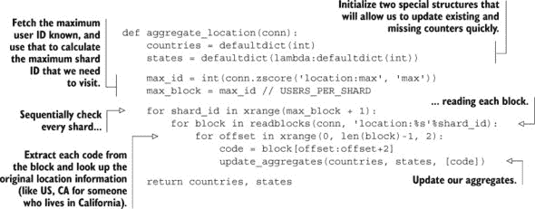

这个用于计算每个人国家/州级别信息的聚合函数使用了一个名为`defaultdict`的结构，我们也在第六章中首次使用它来计算在将信息写回 Redis 之前关于位置信息的聚合。在这个函数内部，我们引用了一个辅助函数，该函数实际上更新了聚合并将位置代码解码回原始的 ISO3 国家代码和本地州缩写，这些可以在下面的列表中看到。

##### 列表 9.17\. 将位置代码转换回国家/州信息

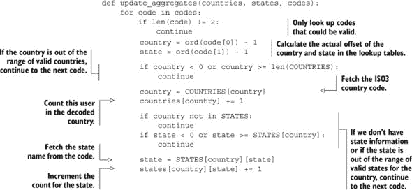

通过一个将位置代码转换回有用位置信息并更新聚合信息的函数，我们拥有了在用户子集上执行聚合的构建块。例如，假设我们有许多 Twitter 用户的地理位置信息。还假设我们每个用户都有关注者信息。要发现特定用户关注者的地理位置信息，我们只需获取这些用户的地理位置信息并计算类似于我们的全局聚合的聚合。下面的列表显示了一个将聚合给定用户 ID 列表上的位置信息的函数。

##### 列表 9.18\. 一个用于聚合给定用户 ID 位置信息的函数

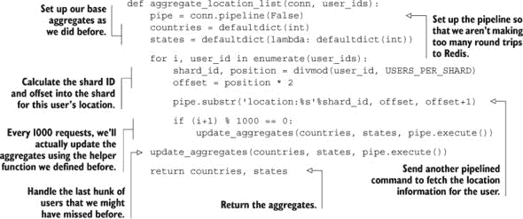

这种在分片`STRING`s 中存储固定长度数据的技术可能很有用。尽管我们为每个用户存储了多个字节数据，但我们可以使用`GETBIT`和`SETBIT`相同地存储单个位，甚至位组。

### 9.4\. 摘要

在本章中，我们探讨了多种方法来减少 Redis 的内存使用，包括使用短数据结构、将大型结构分片以使其再次变小，以及直接将数据打包到`STRING`s 中。

如果你从这个章节中带走了一件事，那就是通过仔细考虑如何存储你的数据，你可以显著减少 Redis 支持你的应用程序所需的内存量。

在下一章中，我们将重新探讨各种主题，以帮助 Redis 扩展到更大的机器组，包括读取从属服务器、跨多个主服务器分片数据以及扩展各种不同类型查询的技术。

## 第十章\. 缩放 Redis

*本章涵盖*

+   扩展读取

+   扩展写入和内存容量

+   扩展复杂查询

随着你对 Redis 的使用增长，可能会有这样的时候，你不再能够将所有数据放入单个 Redis 服务器中，或者当你需要执行比 Redis 能够承受的更多读和/或写操作时。当这种情况发生时，你有几个选项可以帮助你将 Redis 扩展到你的需求。

在本章中，我们将介绍帮助您扩展读查询、写查询、可用总内存以及扩展更复杂查询选择的技术。

我们的首要任务是解决那些我们可以存储所有所需数据，并且可以无问题处理写操作，但需要在一个 Redis 服务器上执行比单个 Redis 服务器能处理更多的读查询的问题。

### 10.1. 扩展读操作

在第八章中，我们构建了一个提供许多与 Twitter 相同功能和特性的社交网络。其中一项功能是用户可以查看他们的*主页时间线*以及他们的*个人资料时间线*。在查看这些时间线时，我们将一次获取 30 个帖子。对于一个小型社交网络，这不会是一个严重的问题，因为我们仍然可以支持每秒从 3,000 到 10,000 个用户获取时间线（如果 Redis 只是做这件事的话）。但对于一个大型社交网络，每秒需要处理的时间线获取次数可能是这个数字的许多倍，这并不令人意外。

在本节中，我们将讨论使用读从属服务器来支持扩展读查询，使其超出单个 Redis 服务器处理能力的做法。

在我们讨论扩展读操作之前，让我们首先回顾一下在必须求助于使用从属服务器和额外服务器来扩展我们的查询之前，可以改进性能的一些机会：

+   如果我们使用的是小结构（如我们在第九章中讨论的），首先确保我们的最大 ziplist 大小不是太大，以免造成性能惩罚。

+   记住要使用为我们想要执行的查询类型提供良好性能的结构（不要将`LIST`当作`SET`来处理；不要为了在客户端排序而获取整个`HASH`，使用`ZSET`；等等）。

+   如果我们要将大对象发送到 Redis 进行缓存，考虑压缩数据以减少读写时的网络带宽（比较 lz4、gzip 和 bzip2，以确定哪种为我们使用提供了最佳的大小/性能权衡）。

+   记住要使用管道（带或不带事务，取决于我们的需求）和连接池，正如我们在第四章中讨论的那样。

当我们正在尽一切努力确保读写速度快时，是时候解决执行更多读查询的需求了。增加 Redis 可用总读吞吐量的最简单方法就是添加只读从服务器。如果你还记得 第四章，我们可以运行额外的服务器，这些服务器连接到主服务器，接收主服务器数据的副本，并实时保持更新（或多或少取决于网络带宽）。通过在我们的读查询中使用多个从服务器之一，我们可以通过每个新的从服务器获得额外的读查询能力。

|  |
| --- |

##### 记住：向大师学习

当使用读从服务器，以及通常使用任何从服务器时，你必须记住只向主 Redis 服务器写入。默认情况下，尝试向配置为从服务器的 Redis 服务器（即使它也是主服务器）写入将导致该服务器返回错误。我们将在 第 10.3.1 节 中讨论使用配置选项允许向从服务器写入，但通常你应该禁用从服务器写入；向从服务器写入通常是一个错误。

|  |
| --- |

第四章 包含了配置 Redis 以复制到从服务器、其工作原理以及扩展到多个读从服务器的一些想法的所有详细信息。简而言之，我们可以通过添加一行读取 `slaveof host port` 的命令来更新 Redis 配置文件，用主服务器的地址和端口替换 `host` 和 `port`。我们还可以通过在现有服务器上运行 `SLAVEOF host port` 命令来配置一个从服务器。记住：当从服务器连接到主服务器时，从服务器上之前存在的任何数据都将被丢弃。要断开从服务器与主服务器的连接以停止其复制，我们可以运行 `SLAVEOF no one`。

当使用多个 Redis 从服务器来服务数据时，出现的一个最大问题是当主服务器暂时或永久性地宕机时会发生什么。记住，当从服务器连接时，Redis 主服务器会启动一个快照。如果在快照完成之前多个从服务器连接，它们都将接收到相同的快照。虽然这在效率方面很好（无需创建多个快照），但同时在多个从服务器上发送多个快照副本可能会消耗服务器大部分的网络带宽。这可能会导致主服务器的高延迟，并可能导致之前连接的从服务器断开连接。

解决从服务器重新同步问题的方法之一是减少主服务器和其从服务器之间发送的总数据量。这可以通过设置中间复制服务器来形成一个树形结构来实现，如图 10.1 所示，我们借鉴自 第四章。

##### 图 10.1\. 一个示例 Redis 主/从副本树，包含九个最低级别的从服务器和三个中间复制辅助服务器

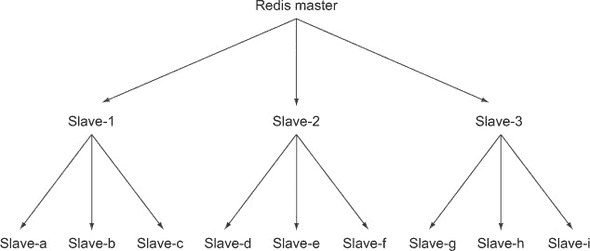

这些从属树将会工作，如果我们想要复制到不同的数据中心（在较慢的 WAN 链路上进行重新同步将消耗资源，这些资源应该推送到一个中间从属而不是运行在根主节点上），那么它们可能是必要的。但是从属树由于具有复杂的网络拓扑，使得手动或自动处理故障转移情况变得困难。

建立从属树的另一种选择是使用网络链路上的压缩来减少需要传输的数据量。一些用户发现使用 SSH 进行压缩隧道连接可以显著降低带宽使用。有一家公司从使用 21 兆比特的网络带宽复制到单个从属节点降低到大约 1.8 兆比特（[`mng.bz/2ivv`](http://mng.bz/2ivv)）。如果你使用这种方法，你将想要使用一种机制来自动重新连接断开的 SSH 连接，这里有几个选项可供选择。

| |
| --- |

##### 加密和压缩开销

通常，SSH 隧道加密的开销不应给你的服务器带来巨大负担，因为 AES-128 可以在 2.6 GHz Intel Core 2 处理器的单个核心上每秒加密大约 180 兆字节，而 RC4 可以在同一台机器上每秒加密大约 350 兆字节。假设你有一个千兆网络链路，大约一个中等强大的核心可以加密到连接的最大值。压缩可能会遇到问题，因为 SSH 压缩默认使用 gzip。在压缩级别 1（你可以配置 SSH 使用特定的压缩级别；请检查 SSH 的手册页），我们可靠的 2.6 GHz 处理器可以每秒压缩大约 24-52 兆字节的几种不同类型的 Redis 转储（初始同步），以及 60-80 兆字节的几种不同类型的只追加文件（流式复制）。记住，尽管更高的压缩级别可以压缩更多数据，但它们也会使用更多的处理器，这可能会成为高吞吐量低处理器机器的问题。通常，如果可能的话，我会建议使用低于 5 的压缩级别，因为 5 仍然提供了相对于级别 1 大约 10-20%的总数据量减少，大约是 2-3 倍的处理时间。压缩级别 9 通常需要比级别 1 多 5-10 倍的时间，而压缩效果仅比级别 5 好 1-5%（对于任何合理的快速网络连接，我坚持使用级别 1）。

| |
| --- |
| |

##### 使用 OpenVPN 进行压缩

初看起来，OpenVPN 对 AES 加密和 lzo 压缩的支持似乎是一个提供透明重新连接、压缩和加密（与使用第三方 SSH 重新连接脚本相比）的很好的即插即用解决方案。不幸的是，我所找到的大部分信息都表明，在 OpenVPN 中启用 lzo 压缩时的性能提升仅限于 10 兆比特连接的大约 25-30%，在更快连接上几乎没有提升。

| |
| --- |

最近添加到 Redis 工具列表中，可以帮助处理复制和故障转移的工具被称为 *Redis Sentinel*。Redis Sentinel 是 Redis 服务器二进制的一个模式，其中它不作为典型的 Redis 服务器运行。相反，Sentinel 监视多个主节点及其从节点的行为和健康状态。通过针对主节点的 `PUBLISH`/`SUBSCRIBE` 操作以及针对从节点和主节点的 `PING` 调用，一组 Sentinel 进程独立地发现有关可用从节点和其他 Sentinel 的信息。在主节点故障时，将根据所有 Sentinel 拥有的信息选择一个 Sentinel，并从现有的从节点中选择一个新的主服务器。在此从节点变为主节点后，Sentinel 将将从节点移动到新的主节点（默认情况下一次一个，但可以配置为更高的数量）。

通常，Redis Sentinel 服务旨在提供从主节点到其从节点之一的自动故障转移。它提供了故障转移通知、调用用户提供的脚本来更新配置等选项。

既然我们已经尝试扩展我们的读取容量，现在是时候看看我们如何可能能够扩展我们的写入容量了。

### 10.2. 扩展写入和内存容量

在第二章中，我们构建了一个系统，该系统能够自动在 Redis 中缓存渲染的网页。幸运的是，这有助于减少页面加载时间和网页处理开销。不幸的是，我们已经达到了我们能够负担的最大单台机器的缓存规模，现在必须将数据分散到一组较小的机器上。

| |
| --- |

##### 扩展写入量

虽然我们在增加总可用内存的上下文中讨论了分片，但这些方法也可以在达到单台机器可以承受的性能极限时增加写入吞吐量。

| |
| --- |

在本节中，我们将讨论一种使用与我们在第九章中使用的技术类似的方法来扩展内存和写入吞吐量的方法。

为了确保我们确实需要扩展我们的写入容量，我们首先应该确保我们已经做了我们能做的一切来减少内存使用和写入的数据量：

+   确保我们已经检查了所有减少读取数据量的方法。

+   确保我们已经将较大的无关功能块移动到不同的服务器上（如果我们已经从第五章中使用了我们的连接装饰器，这应该很容易）。

+   如果可能，在写入 Redis 之前，尽量在本地内存中聚合写入，正如我们在第六章中讨论的那样（这适用于几乎所有分析和统计计算方法）。

+   如果我们在 `WATCH`/`MULTI`/`EXEC` 方面遇到限制，可以考虑使用我们在第六章中讨论的锁（或者考虑使用 Lua，我们将在第十一章中讨论）。

+   如果我们使用 AOF 持久化，请记住我们的磁盘需要跟上我们写入的数据量（400,000 个小命令可能每秒只有几兆字节，但 100,000 × 1 KB 的写入是每秒 100 兆字节）。

现在我们已经尽可能减少内存使用、最大化性能并了解单台机器的限制，是时候实际上将我们的数据分片到多台机器上了。我们将数据分片到多台机器的方法依赖于使用的 Redis 服务器数量大致固定。如果我们能估计到我们的写入量，例如，每 6 个月增加 4 倍，我们可以在 256 个分片中预先分片我们的数据。通过预先分片到 256 个分片，我们将有一个计划，应该能够满足未来 2 年的预期增长（提前计划多远取决于你）。

| |
| --- |

##### 为了增长而预先分片

当为了准备增长而预先分片你的系统时，你可能处于数据太少以至于不值得运行你将来可能需要的那么多机器的情况。为了仍然能够分离你的数据，你可以为每个分片在单个机器上运行多个 Redis 服务器，或者你可以在单个 Redis 服务器内部使用多个 Redis 数据库。从这个起点，你可以通过使用复制和配置管理（参见 10.2.1 节）过渡到多台机器。如果你在单个机器上运行多个 Redis 服务器，请记住让它们监听不同的端口，并确保所有服务器都写入不同的快照文件和/或追加文件。

| |
| --- |

我们需要做的第一件事是讨论我们将如何定义我们的分片配置。

#### 10.2.1\. 处理分片配置

如你从第五章中可能记得的，我们编写了一个创建和使用命名 Redis 配置的方法。这种方法使用 Python 装饰器来获取配置信息，将其与现有的配置信息进行比较，并创建或重用现有连接。我们将扩展这个想法以添加对分片连接的支持。通过这些更改，我们可以使用我们在第九章中开发的代码的大部分，只需进行一些小的修改。

要开始，首先让我们创建一个简单的函数，该函数使用我们在第五章（chapter 5）中连接装饰器中使用的相同配置布局。如果你还记得，我们使用 JSON 编码的字典来存储 Redis 的连接信息，键的格式为`config:redis:<component>`。提取装饰器的连接管理部分，我们最终得到一个简单的函数，用于根据命名配置创建或重用 Redis 连接，如下所示。

##### 列表 10.1\. 基于命名配置获取 Redis 连接的函数

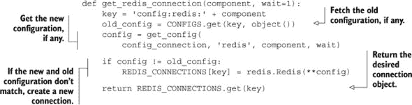

这个简单的函数获取先前已知以及当前的配置。如果它们不同，它将更新已知配置，创建一个新的连接，然后存储并返回这个新连接。如果配置没有改变，它将返回之前的连接。

当我们能够轻松获取连接时，我们还应该添加对创建分片 Redis 连接的支持，这样即使我们的后续装饰器在每种情况下都不太有用，我们仍然可以轻松地创建和使用分片连接。要连接到新的分片连接，我们将使用相同的配置方法，尽管分片配置会有所不同。例如，组件`logs`的第 7 个分片将存储在名为`config:redis:logs:7`的键中。这种命名方案将使我们能够重用我们已有的现有连接和配置代码。我们的获取分片连接的函数如下所示。

##### 列表 10.2\. 基于分片信息获取连接

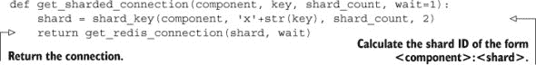

现在我们有了获取分片 Redis 服务器连接的简单方法，我们可以创建一个装饰器，就像我们在第五章中看到的那样，它会自动创建分片连接。

#### 10.2.2\. 创建服务器分片连接装饰器

现在我们有了轻松获取分片连接的方法，让我们用它来构建一个装饰器，自动将分片连接传递给底层函数。

我们将执行与第五章中使用的相同的三级函数装饰，这将使我们能够使用那里使用的相同类型的“组件”传递。除了组件信息外，我们还将传递我们将要分片到其上的 Redis 服务器数量。以下列表显示了我们的分片感知连接装饰器的详细信息。

##### 列表 10.3\. 一个分片感知连接装饰器

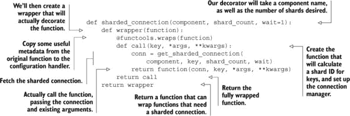

由于我们构建了连接装饰器的方式，我们可以几乎完全不变地装饰我们的`count_visit()`函数，该函数来自第九章。我们需要小心，因为我们正在保持聚合计数信息，这些信息由我们的`get_expected()`函数获取和/或更新。由于存储的信息将在不同用户的不同日子上被使用和重复使用，我们需要为它使用一个非分片连接。下面显示了更新并装饰过的`count_visit()`函数以及装饰并略有更新的`get_expected()`函数。

##### 列表 10.4\. 一个机器和键分片的`count_visit()`函数

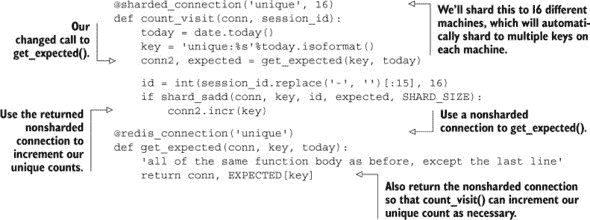

在我们的例子中，我们将数据分片到 16 台不同的机器上，用于唯一的访问`SET`，其配置存储在名为`config:redis:unique:0`到`config:redis:unique:15`的键中。对于我们的每日计数信息，我们将其存储在一个非分片 Redis 服务器上，其配置信息存储在键`config:redis:unique`中。

| |
| --- |

##### 单机上的多个 Redis 服务器

本节讨论将写入扩展到多台机器以增加总内存和总写入容量。但如果你觉得受限于 Redis 的单线程处理限制（可能是因为你正在执行昂贵的搜索、排序或其他查询），并且你有更多的核心用于处理，更多的网络用于通信，以及更多的可用磁盘 I/O 用于快照/AOF，你可以在单机上运行多个 Redis 服务器。你只需要配置它们在不同的端口上监听，并确保它们有不同的快照/AOF 配置。

| |
| --- |
| |

##### 随时间处理唯一访问次数的替代方法

通过使用 `SETBIT`、`BITCOUNT` 和 `BITOP`，你可以通过使用类似我们在第九章 chapter 9 中对位置所做的索引查找位，在不分片的情况下扩展唯一访问计数。一个在 Python 中实现此功能的库可以在 [`github.com/Doist/bitmapist`](https://github.com/Doist/bitmapist) 找到。

| |
| --- |

现在我们有了获取常规和分片连接的函数，以及自动传递常规和分片连接的装饰器，使用多种类型的 Redis 连接变得显著更容易。不幸的是，我们需要的所有操作在分片数据集中并不像唯一访问计数那样简单。在下一节中，我们将讨论以两种不同的方式扩展搜索，以及如何扩展我们的社交网络示例。

### 10.3. 扩展复杂查询

随着我们使用 Redis 扩展各种服务，遇到数据分片不足以解决问题的情况并不少见，我们需要执行的类型查询比仅仅设置或获取值需要更多的工作。在本节中，我们将讨论一个简单可扩展的问题，以及两个需要更多工作的难题。

我们首先扩展的问题是我们从第七章 chapter 7 中的搜索引擎，我们有一些机器有足够的内存来存储我们的索引，但我们需要执行的查询比我们的服务器目前能处理的要多。

#### 10.3.1. 扩展搜索查询量

随着我们的搜索引擎从第七章 chapter 7 使用 `SORT` 和基于 `ZSET` 的评分搜索进行扩展，我们的广告定位搜索引擎（甚至求职搜索系统），在某个时候我们可能会达到一个点，即单个服务器无法处理每秒所需的查询数量。在本节中，我们将讨论如何添加查询从属服务器以进一步提高我们服务更多搜索请求的能力。

在第 10.1 节中，你看到了如何通过添加从节点来扩展对 Redis 的只读查询。如果你还没有阅读第 10.1 节，你应该在继续之前阅读。在你有一组从节点来执行查询之后，如果你正在运行 Redis 2.6 或更高版本，你将立即注意到执行搜索查询会失败。这是因为执行第七章中讨论的搜索需要执行`SUNIONSTORE`、`SINTERSTORE`、`SDIFFSTORE`、`ZINTERSTORE`和/或`ZUNIONSTORE`查询，所有这些都会写入 Redis。

为了对 Redis 2.6 及更高版本执行写入操作，我们需要更新我们的 Redis 从节点配置。在 Redis 配置文件中，有一个选项可以禁用/启用对从节点的写入。这个选项被称为`slave-read-only`，默认值为`yes`。通过将`slave-read-only`更改为`no`并重新启动我们的从节点，我们现在应该能够对从 Redis 服务器执行标准搜索查询。记住，我们缓存了查询的结果，并且这些缓存的结果仅在运行查询的从节点上可用。所以如果我们打算重用缓存的结果，我们可能需要执行一定级别的会话持久性（即来自客户端的重复请求都发送到同一个 Web 服务器，并且该 Web 服务器始终向同一个 Redis 服务器发送请求）。

在过去，我使用这种方法快速且容易地扩展了一个广告定位引擎。如果你决定走这条路来扩展搜索查询，请记住注意第 10.1 节中讨论的重新同步问题。

当我们在一台机器上拥有足够的内存，并且我们的操作是只读的（或者至少不会真正更改其他查询使用的底层数据）时，添加从节点可以帮助我们扩展。但有时数据量可能会超过内存容量，我们仍然需要执行复杂的查询。当我们拥有的数据比可用内存多时，我们如何扩展搜索？

#### 10.3.2. 扩展搜索索引大小

如果我们能够期待搜索引擎的一点，那就是搜索索引会随着时间的推移而增长。随着搜索索引的增长，这些索引使用的内存也会增长。根据增长的速度，我们可能或可能无法继续购买/租赁更大的计算机来运行我们的索引。但对于我们中的许多人来说，获取更大和更大的计算机只是不可能的。

在本节中，我们将讨论如何构建我们的数据结构以支持分片搜索查询，并将包括执行针对一组分片 Redis 主节点（或遵循第 10.3.1 节中的说明的分片主节点的从节点）的分片搜索查询的代码。

为了对搜索查询进行分片，我们必须首先对索引进行分片，以便对于每个索引的文档，该文档的所有数据都在同一个分片上。结果是我们第七章中的`index_document()`函数接受一个连接对象，我们可以通过传递的`docid`手动进行分片。或者，因为`index_document()`接受一个连接后跟`docid`，我们可以使用我们的自动分片装饰器（来自列表 10.3）来为我们处理分片。

当我们的文档在分片之间索引时，我们只需要对分片执行查询以获取结果。我们需要做什么的细节将取决于我们的索引类型——是`SORT`基于的还是`ZSET`基于的。让我们首先更新我们的基于`SORT`的索引以进行分片搜索。

##### 基于分片的排序搜索

与所有分片搜索一样，我们需要一种方法来组合分片搜索的结果。在我们第七章中`search_and_sort()`的实现中，我们收到了结果的总量和所需查询的文档 ID。这是一个很好的起点，但总体上我们需要编写函数来执行以下步骤：

> **1**. 对单个分片执行搜索并获取排序查询的值。
> 
> **2**. 在所有分片上执行搜索。
> 
> **3**. 合并查询结果，并选择所需的子集。

首先，让我们看看执行搜索和从单个分片获取值需要什么。

因为我们已经有了来自第七章的`search_and_sort()`函数，所以我们可以先使用它来获取搜索结果。在得到结果后，我们可以获取与每个搜索结果相关的数据。但我们必须注意分页，因为我们不知道之前搜索中的每个结果来自哪个分片。因此，为了始终返回正确的搜索结果（第 91-100 项），我们需要从每个分片获取前 100 个搜索结果。获取所有必要结果和数据的代码可以在下一列表中看到。

##### 列表 10.5\. 基于排序搜索并获取排序值的函数

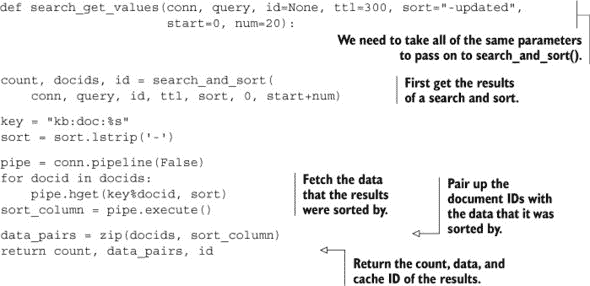

此函数从单个分片中获取所有必要的准备最终合并的信息。我们的下一步是在所有分片上执行查询。

要在我们的所有分片上执行查询，我们有两种选择。我们可以逐个在每个分片上运行每个查询，或者我们可以同时在我们的所有分片上执行我们的查询。为了简单起见，我们将在每个分片上逐个执行我们的查询，并将结果收集在下一列表中。

##### 列表 10.6\. 对所有分片执行查询的函数

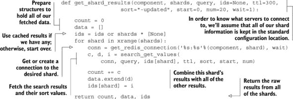

这个函数按如下方式工作：我们逐个对每个分片执行查询，直到我们从所有分片获得结果。记住，为了对所有分片执行查询，我们必须将正确的分片数传递给 `get_shard_results()` 函数。

|  |
| --- |

**练习：并行运行查询**

Python 包含了多种方法来并行运行对 Redis 服务器的调用。因为执行查询的大部分工作实际上只是等待 Redis 响应，我们可以轻松地使用 Python 内置的线程和队列库向分片 Redis 服务器发送请求并等待响应。你能编写一个 `get_shard_results()` 的版本，它使用线程并行从所有分片获取结果吗？

|  |
| --- |

现在我们已经从所有查询中获取了所有结果，我们只需要重新排序我们的结果，以便我们可以对所有获取的结果进行排序。这并不特别复杂，但我们必须小心处理数字和非数字排序，处理缺失值，以及处理数字排序中的非数字值。我们用于合并结果并仅返回请求结果的函数在下一个列表中显示。

##### 列表 10.7\. 一个合并分片搜索结果的函数

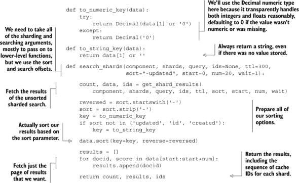

为了正确处理排序，我们需要编写两个函数将 Redis 返回的数据转换为可以一致排序的值。你会注意到我们选择使用 Python `Decimal` 值进行数字排序。这是因为我们用更少的代码得到相同的排序结果，并且透明地支持正确处理无穷大。从那里，我们所有的代码都完全符合预期：我们获取结果，准备对结果进行排序，对结果进行排序，然后仅返回搜索中请求范围内的文档 ID。

现在我们已经有了跨分片 Redis 服务器工作的 `SORT` 基于搜索版本，剩下的工作就是分片基于 `ZSET` 的分片索引的搜索。

##### 分片基于 `ZSET` 的搜索

与基于 `SORT` 的搜索一样，处理基于 `ZSET` 的搜索需要运行我们的查询对所有分片，获取用于排序的分数，并正确合并结果。我们将在本节中执行与基于 `SORT` 的搜索相同的步骤：在一个分片上搜索，在所有分片上搜索，然后合并结果。

要在一个分片上搜索，我们将 `ZSET`s 上的 第七章 `search_and_zsort()` 函数包装起来，从下一个列表中的缓存 `ZSET` 中获取结果和分数。

##### 列表 10.8\. 基于 `ZSET` 的搜索，返回每个结果的分数

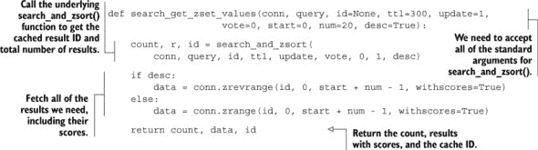

与基于`SORT`的执行类似工作的搜索相比，这个函数通过忽略没有得分的返回结果，直接从缓存的`ZSET`中获取带得分的直接结果来尝试保持简单。因为我们已经将得分作为浮点数存储，便于排序，所以我们将搜索所有分片的函数与合并和排序结果的函数结合起来。

与之前一样，我们将逐个对每个分片进行搜索，合并结果。当我们得到结果时，我们将根据返回的得分进行排序。排序后，我们将结果返回给调用者。实现此功能的函数如下所示。

##### 列表 10.9\. 在`ZSET`s 上进行的分片搜索查询，返回分页结果

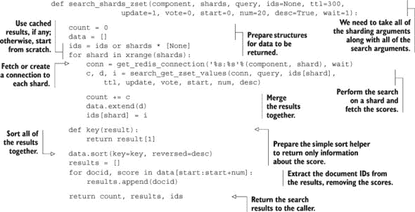

通过这段代码，你应该对处理分片搜索查询所需的各种事物有一个很好的了解。通常，面对这种情况，我会质疑是否值得尝试以这种方式扩展这些查询。鉴于我们现在至少有可工作的分片搜索代码，这个问题更容易回答。请注意，随着我们分片数量的增加，我们需要获取越来越多的数据以满足我们的查询。在某个时候，我们甚至可能需要将获取和合并的任务委托给其他进程，或者甚至以树状结构进行合并。到那时，我们可能需要考虑其他专门为搜索构建的解决方案（如 Lucene、Solr、Elastic Search，甚至是亚马逊的云搜索）。

现在你已经知道了如何扩展第二种搜索类型，我们实际上在其他章节中只覆盖了可能需要扩展的一个其他问题。让我们看看从第八章构建社交网络扩展我们的社交网络需要什么。

#### 10.3.3\. 缩放社交网络

正如我们在第八章构建社交网络中构建社交网络时所指出的，它并不是为了扩展到像 Twitter 这样的社交网络规模而设计的，而是主要为了帮助你了解构建社交网络所需的结构和方法。在本节中，我将描述一些方法，这些方法可以让我们通过分片几乎无限制地扩展社交网站（主要受我们的预算限制，这在大型项目中总是如此）。

帮助社交网络进行扩展的第一个必要步骤之一是确定哪些数据经常被读取，哪些数据经常被写入，以及是否有可能将常用数据与很少使用的数据分开。首先，假设我们已经将发布消息数据提取到一个单独的 Redis 服务器中，该服务器有读取从属服务器来处理该数据上发生的中等高读取量。这实际上留下了两种主要类型的数据需要扩展：时间线和关注者/被关注者列表。

| |
| --- |

##### 缩放已发布消息数据库的大小

如果你实际上构建了这个系统，并且取得了一些成功，那么在某个时候，你需要进一步扩展发布消息数据库，而不仅仅是读副本。因为每条消息完全包含在一个单一的`HASH`中，这些可以基于存储`HASH`的键轻松地分片到 Redis 服务器集群中。由于这些数据可以轻松分片，并且因为我们已经在第 10.3.2 节中解决了如何从多个分片中获取数据作为我们搜索扩展的一部分，所以你在这里不应该有任何困难。或者，你也可以使用 Redis 作为缓存，将最近发布的消息存储在 Redis 中，而将较旧（很少读取）的消息存储在主要基于磁盘的存储服务器（如 PostgreSQL、MySQL、Riak、MongoDB 等）中。如果你发现自己遇到了挑战，请随时在消息板上或在 Redis 邮件列表上发帖。

|  |
| --- |

如您所记，我们主要有三种时间线类型：主页时间线、个人资料时间线和列表时间线。时间线本身都是相似的，尽管列表时间线和主页时间线都限制在 1,000 个项目以内。同样，关注者、被关注者、列表关注者和列表被关注者本质上也是相同的，因此我们也将以相同的方式处理它们。首先，让我们看看我们如何通过分片来扩展时间线。

##### 分片时间线

当我们说我们在分片时间线时，这有点像是一种诱饵和开关。因为主页和列表时间线较短（最多 1,000 条条目，我们可能希望用它来告知如何设置`zset-max-ziplist-size`的大小），^([1])实际上没有必要分片`ZSET`的内容；我们只需要根据它们的键名将这些时间线放置在不同的分片上。

> ¹ 由于我们向主页和列表时间线添加项目的方式，它们实际上可以在短时间内增长到大约 2,000 条条目。而且由于 Redis 不会在结构变得太大时将其转换回自己的 ziplist 编码版本，将`zset-max-ziplist-size`设置为略超过 2,000 条条目可以保持这两个时间线编码效率。

另一方面，个人资料时间线可以增长到的大小目前是无限的。尽管绝大多数用户可能每天最多只发几次帖，但仍然可能存在某人发帖频率显著更高的情况。例如，Twitter 上排名前 1,000 的帖主都发布了超过 150,000 条状态消息，其中前 15 位都发布了超过一百万条消息。

在实际层面上，将单个用户的时间线中保留的消息数量限制在约 20,000 条（最旧的被隐藏或删除）是不合理的，这将处理 99.999%的 Twitter 用户。我们将假设这是我们扩展个人资料时间线的计划。如果不是，我们可以使用本节后面覆盖的用于扩展关注者/被关注者列表的技术来扩展个人资料时间线。 

为了根据键名分片我们的时间线，我们可以编写一组处理`ZADD`、`ZREM`和`ZRANGE`等分片版本的函数，以及其他一些函数，所有这些都将是非常简短的、三行的函数，很快就会变得无聊。相反，让我们编写一个使用 Python 字典查找来自动创建连接到分片的类。

首先，让我们从更新我们的`follow_user()`函数开始，该函数在第八章中进行了更新。我们将创建一个通用的分片连接对象，它将允许我们根据我们想要访问的分片中的键创建一个连接。一旦我们有了这个连接，我们就可以调用所有标准的 Redis 方法来在该分片上执行我们想要的任何操作。我们可以在下一个列表中看到我们想要的 API 看起来是什么样子，以及我们需要如何更新我们的函数。

##### 列表 10.10\. 我们想要我们的分片访问 API 工作方式的示例

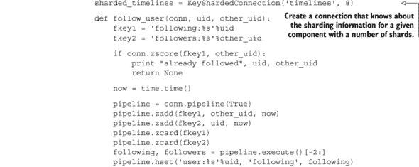

现在我们已经对想要我们的 API 看起来是什么样子有了想法，让我们来构建它。我们首先需要一个对象，该对象接受组件和分片数量。当一个键通过对象上的字典查找被引用时，我们需要返回一个连接到应该存储提供键的分片。实现这一点的类如下所示。

##### 列表 10.11\. 基于键名实现分片连接解析的类

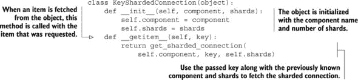

对于基于键的简单分片，这几乎是我们将在 Redis 中执行的所有调用所需的一切。剩下的只是更新`unfollow_user()`、`refill_timeline()`以及访问家庭和列表时间线的其他函数的其余部分。如果您打算扩展这个社交网络，请自行更新这些函数。对于我们这些不扩展社交网络的人来说，我们将继续前进。

| |
| --- |

**练习：将帖子同步到家庭和列表时间线**

随着对家庭和列表时间线数据存储位置的更新，您能否更新您的列表时间线以支持从第八章中的章节 8 支持的分片配置文件？您能否保持其几乎与原始版本一样快？提示：如果您遇到困难，我们包括了一个完全更新的版本，该版本支持分片关注者列表，请参阅列表 10.15。

| |
| --- |

接下来是扩展关注者和关注列表。

##### 使用分片扩展关注者和关注列表

虽然我们对时间线的扩展相当直接，但扩展关注者、被关注者和等效的“列表”`ZSET`s 则更为困难。这些`ZSET`s 中的绝大多数将是短的（99.99%的 Twitter 用户关注者少于 1,000 人），但可能会有一些用户关注了大量用户，或者拥有大量关注者。作为一个实际问题，限制一个用户或列表可以关注的用户数量相对较小（可能最多 1,000 人，以匹配主页和列表时间线的限制）是合理的，迫使他们创建列表以真正地关注更多人。但是，当某个用户的关注者数量显著增加时，我们仍然会遇到问题。

为了处理关注者/被关注者列表可能变得非常大的情况，我们将这些`ZSET`s 分片到多个分片上。更具体地说，一个用户的关注者将被分成与我们拥有的分片数量一样多的部分。由于我们将要讨论的原因，我们只需要实现特定的分片版本的`ZADD`、`ZREM`和`ZRANGEBYSCORE`。

我知道你在想什么：既然我们刚刚构建了一个自动处理分片的方法，我们可以使用它。我们将（在一定程度上）这样做，但由于我们是在分片数据而不是仅仅键，我们无法直接使用我们之前的类。此外，为了减少我们需要创建和调用的连接数量，让关注者/被关注者链接的双方数据都在同一个分片上是非常有意义的，所以我们不能像在第九章（kindle_split_021.html#ch09）和第 10.2 节（#ch10lev1sec2）中那样仅通过数据来分片。

为了使我们的关注者/被关注者数据分片，使得关注者/被关注者关系的双方都在同一个分片上，我们将使用这两个 ID 作为查找分片的关键部分。就像我们对分片时间线所做的那样，让我们更新`follow_user()`以显示我们希望使用的 API，然后我们将创建实现该功能所需的类。带有我们期望的 API 的更新后的`follow_user()`将在下面。

##### 列表 10.12\. 访问关注者/被关注者`ZSET`分片

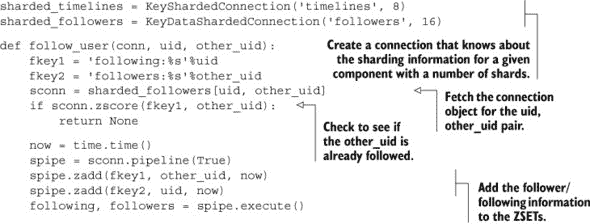

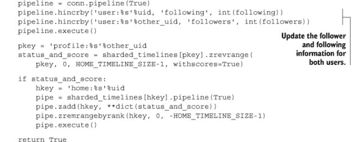

除了稍微调整和代码更新之外，这次更改与我们之前为分片时间线所做的更改唯一的不同之处在于，我们不是传递一个特定的键来查找分片，而是传递一对 ID。从这两个 ID 中，我们将计算出涉及这两个 ID 的数据应该存储在哪个合适分片上。实现此 API 的类将在下面出现。

##### 列表 10.13\. 基于 ID 对的分片连接解析

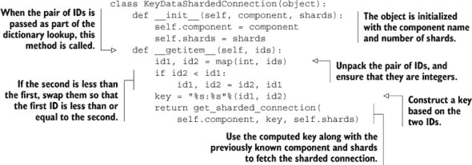

与列表 10.11 相比，这个分片连接生成器唯一的不同之处在于，它接受一对 ID 而不是一个键。从这两个 ID 中，我们生成一个键，其中较低的 ID 排在前面，较高的 ID 排在后面。通过这种方式构建键，我们确保无论初始顺序如何，只要我们引用相同的两个 ID，我们总是会落在同一个分片上。

使用这个分片连接生成器，我们可以更新几乎所有剩余的跟随者/被跟随者`ZSET`操作。剩下的一个操作是正确处理`ZRANGEBYSCORE`，我们在几个地方使用它来获取“页面”的跟随者。通常这是在更新发布时将消息分发给主页和列表时间线时进行的。在分发给时间线时，我们可以扫描一个分片的全部`ZSET`，然后转到下一个。但通过一点额外的工作，我们可以同时通过所有`ZSET`s，这将给我们一个有用的分片`ZRANGEBYSCORE`操作，可以在其他情况下使用。

如我们在第 10.3.2 节中看到的，为了从分片的`ZSET`s 中获取项目 100-109，我们需要从所有`ZSET`s 中获取项目 0-109 并将它们合并在一起。这是因为我们只知道我们想要开始的索引。由于我们有基于分数扫描的机会，当我们想要获取分数大于 X 的下一个 10 个项目时，我们只需要从所有分片中获取分数大于 X 的下一个 10 个项目，然后进行合并。以下列表显示了实现跨多个分片`ZRANGEBYSCORE`的函数。

##### 列表 10.14。实现分片`ZRANGEBYSCORE`的函数

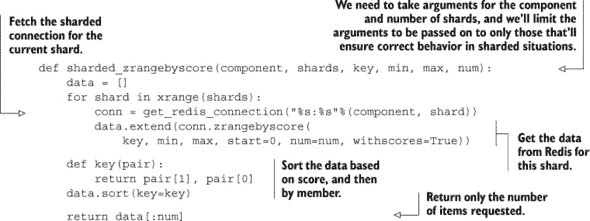

这个函数的工作方式与我们在第 10.3.2 节中做的查询/合并非常相似，只是我们可以在`ZSET`的中间开始，因为我们有分数（而不是索引）。

|  |
| --- |

##### 使用此方法进行分片个人资料时间线

你会注意到我们使用时间戳来处理跟随者/被跟随者列表，这避免了我们在第 10.3.2 节中讨论的跨分片`ZSET`s 分页的一些缺点。如果你计划使用这种方法来分片个人资料时间线，你需要回过头来更新你的代码，使用时间戳而不是偏移量，并且你需要实现一个`ZREVRANGEBYSCORE`版本的列表 10.14，这应该是直截了当的。

|  |
| --- |

使用这个新的分片`ZRANGEBYSCORE`函数，让我们更新下一个列表中用于将帖子分发给主页和列表时间线的函数。当我们这样做的时候，我们不妨添加对分片主页时间线的支持。

##### 列表 10.15。更新后的联盟状态函数

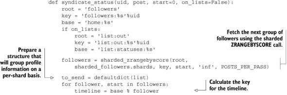

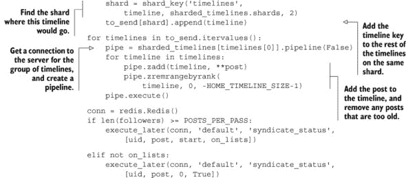

如代码所示，我们使用分片的 `ZRANGEBYSCORE` 函数来获取对这个用户帖子感兴趣的用户。此外，为了保持内容同步过程快速，我们将要发送到每个主页或列表时间线分片服务器的请求分组在一起。稍后，在我们将所有写入操作分组在一起后，我们使用管道将帖子添加到给定分片服务器上的所有时间线上。虽然这可能比非分片版本慢，但这确实允许我们将社交网络扩展得比以前更大。

剩下的工作就是完成更新其余的函数，以支持我们在 第 10.3.3 节 中所做的所有分片。再次提醒，如果你打算扩展这个社交网络，请随意这样做。但如果你有一些未分片的代码想要分片，你可以将 第 8.4 节 中的 `syndicate_status()` 的早期版本与我们的新版本进行比较，以了解如何更新你的代码。

### 10.4\. 概述

在本章中，我们回顾了各种问题，以了解将它们扩展到更高的读取量、更高的写入量和更多的内存需要什么。我们使用了只读从属服务器、可写查询从属服务器以及与分片感知类和函数结合的分片。尽管这些方法可能不会涵盖你特定问题所有潜在的扩展用例，但每个示例都是选择提供一套可以在其他情况下普遍使用的技术的。

如果你从这个章节中带走一个概念，那就是扩展任何系统都可能是一个挑战。但有了 Redis，你可以使用各种方法来扩展你的平台（希望可以扩展到你需要的程度）。

在下一章和最后一章中，我们将介绍使用 Lua 脚本进行 Redis 脚本编程。我们将回顾一些过去的问题，以展示如何通过 Redis 2.6 及更高版本中提供的功能简化我们的解决方案并提高性能。

## 第十一章\. 使用 Lua 脚本脚本化 Redis

*本章涵盖*

+   不用编写 C 代码添加功能

+   使用 Lua 重新编写锁和信号量

+   摆脱 WATCH/MULTI/EXEC

+   使用 Lua 分片 LIST

在过去的几章中，你已经建立了一个工具集，你可以在现有应用程序中使用这些工具，同时也会遇到可以用来解决各种问题的技术。本章做了很多同样的事情，但会颠覆一些你的预期。自 Redis 2.6 版本起，Redis 包含了 Lua 编程语言的 *服务器端脚本* 功能。这让你可以在 Redis 内部执行各种操作，既可以简化你的代码，也可以提高性能。

在本章中，我们将首先讨论 Lua 相对于在客户端执行操作的一些优势，并通过第八章中的社交网络示例来展示。然后，我们将通过第四章和第六章中的两个问题来展示使用 Lua 可以消除`WATCH`/`MULTI`/`EXEC`事务需求的示例。稍后，我们将重新审视第六章中的锁和信号量，以展示它们如何使用 Lua 实现公平的多客户端访问和更高的性能。最后，我们将使用 Lua 构建一个分片`LIST`，它支持许多（但不是所有）标准的`LIST`命令等效功能。

让我们开始学习我们可以使用 Lua 脚本做一些什么。

### 11.1. 添加功能而不编写 C 代码

在 Redis 2.6 版本之前（以及 Redis 2.4 版本不受支持的脚本分支），如果我们想要 Redis 中尚未存在的高级功能，我们要么必须编写客户端代码（就像我们在过去 10 章中做的那样），要么必须编辑 Redis 本身的 C 源代码。尽管编辑 Redis 的源代码并不太难，但在商业环境中支持此类代码，或者试图说服管理层运行我们自己的 Redis 服务器版本是一个好主意，可能会很具挑战性。

在本节中，我们将介绍一些方法，通过这些方法我们可以在 Redis 服务器内部执行 Lua 代码。通过用 Lua 脚本编写 Redis，我们可以避免一些常见的陷阱，这些陷阱会减慢开发速度或降低性能。

在 Redis 中执行 Lua 代码的第一步是将代码加载到 Redis 中。

#### 11.1.1. 将 Lua 脚本加载到 Redis 中

一些较旧的（仍在使用中）的 Redis 2.6 版本的 Python Redis 库还没有提供直接加载或执行 Lua 脚本的能力，因此我们将花几分钟时间创建一个用于脚本加载的程序。要将脚本加载到 Redis 中，有一个两部分的命令称为`SCRIPT LOAD`，当提供一个 Lua 脚本字符串时，它将存储脚本以供以后执行，并返回脚本的 SHA1 哈希值。稍后，当我们想要执行该脚本时，我们运行 Redis 命令`EVALSHA`，并提供 Redis 返回的哈希值以及脚本需要的任何参数。

我们进行这些操作的代码将受到当前 Python Redis 代码的启发。（我们主要使用这种方法，因为它允许我们使用任何我们想要的连接，而无需显式创建新的脚本对象，这在处理服务器分片时可能很有用。）当我们向`script_load()`函数传递一个字符串时，它将创建一个可以稍后调用来在 Redis 中执行脚本的函数。在调用对象以执行脚本时，我们必须提供一个 Redis 连接，该连接将在第一次调用时调用`SCRIPT LOAD`，然后是所有后续调用中的`EVALSHA`。`script_load()`函数如下所示。

##### 列表 11.1\. 一个用于加载稍后调用的脚本的函数

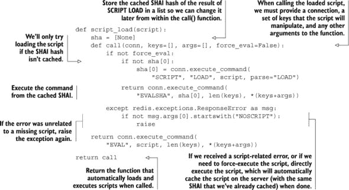

你会注意到，除了我们的 `SCRIPT LOAD` 和 `EVALSHA` 调用之外，我们还捕获了一个异常，这个异常可能发生在我们本地缓存了脚本的 SHA1 哈希值，但服务器不知道它。如果服务器重启，如果有人执行了 `SCRIPT FLUSH` 命令来清理脚本缓存，或者如果我们函数在一段时间内提供了连接到两个不同的 Redis 服务器，这种情况就会发生。如果我们发现脚本缺失，我们将直接使用 `EVAL` 执行脚本，这将在执行脚本的同时将其缓存。此外，我们还允许客户端直接执行脚本，这在将 Lua 脚本作为事务或其他管道序列的一部分执行时可能很有用。

|  |
| --- |

##### Lua 脚本的键和参数

在我们的脚本加载器内部，你可能已经注意到调用 Lua 脚本需要三个参数。第一个是一个 Redis 连接，到现在应该已经是标准的了。第二个参数是一个键列表。第三个是传递给函数的参数列表。

键和参数之间的区别在于，你应该将脚本将读取或写入的所有键作为 `keys` 参数传递。这是为了在您使用类似第十章中描述的多服务器分片技术时，让其他层验证所有键是否位于同一分片上。

当 Redis 集群发布时，它将提供自动的多服务器分片，脚本运行之前会检查键，如果访问了不在同一服务器上的任何键，则会返回错误。

第二个参数列表没有这样的限制，其目的是在 Lua 调用内部使用数据。

|  |
| --- |

让我们在控制台中尝试一个简单的例子来开始。

如此例所示，我们创建了一个简单的脚本，其唯一目的是返回值 1。当我们用连接对象调用它时，脚本被加载并执行，结果返回值 `1`。

##### 从 Lua 返回非字符串和非整数值

由于 Lua 允许数据进出时的限制，一些在 Lua 中可用的数据类型不允许被传出，或者在被返回之前会被修改。表 11.1 展示了这些数据在被返回时的修改情况。

##### 表 11.1\. Lua 返回的值及其转换结果

| Lua 值 | 转换为 Python 时的行为 |
| --- | --- |
| true | 转换为 1 |
| false | 转换为 None |
| nil | 不会转换为任何东西，并阻止表中的剩余值被返回 |
| 1.5（或任何其他浮点数） | 舍弃小数部分，转换为整数 |
| 1e30（或任何其他大浮点数） | 转换为 Python 版本的最小整数 |
| "strings" | 不变 |
| 1（或任何其他整数 +/-2⁵³-1） | 整数返回不变 |

由于返回多种数据类型时产生的歧义，您应尽可能明确地返回字符串，并手动进行任何解析。在我们的示例中，我们只返回布尔值、字符串、整数和 Lua 表（这些表将被转换为 Python 列表）。

既然我们可以加载和执行脚本，让我们从第八章的一个简单示例开始，创建一个状态消息。

#### 11.1.2\. 创建新的状态消息

当我们构建用于执行一系列操作的 Lua 脚本时，从简短且不复杂的示例开始是很好的。在这种情况下，我们将首先编写一个 Lua 脚本，并结合一些包装代码来发布状态消息。

| |
| --- |

##### Lua 脚本——与单个命令或`MULTI/EXEC`一样原子

如您所知，Redis 中的单个命令是*原子性*的，因为它们一次执行一个。使用`MULTI`/`EXEC`，您可以在执行多个命令时防止其他命令运行。但是，对 Redis 来说，`EVAL`和`EVALSHA`被视为一个（非常复杂）的命令，因此它们在执行时不会允许任何其他结构操作发生。

| |
| --- |
| |

##### Lua 脚本——如果它们修改了结构，则无法中断

当使用`EVAL`或`EVALSHA`执行 Lua 脚本时，Redis 不允许运行任何其他读写命令。这可能是方便的。但是，因为 Lua 是一种通用编程语言，您可以编写永远不会返回的脚本，这可能会阻止其他客户端执行命令。为了解决这个问题，Redis 提供了两种停止 Redis 中脚本的方法，具体取决于您是否执行了 Redis 的写入调用。

如果您的脚本没有执行任何写入操作（只有读取），当脚本执行时间超过配置的`lua-time-limit`（检查您的 Redis 配置文件）时，您可以执行`SCRIPT KILL`。

如果您的脚本已写入 Redis，则终止脚本可能会导致 Redis 处于不一致的状态。在这种情况下，您唯一可以恢复的方法是使用`SHUTDOWN NOSAVE`命令终止 Redis，这将导致 Redis 丢失自上次快照以来或自上次命令组写入 AOF 以来所做的任何更改。

由于这些限制，您应该在将 Lua 脚本投入生产运行之前始终对其进行测试。

| |
| --- |

如您从第八章中可能记得的，列表 8.2 展示了创建状态消息的过程。接下来将展示我们用于发布状态消息的原始代码的一个副本。

##### 列表 11.2\. 来自列表 8.2 的函数，用于创建状态消息`HASH`

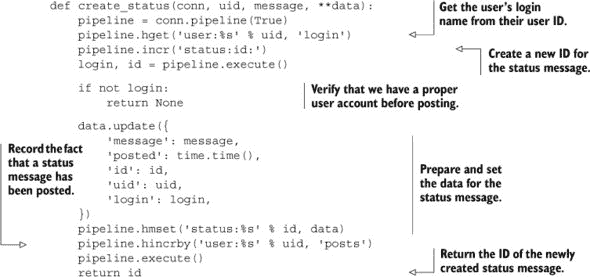

一般而言，为了发布状态消息而进行两次往返 Redis 的性能惩罚并不大——是单次往返延迟的两倍。但如果我们能将这两次往返减少到一次，我们也许还能减少其他许多例子中的往返次数。往返次数越少，给定命令组的延迟就越低。较低的延迟意味着等待时间更少，所需的 Web 服务器更少，整个系统的整体性能更高。

为了回顾当我们发布一条新的状态消息时会发生什么：我们在`HASH`中查找用户的姓名，增加一个计数器（以获取一个新的 ID），将数据添加到 Redis 的`HASH`中，并在用户的`HASH`中增加一个计数器。在 Lua 中这听起来并不糟糕；让我们在下一个列表中尝试一下，其中显示了 Lua 脚本，以及一个实现与之前相同的 API 的 Python 包装器。

##### 列表 11.3\. 使用 Lua 创建状态消息

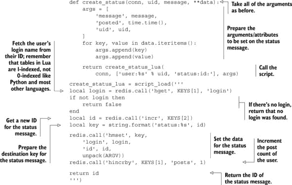

此函数执行了之前所有-Python 版本执行的所有相同操作，只是每次调用不需要两次往返 Redis，而只需要一次（第一次调用将脚本加载到 Redis 中，然后调用加载的脚本，但后续调用只需要一次）。这对发布状态消息来说不是一个大问题，但对于我们在前几章中遇到的大多数其他问题，多次往返可能会比必要的花费更多时间，或者导致`WATCH`/`MULTI`/`EXEC`竞争。

| |
| --- |

##### 将不是脚本`KEYS`参数一部分的键写入

在第 11.1.1 节的注释中，我提到我们应该将所有要修改的键作为脚本的关键字参数传递，但在这里我们正在根据未传递的键编写一个`HASH`。这样做使得这个 Lua 脚本与未来的 Redis 集群不兼容。这个操作在非集群分片服务器场景中是否仍然正确将取决于你的分片方法。我这样做是为了强调你可能需要这样做，但这样做会阻止你使用 Redis 集群。

| |
| --- |
| |

##### 脚本加载器和辅助工具

你会注意到在这个第一个例子中，我们有两个主要部分。我们有一个 Python 函数，它处理将早期的 API 翻译成 Lua 脚本调用的转换，还有一个从我们之前的`script_load()`函数加载的 Lua 脚本。我们将继续这种模式，因为 Lua 脚本的本地 API（`KEYS`和`ARGV`）在多个上下文中调用可能很困难。

| |
| --- |

自从 Redis 2.6 完成并发布以来，支持 Lua 脚本的主要语言库应该会变得更好、更完整。在 Python 方面，一个类似于我们编写的脚本加载器已经在 redis-py 项目的源代码库中可用，并且目前可以从 Python 包索引中获取。我们使用我们的脚本加载器，因为它在面对分片网络连接时的灵活性和易用性。

随着我们与 Redis 交互量的增加，我们转向使用锁和信号量来帮助减少 `WATCH`/`MULTI`/`EXEC` 事务周围的竞争问题。让我们来看看重写锁和信号量，看看我们是否能够进一步提高性能。

### 11.2\. 使用 Lua 重写锁和信号量

当我在第六章中介绍锁和信号量时，我展示了锁如何通过在流量高峰场景中采取悲观策略来减少与 `WATCH`/`MULTI`/`EXEC` 事务的竞争。但是，锁本身在最佳情况下需要两到三个往返来获取或释放锁，并且在某些情况下可能会遇到竞争。

在本节中，我们将重新审视第 6.2 节中的锁，并使用 Lua 重新编写它，以进一步提高性能。然后，我们将重新审视第 6.3 节中的信号量示例，以实现一个完全公平的锁，同时在那里提高性能。

让我们先看看 Lua 中的锁，以及为什么我们还想继续使用锁。

#### 11.2.1\. 为什么在 Lua 中使用锁？

让我们先来讨论一下我们决定使用 Lua 构建锁的*原因*。主要有两个原因。

从技术角度来说，当使用 `EVAL` 或 `EVALSHA` 执行 Lua 脚本时，脚本或哈希之后的第一组参数是将在 Lua 中读取或写入的键（我在章节 11.1.1 和 11.1.2 中的两个笔记中提到过）。这主要是为了允许后续的 Redis 集群服务器拒绝读取或写入特定分片上不可用的键的脚本。如果我们事先不知道将要读取/写入哪些键，那么我们不应该使用 Lua（我们应该改用 `WATCH`/`MULTI`/`EXEC` 或锁）。因此，每次我们读取或写入作为脚本 `KEYS` 参数一部分之外的键时，如果我们后来过渡到 Redis 集群，我们都会面临潜在的不兼容性或损坏的风险。

第二个原因是，在某些情况下，在 Redis 中操作数据需要的数据在初始调用时不可用。一个例子是从 Redis 获取一些`HASH`值，然后使用这些值从关系型数据库中获取信息，这然后导致将数据写回 Redis。我们第一次看到这种情况是在第 2.4 节中安排在 Redis 中缓存行时。在那个情况下，我们没有麻烦去锁定，因为两次写入相同的行两次不会是一个严重的问题。但在其他缓存场景中，多次读取要缓存的数据可能会比可接受的开销更大，甚至可能导致较新的数据被较旧的数据覆盖。

由于这两个原因，让我们重写我们的锁以使用 Lua。

#### 11.2.2. 重写我们的锁

如你从第 6.2 节中可能记得的那样，锁定涉及生成一个 ID，条件性地使用`SETNX`设置一个键，并在成功后设置键的过期时间。尽管在概念上很简单，但我们不得不处理失败和重试，这导致了下一列表中显示的原始代码。

##### 列表 11.4. 来自第 6.2.5 节的我们的最终`acquire_lock_with_timeout()`函数

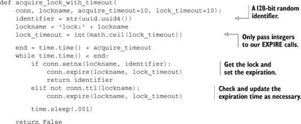

如果你记得我们在第 6.2 节中是如何构建这个锁的，那么这里就没有什么太令人惊讶的内容。让我们继续提供相同的功能，但将核心锁定移动到 Lua 中。

##### 列表 11.5. 使用 Lua 重写的`acquire_lock_with_timeout()`

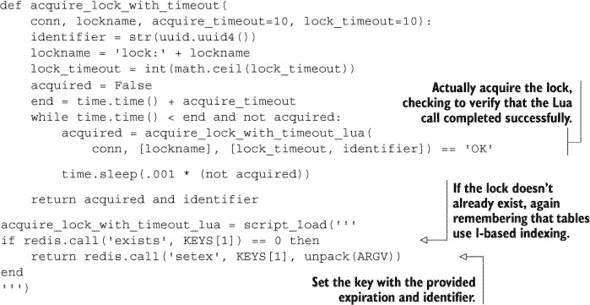

代码中没有任何显著的变化，除了我们更改了使用的命令，使得如果获取了锁，它总是有一个超时时间。我们还可以继续重写释放锁的代码以使用 Lua。

之前，我们监视锁键，然后验证锁是否仍然具有相同的值。如果它具有相同的值，我们就移除锁；否则，我们会说锁已经丢失。我们下面展示了`release_lock()`的 Lua 版本。

##### 列表 11.6. 使用 Lua 重写的`release_lock()`

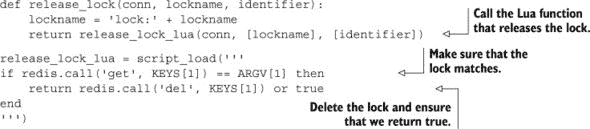

与获取锁不同，由于我们不再需要执行所有典型的`WATCH`/`MULTI`/`EXEC`步骤，释放锁变得简短了。

减少代码很好，但如果我们没有真正提高锁本身的性能，那么我们就没有走得太远。我们在锁定代码中添加了一些仪表，以及一些基准测试代码，该代码执行 1、2、5 和 10 个并行进程来重复获取和释放锁。我们计算了获取锁的尝试次数以及 10 秒内锁被获取的次数，包括我们的原始和基于 Lua 的获取和释放锁函数。表 11.2 显示了执行并成功的调用次数。

##### 表 11.2. 在 10 秒内，我们的原始锁与基于 Lua 的锁的性能比较

| 基准配置 | 10 秒内尝试次数 | 10 秒内获取次数 |
| --- | --- | --- |
| 原始锁，1 个客户端 | 31,359 | 31,359 |
| 原始锁，2 个客户端 | 30,085 | 22,507 |
| 原始锁，5 个客户端 | 47,694 | 19,695 |
| 原始锁，10 个客户端 | 71,917 | 14,361 |
| Lua 锁，1 个客户端 | 44,494 | 44,494 |
| Lua 锁，2 个客户端 | 50,404 | 42,199 |
| Lua 锁，5 个客户端 | 70,807 | 40,826 |
| Lua 锁，10 个客户端 | 96,871 | 33,990 |

观察我们的基准测试数据（请注意右列），有一点需要注意，那就是基于 Lua 的锁在获取和释放锁的循环中比我们之前的锁成功得更多——单个客户端超过 40%，2 个客户端达到 87%，5 或 10 个客户端尝试获取和释放相同锁时超过 100%。比较中间和右列，我们还可以看到 Lua 的锁定尝试速度有多快，这主要归因于往返次数的减少。

但比性能改进更好的是，我们获取和释放锁的代码更容易理解并验证其正确性。

另一个我们构建同步原语（例如信号量）的例子；让我们看看如何构建它们。

#### 11.2.3\. Lua 中的计数信号量

在我们处理第六章中的计数信号量时 kindle_split_017.html#ch06，我们花费了大量时间来确保我们的信号量具有一定的公平性。在这个过程中，我们使用计数器为客户端创建了一种数字标识符，然后使用它来确定客户端是否成功。但由于我们在获取信号量时仍然存在竞态条件，我们最终仍然需要使用锁来使信号量正确地工作。

让我们来看看我们之前实现的计数信号量，并思考如何使用 Lua 来改进它。

##### 列表 11.7\. 来自 第 6.3.2 节 的 `acquire_semaphore()` 函数

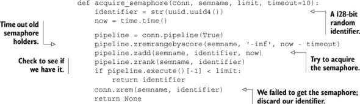

在将此函数翻译成 Lua 的过程中，在清理超时的信号量后，我们可以知道信号量是否可用以获取，因此我们可以简化在信号量不可用的情况下的代码。此外，由于所有操作都在 Redis 内部进行，我们不需要计数器或所有者 `ZSET`，因为第一个执行 Lua 函数的客户端应该获得信号量。`acquire_semaphore()` 的 Lua 版本可以在下一个列表中看到。

##### 列表 11.8\. 使用 Lua 重写的 `acquire_semaphore()` 函数

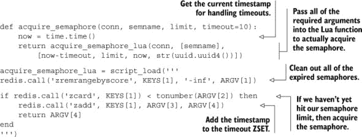

这个更新的信号量提供了与`acquire_fair_semaphore_with_lock()`加锁版本相同的特性，包括完全公平。此外，由于我们进行的简化（没有锁，没有`ZINTERSTORE`，没有`ZREMRANGEBYRANK`），我们新的信号量将比之前的信号量实现运行得更快，同时降低信号量的复杂性。

由于我们的简化，释放信号量可以使用来自第 6.3.1 节的原始`release_semaphore()`代码。我们只需要创建一个基于 Lua 的刷新信号量函数来替换来自第 6.3.3 节的公平信号量版本，如下所示。

##### 列表 11.9. 使用 Lua 编写的`refresh_semaphore()`函数

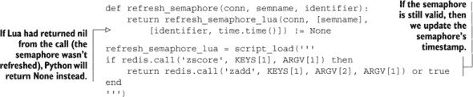

通过用 Lua 重写获取和刷新信号量，我们现在有一个完全公平的信号量，它更快，更容易理解。

现在我们已经用 Lua 重写了锁和信号量，并看到了它们如何提高性能，让我们尝试从我们之前的两个示例中去除`WATCH`/`MULTI`/`EXEC`事务和锁，看看我们如何使它们表现良好。

### 11.3. 去除 WATCH/MULTI/EXEC

在前面的章节中，我们使用`WATCH`、`MULTI`和`EXEC`的组合在几个案例中实现 Redis 中的事务形式。一般来说，当有少量写操作修改被`WATCH`的数据时，这些事务在没有显著争用或重试的情况下完成。但如果操作需要多次往返才能执行，如果争用很高，或者网络延迟很高，客户端可能需要多次重试才能完成操作。

在本节中，我们将重新审视第六章中的自动完成示例，以及最初在第四章中涵盖的市场示例，以展示我们如何简化代码并提高性能。

首先，让我们看看第六章中的一个自动完成示例。

#### 11.3.1. 重新审视组自动完成

在第六章中，我们介绍了一个使用`ZSET`存储要自动完成的用户名的自动完成过程。

如您所记，我们计算了一对字符串，将围绕我们想要自动完成的全部值。当我们有了这些值，我们将数据插入到`ZSET`中，然后`WATCH``ZSET`以观察其他人是否进行类似更改。然后我们在两个端点之间获取 10 个项目，并在`MULTI`/`EXEC`对之间删除它们。让我们快速看一下我们使用的代码。

##### 列表 11.10. 第 6.1.2 节中的我们的自动完成代码

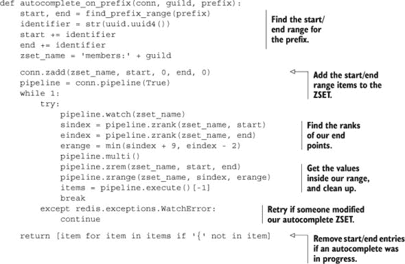

如果一次只执行少量自动完成操作，这不应该导致很多重试。但无论重试与否，我们仍然有很多与处理可能很少发生的重试相关的代码——大约 40%，具体取决于我们如何计算行数。让我们删除所有这些重试代码，并将此函数的核心功能移动到 Lua 脚本中。这种变化的成果在下一列表中展示。

##### 列表 11.11\. 使用 Redis 脚本在词缀上进行自动完成

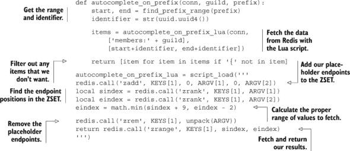

Lua 脚本的主体应该相当熟悉；它是 第六章 代码的直接翻译。不仅结果代码显著更短，而且执行速度也更快。使用与 第六章 中使用的类似基准测试方法，我们运行了 1、2、5 和 10 个并发进程，尽可能快地对相同的公会执行自动完成请求。为了使我们的图表简单，我们只计算了 10 秒内的自动完成尝试和成功的自动完成次数。表 11.3 显示了这次测试的结果。

##### 表 11.3\. 10 秒内我们的原始自动完成与基于 Lua 的自动完成的性能比较

| 基准配置 | 10 秒内的尝试次数 | 10 秒内的自动完成次数 |
| --- | --- | --- |
| 原始自动完成，1 个客户端 | 26,339 | 26,339 |
| 原始自动完成，2 个客户端 | 35,188 | 17,551 |
| 原始自动完成，5 个客户端 | 59,544 | 10,989 |
| 原始自动完成，10 个客户端 | 57,305 | 6,141 |
| Lua 自动完成，1 个客户端 | 64,440 | 64,440 |
| Lua 自动完成，2 个客户端 | 89,140 | 89,140 |
| Lua 自动完成，5 个客户端 | 125,971 | 125,971 |
| Lua 自动完成，10 个客户端 | 128,217 | 128,217 |

观察我们的表格，当我们执行使用 `WATCH`/`MULTI`/`EXEC` 事务的较老自动完成函数时，随着客户端数量的增加，完成事务的概率降低，并且 10 秒内的总尝试次数达到峰值限制。另一方面，我们的 Lua 自动完成可以每秒尝试和完成更多次，这主要归功于更少的网络往返带来的开销减少，以及没有遇到任何由于竞争导致的 `WATCH` 错误。仅观察两者的 10 客户端版本，10 客户端的 Lua 自动完成能够完成比原始自动完成超过 20 倍的自动完成操作。

现在我们已经看到了在更简单的例子中我们能做得有多好，让我们看看我们如何可以改进我们的市场。

#### 11.3.2\. 再次改进市场

在 第 6.2 节 中，我们回顾了我们在 第 4.4 节 中引入的市场示例，用锁代替了我们的 `WATCH`、`MULTI` 和 `EXEC` 的使用，并展示了如何在 Redis 中使用粗粒度和细粒度锁来减少竞争并提高性能。

在本节中，我们将再次处理市场，通过完全移除锁并将我们的代码移入 Lua 脚本中，进一步提高性能。

首先，让我们看看带有锁的市场代码。作为一个回顾，首先获取锁，然后我们观察买家的用户信息`HASH`，如果买家有足够的钱，就允许买家购买商品。原始函数在第 6.2 节中展示。

##### 列表 11.12.来自第 6.2 节的商品购买带锁函数

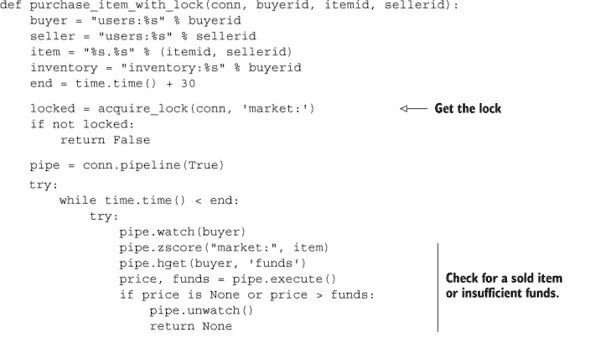

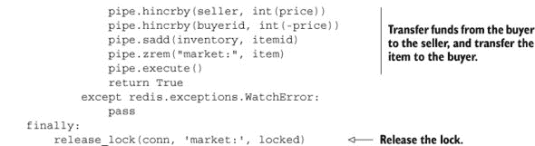

尽管使用了锁，我们仍然需要监视买家的用户信息`HASH`以确保购买时资金充足。正因为如此，我们有了两方面的最坏情况：处理锁定的代码块，以及处理潜在的`WATCH`错误的代码块。在我们迄今为止看到的所有解决方案中，这个方案是重写为 Lua 的理想候选。

当用 Lua 重写这个函数时，我们可以去掉锁，`WATCH`/`MULTI`/`EXEC`事务，甚至超时。我们的代码变得简单直接：确保商品可用，确保买家有足够的钱，将商品转给买家，并将买家的钱转给卖家。下面的列表展示了重写的商品购买函数。

##### 列表 11.13.用 Lua 重写的购买商品函数

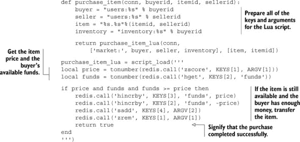

仅比较两个代码列表，基于 Lua 的商品购买代码更容易理解。而且没有多次往返才能完成一次购买（锁定、监视、获取价格和可用资金，然后购买，然后解锁），很明显，购买商品将比我们在第六章中使用的细粒度锁定更快。但快多少呢？

|  |
| --- |

**练习：用 Lua 重写商品列表**

我们为了基准测试重写了 Lua 中的购买商品函数，但你能否将第 4.4.2 节中的原始商品列表函数重写为 Lua？提示：本章的源代码包含了这个练习的答案，就像其他章节的源代码包含了几乎所有练习的答案一样。

|  |
| --- |

现在我们已经用 Lua 重写了商品购买函数，如果你做了练习，你也会有一个用 Lua 编写的商品列表函数。如果你阅读了我们的练习提示，你会注意到我们也用 Lua 重写了商品列表函数。你可能记得，在第 6.2.4 节的结尾，我们进行了一些基准测试，比较了`WATCH`/`MULTI`/`EXEC`事务与粗粒度和细粒度锁的性能。我们重新运行了基准测试，使用我们新重写的 Lua 版本，对五个列表和五个购买过程进行了测试，以产生表 11.4 中的最后一行。

##### 表 11.4\. 与无锁、粗粒度锁和细粒度锁相比，Lua 在 60 秒内的性能

|   | 列出项目 | 购买项目 | 购买重试 | 平均每次购买等待时间 |
| --- | --- | --- | --- | --- |
| 5 个列表器，5 个买家，无锁 | 206,000 | <600 | 161,000 | 498ms |
| 5 个列表器，5 个买家，带有锁 | 21,000 | 20,500 | 0 | 14ms |
| 5 个列表器，5 个买家，带有细粒度锁 | 116,000 | 111,000 | 0 | <3ms |
| 5 个列表器，5 个买家，使用 Lua | 505,000 | 480,000 | 0 | <1ms |

正如我们在将功能移入 Lua 的其他情况下所看到的那样，我们看到了显著的性能提升。从数字上看，与细粒度锁相比，我们看到了列表和购买性能提高了 4.25 倍以上，并且执行购买时的延迟低于 1 毫秒（实际延迟始终在 .61 毫秒左右）。从这张表中，我们可以看到粗粒度锁相对于 `WATCH`/`MULTI`/`EXEC` 的性能优势，细粒度锁相对于粗粒度锁的优势，以及 Lua 相对于细粒度锁的优势。尽管如此，请记住，虽然 Lua 可以提供非凡的性能优势（在某些情况下还可以大幅简化代码），但 Redis 中的 Lua 脚本仅限于我们可以从 Lua 和 Redis 内部访问的数据，而使用锁或 `WATCH`/`MULTI`/`EXEC` 事务时则没有这样的限制。

现在您已经看到了 Lua 可提供的惊人性能优势，让我们看看一个示例，我们可以通过 Lua 节省内存。

### 11.4\. 使用 Lua 分片 `LIST`

在 第 9.2 节 和 第 9.3 节 中，我们将 `HASH`、`SET` 和甚至 `STRING` 分片，作为减少内存的一种方式。在 第 10.3 节 中，我们将 `ZSET` 分片，以便允许搜索索引超过一台机器的内存，并提高性能。

如 第 9.2 节 所承诺，在本节中，我们将创建一个分片 `LIST` 以减少长 `LIST` 的内存使用。我们将支持向 `LIST` 的两端推送，并支持从列表两端进行阻塞和非阻塞弹出。

在实际实现这些功能之前，我们将看看如何结构化数据本身。

#### 11.4.1\. 结构化分片 `LIST`

为了以允许从两端推送和弹出数据的方式存储分片 `LIST`，我们需要第一个和最后一个分片的 ID，以及 `LIST` 分片本身。

为了存储关于第一个和最后一个分片的信息，我们将保留两个数字，作为标准 Redis 字符串存储。这些键将命名为 `<listname>:first` 和 `<listname>:last`。每当分片 `LIST` 为空时，这两个数字都将相同。图 11.1 显示了第一个和最后一个分片的 ID。

##### 图 11.1\. 分片 `LIST` 的第一个和最后一个分片 ID

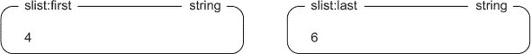

此外，每个分片将被命名为 `<listname>:<shardid>`，并且分片将按顺序分配。更具体地说，如果从左侧弹出项目，那么当项目被推到右侧时，最后一个分片索引将增加，并将使用更多具有更高分片 ID 的分片。同样，如果从右侧弹出项目，那么当项目被推到左侧时，第一个分片索引将减少，并将使用更多具有较低分片 ID 的分片。图 11.2 展示了作为同一分片 `LIST` 部分的一些示例分片。

##### 图 11.2\. `LIST` 分片中的数据

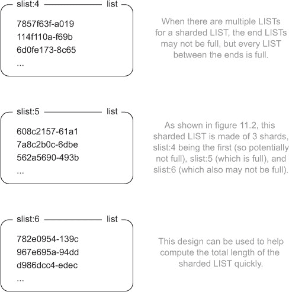

我们将用于分片 `LIST` 的结构不应显得奇怪。我们唯一有趣的事情是将单个 `LIST` 分割成多个部分并跟踪第一个和最后一个分片的 ID。但实际上实现我们的操作？这就是事情变得有趣的地方。

#### 11.4.2\. 将项目推入分片 `LIST`

结果表明，我们将执行的最简单的操作之一将是将项目推入分片 `LIST` 的两端。由于 Redis 2.6 中阻塞弹出操作方式的一些小的语义变化，我们必须做一些工作以确保我们不会意外地溢出一个分片。当我们更详细地讨论代码时，我会解释。

为了将项目推入分片 `LIST` 的两端，我们必须首先通过将其分成块来准备发送的数据。这是因为如果我们向分片 `LIST` 发送，我们可能知道总容量，但我们不知道是否有任何客户端正在等待该 `LIST` 的阻塞弹出，^([1]) 因此我们可能需要为大型 `LIST` 推送进行多次遍历。

> ¹ 在 Redis 的早期版本中，向带有阻塞客户端等待的 `LIST` 推送项目会导致项目立即被推送，并且随后的 `LLEN` 调用会在将项目发送到阻塞客户端之后报告 `LIST` 的长度。在 Redis 2.6 中，这种情况不再存在——阻塞弹出在当前命令完成后处理。在这种情况下，这意味着阻塞弹出在当前 Lua 调用完成后处理。

在我们准备我们的数据之后，我们将其传递给底层的 Lua 脚本。在 Lua 中，我们只需要找到第一个/最后一个分片，然后将项目推入该 `LIST` 直到它满，返回推入的项目数量。以下列表显示了将项目推入分片 `LIST` 两端的 Python 和 Lua 代码。

##### 列表 11.14\. 将项目推入分片 `LIST` 的函数

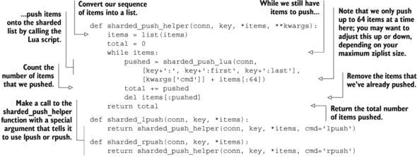

如我之前所述，因为我们不知道客户端是否正在阻塞弹出，所以我们不能在一次调用中推送所有项目，所以我们选择每次推送 64 个项目，尽管你可以根据你最大的 ziplist 编码 `LIST` 配置的大小自由调整它。

| |
| --- |

##### 分片 `LIST` 的限制

在本章前面，我提到，为了正确检查分片数据库（如未来的 Redis 集群）中的键，我们应该将所有将要修改的键作为 `KEYS` 参数传递给 Redis 脚本。但由于我们打算写入的分片不一定事先知道，所以我们不能这样做。因此，这个分片 `LIST` 只能包含在一个实际的 Redis 服务器上，不能分片到多个服务器。

| |
| --- |

你会注意到，对于我们的分片推送，当第一个分片满了之后，我们可能需要循环以访问另一个分片。因为脚本执行期间没有其他命令可以执行，循环最多需要两次：一次是为了注意到初始分片已满，另一次是为了将项目推送到空分片。

| |
| --- |

**练习：查找分片 `LIST` 的长度**

现在你已经可以创建分片 `LIST`，知道你的 `LIST` 增长了多少可能很有用，特别是如果你正在使用分片 `LIST` 作为非常长的任务队列。你能编写一个函数（使用或不用 Lua）来返回分片 `LIST` 的大小吗？

| |
| --- |

接下来，让我们来处理从 `LIST` 中弹出项目。

#### 11.4.3\. 从分片 `LIST` 弹出项目

当从分片 `LIST` 弹出项目时，技术上我们不需要使用 Lua。Redis 已经有了我们弹出项目所需的一切：`WATCH`、`MULTI` 和 `EXEC`。但就像我们在其他情况下看到的那样，当存在高竞争（对于足够长的 `LIST`，这绝对可能是需要分片的情况），`WATCH`/`MULTI`/`EXEC` 事务可能会很慢。

要以非阻塞方式从 Lua 中的分片 `LIST` 弹出项目，我们只需要找到最末尾的分片，弹出项目（如果有的话），如果结果 `LIST` 分片为空，则调整末尾分片信息，如下一列表所示。

##### 列表 11.15\. 将项目推送到分片 `LIST` 的 Lua 脚本

当从分片 `LIST` 弹出项目时，我们需要记住，如果我们从一个空分片弹出，我们不知道是因为整个分片 `LIST` 为空还是只是这个分片本身。在这种情况下，我们需要验证我们是否在端点之间还有空间，以便知道我们是否可以调整一个端点或另一个端点。在这种情况下，只有一个分片为空，我们有从正确分片弹出项目的机会，我们就是这样做的。

我们承诺的 API 中唯一剩下的部分是阻塞弹出操作。

#### 11.4.4\. 从分片 `LIST` 执行阻塞弹出

我们已经逐步完成了将项目推送到长 `LIST` 的两端，从两端弹出项目，甚至编写了一个函数来获取分片 `LIST` 的总长度。在本节中，我们将构建一个方法来从分片 `LIST` 的两端执行阻塞弹出。在前几章中，我们使用阻塞弹出实现了消息传递和任务队列，尽管还有其他可能的用途。

在可能的情况下，如果我们不需要实际阻塞并等待请求，我们应该使用分片`LIST`弹出方法的非阻塞版本。这是因为，在当前 Lua 脚本和`WATCH`/`MULTI`/`EXEC`事务可用的语义和命令中，仍然存在一些我们可能会收到错误数据的情况。这些情况很少见，我们将通过几个步骤来尝试防止它们发生，但每个系统都有局限性。

为了执行阻塞式弹出，我们将采取一些欺骗手段。首先，我们将尝试在循环中执行非阻塞式弹出，直到耗尽时间或获取到项目。如果这成功了，那么我们就完成了。如果这没有获取到项目，那么我们将重复几个步骤，直到获取到项目或直到超时。

我们将要执行的具体操作顺序是首先尝试非阻塞式弹出。如果失败了，然后我们获取第一个和最后一个分片 ID 的信息。如果 ID 相同，我们就在那个分片 ID 上执行阻塞式弹出。嗯，有点像。

由于我们获取端点以来，我们想要弹出的端片的分片 ID 可能已经改变（由于往返延迟），我们在阻塞式弹出之前插入了一个管道化的 Lua 脚本`EVAL`调用。这个脚本验证我们是否正在尝试从正确的`LIST`弹出。如果我们正在尝试，那么它将不执行任何操作，我们的阻塞式弹出操作将无问题发生。但如果它不是正确的`LIST`，那么脚本将向`LIST`推送一个额外的“虚拟”项目，然后这个项目将立即在随后的阻塞式弹出操作中被弹出。

当 Lua 脚本执行和阻塞式弹出操作执行之间可能存在潜在的竞争条件。如果在 Lua 脚本执行和阻塞式弹出操作执行之间有人尝试从同一分片弹出或推送项目，那么我们可能会得到错误的数据（其他弹出客户端获取我们的虚拟项目），或者我们可能会阻塞在错误分片上。

|  |
| --- |

##### 为什么不使用`MULTI/EXEC`事务？

我们在其他章节中已经大量讨论了`MULTI`/`EXEC`事务作为防止竞争条件的一种方法。那么为什么我们不使用`WATCH`/`MULTI`/`EXEC`来准备信息，然后在`EXEC`之前使用`BLPOP`/`BRPOP`操作作为最后一个命令呢？这是因为如果`BLPOP`/`BRPOP`操作在空`LIST`上作为`MULTI`/`EXEC`事务的一部分发生，它将永远阻塞，因为在这段时间内无法运行其他命令。为了防止这种错误，`MULTI`/`EXEC`块内的`BLPOP`/`BRPOP`操作将作为它们的非阻塞`LPOP`/`RPOP`版本执行（除了允许客户端传递多个列表以尝试弹出）。

|  |
| --- |

为了解决在错误分片上阻塞的问题，我们每次只会阻塞一秒钟（即使我们本应永远阻塞）。为了解决我们的阻塞弹出操作获取到实际上不在末端分片上的数据的问题，我们假设如果数据在两个非事务性管道调用之间到来，它就足够接近正确。我们处理阻塞弹出的函数可以在下一个列表中看到。

##### 列表 11.16\. 我们用于从分片 `LIST` 中执行阻塞弹出操作的代码

要使这一切真正工作，需要很多部分协同作用，但请记住，这里有三个基本部分。第一个部分是一个辅助程序，它处理循环以实际获取项目。在这个循环内部，我们调用第二个部分，即辅助程序/阻塞弹出函数对，它处理调用中的阻塞部分。第三个部分是用户实际调用的 API，它处理将所有适当的参数传递给辅助程序。

对于在分片 `LIST` 上操作的每个命令，我们都可以使用 `WATCH`/`MULTI`/`EXEC` 事务来实现它们。但是，当存在适度的竞争时，会出现一个实际问题，因为每个这些操作都会同时操作多个结构，并且会操作作为事务本身一部分计算的结构。在整个结构上使用锁可以在一定程度上有所帮助，但使用 Lua 可以显著提高性能。

### 11.5\. 摘要

如果你从这个章节中带走一个想法，那就是使用 Lua 脚本可以极大地提高性能，并且可以简化你需要执行的操作。尽管在某些情况下，Redis 脚本在分片上存在一些限制，而这些限制在使用锁或 `WATCH`/`MULTI`/`EXEC` 事务时并不存在，但在大多数情况下，Lua 脚本都是一个重大的胜利。

悲剧的是，我们的章节已经结束。接下来，你将找到三个主要平台的安装说明附录；对可能有用的软件、库和文档的引用；以及一个索引，帮助你在这个章节或其他章节中找到相关主题。
