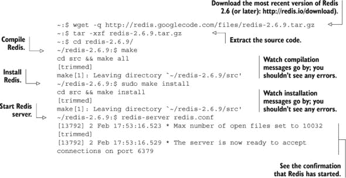
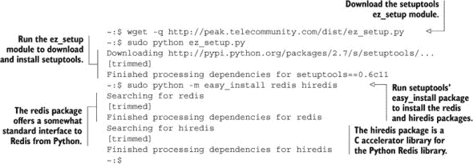
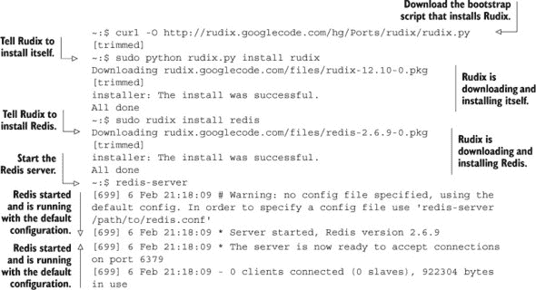
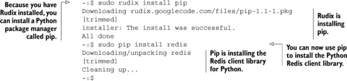
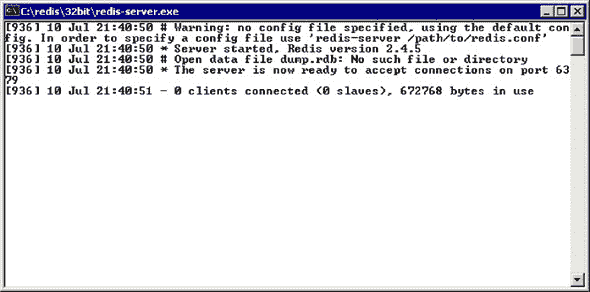
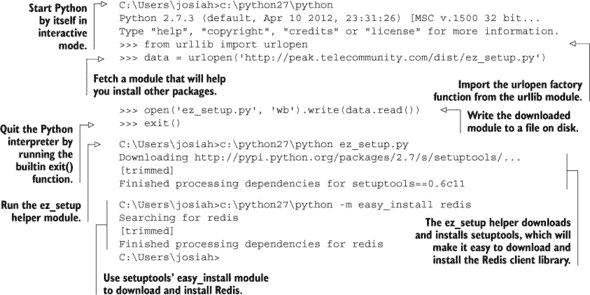
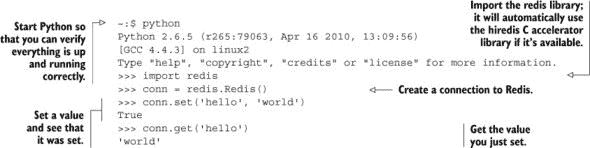

## 附录 A. 快速设置

根据你的平台，设置 Redis 可以从简单到困难不等。我已经将安装说明分解为三个主要平台的章节。你可以自由地跳到你的平台，这也会包括在你的系统上安装和配置 Python 以及 Redis 客户端库的说明。

### A.1\. 在 Debian 或 Ubuntu Linux 上的安装

如果你使用的是基于 Debian 的 Linux，你的第一反应可能是 `apt-get install redis-server`，但这可能不是正确的事情。根据你的 Debian 或 Ubuntu 版本，你可能会安装 Redis 的旧版本。例如，如果你使用 Ubuntu 10.4，你会下载 Redis 1.2.6，这是 2010 年 3 月发布的，不支持我们使用的许多命令。

在本节中，你将首先安装构建工具，因为你将从头开始编译 Redis。然后，你将下载、编译和安装 Redis。Redis 运行后，你将下载 Redis 客户端库。

要开始，请确保你已经通过获取和下载 `make` 安装了所有标准所需的构建工具，如下面的列表所示。

##### 列表 A.1\. 在 Debian Linux 上安装构建工具

```
~$ sudo apt-get update
~$ sudo apt-get install make gcc python-dev
```

当你的构建工具安装好（它们可能之前已经安装好了；这是一个验证步骤），你会采取以下步骤：

> **1**.  从 [`redis.io/download`](http://redis.io/download) 下载最新的稳定版 Redis 源代码。
> 
> **2**.  提取、编译、安装和启动 Redis。
> 
> **3**.  下载并安装必要的 Redis 客户端库。

此过程中的前两个步骤将在下面展示。

##### 列表 A.2\. 在 Linux 上安装 Redis



在 Redis 安装并运行后，你需要安装 Redis 客户端库。你不会费心安装 Python，因为 Python 2.6 或 2.7 应该已经默认安装在过去的几年中的 Ubuntu 或 Debian 版本中。但你会下载并安装一个简单的辅助包，称为 `setuptools`，它将帮助你下载和安装 Redis 客户端库。^([1)] 安装 Redis 客户端库的最后一个步骤将在下面展示。

> ¹ 经验丰富的 Python 用户会问“为什么不使用 `pip`？”这是一个用于安装 Python 库的另一个包。这是因为 `virtualenv`，它是轻松下载 `pip` 所必需的，但超出了这些说明的范围。

##### 列表 A.3\. 在 Linux 上安装 Redis 客户端库



现在你已经安装了 Python 库，你可以跳到章节 A.4 来测试从 Python 运行 Redis，这应该会为你准备其他所有章节。

### A.2\. 在 OS X 上安装

与其他平台一样，有几种方式可以下载和安装 Redis 以及 Python Redis 客户端库。在本节中，我们将讨论以下内容：

> **1**. 在 OS X 上下载、安装和运行 Redis。
> 
> **2**. 安装 Python Redis 客户端库。

如果你阅读了 Linux 部分，你会知道我们确保了从头开始构建 Redis 所需的工具都是可用的，因为这样做很容易。尽管 OS X 的 Xcode 安装有点困难，但构建工具下载文件大小是 10 倍之多，这使得在不长时间休息的情况下继续操作变得更加困难。因此，你将使用一种不需要编译器的 Redis 安装方法。

要在 OS X 上不使用编译器安装 Redis，你将使用一个名为 *Rudix* 的 Python 工具，它为各种软件安装预编译的二进制文件。方便的是，截至本文撰写时，它包括最新版本 Redis 的安装程序。

要下载和安装 Rudix 和 Redis，你应该打开一个终端。终端应用程序位于应用程序中的实用工具组内。启动终端后，请按照下一个列表使用 Rudix 安装 Redis。

##### 列表 A.4\. 在 OS X 上安装 Redis



现在你已经安装了 Redis，是时候安装 Redis 的 Python 客户端库了。你不需要安装 Python，因为 OS X 10.6 和 10.7 版本预装了 Python 2.6 或 2.7，并且可以通过默认的 `python` 命令使用。当 Redis 在一个终端中运行时，打开一个新的标签页（command + T），然后按照下一个列表安装 Python Redis 库。

##### 列表 A.5\. 在 OS X 上安装 Redis 客户端库



如果你阅读了 Linux 或 Windows 的安装说明，你可能已经注意到我们使用了 `setuptools` 的 `easy_install` 方法来安装 Redis 客户端库，但在这里你使用 `pip`。这是因为 Rudix 提供了一个 `pip` 软件包，但没有 `setuptools` 软件包，所以安装 `pip` 更容易，然后使用 `pip` 安装 Python Redis 客户端库，而不是手动下载和安装 `setuptools`。

此外，如果你阅读了 Linux 的安装说明，你可能已经注意到我们在那里安装了 `hiredis` 辅助库，但在 OS X 上你不需要安装它。这是因为，就像之前一样，你不能保证用户已经安装了 Xcode，所以你会使用你拥有的可用工具。

现在你已经安装了 Redis Python 库，你应该跳到 章节 A.4 并按照说明使用 Python 首次运行 Redis。

### A.3\. 在 Windows 上安装

在我们深入介绍如何在 Windows 上安装 Redis 之前，我想指出，由于各种原因，不建议在 Windows 上运行 Redis。在本节中，我们将讨论这些要点：

+   你不应该在 Windows 上运行 Redis 的原因。

+   如何下载、安装和运行预编译的 Windows 二进制文件。

+   如何在 Windows 上下载和安装 Python。

+   如何安装 Redis 客户端库。

我们的第一步是讨论为什么你不应该在 Windows 上运行 Redis。

#### A.3.1. Redis 在 Windows 上的缺点

Windows 不支持 Redis 在多种情况下使用的`fork`系统调用，该调用用于将数据库转储到磁盘。由于无法进行`fork`操作，Redis 在转储完成前无法执行一些必要的数据库保存方法，从而会阻塞客户端。

最近，微软贡献了工程时间帮助解决后台保存问题，使用线程写入磁盘而不是使用分叉的子进程。截至本文撰写时，微软确实有一个 Redis 2.6 的 alpha 阶段分支，但它仅提供源代码，并且微软不对其在生产场景中的适用性做出任何保证。

至少在短期内，Dusan Majkic 提供了一个非官方的 Redis 端口，为 Redis 2.4.5 提供了预编译的二进制文件，但它存在之前提到的问题，即当 Redis 将数据库转储到磁盘时会出现阻塞。

|  |
| --- |

##### 在 Windows 中自行编译 Redis

如果你发现自己需要尽可能最新的 Windows 版本 Redis，那么你需要自己编译 Redis。你的最佳选择是使用微软的官方端口（[`github.com/MSOpenTech/redis/`](https://github.com/MSOpenTech/redis/))，这需要微软的 Visual Studio，尽管免费的 Express 2010 也能正常工作。如果你选择走这条路，请注意，微软对其端口对 Windows 的适用性（除了开发和测试之外）不做任何保证。

现在你已经了解了 Windows 上 Redis 的状态，如果你仍然想在 Windows 上运行 Redis，那么让我们来安装它。

#### A.3.2. 在 Windows 上安装 Redis

您可以通过 Dusan Majkic 从他的 GitHub 页面下载一个适度的过时版本的 Redis 预编译版本，适用于 32 位和 64 位 Windows：[`github.com/dmajkic/redis/downloads`](https://github.com/dmajkic/redis/downloads)。现在就去做吧。

下载 Redis 后，您需要从 zip 文件中提取可执行文件。只要您使用的是比 Windows XP 更新的 Windows 版本，您应该能够无需任何额外软件即可提取 Redis。现在就做吧。

在您将 Redis 的 32 位或 64 位版本提取到您选择的任何位置（根据您的平台和偏好；请记住，64 位 Windows 可以运行 32 位或 64 位 Redis，但 32 位 Windows 只能运行 32 位 Redis）之后，您可以通过双击 `redis-server` 可执行文件来启动 Redis。Redis 启动后，您应该看到一个类似于 图 A.1 的窗口。

##### 图 A.1\. Windows 下运行的 Redis



现在 Redis 已经启动并运行，是时候下载并安装 Python 了。

#### A.3.3. 在 Windows 上安装 Python

如果您已经安装了 Python 2.6 或 2.7，那么您就没事了。如果没有，您将需要下载 Python 2.7 的最新版本，因为这是支持 Redis 库的最新 Python 版本。请访问 [`www.python.org/download/`](http://www.python.org/download/) 并选择适用于 Windows 的 32 位或 64 位的 2.7 系列的最新版本（同样，取决于您的平台）。当 Python 下载完成后，您可以通过双击下载的 .msi 文件来安装它。

假设您为安装 Python 2.7 接受了所有默认选项，Python 应该安装在 C:\Python27\。从这里，您只需要安装 Python Redis 库，就可以准备好使用 Python 来使用 Redis。如果您使用的是 Python 2.6，那么每当本书提到 *Python27* 时，您可以使用 *Python26* 代替。

为了帮助您安装 Redis 客户端库，您将使用 `setuptools` 包中的 `easy_install` 工具。这是因为您可以从命令行轻松下载 `setuptools`。要开始，请通过开始菜单中的“附件”程序组进入，然后点击“命令提示符”。在打开命令提示符后，按照下一个列表操作；它显示了如何下载和安装 `setuptools` 和 Redis 客户端库。

##### 列表 A.6\. 在 Windows 上为 Python 安装 Redis 客户端库



现在，您已经安装了 Python 和 Redis 客户端库，您应该继续阅读 A.4 节，以使用 Python 首次从 Python 使用 Redis。

### A.4\. Hello Redis

在 Redis 本身安装完成后，您需要确保 Python 有适当的库来访问 Redis。如果您遵循了前面的说明，您可能仍然有一个命令提示符是打开的。在这个命令提示符中（如果您关闭了旧的，您可以打开一个新的），您将运行 Python。（Windows 用户可以参考设置过程中的 Python 运行方式。）在 Python 控制台中，您将尝试连接到 Redis 并执行一些命令，如下一个列表所示。

##### 列表 A.7\. 从 Python 测试 Redis



|  |
| --- |

##### 以其他方式运行 Python

虽然您可以在标准终端中运行 Python，但还有许多其他更“功能齐全”的方式来拥有一个 Python 控制台。Idle 是一个基本的编辑器和控制台，与 Python 一起在 Windows 和 OS X 上提供；您也可以在 Linux 上安装它（安装 `idle-python2.6` 或 `idle-python2.7` 包，根据相关情况）。在控制台中，您可以从命令行运行 `python -m idlelib.idle`，Idle 应该会加载。Idle 是一个相当基本的编辑器和 Python 控制台本身，因此如果您是编程新手，它应该是一个温和的介绍。许多人发现 IPython 是首选的 Python 控制台，它提供了太多功能，无法在此处一一列举。无论您选择基本还是功能齐全，您都不会出错。

|  |
| --- |
|  |

##### Redis 在 OS X 和 Windows 上

目前，Windows 和 OS X 的 Redis 预编译版本来自 2.4 系列。在某些章节中，我们使用了仅在 Redis 2.6 及以后系列中可用的功能。如果你发现我们做的一些事情不起作用，而你使用的是 Redis 2.4，那可能是因为该功能或用法是在 Redis 2.6 中添加的。有关具体示例，请参阅 第三章 的注释。

| |
| --- |
| |

##### 配置 Redis

默认情况下，Redis 应该配置为使用快照或只追加文件来保存你的数据，并且只要你在客户端上执行 `shutdown`，Redis 就应该保留你的数据。根据你如何启动它，Redis 可能会将数据文件的磁盘版本保存在与运行路径相同的路径上。要更新它，你需要编辑 redis.conf 并使用适合你平台的系统启动脚本（记得将你的数据移动到新配置的路径）。有关配置 Redis 的更多信息，请参阅 第四章。

| |
| --- |
| |

##### 在非 Linux 平台上是否可以使用 hiredis？

对于使用 Windows 或 OS X 并查看 Debian/Ubuntu 安装说明的人来说，你会注意到我们安装了一个名为 `hiredis` 的库来与 Python 一起使用。这个库是一个加速器，它将协议处理传递给一个 C 库。尽管这个库可以编译为 OS X 和 Windows，但它们的二进制文件在互联网上并不容易下载。此外，因为我没有让你安装编译器，如果你对你的平台有兴趣编译和使用 `hiredis`，那么你就得自己动手了。

| |
| --- |

在其他章节中，我们会定期使用 Python 控制台来展示与 Redis 的交互。在其他情况下，我们将在控制台之外展示函数定义和可执行语句。在这些不使用控制台的情况下，我们假设这些函数是在一个 Python 模块中定义的。如果你之前没有使用过 Python，你应该阅读 [`docs.python.org/tutorial/modules.html`](http://docs.python.org/tutorial/modules.html) 中的 Python 模块教程，直到包括“将模块作为脚本执行”这一节。

如果你属于那种能够阅读语言文档和教程并“理解”它们的人，而且你之前没有花很多时间使用 Python，你可能想考虑通过 [`docs.python.org/tutorial/`](http://docs.python.org/tutorial/) 上的 Python 语言教程。如果你只对那些能让你更多地了解 Python 语法和语义的重要部分感兴趣，请阅读第 3-7 节，然后是 9.10 和 9.11 节（这些章节是关于生成器的，我们在其中使用了几次）。

到现在为止，你应该已经运行了 Redis 和 Python 解释器。如果你是通过 第一章 的引用来到这里的，请返回去真正开始使用 Python 来使用 Redis。

如果你在安装 Redis 或 Python 时遇到困难，请发布你的问题或阅读他人的答案，在 *Redis in Action* Manning 论坛上：[`mng.bz/vB6c`](http://mng.bz/vB6c).
